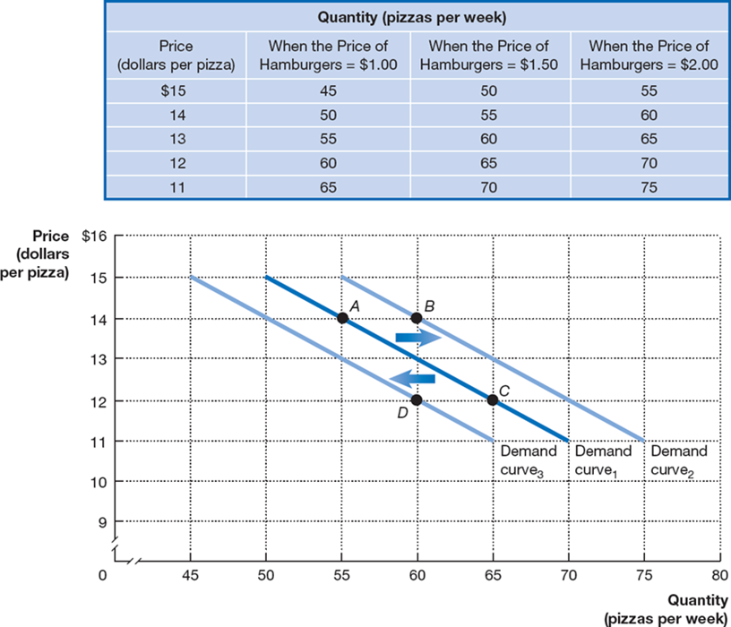
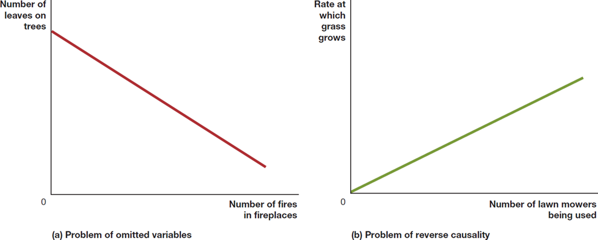

## Macroeconomics

Macroeconomics

Ninth Edition

{height=99%}

Chapter 1

Economics: Foundations and Models

{height=99%}

Copyright © 2025, 2021, 2018 Pearson Education, Inc. All Rights Reserved

## Chapter Outline

Chapter Outline

1.1 Three Key Economic Ideas + 1.2 The Economic Problem That Every Society Must Solve + 1.3 Economic Models + 1.4 Microeconomics and Macroeconomics + 1.5 Economic Skills and Economics as a Career + 1.6 A Preview of Important Economic Terms + Appendix Using Graphs and Formulas

## Should Apple Manufacture the iPhone in the United States?

Should Apple Manufacture the iPhone in the United States?

When Apple began selling computers in the 1970s and 80s, it manufactured them in the United States. + While Apple designed the iPhone in the United States, most iPhones are assembled in China. + Why are many products manufactured overseas? Can we change this? Should we?

{height=99%}

## What Is This Class About?

What Is This Class About?

People make choices as they try to attain their goals. Choices are necessary because we live in a world of scarcity. + Scarcity: A situation in which unlimited wants exceed the limited resources available to fulfill those wants. + Economics is the study of the choices people make to attain their goals, given their scarce resources. + Economists study these choices using economic models, simplified versions of reality used to analyze real-world economic situations.

## Some Typical “Economics” Questions

Some Typical “Economics” Questions

We will learn how to answer questions like these: + What determines the prices of goods and services, from smartphones to pizza to automobiles? + Why do firms engage in international trade, and how do government policies, such as tariffs, affect international trade? + Why does government control the prices of some goods and services, and what are the effects of those controls?

## 1.1 Three Key Economic Ideas

1.1 Three Key Economic Ideas

Explain these three key economic ideas: People are rational, people respond to economic incentives, and optimal decisions are made at the margin.

Economic agents interact with one another in markets. + Market: A group of buyers and sellers of a good or service and the institution or arrangement by which they come together to trade. + In analyzing markets, we typically assume: + People are rational. + People respond to economic incentives. + Optimal decisions are made at the margin.

## 1. People Are Rational

1. People Are Rational

Economists generally assume that people are rational, using all available information to achieve their goals. + Rational consumers and firms weigh the benefits and costs of each action and try to make the best decision possible. + Example: Apple doesn’t randomly choose the price of its iPhones; it chooses the price(s) that it thinks will be most profitable.

## 2. People Respond to Economic Incentives

2. People Respond to Economic Incentives

As incentives change, so do the actions that people will take. + Example: In many states, convicted felons are required to submit D N A samples. D N A from new crimes is checked against the database of submitted D N A, so repeat offenders are more likely to be caught. + The introduction of this process reduced repeat convictions by serious violent offenders by 17%. Even criminals respond to economic incentives.

## Apply the Concept: Will Changes to the Federal Student Loan Program Unintentionally Give Colleges an Incentive to Increase Tuition? (1 of 2)

Apply the Concept: Will Changes to the Federal Student Loan Program Unintentionally Give Colleges an Incentive to Increase Tuition? (1 of 2)

{height=99%}

Sometimes government policies change economic incentives in such a way that they create unintended consequences. + In August 2022, President Biden announced a plan to help student loan borrowers, including reducing annual payments for most borrowers from 10% to 5% of income.

## Apply the Concept: Will Changes to the Federal Student Loan Program Unintentionally Give Colleges an Incentive to Increase Tuition? (2 of 2)

Apply the Concept: Will Changes to the Federal Student Loan Program Unintentionally Give Colleges an Incentive to Increase Tuition? (2 of 2)

{height=99%}

Under those repayment rules, a typical college student would only end up repaying about 50% of the amount borrowed. + Will students borrow extra money for higher ‘living expenses’, knowing there’s a good chance they’ll never have to repay it?

## 3. Optimal Decisions Are Made at the Margin

3. Optimal Decisions Are Made at the Margin

While some decisions are all-or-nothing, most decisions involve doing a little more or a little less of something. + Example: Should you watch an extra hour of T V or study instead? + Economists think about decisions like this in terms of the marginal cost and marginal benefit (M C and M B): the additional cost or benefit associated with a small amount extra of some action. + Analysis that involves comparing marginal benefits and marginal costs is called marginal analysis.

## 1.2 The Economic Problem That Every Society Must Solve

1.2 The Economic Problem That Every Society Must Solve

Discuss how an economy answers these questions: What goods and services will be produced? How will the goods and services be produced? Who will receive the goods and services produced?

In a world of scarcity, we have limited economic resources to satisfy our desires. + Therefore, we face trade-offs.

Trade-off: The idea that, because of scarcity, producing more of one good or service means producing less of another good or service.

## 1. What Goods and Services Will Be Produced?

1. What Goods and Services Will Be Produced?

Individuals, firms, and governments must decide on the goods and services that should be produced. + An increase in the production of one good requires the reduction in the production of some other good. This is a trade-off, resulting from the scarcity of productive resources. + The highest-valued alternative that must be given up in order to engage in some activity is known as the opportunity cost. + Example: The opportunity cost of increased funding for space exploration might be giving up the opportunity to fund cancer research.

## 2. How Will the Goods and Services Be Produced?

2. How Will the Goods and Services Be Produced?

A firm might have several different methods for producing its goods and services. + Example #1: A music producer can make a song sound good by: + Hiring a great singer and using standard production techniques. + Hiring a mediocre singer and using Auto-Tune to correct the inaccuracies.

Example #2: As the cost of manufacturing labor changes, a firm might respond by: + Changing its production technique to one that employs more machines and fewer workers. + Moving its factory to a location with cheaper labor.

## 3. Who Will Receive the Goods and Services Produced?

3. Who Will Receive the Goods and Services Produced?

The way we are most familiar with in the United States is that people with higher incomes obtain more goods and services. + Changes in tax and welfare policies change the distribution of income, though people often disagree about the extent to which this “redistribution” is desirable.

## Centrally Planned Economies Versus Market Economies

Centrally Planned Economies Versus Market Economies

Centrally planned economy: An economy in which the government decides how economic resources will be allocated. + Market economy: An economy in which the decisions of households and firms interacting in markets determine the allocation of economic resources. + Is either of these a good description of the United States economy? Or is it best described as a mixture of both?

## The Modern “Mixed” Economy

The Modern “Mixed” Economy

In the 1800s and early 1900s, the U.S. economy was probably best described as a ‘market economy’. + But beginning in the mid-1900s, government intervention in markets dramatically increased, including the Social Security system, minimum wage regulations, and other interventions to meet social goals. + It is more accurate to describe the U.S. economy as a mixed economy. + Mixed economy: An economy in which most economic decisions result from the interaction of buyers and sellers in markets but in which the government plays a significant role in the allocation of resources.

## Efficiency of Market Economies

Efficiency of Market Economies

Market economies tend to be more efficient than centrally planned economies. + Market economies promote: + Productive efficiency, a state of the economy in which every good or service is produced at the lowest possible cost; and + Allocative efficiency, a state of the economy in which production is in accordance with consumer preferences; in particular, every good or service is produced up to the point where the last unit provides a marginal benefit to consumers equal to the marginal cost of producing it.

## Source of Economic Efficiency

Source of Economic Efficiency

Productive efficiency comes about because of competition. + Allocative efficiency arises due to voluntary exchange. + Voluntary exchange: A situation that occurs in markets when both the buyer and the seller of a product are made better off by the transaction. + Each transaction that takes place improves the well-being of the buyer and seller; transactions continue until no further improvement can take place.

## Caveats About Market Economies

Caveats About Market Economies

Markets may not result in fully efficient outcomes. For example: + People might not immediately do things in the most efficient way. + Governments might interfere with market outcomes. + Market outcomes might ignore the desires of people who are not involved in transactions, like avoiding pollution.

## Market Economies and Equity

Market Economies and Equity

Economically efficient outcomes are not necessarily desirable. + Less efficient outcomes may be more fair or equitable.

Equity: The fair distribution of economic benefits. + An important trade-off for a government is that between efficiency and equity. + Example: If we tax income, people might work less or open fewer businesses, but those tax receipts can fund programs that aid the poor.

## 1.3 Economic Models

1.3 Economic Models

Explain how economists use models to analyze economic events and government policies.

Economists develop economic models to analyze real-world issues. + Building an economic model often follows these steps: + Decide on the assumptions to use. + Formulate a testable hypothesis. + Use economic data to test the hypothesis. + Revise the model if it fails to explain the economic data well. + Retain the revised model to help answer similar economic questions in the future.

## The Role of Assumptions in Economic Models

The Role of Assumptions in Economic Models

All models need assumptions and simplifications in order to be useful. + Economic models make behavioral assumptions about the motives of consumers and firms: + Consumers will buy goods and services to maximize their well-being. + Firms act to maximize their profits.

These assumptions may or may not be correct; we can form hypotheses based on these assumptions, and test whether or not they are correct.

## Forming and Testing Hypotheses in Economic Models

Forming and Testing Hypotheses in Economic Models

In an economic model, a hypothesis is a statement about an economic variable that may be either correct or incorrect. + Economic variable: Something measurable that can have different values, such as the number of people employed in manufacturing. + Example: The increased use of industrial robots and information technology in U.S. factories has resulted in a decline in manufacturing employment.

Most economic hypotheses are about causal relationships.

## Testing Hypotheses in Economic Models

Testing Hypotheses in Economic Models

After collecting the relevant data, economists use statistical methods to evaluate the hypotheses. + It is often difficult to establish whether an effect is causal. + Example: Employment in manufacturing did decline at the same time that the use of robots increased, but that doesn’t prove one caused the other.

Economists accept and use an economic model if it leads to hypotheses that are confirmed (or not rejected) by statistical analysis. + New information may reject previously believed hypotheses.

## Positive and Normative Analysis

Positive and Normative Analysis

Economists try to mimic natural scientists by using the scientific method. But economics is a social science; studying the behavior of people is often tricky. + When analyzing human behavior, we can perform: + Positive analysis: Analysis concerned with what is. + Normative analysis: Analysis concerned with what ought to be.

Economists mostly perform positive analysis; but positive analysis alone is usually not enough to decide what to do.

## Economics as a Social Science

Economics as a Social Science

Social sciences study the actions of individuals; economics is a social science, like psychology, political science, and sociology. + Compared with other social sciences, economics puts more emphasis on (1) how individuals’ actions and decisions affect outcomes like prices and (2) how changes in conditions and policies affect those outcomes. + Economics considers the actions of individuals in every context, not just business. + Government policymakers have increasingly relied on economic analysis.

## Apply the Concept: What Can Economics Contribute to the Debate Over Tariffs?

Apply the Concept: What Can Economics Contribute to the Debate Over Tariffs?

Governments can impose tariffs (taxes on imports) to raise revenue or discourage imports. + Economic theory can identify the likely winners and losers from a particular tariff. + Economic analysis can use models and data to estimate the dollar amounts gained by the winners and lost by the losers. + Typically, the losses outweigh the gains, so economists generally discourage tariffs. + But policymakers may place higher value on the well-being of some groups—a normative judgment.

## 1.4 Microeconomics and Macroeconomics

1.4 Microeconomics and Macroeconomics

Distinguish between microeconomics and macroeconomics.

Microeconomics is the study of: + How households and firms make choices, + How they interact in markets, and + How the government attempts to influence their choices.

Macroeconomics is the study of the economy as a whole, including topics such as inflation, unemployment, and economic growth.

## Table 1.1 Issues in Microeconomics and Macroeconomics

Table 1.1 Issues in Microeconomics and Macroeconomics

## 1.5 Economic Skills and Economics as a Career

1.5 Economic Skills and Economics as a Career

Describe economics as a career and the key skills you can gain from studying economics.

When buying a house, a home inspector can describe problems the house has, advise how to fix the problems, and explain the likely cost. + Similarly, an economist can describe how individuals, businesses, and governments make choices, explain the likely consequences of those choices, and advise on how better decisions can be made.

## Table 1.2 Applying Economics in a Career (1 of 2)

Table 1.2 Applying Economics in a Career (1 of 2)

## Table 1.2 Applying Economics in a Career (2 of 2)

Table 1.2 Applying Economics in a Career (2 of 2)

## Does Majoring in Economics Increase Your Income?

Does Majoring in Economics Increase Your Income?

Economists develop a set of skills designed specifically to help businesses make better decisions. More C E O s of large corporations majored in economics than any other major, including: + Elon Musk of Tesla, Space X, Twitter/X, and the Boring Company + Meg Whitman, formerly C E O of Hewlett-Packard + Warren Buffet of Berkshire Hathaway

## Table 1.3 Higher Salaries for Economics Majors: Correlation or Causation?

Table 1.3 Higher Salaries for Economics Majors: Correlation or Causation?

Are these higher-than-average incomes caused by majoring in economics, or is the relationship only a correlation? + While economics teaches important skills, another possible explanation is self-selection: future high earners may be more attracted to fields like economics.

## 1.6 A Preview of Important Economic Terms

1.6 A Preview of Important Economic Terms

Define important economic terms.

Like all fields of study, economics uses terms or jargon with specific, precise meanings. + Sometimes these terms will be used in ways that differ even from closely related disciplines. + Examples: + Technology: The processes a firm uses to produce goods and services. + Capital: Manufactured goods that are used to produce other goods and services.

Pay close attention to terms defined in class and in the textbook!

## Appendix: Using Graphs and Formulas

Appendix: Using Graphs and Formulas

Use graphs and formulas to analyze economic situations.

A map is a simplified model of reality, showing essential details only. + Economic models, with features like graphs and formulas, can help us understand economic situations just like a map helps us to understand the geographic layout of a city.

{height=99%}

## Figure 1A.1 Bar Graphs and Pie Charts

Figure 1A.1 Bar Graphs and Pie Charts

{height=99%}

The left panel shows a bar graph of market share data for the U.S. P C market; market share is represented by the height of the bar. + The right panel shows a pie chart of the same data; market share is represented by the size of the “slice of the pie.”

## Figure 1A.2 Time-Series Graphs

Figure 1A.2 Time-Series Graphs

{height=99%}

Both panels present time-series graphs of Apple’s worldwide sales of Macs during each year from 2015 to 2022. + The right panel has a truncated scale on the vertical axis, while the left panel does not. + As a result, the fluctuations in Apple’s sales appear smaller in the left panel than the right one.

## Figure 1A.3 Plotting Price and Quantity Points in a Graph

Figure 1A.3 Plotting Price and Quantity Points in a Graph

The figure shows a two-dimensional grid on which we measure the price of pizza along the vertical axis (or y-axis) and the quantity of pizza sold per week along the horizontal axis (or x-axis). + Each point on the grid represents one of the price and quantity combinations listed in the table. + By connecting the points with a line, we can better illustrate the relationship between the two variables.

{height=99%}

## Figure 1A.4 Calculating the Slope of a Line (1 of 2)

Figure 1A.4 Calculating the Slope of a Line (1 of 2)

We can calculate the slope of a line as the change in the value of the variable on the y-axis divided by the change in the value of the variable on the x-axis. + Because the slope of a straight line is constant, we can use any two points in the figure to calculate the slope of the line.

{height=99%}

## Figure 1A.4 Calculating the Slope of a Line (2 of 2)

Figure 1A.4 Calculating the Slope of a Line (2 of 2)

For example, when the price of pizza decreases from $14 to $12, the quantity of pizza demanded increases from 55 per week to 65 per week.

So, the slope of this

line equals

divided by 10, or

{height=99%}

## Figure 1A.5 Showing Three Variables on a Graph (1 of 3)

Figure 1A.5 Showing Three Variables on a Graph (1 of 3)

The demand curve for pizza shows the relationship between the price of pizzas and the quantity of pizzas demanded, holding constant other factors that might affect the willingness of consumers to buy pizza.

{height=99%}

## Figure 1A.5 Showing Three Variables on a Graph (2 of 3)

Figure 1A.5 Showing Three Variables on a Graph (2 of 3)

If the price of pizza is $14 (point A), an increase in the price of hamburgers from $1.50 to $2.00 increases the quantity of pizzas demanded from 55 to 60 per week (point B) and shifts us to Demand

{height=99%}

## Figure 1A.5 Showing Three Variables on a Graph (3 of 3)

Figure 1A.5 Showing Three Variables on a Graph (3 of 3)

Or, if we start on Demand

and the price of

pizza is $12 (point C), a decrease in the price of hamburgers from $1.50 to $1.00 decreases the quantity of pizza demanded from 65 to 60 per week (point D) and shifts us to Demand

{height=99%}

## Figure 1A.6 Graphing the Positive Relationship Between Income and Consumption

Figure 1A.6 Graphing the Positive Relationship Between Income and Consumption

In a positive relationship between two economic variables, as one variable increases, the other variable also increases. + In a negative relationship, as one variable increases, the other decreases. + This figure shows the positive relationship between disposable personal income and consumption spending.

{height=99%}

## Figure 1A.7 Determining Cause and Effect

Figure 1A.7 Determining Cause and Effect

{height=99%}

Using graphs to draw conclusions about cause and effect is hazardous. + For example, in panel (a), as the number of fires in fireplaces increases, the number of leaves on trees falls; but the fires don’t cause the leaves to fall. + In panel (b), as the number of lawn mowers being used increases, so does the rate at which grass grows.

## Are Graphs of Economic Relationships Always Straight Lines?

Are Graphs of Economic Relationships Always Straight Lines?

The relationship between two variables is linear when it can be represented by a straight line. + Few economic relationships are actually linear. However, linear approximations are simpler to use and are often “good enough” in modeling.

## Figure 1A.8 The Slope of a Nonlinear Curve (Panel (a))

Figure 1A.8 The Slope of a Nonlinear Curve (Panel (a))

A non-linear curve has different slopes at different points. This curve shows the total cost of production for various quantities of Apple iPhones. + We can approximate its slope over a section by measuring the slope as if that section were linear. + Between C and D, the slope is greater than between A and B; so we say the curve is steeper between C and D than between A and B.

{height=99%}

## Figure 1A.8 The Slope of a Nonlinear Curve (Panel (b))

Figure 1A.8 The Slope of a Nonlinear Curve (Panel (b))

Another way to measure the slope of a non-linear curve is to measure the slope of a tangent line to the curve, at the point we want to know the slope.

{height=99%}

## Formula for a Percentage Change

Formula for a Percentage Change

One important formula is the percentage change, which is the change in some economic variable, usually from one period to the next, expressed as a percentage. + U.S. real G D P increased from $19,610 billion in 2021 to $20,018 billion in 2022. This was a 2.1% increase.

## Figure 1A.9 Showing a Firm’s Total Revenue on a Graph

Figure 1A.9 Showing a Firm’s Total Revenue on a Graph

The area of a rectangle is equal to its base multiplied by its height; total revenue is equal to quantity multiplied by price. + Here, total revenue is equal to the quantity of 125,000 bottles times the price of $2.00 per bottle, or $250,000. + The area of the green-shaded rectangle shows the firm’s total revenue.

{height=99%}

## Figure 1A.10 The Area of a Triangle

Figure 1A.10 The Area of a Triangle

The area of a triangle is equal to

multiplied by its base

multiplied by its height.

The area of the blue-shaded triangle has a base equal to

and a height equal to

Therefore, its area equals

{height=99%}

## Summary of Using Formulas

Summary of Using Formulas

Whenever you must use a formula, you should follow these steps: + Make sure you understand the economic concept the formula represents. + Make sure you are using the correct formula for the problem you are solving. + Make sure the number you calculate using the formula is economically reasonable. For example, if you are using a formula to calculate a firm’s revenue and your answer is a negative number, you know you made a mistake somewhere.

## Copyright

Copyright

{height=99%}

This work is protected by United States copyright laws and is provided solely for the use of instructors in teaching their courses and assessing student learning. Dissemination or sale of any part of this work (including on the World Wide Web) will destroy the integrity of the work and is not permitted. The work and materials from it should never be made available to students except by instructors using the accompanying text in their classes. All recipients of this work are expected to abide by these restrictions and to honor the intended pedagogical purposes and the needs of other instructors who rely on these materials.

