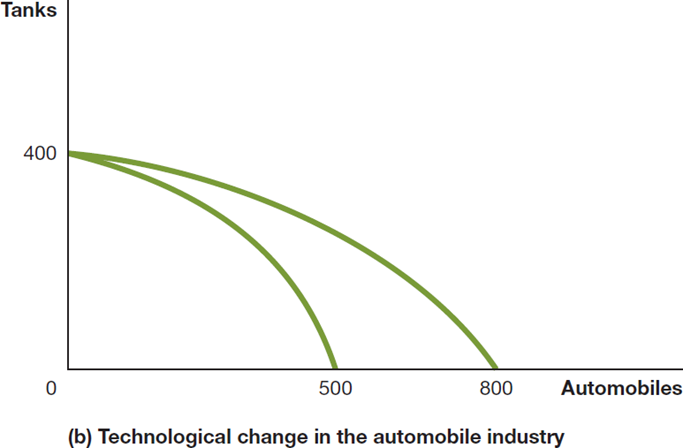

## Macroeconomics

Macroeconomics

Ninth Edition

{height=99%}

Chapter 2

Trade-offs, Comparative Advantage, and the Market System

{height=99%}

Copyright © 2025, 2021, 2018 Pearson Education, Inc. All Rights Reserved

## Chapter Outline

Chapter Outline

2.1 Production Possibilities Frontiers and Opportunity Costs + 2.2 Comparative Advantage and Trade + 2.3 The Market System

## Ford Faces a Trade-Off at Its Dearborn, Michigan Plant

Ford Faces a Trade-Off at Its Dearborn, Michigan Plant

Ford, like other auto manufacturers, is investing heavily in electric vehicles (E V s). + But devoting more resources to E V research, design, and assembly means taking resources away from other activities. + How should Ford think about this trade-off?

{height=99%}

## Scarcity and Trade-offs

Scarcity and Trade-offs

Households, firms, and governments continually face decisions about how best to use their scarce resources. + Scarcity: A situation in which unlimited wants exceed the limited resources available to fulfill those wants. + Scarcity requires trade-offs. Economics teaches us tools to help make good trade-offs. + Example: When deciding how to use its scarce workers and machinery, if Ford wants to produce more F-150 Lightnings, those resources will not be available to produce other models.

## 2.1 Production Possibilities Frontiers and Opportunity Costs

2.1 Production Possibilities Frontiers and Opportunity Costs

Use a production possibilities frontier to analyze opportunity costs and trade-offs.

A production possibilities frontier (P P F) is a curve showing the maximum attainable combinations of two goods that can be produced with available resources and current technology. + Is the P P F a positive or normative tool? + Positive; it shows “what is,” not “what should be.”

## Figure 2.1 Ford’s Production Possibilities Frontier (1 of 2)

Figure 2.1 Ford’s Production Possibilities Frontier (1 of 2)

Ford can produce its gasoline-powered or electric versions of its F-150. + Producing more electric versions requires reducing the number of gasoline-powered F-150s produced. + Points on the P P F are attainable for Ford. + Points below the curve are inefficient. + Points above the curve are unattainable with current resources.

{height=99%}

## Figure 2.1 Ford’s Production Possibilities Frontier (2 of 2)

Figure 2.1 Ford’s Production Possibilities Frontier (2 of 2)

To produce 20 more E V s (e.g., moving from point A to B), Ford must produce 20 fewer gasoline-powered F-150s. + The 20 gasoline-powered F-150s are the opportunity cost of producing 20 more F-150 Lightnings.

Opportunity cost: The highest-valued alternative that must be given up to engage in an activity.

{height=99%}

## Figure 2.2 Increasing Marginal Opportunity Costs

Figure 2.2 Increasing Marginal Opportunity Costs

On the previous slide, opportunity costs were constant. + But opportunity costs are often increasing. + Why? Some resources are better suited to one task than another. The first resources to “switch” are the one best suited to switching. + The more resources already devoted to an activity, the smaller the payoff to devoting additional resources to that activity.

{height=99%}

## Figure 2.3 Economic Growth (Panel (a))

Figure 2.3 Economic Growth (Panel (a))

As more economic resources become available, the economy can move from point A to point B, producing more tanks and more automobiles. + Shifts in the production possibilities frontier represent economic growth. + Economic growth: The ability of the economy to increase the production of goods and services.

{height=99%}

## Figure 2.3 Economic Growth (Panel (b))

Figure 2.3 Economic Growth (Panel (b))

This panel shows technological improvement in the automobile industry. + The quantity of tanks that can be produced remains unchanged. + As in the previous slide, many previously unattainable combinations are now attainable.

{height=99%}

## Extra Apply the Concept: A P P F for Exam Grades

Extra Apply the Concept: A P P F for Exam Grades

Suppose you have a limited amount of time to study for two exams, Economics and Accounting. + What would the production possibilities curve for the exam grades look like? + A straight line, like the P P F for Tesla’s vehicles, or + A bowed-outward curve, like the P P F for tanks and automobiles?

Answer: 2, the first hour spent studying economics is much more valuable (and has a lower opportunity cost) than the last hour.

## 2.2 Comparative Advantage and Trade

2.2 Comparative Advantage and Trade

Describe comparative advantage and explain how it serves as the basis for trade.

You and your neighbor each have a limited time to pick apples and/or cherries. + The table shows the amount of each fruit that you could each pick, by devoting all of your time to that fruit.

## Figure 2.4 Production Possibilities for You and Your Neighbor, Without Trade (1 of 2)

Figure 2.4 Production Possibilities for You and Your Neighbor, Without Trade (1 of 2)

{height=99%}

If you spend all of your time picking cherries, you can pick 20 pounds of cherries; or if you spend all your time picking apples, you can pick 20 pounds of apples. + Your neighbor can similarly pick 60 pounds of cherries or 30 pounds of apples.

## Specialization and Gains from Trade

Specialization and Gains from Trade

What if you and your neighbor decided to specialize and trade? + Trade: The act of buying and selling. + Could your neighbor benefit from trade? She is better at picking both apples and cherries… + Both of you can benefit from trade by specializing in what you are relatively good at. Let’s see how…

## Figure 2.4 Production Possibilities for You and Your Neighbor, Without Trade (2 of 2)

Figure 2.4 Production Possibilities for You and Your Neighbor, Without Trade (2 of 2)

{height=99%}

When you don’t trade with your neighbor, let’s say you pick and consume 8 pounds of apples and 12 pounds of cherries per week—point A in panel (a). + When your neighbor doesn’t trade with you, she picks and consumes 9 pounds of apples and 42 pounds of cherries per week—point C in panel (b).

## Figure 2.5 Gains From Trade (1 of 2)

Figure 2.5 Gains From Trade (1 of 2)

{height=99%}

If you specialize in picking apples, you can pick 20 pounds. If your neighbor specializes in picking cherries, she can pick 60 pounds. + If you trade 10 pounds of your apples for 15 pounds of your neighbor’s cherries, you will be able to consume 10 pounds of apples and 15 pounds of cherries— point B in panel (a).

## Figure 2.5 Gains From Trade (2 of 2)

Figure 2.5 Gains From Trade (2 of 2)

{height=99%}

Your neighbor can now consume 10 pounds of apples and 45 pounds of cherries—point D in panel (b). You and your neighbor are both better off as a result of trade. + Note that your neighbor benefits from trade even though she could produce more of either fruit than you could.

## Table 2.1 A Summary of the Gains from Trade

Table 2.1 A Summary of the Gains from Trade

Both you and your neighbor are able to consume more with trade than without.

## Explaining the Gains From Specialization and Trade

Explaining the Gains From Specialization and Trade

How could both of you benefit from trade when your neighbor was so much better than you? + Economists say your neighbor had an absolute advantage in both cherry and apple picking, but you had a comparative advantage in picking apples. + Absolute advantage: The ability of an individual, a firm, or a country to produce more of a good or service than competitors, using the same amount of resources. + Comparative advantage: The ability of an individual, a firm, or a country to produce a good or service at a lower opportunity cost than competitors.

## Table 2.2 Opportunity Costs of Picking Apples and Cherries

Table 2.2 Opportunity Costs of Picking Apples and Cherries

The basis for trade is comparative advantage, not absolute advantage. + Individuals, firms, and countries are better off if they specialize in producing goods and services for which they have a comparative advantage and obtain the other goods and services they need by trading.

## Apply the Concept: Comparative Advantage, Opportunity Cost, and Housework

Apply the Concept: Comparative Advantage, Opportunity Cost, and Housework

People living together have to divide up household chores. + Basic economic concepts like comparative advantage can provide useful insight in the division of labor. + Suppose Jack is faster than Jill at both cooking and laundry. However: + Jack is much faster at preparing tasty meals, while + Jack is only a little faster at doing laundry

Jack’s comparative advantage is in cooking—to cook a tasty meal, he gives up the opportunity to do less laundry than Jill—so he should specialize in this, while Jill specializes in laundry.

## 2.3 The Market System

2.3 The Market System

Explain the basics of how a market system works.

A market is a group of buyers and sellers of a good or service, and the institution or arrangement by which they come together to trade. + Two key groups participate in the modern economy: + Households consist of individuals who provide the factors of production: labor, capital, natural resources, and other inputs used to make goods and services. + Firms purchase these factors of production from households and use them to create goods and services.

## The Four Factors of Production

The Four Factors of Production

Labor: All types of work, from the part-time labor of teenagers working at McDonald’s to the work of senior managers in large corporations. + Capital: Refers to physical capital, such as computers, office buildings, and machine tools, used to produce other goods. + Natural resources: Land, water, oil, iron ore, and other raw materials (or “gifts of nature”) that are used in producing goods. + An entrepreneur is someone who operates a business. Entrepreneurial ability is the ability to bring together the other factors of production to successfully produce and sell goods and services.

## Households and Firms

Households and Firms

Factor market: A market for the factors of production, such as labor, capital, natural resources, and entrepreneurial ability. + Product market: A market for goods—such as computers—or services—such as medical treatment.

## Figure 2.6 The Circular-Flow Diagram (1 of 2)

Figure 2.6 The Circular-Flow Diagram (1 of 2)

Circular-flow diagram: A model that illustrates how participants in markets are linked. + Households provide factors of production to firms. + Firms provide goods and services to households. + Firms pay money to households for the factors of production. + Households pay money to firms for the goods and services.

{height=99%}

## Figure 2.6 The Circular-Flow Diagram (2 of 2)

Figure 2.6 The Circular-Flow Diagram (2 of 2)

Like all economic models, the circular-flow diagram is a simplified version of reality: + No government + No financial system + No foreign buyers and sellers of goods

We will explore these sectors in later chapters.

{height=99%}

## The Gains From Free Markets

The Gains From Free Markets

A free market is one with few government restrictions on how a good or service can be produced or sold or on how a factor of production can be employed. + Countries that come closest to the free market benchmark have been more successful than those with centrally planned economies in providing their people with rising living standards. + This concept is not new: Adam Smith argued for free markets in his 1776 treatise, An Inquiry into the Nature and Causes of the Wealth of Nations.

## The Market Mechanism

The Market Mechanism

It is not immediately obvious that markets will do better than centrally planned systems for satisfying human desires. + After all, individuals are acting only in their own rational self-interest. + But markets with flexible prices allow the collective actions of households and firms to signal the relative worth of goods and services. + In this way, the “invisible hand” of the market allows individual responses to collectively end up satisfying the wants of consumers.

## How does the Market Mechanism Work?

How does the Market Mechanism Work?

Suppose many consumers switch from buying gasoline-powered cars to buying electric cars. + Firms will find they can charge more for electric cars. + The self-interest of these firms will lead them to produce more electric cars, since these are now more profitable.

We don’t need anyone (such as a government) to be in charge of this decision-making; it will happen organically. + However we need flexible prices in order for the correct price signals to reach firms.

## How the Market Mobilizes Knowledge

How the Market Mobilizes Knowledge

To function well, the economy must process enormous amounts of knowledge or information. + Some knowledge is general and widely-available. But some are known only locally, perhaps only by a few people. + These individuals use their knowledge for their own benefit—increased profit etc.—but this helps price signals to be sent throughout the economy. + This local knowledge is critical for adapting to changing conditions, something that happens much faster in market systems than in centrally-planned economies.

## Apply the Concept: How Do You Make an i Pad?

Apply the Concept: How Do You Make an i Pad?

How do you make an i Pad? + Although Apple engineers designed the i Pad, Apple does not manufacture i Pad components, nor does it assemble the final product. + Hundreds of firms are involved; many probably don’t even know their products will be used in an i Pad. + But guided by their own self-interest, they all contribute to the final product—without any desire to enrich Apple or provide enjoyment for i Pad purchasers.

{height=99%}

## The Role of the Entrepreneur in the Market System

The Role of the Entrepreneur in the Market System

An entrepreneur is someone who operates a business, bringing together the factors of production—labor, capital, and natural resources—to produce goods and services. + The best entrepreneurs create products that consumers never even knew they wanted. + “If I had asked my customers what they wanted, they would have said a faster horse.”

- Henry Ford

Entrepreneurs make a vital contribution to economic growth, often with considerable personal risk and sacrifice.

## The Legal Basis of a Successful Market System

The Legal Basis of a Successful Market System

In a free market, the government does not restrict how firms produce and sell goods or how they employ factors of production. + However, governments must provide a sound legal environment that will allow the market system to succeed, including: + Protection of private property + When criminals can take your wages or profits, households and firms have little incentive to work hard. + Property rights: The rights individuals or firms have to the exclusive use of their property, including the right to buy or sell it.

Enforcement of contracts and property rights + Important for transactions across time to occur. + An independent court system is critical for this.

## Apply the Concept: What Is Socialism? (1 of 2)

Apply the Concept: What Is Socialism? (1 of 2)

In his book Das Kapital, Karl Marx argued that the market system (capitalism) would be replaced by a communist economy controlled by workers. + Countries adopting communism have instead become centrally planned, with firm government control.

After

a new trend

emerged: social democratic parties.

{height=99%}

## Apply the Concept: What Is Socialism? (2 of 2)

Apply the Concept: What Is Socialism? (2 of 2)

Social democratic parties favor a large role for government in the economy, sometimes including government ownership or control of some large industries. + This is not socialism in the Marxist tradition; but its proponents argue for an increased role for government in sectors like health care and education.

{height=99%}

## Copyright

Copyright

{height=99%}

This work is protected by United States copyright laws and is provided solely for the use of instructors in teaching their courses and assessing student learning. Dissemination or sale of any part of this work (including on the World Wide Web) will destroy the integrity of the work and is not permitted. The work and materials from it should never be made available to students except by instructors using the accompanying text in their classes. All recipients of this work are expected to abide by these restrictions and to honor the intended pedagogical purposes and the needs of other instructors who rely on these materials.

