## Macroeconomics

Macroeconomics

Ninth Edition

{height=99%}

Chapter 3

Where Prices Come From: The Interaction of Demand and Supply

{height=99%}

Copyright © 2025, 2021, 2018 Pearson Education, Inc. All Rights Reserved

## Chapter Outline

Chapter Outline

3.1 The Demand Side of the Market + 3.2 The Supply Side of the Market + 3.3 Market Equilibrium: Putting Demand and Supply Together + 3.4 The Effect of Demand and Supply Shifts on Equilibrium

## A Water Bottle as a Status Symbol?

A Water Bottle as a Status Symbol?

In recent years, reusable water bottles have become fashionable; for example: + W S J referred to Stanley Quencher as “the new office status symbol.” + The Yeti Rambler is a “cult favorite.”

Some “smart” water bottles even interact with smartphone apps. + How do these changes in tastes affect prices and quantities?

{height=99%}

## Our Model of a Market

Our Model of a Market

To analyze the market for Nike athletic shoes or anything else, we need a model of how buyers and sellers behave. + The model we use in this chapter is a perfectly competitive market, a market with (1) many buyers and sellers, (2) all firms selling identical products, and (3) no barriers to new firms entering the market. + While these assumptions are quite restrictive, the model is still useful for analyzing many markets.

## 3.1 The Demand Side of the Market

3.1 The Demand Side of the Market

List and describe the variables that influence demand.

We begin our analysis of where prices come from by investigating how buyers behave. + We refer to this as market demand, the demand by all the consumers of a given good or service.

## Figure 3.1 A Demand Schedule and Demand Curve (1 of 3)

Figure 3.1 A Demand Schedule and Demand Curve (1 of 3)

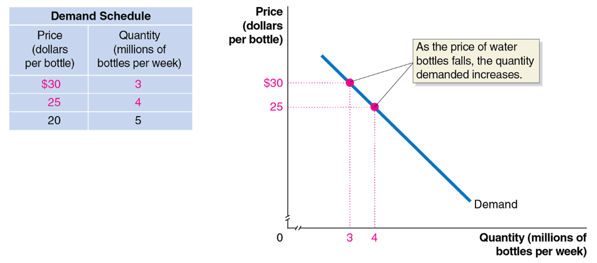{height=99%}

Demand schedule: A table that shows the relationship between the price of a product and the quantity of the product demanded. + Demand curve: A curve that shows the relationship between the price of a product and the quantity of the product demanded.

## Figure 3.1 A Demand Schedule and Demand Curve (2 of 3)

Figure 3.1 A Demand Schedule and Demand Curve (2 of 3)

Quantity demanded: The amount of a good or service that a consumer is willing and able to purchase at a given price. + Law of demand: A rule that states that, holding everything else constant, when the price of a product falls, the quantity demanded of the product will increase, and when the price of a product rises, the quantity demanded of the product will decrease.

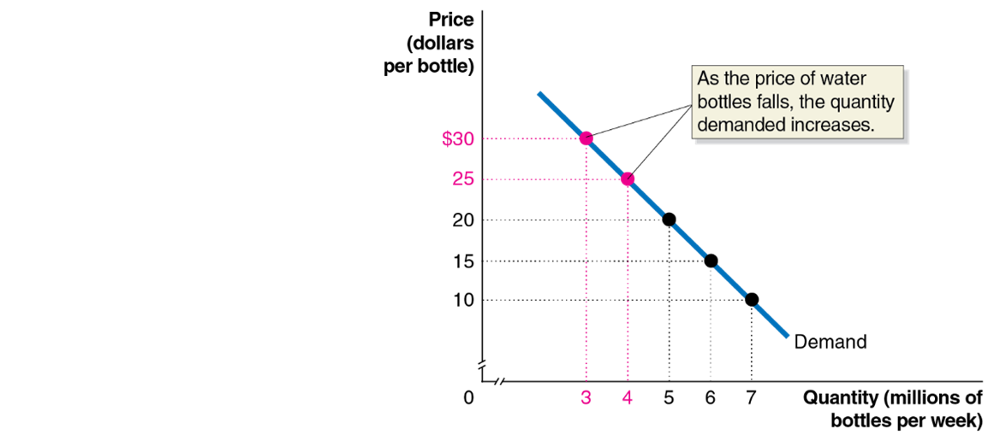{height=99%}

## What Explains the Law of Demand?

What Explains the Law of Demand?

When the price of a good falls, two effects take place: + Consumers substitute toward the good whose price has fallen. + Consumers have more purchasing power, which is like an increase in income.

We call these the substitution effect and the income effect: + Substitution effect: The change in the quantity demanded of a good that results from a change in price, making the good more or less expensive relative to other goods, holding constant the effect of the price change on consumer purchasing power. + Income effect: The change in the quantity demanded of a good that results from the effect of a change in the good’s price on a consumer’s purchasing power, holding all other factors constant.

## Figure 3.1 A Demand Schedule and Demand Curve (3 of 3)

Figure 3.1 A Demand Schedule and Demand Curve (3 of 3)

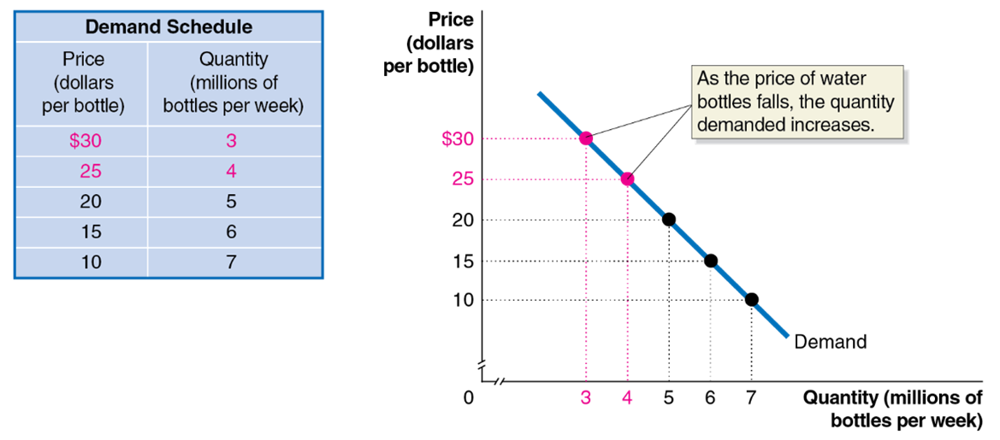{height=99%}

When drawing the demand curve, we assume ceteris paribus. + Ceteris paribus (“all else equal”) condition: The requirement that when analyzing the relationship between two variables—such as price and quantity demanded—other variables must be held constant.

## Figure 3.2 Shifting the Demand Curve (1 of 2)

Figure 3.2 Shifting the Demand Curve (1 of 2)

A change in something other than price that affects demand causes the entire demand curve to shift.

A shift to the right

is an increase in demand.

A shift to the left

is a decrease in demand.

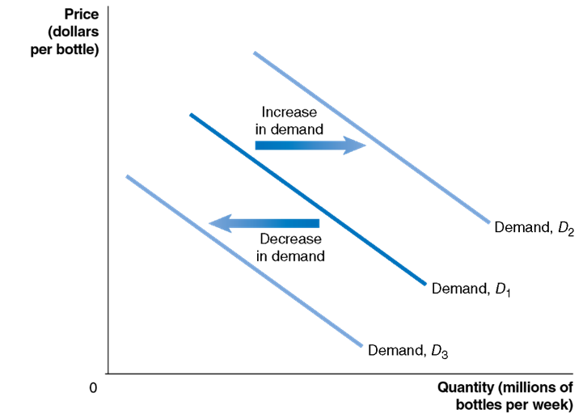{height=99%}

## Figure 3.2 Shifting the Demand Curve (2 of 2)

Figure 3.2 Shifting the Demand Curve (2 of 2)

As the demand curve shifts, the quantity demanded will change, even if the price doesn’t change. + The quantity demanded changes at every possible price.

{height=99%}

## Variables That Shift Market Demand

Variables That Shift Market Demand

Income + An increase in income increases demand if the product is normal, and decreases demand if the product is inferior.

Prices of related goods + An increase in the price of related goods increases demand if products are substitutes, and decreases demand if products are complements.

Tastes + Population and demographics + Expected future prices + Natural Disasters and Pandemics + We will discuss how each of these affect demand.

## Changes in Income of Consumers

Changes in Income of Consumers

Normal good: A good for which the demand increases as income rises and decreases as income falls.

Examples:

New clothes + Restaurant meals + Vacations

Inferior good: A good for which the demand increases as income falls and decreases as income rises.

Examples:

Second-hand clothes + Instant noodles

## Effects of Changes in Income

Effects of Changes in Income

An increase in income would increase the demand for new clothes, ceteris paribus.

However, the same increase in income would likely decrease the demand for second-hand clothes.

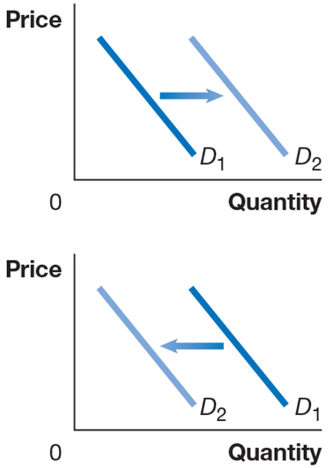{height=99%}

## Changes in the Price of Related Goods

Changes in the Price of Related Goods

Substitutes: Goods and services that can be used for the same purpose.

Examples:

Big Mac and Whopper + Ford F-150 and Dodge Ram + Reusable water bottles and bottled spring water

Complements: Goods and services that are used together.

Examples:

Big Mac and McDonald’s fries + Left shoes and right shoes + Reusable water bottles and gym memberships

## Effects of Changes in the Price of Related Goods

Effects of Changes in the Price of Related Goods

An increase in the price of a reusable water bottle would increase the demand for bottled spring water.

However, the same increase in the price of a reusable water bottle would decrease the demand for gym memberships.

{height=99%}

## Changes in Tastes

Changes in Tastes

Tastes + If consumers’ tastes change, they may buy more or less of the product. + Example: If influencers successfully advertise reusable water bottles, they affect consumers’ tastes, increasing demand for reusable water bottles.

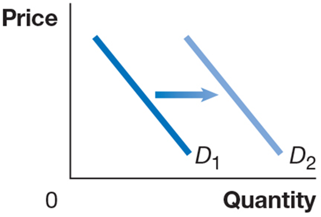{height=99%}

## Apply the Concept: When Did Most People Stop Wearing Hats?

Apply the Concept: When Did Most People Stop Wearing Hats?

The two photos show crowd scenes from the 1930s and 2022; almost everyone wore a hat in the first photo, but very few were doing so in the second. + Why? Most explanations involve changing tastes: + Wearing hats in cars is inconvenient. + Better climate control reduces the need to keep your head warm. + General trend toward less formal clothing.

{height=99%}

{height=99%}

## Changes in Population/Demographics

Changes in Population/Demographics

Demographics: The characteristics of a population with respect to age, race, and gender. + Increases in the number of people buying something will increase the amount demanded. + Example: An increase in the elderly population increases the demand for medical care.

{height=99%}

## Apply the Concept: Millennials and Gen Z Are Changing Existing Markets

Apply the Concept: Millennials and Gen Z Are Changing Existing Markets

Millennials (born 1981-1996) and Gen Z (born 1997-2012) have different tastes than prior generations. + These groups are more likely than older generations to own reusable water bottles. + W S J: “Canned tuna is struggling to connect with younger generations.” + Harley Davidson’s “greatest challenge is to bring younger people into the sport” of riding motorcycles.

{height=99%}

## Changes in Expectations About Future Prices

Changes in Expectations About Future Prices

Consumers decide which products to buy and also when to buy them. + Future products are substitutes for current products. + An expected increase in the price tomorrow increases demand today. + An expected decrease in the price tomorrow decreases demand today.

Example: If you found out the price of gasoline would go up tomorrow, you would increase your demand today.

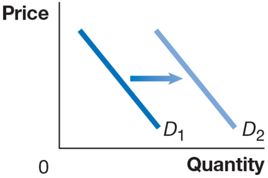{height=99%}

## Natural Disasters and Pandemics (1 of 3)

Natural Disasters and Pandemics (1 of 3)

Temporary disruptions to economic activity can happen via natural disasters or pandemics. + Natural disaster: (in an economic context) A hurricane, flood, or similar act of nature that causes damage to stores, factories, or office buildings. + Pandemic: (in an economic context) A situation in which a disease becomes sufficiently widespread as to significantly affect economic activity.

## Natural Disasters and Pandemics (2 of 3)

Natural Disasters and Pandemics (2 of 3)

Example: The Covid-19 pandemic reduced the demand for goods that required people gathering (restaurants, concert tickets, etc.) but increased the demand for computing equipment to work from home.

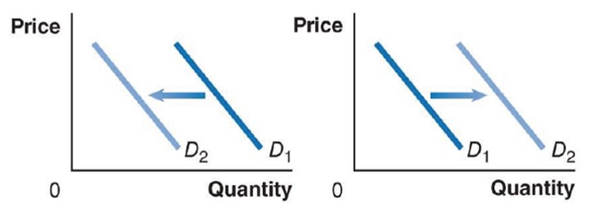{height=99%}

## Figure 3.3 A Change in Demand versus a Change in Quantity Demanded

Figure 3.3 A Change in Demand versus a Change in Quantity Demanded

A change in the price of the product being examined causes a movement along the demand curve. + This is a change in quantity demanded.

Any other change affecting demand causes the entire demand curve to shift. + This is a change in demand.

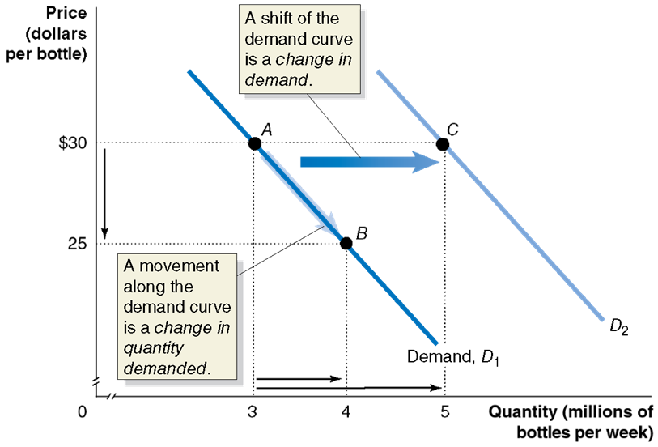{height=99%}

## 3.2 The Supply Side of the Market

3.2 The Supply Side of the Market

List and describe the variables that influence supply.

There are some similarities, and some important differences, between the demand and supply sides of the market. + In this section, we examine the market supply, i.e., the decisions of (generally) firms about how much of a product to provide at various prices.

## Figure 3.4 A Supply Schedule and Supply Curve (1 of 2)

Figure 3.4 A Supply Schedule and Supply Curve (1 of 2)

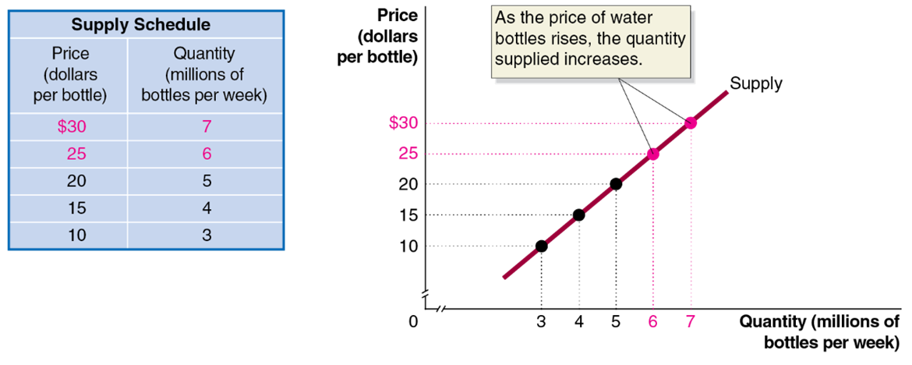{height=99%}

Supply schedule: A table that shows the relationship between the price of a product and the quantity of the product supplied. + Supply curve: A curve that shows the relationship between the price of a product and the quantity of the product supplied.

## Figure 3.4 A Supply Schedule and Supply Curve (2 of 2)

Figure 3.4 A Supply Schedule and Supply Curve (2 of 2)

Quantity supplied: The amount of a good or service that a firm is willing and able to supply at a given price. + Law of supply: A rule that states that, holding everything else constant, increases in price cause increases in the quantity supplied, and decreases in price cause decreases in the quantity supplied.

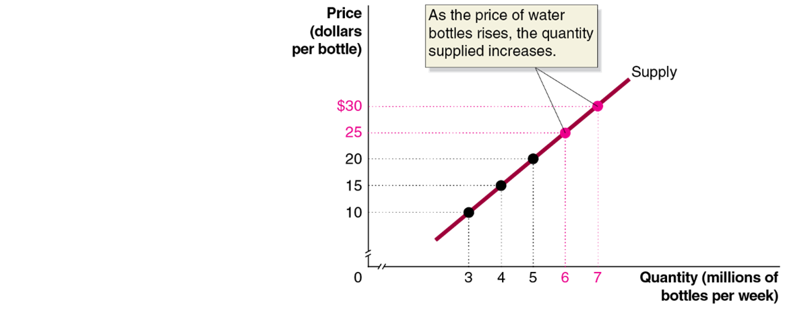{height=99%}

## Figure 3.5 Shifting the Supply Curve (1 of 2)

Figure 3.5 Shifting the Supply Curve (1 of 2)

A change in something other than price that affects supply causes the entire supply curve to shift.

A shift to the right

is an increase in supply.

A shift to the left

is a decrease in supply.

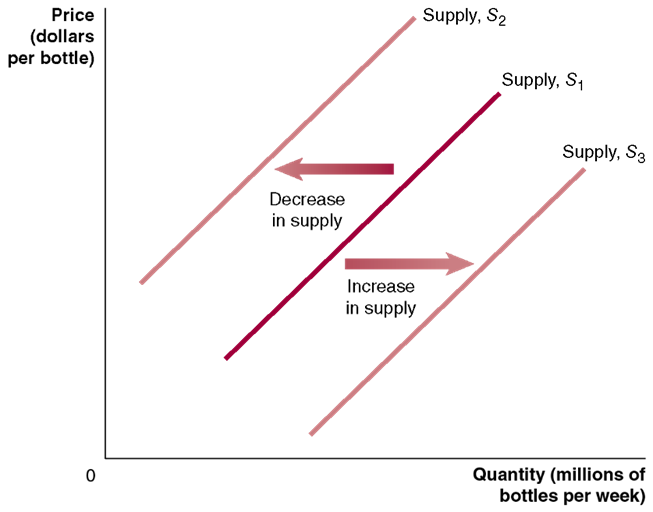{height=99%}

## Figure 3.5 Shifting the Supply Curve (2 of 2)

Figure 3.5 Shifting the Supply Curve (2 of 2)

As the supply curve shifts, the quantity supplied will change, even if the price doesn’t change. + The quantity supplied changes at every possible price.

{height=99%}

## What Variables Shift Market Supply?

What Variables Shift Market Supply?

Prices of inputs + Technological change + Prices of related goods in production + Number of firms in the market + Expected future prices + Natural disasters and pandemics

We will discuss how each of these affect supply.

## Change in Prices of Inputs

Change in Prices of Inputs

Inputs are anything used in the production of a good or service. + For a reusable water bottle, this includes plastic, labor, and transportation services. + An increase in the price of input decreases the profitability of selling the good, causing a decrease in supply. + A decrease in the price of an input increases the profitability of selling the good, causing an increase in supply.

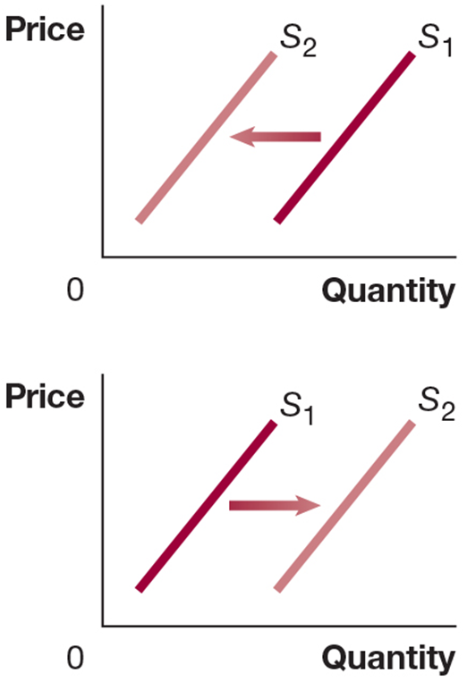{height=99%}

## Technological Change

Technological Change

A firm may experience a positive or negative change in its ability to produce a given level of output with a given quantity of inputs. We call this a technological change. + Examples: + A new, more efficient way of producing water bottles would increase their supply. + Governmental restrictions on how much workers are allowed to work might decrease the supply of water bottles.

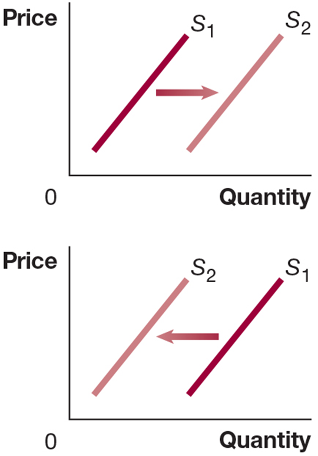{height=99%}

## Prices of Related Goods in Production

Prices of Related Goods in Production

Many firms can produce and sell alternative products: substitutes in production. + Example: An Illinois farmer can plant either corn or soybeans. If the price of soybeans rises, that farmer will plant (supply) less corn. + Sometimes, two products are necessarily produced together: complements in production + Example: Cattle provide both beef and leather. An increase in the price of beef encourages more cattle farming, which increases the supply of leather.

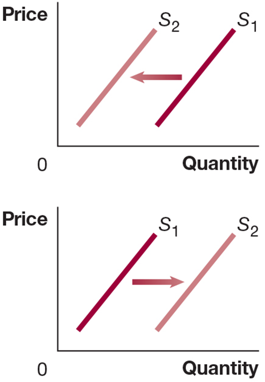{height=99%}

## Number of Firms and Expected Future Prices

Number of Firms and Expected Future Prices

More firms in the market will result in more products available at a given price (greater supply).

If a firm anticipates that the price of its product will be higher in the future, it might decrease its supply today in order to increase it later.

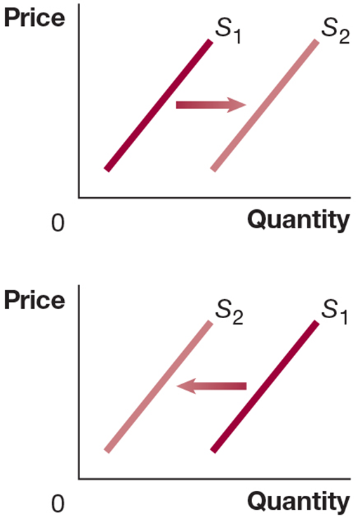{height=99%}

## Natural Disasters and Pandemics (3 of 3)

Natural Disasters and Pandemics (3 of 3)

Less of a good will be supplied due to disruptions in production + Example: During hurricanes and floods, some manufacturing plants will be damaged and forced to shut down. The result will be fewer units supplied.

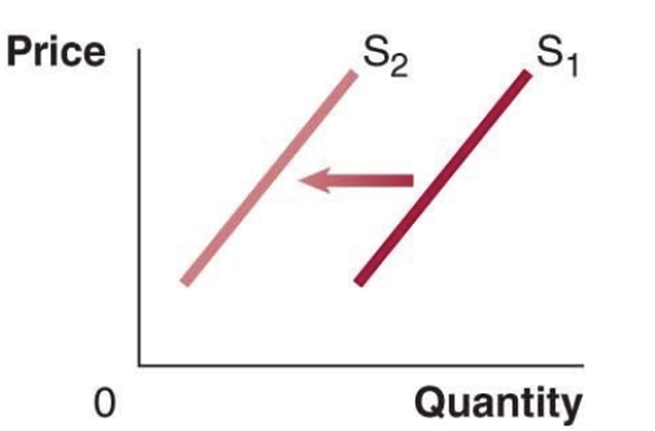{height=99%}

## Apply the Concept: Fracking, the U.S. Oil Boom, and Expected Oil Prices

Apply the Concept: Fracking, the U.S. Oil Boom, and Expected Oil Prices

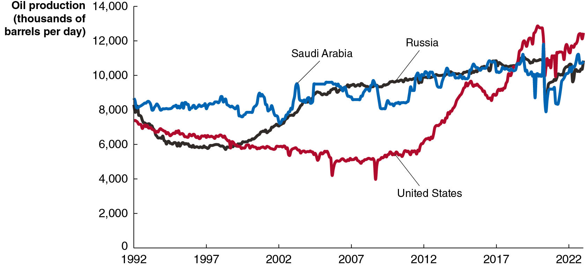{height=99%}

The development of hydraulic fracturing (fracking) disrupted the world oil market, propelling the U.S. to be the world’s largest oil producer. + In 2016 and during the Covid-19 pandemic, U.S. oil producers believed the price of oil was temporarily low. Each time they reduced current production, intending to sell more later when prices recovered.

## Figure 3.6 A Change in Supply Versus a Change in Quantity Supplied

Figure 3.6 A Change in Supply Versus a Change in Quantity Supplied

A change in the price of the product being examined causes a movement along the supply curve. + This is a change in the quantity supplied.

Any other change affecting supply causes the entire supply curve to shift. + This is a change in supply.

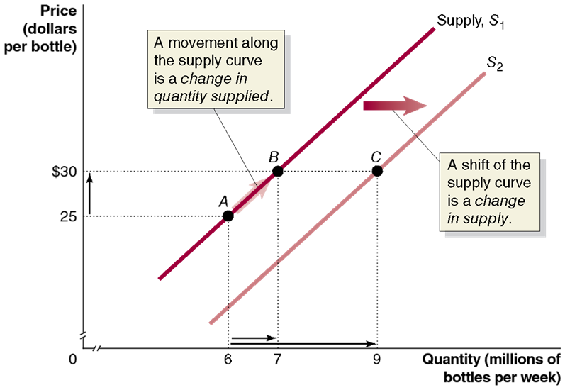{height=99%}

## 3.3 Market Equilibrium: Putting Demand and Supply Together

3.3 Market Equilibrium: Putting Demand and Supply Together

Use a graph to illustrate market equilibrium.

Market equilibrium is a situation in which quantity demanded equals quantity supplied. + Recall that markets with many buyers and sellers are perfectly competitive markets; a market equilibrium in one of these markets is called a competitive market equilibrium.

There are

firms selling reusable water bottles; we

will assume this is enough to generate competitive behavior in the market for reusable water bottles.

## Figure 3.7 Market Equilibrium

Figure 3.7 Market Equilibrium

At a price of $20, + consumers want to buy 5 million water bottles per week, and + producers want to sell 5 million water bottles per week.

We say the equilibrium price in this market is $20, and the equilibrium quantity is 5 million reusable water bottles per week. + Since buyers and sellers want to trade the same quantity at the price of $20, we do not expect the price to change.

{height=99%}

## Figure 3.8 The Effect of Surpluses and Shortages on the Market Price (1 of 2)

Figure 3.8 The Effect of Surpluses and Shortages on the Market Price (1 of 2)

What if the price were $25 instead? + At a price of $25, + consumers want to buy 4 million water bottles, while + producers want to sell 6 million water bottles.

This gives a surplus of 2 million water bottles: a situation in which the quantity supplied is greater than the quantity demanded. + Prediction: Sellers will compete among themselves, driving the price down.

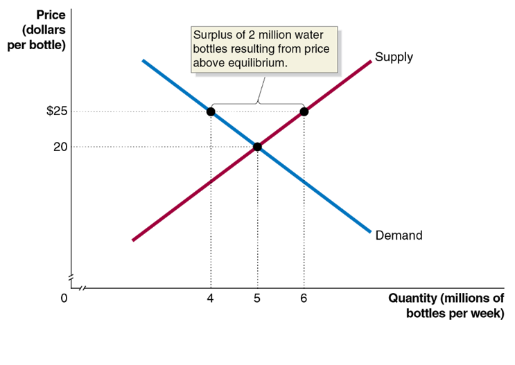{height=99%}

## Figure 3.8 The Effect of Surpluses and Shortages on the Market Price (2 of 2)

Figure 3.8 The Effect of Surpluses and Shortages on the Market Price (2 of 2)

Now what if the price were $10? + At a price of $10, + consumers want to buy 7 million water bottles, while + producers want to sell 3 million.

This gives a shortage of 4 million water bottles: a situation in which the quantity demanded is greater than the quantity supplied. + Prediction: Sellers will realize they can increase the price and still sell as many water bottles, so the price will rise.

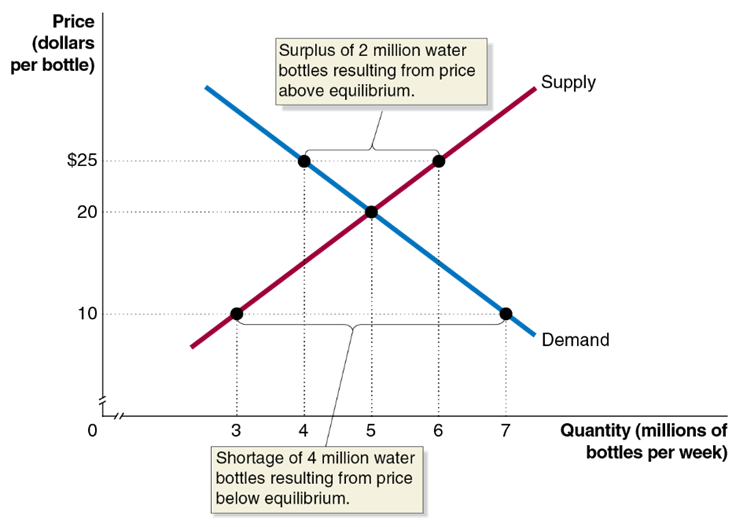{height=99%}

## Demand and Supply Both Count

Demand and Supply Both Count

Price is determined by the interaction of buyers and sellers. + Neither group can dictate price in a competitive market (i.e., one with many buyers and sellers). + However, changes in supply and/or demand will affect the price and quantity traded.

## 3.4 The Effect of Demand and Supply Shifts on Equilibrium

3.4 The Effect of Demand and Supply Shifts on Equilibrium

Use demand and supply graphs to predict changes in prices and quantities.

Predictions about price and quantity in our model require us to know demand and supply curves. + Typically, we know price and quantity but do not know the curves that generate them.

The power of the demand and supply model is in its ability to predict directional changes in price and quantity.

## Figure 3.9 The Effect of an Increase in Demand on Equilibrium

Figure 3.9 The Effect of an Increase in Demand on Equilibrium

Suppose incomes increase. What happens to the equilibrium in the reusable water bottle market? + Reusable water bottles are a normal good, so as income rises, demand shifts to the right

Equilibrium price rises

Equilibrium quantity rises

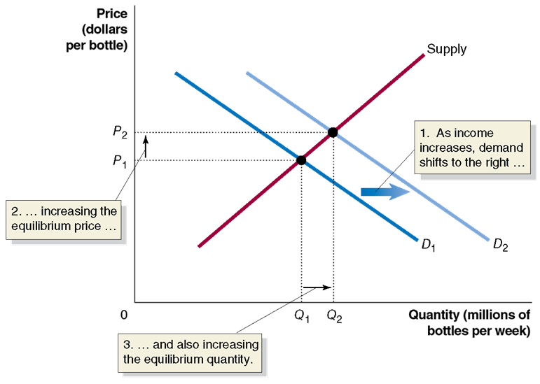{height=99%}

## Figure 3.10 The Effect of an Increase in Supply on Equilibrium (1 of 2)

Figure 3.10 The Effect of an Increase in Supply on Equilibrium (1 of 2)

The graph shows the market for reusable water bottles as a new producer, Yeti, enters the market. + When Yeti enters, more water bottles are supplied at any given price—an increase in supply from

Equilibrium price falls from

Equilibrium quantity rises

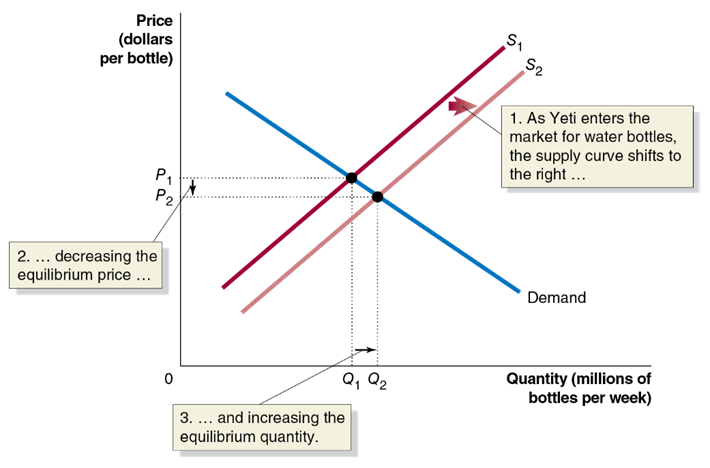{height=99%}

## Figure 3.10 The Effect of an Increase in Supply on Equilibrium (2 of 2)

Figure 3.10 The Effect of an Increase in Supply on Equilibrium (2 of 2)

By how much will the price fall? By how much will quantity rise? + We cannot say, without knowing more information. + For now, we can only predict that price will fall and quantity will rise.

{height=99%}

## Table 3.3 How Shifts in Demand and Supply Affect Equilibrium Price (P) and Quantity (Q) (1 of 2)

Table 3.3 How Shifts in Demand and Supply Affect Equilibrium Price (P) and Quantity (Q) (1 of 2)

## Figure 3.11 Shifts in Demand and Supply Over Time (1 of 3)

Figure 3.11 Shifts in Demand and Supply Over Time (1 of 3)

Over time, it is likely that both demand and supply will change. + For example, as new firms enter the market for water bottles and incomes increase, we expect: + The supply curve will shift to the right, and + The demand curve will shift to the right.

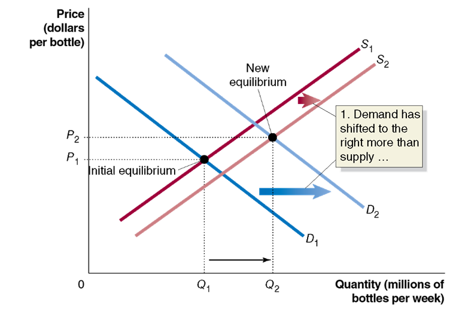{height=99%}

## Figure 3.11 Shifts in Demand and Supply Over Time (2 of 3)

Figure 3.11 Shifts in Demand and Supply Over Time (2 of 3)

What does our model predict?

So we can be sure equilibrium quantity will rise, but the effect on the equilibrium price is not clear. + This panel shows demand shifting more than supply: equilibrium price and quantity both rise.

{height=99%}

## Figure 3.11 Shifts in Demand and Supply Over Time (3 of 3)

Figure 3.11 Shifts in Demand and Supply Over Time (3 of 3)

This panel shows supply shifting more than demand: quantity rises, but equilibrium price falls. + Without knowing the relative size of the changes, the effect on the equilibrium price is ambiguous. + It is possible, but unlikely, that the equilibrium price will remain unchanged.

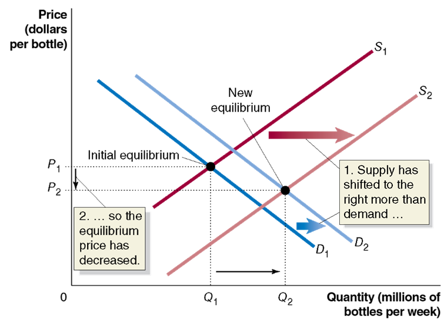{height=99%}

## Table 3.3 How Shifts in Demand and Supply Affect Equilibrium Price (P) and Quantity (Q) (2 of 2)

Table 3.3 How Shifts in Demand and Supply Affect Equilibrium Price (P) and Quantity (Q) (2 of 2)

The cell in red is the example that we just saw.

## Apply the Concept: Sticker Shock in the Market for Used Cars (1 of 2)

Apply the Concept: Sticker Shock in the Market for Used Cars (1 of 2)

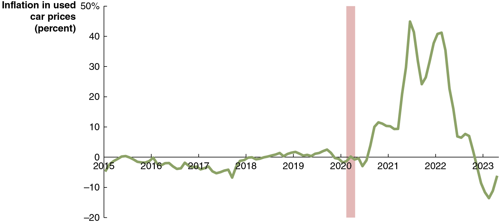{height=99%}

Leading up to 2020, prices for many goods (including used cars) had been stable for a long time. + But beginning in 2020, prices for used cars started rising at rates not seen for decades.

## Apply the Concept: Sticker Shock in the Market for Used Cars (2 of 2)

Apply the Concept: Sticker Shock in the Market for Used Cars (2 of 2)

Why did prices rise? + Supply shortages for new cars ‘drove’ increases in demand for used cars. + Rental car companies reduced their fleets, removing a major source of used cars.

The graph shows both of these effects, each of which increased prices.

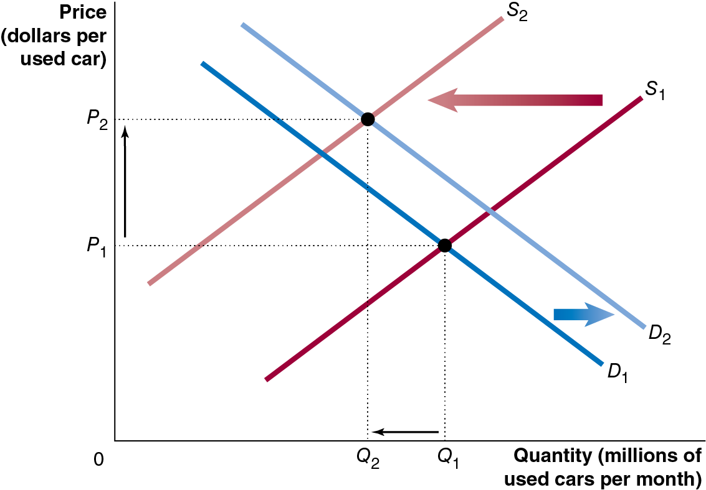{height=99%}

## Shifts of a Curve versus Movements Along a Curve

Shifts of a Curve versus Movements Along a Curve

Suppose an increase in supply occurs. We now know: + Equilibrium quantity will increase, and + Equilibrium price will decrease.

It is tempting to believe the decrease in price will cause an increase in demand. But this is incorrect. + The decrease in price will cause a movement along the demand curve but not an increase in demand. + Why? The demand curve already describes how much of the good consumers want to buy, at any given price. + When the price change occurs, we just look at the demand curve to see what happens to how much consumers want to buy.

## Copyright

Copyright

{height=99%}

This work is protected by United States copyright laws and is provided solely for the use of instructors in teaching their courses and assessing student learning. Dissemination or sale of any part of this work (including on the World Wide Web) will destroy the integrity of the work and is not permitted. The work and materials from it should never be made available to students except by instructors using the accompanying text in their classes. All recipients of this work are expected to abide by these restrictions and to honor the intended pedagogical purposes and the needs of other instructors who rely on these materials.

