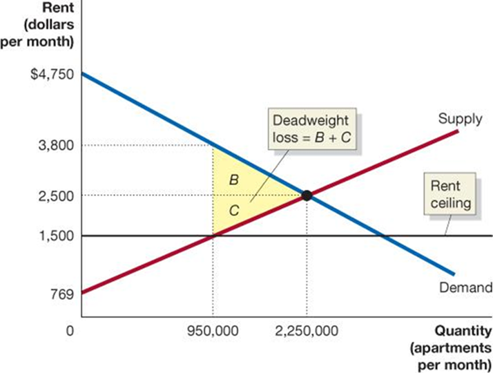

## Macroeconomics

Macroeconomics

Ninth Edition

{height=99%}

Chapter 4

Economic Efficiency, Government Price Setting, and Taxes

{height=99%}

Copyright © 2025, 2021, 2018 Pearson Education, Inc. All Rights Reserved

## Chapter Outline

Chapter Outline

4.1 Consumer Surplus and Producer Surplus + 4.2 The Efficiency of Competitive Markets + 4.3 Government Intervention in the Market: Price Floors and Price Ceilings + 4.4 The Economic Effect of Taxes + Appendix: Quantitative Demand and Supply Analysis

## What Do Food Riots in Venezuela and the Rise of Uber in the United States Have in Common?

What Do Food Riots in Venezuela and the Rise of Uber in the United States Have in Common?

25 years ago, Venezuelans enjoyed the highest standard of living in Latin America; but by 2017, 90% lived in poverty, and people fought over food supplies. + In many U.S. cities, operating a taxi requires a permit from the city government; but ride-sharing apps Uber and Lyft disrupted the taxi market, decreasing the value of these permits. + What do these two situations have in common?  Both situations involve governments trying to alter prices.

{height=99%}

## 4.1 Consumer Surplus and Producer Surplus

4.1 Consumer Surplus and Producer Surplus

Distinguish between the concepts of consumer surplus and producer surplus.

Surplus (noun): Something that remains above what is used or needed.

Economists use the idea of “surplus” to refer to the benefit that people derive from engaging in market transactions. + Consumer surplus is the difference between the highest price a consumer is willing to pay for a good or service and the actual price the consumer pays. + Producer surplus is the difference between the lowest price a firm would be willing to accept for a good or service and the price it actually receives.

## Figure 4.1 Deriving the Demand Curve for Chai Tea (1 of 2)

Figure 4.1 Deriving the Demand Curve for Chai Tea (1 of 2)

Suppose four people are each interested in buying a cup of chai tea. + We can characterize them by the highest price they are willing to pay. + At prices above $6, no chai tea will be sold. + At $6, one cup will be sold, etc.

{height=99%}

## Figure 4.1 Deriving the Demand Curve for Chai Tea (2 of 2)

Figure 4.1 Deriving the Demand Curve for Chai Tea (2 of 2)

How much benefit do the potential tea consumers derive from this market? + That depends on the price and their marginal benefit, the additional benefit to a consumer from consuming one more unit of a good or service. + If the price is low, many of the consumers benefit. + If the price is high, few (if any) of the consumers benefit.

{height=99%}

## Figure 4.2 Measuring Consumer Surplus (1 of 3)

Figure 4.2 Measuring Consumer Surplus (1 of 3)

If the price of tea is $3.50 per cup, Theresa, Tom, and Terri will buy a cup. + Theresa was willing to pay $6.00; a cup of chai tea is “worth” $6.00 to her. She gets it for $3.50, so she derives a net benefit of

Area A represents this net benefit and is known as Theresa’s consumer surplus in the chai tea market.

Notice that the area A is

{height=99%}

## Figure 4.2 Measuring Consumer Surplus (2 of 3)

Figure 4.2 Measuring Consumer Surplus (2 of 3)

Tom and Terri also obtained consumer surplus, equal to $1.50 (area B) and $0.50 (area C). + The sum of the areas of rectangles A, B, and C is the consumer surplus in the chai tea market. + This area can be described as the area below the demand curve, above the price that consumers pay.

{height=99%}

## Figure 4.2 Measuring Consumer Surplus (3 of 3)

Figure 4.2 Measuring Consumer Surplus (3 of 3)

If the price falls to $3.00, Theresa, Tom, and Terri each gain an additional $0.50 of consumer surplus. + Tim is indifferent between buying the cup and not; his well-being is the same either way. + The overall consumer surplus remains the area below the demand curve, above the (new) price.

{height=99%}

## Figure 4.3 Total Consumer Surplus in the Market for Chai Tea

Figure 4.3 Total Consumer Surplus in the Market for Chai Tea

The market for chai tea is larger than just our four consumers. + With many consumers, the market demand curve looks like “normal”: a straight line.

Consumer surplus in this market is defined in just the same way: the area below the demand curve, above price. The graph shows the total consumer surplus if the price is $2.00.

{height=99%}

## Apply the Concept: The Consumer Surplus from Uber (1 of 2)

Apply the Concept: The Consumer Surplus from Uber (1 of 2)

Access to ride-sharing services from Uber is beneficial for consumers. + We can measure just how beneficial it is by estimating the consumer surplus derived in the market.

What would we need to know in order to do this? + The demand curve for Uber’s services + The price of Uber’s services

## Apply the Concept: The Consumer Surplus from Uber (2 of 2)

Apply the Concept: The Consumer Surplus from Uber (2 of 2)

Five economists analyzed 6 months of Uber rides in New York, San Francisco, Chicago, and Los Angeles in 2015 to estimate the demand curve for Uber rides. + 111 million rides were taken, with an average price of $13.30.

{height=99%}

## Producer Surplus

Producer Surplus

Producer surplus can be thought of in much the same way as consumer surplus. + It is the difference between the lowest price a firm would accept for a good or service and the price it actually receives.

What is the lowest price a firm would accept for a good or service? + The marginal cost of producing that good or service.

Marginal cost: The change in a firm’s total cost from producing one more unit of a good or service.

## Figure 4.4 Measuring Producer Surplus (1 of 2)

Figure 4.4 Measuring Producer Surplus (1 of 2)

Heavenly Tea is a (very small) producer of chai tea. + When the market price of tea is $2.00, Heavenly Tea receives a producer surplus of $0.75 on the first cup (the area of rectangle A), $0.50 on the second cup (rectangle B), and $0.25 on the third cup (rectangle C).

{height=99%}

## Figure 4.4 Measuring Producer Surplus (2 of 2)

Figure 4.4 Measuring Producer Surplus (2 of 2)

The total amount of producer surplus tea sellers receive from selling chai tea can be calculated by adding up the individual producer surplus received on every cup sold. + Total producer surplus is equal to the area above the supply curve and below the market price of $2.00.

{height=99%}

## What Do Consumer Surplus and Producer Surplus Measure?

What Do Consumer Surplus and Producer Surplus Measure?

Consumer surplus measures the net benefit to consumers from participating in a market rather than the total benefit. + Consumer surplus in a market is equal to the total benefit received by consumers (measured in dollars) minus the total amount they must pay to buy the good or service.

Similarly, producer surplus measures the net benefit received by producers from participating in a market. + Producer surplus in a market is equal to the total amount firms receive from consumers minus the cost of providing the good or service.

## 4.2 The Efficiency of Competitive Markets

4.2 The Efficiency of Competitive Markets

Explain the concept of economic efficiency.

We can think about efficiency in a market in two ways: + A market is efficient if all trades take place where the marginal benefit exceeds the marginal cost, and no other trades take place. + A market is efficient if it maximizes the sum of consumer surplus and producer surplus (i.e., the total net benefit to consumers and firms), known as the economic surplus.

## Figure 4.5 Marginal Benefit Equals Marginal Cost Only at the Competitive Equilibrium (1 of 2)

Figure 4.5 Marginal Benefit Equals Marginal Cost Only at the Competitive Equilibrium (1 of 2)

Recall that the demand curve describes the marginal benefit of each additional cup of tea, while the supply curve describes the marginal cost of each additional cup of tea. + If the quantity is too low, the value to consumers of the next unit exceeds the cost to producers.

{height=99%}

## Figure 4.5 Marginal Benefit Equals Marginal Cost Only at the Competitive Equilibrium (2 of 2)

Figure 4.5 Marginal Benefit Equals Marginal Cost Only at the Competitive Equilibrium (2 of 2)

If the quantity is too high, the cost to producers of the last unit is greater than the value consumers derive from it. + Only at the competitive equilibrium is the last unit valued by consumers and producers equally—economic efficiency.

{height=99%}

## Figure 4.6 Economic Surplus Equals the Sum of Consumer Surplus and Producer Surplus

Figure 4.6 Economic Surplus Equals the Sum of Consumer Surplus and Producer Surplus

The figure shows the economic surplus (the sum of consumer surplus and producer surplus) in the market for chai tea. + At the competitive equilibrium quantity, the economic surplus is maximized. + Our two concepts of economic efficiency result in the same level of output!

{height=99%}

## Figure 4.7 When a Market Is Not in Equilibrium, There Is a Deadweight Loss (1 of 2)

Figure 4.7 When a Market Is Not in Equilibrium, There Is a Deadweight Loss (1 of 2)

When the price of chai tea is $2.20 instead of $2.00, consumer surplus declines from an amount equal to the sum of areas A, B, and C to just area A. + Producer surplus increases from the sum of areas D and E to the sum of areas B and D. + Economic surplus decreases by the sum of areas C and E.

{height=99%}

## Figure 4.7 When a Market Is Not in Equilibrium, There Is a Deadweight Loss (2 of 2)

Figure 4.7 When a Market Is Not in Equilibrium, There Is a Deadweight Loss (2 of 2)

The reduction in economic surplus resulting from a market not being in competitive equilibrium is known as a deadweight loss. + Deadweight loss can be thought of as the amount of inefficiency in a market. In competitive equilibrium, deadweight loss is zero.

{height=99%}

## Economic Efficiency

Economic Efficiency

Since our two ideas of economic efficiency coincide, we are in a position to define economic efficiency: + Economic efficiency: A market outcome in which the marginal benefit to consumers of the last unit produced is equal to its marginal cost of production and in which the sum of consumer surplus and producer surplus is at a maximum.

## 4.3 Government Intervention in the Market: Price Floors and Price Ceilings

4.3 Government Intervention in the Market: Price Floors and Price Ceilings

Explain the economic effect of government-imposed price floors and price ceilings.

One option a government has for affecting a market is the imposition of a price ceiling or a price floor. + Price ceiling: A legally determined maximum price that sellers may charge. + Price floor: A legally determined minimum price that sellers may receive.

Price ceilings and floors in the U. S.  are uncommon, but include: + Minimum wages + Rent controls + Agricultural price supports

## Figure 4.8 The Economic Effect of a Price Floor in the Wheat Market (1 of 2)

Figure 4.8 The Economic Effect of a Price Floor in the Wheat Market (1 of 2)

The equilibrium price in the market for wheat is $6.50 per bushel; 2.0 billion bushels are traded at this price. + If wheat farmers convince the government to impose a price floor of $8.00 per bushel, the quantity traded falls to 1.8 billion bushels. + Area A is the surplus transferred from consumers to producers. + Economic surplus is reduced by area B + C, the deadweight loss.

{height=99%}

## Figure 4.8 The Economic Effect of a Price Floor in the Wheat Market (2 of 2)

Figure 4.8 The Economic Effect of a Price Floor in the Wheat Market (2 of 2)

Unfortunately, the situation may be even worse: + If farmers do not realize they will not be able to sell all of their wheat, they will produce 2.2 billion bushels. + This results in a surplus, or excess supply, of 400 million bushels of wheat. + In practice, these surpluses are common and large.

{height=99%}

## Price Floors in Labor Markets: The Debate Over Minimum Wage Policy

Price Floors in Labor Markets: The Debate Over Minimum Wage Policy

The minimum wage may be the most controversial ‘price floor’. + Supporters of the minimum wage see it as a way of raising the incomes of low-skilled workers. + Opponents argue that it results in fewer jobs and imposes large costs on small businesses.

The federal minimum wage has been $7.25 per hour since 2009, and many cities and states have minimum wages above the federal level.

## Figure 4.9 The Effect of a Minimum Wage on the Labor Market

Figure 4.9 The Effect of a Minimum Wage on the Labor Market

Assuming the minimum wage does decrease employment, it must result in a deadweight loss for society. + How much of a decrease in employment occurs due to minimum wages, and are the benefits worth the costs? + Economists continue to debate this.

{height=99%}

## Apply the Concept: Natural Experiments and the Minimum Wage (1 of 2)

Apply the Concept: Natural Experiments and the Minimum Wage (1 of 2)

We could find out the effects of minimum wages by running experiments: changing minimum wages in different places and observing the outcomes. + But this has both ethical and financial difficulties. + As an alternative, economists often look for natural experiments, where some variable of interest changes for one group of people but not for another similar group.

## Apply the Concept: Natural Experiments and the Minimum Wage (2 of 2)

Apply the Concept: Natural Experiments and the Minimum Wage (2 of 2)

David Card and Alan Krueger compared employment in fast food restaurants in neighboring counties in New Jersey and Pennsylvania, after New Jersey raised its minimum wage. + Perhaps surprisingly, employment in New Jersey increased rather than decreased.

{height=99%}

## Figure 4.10 The Economic Effect of a Rent Ceiling (1 of 2)

Figure 4.10 The Economic Effect of a Rent Ceiling (1 of 2)

Without rent control, the equilibrium rent is $2,500 per month. + At that price, 2,000,000 apartments would be rented. + If the government imposes a rent ceiling of $1,500: + The quantity of apartments supplied falls to 1,900,000. + The quantity of apartments demanded rises to 2,100,000.

This results in a shortage of 200,000 apartments.

{height=99%}

## Figure 4.10 The Economic Effect of a Rent Ceiling (2 of 2)

Figure 4.10 The Economic Effect of a Rent Ceiling (2 of 2)

Producer surplus equal to the area of the blue rectangle A is transferred from landlords to renters. + There is a deadweight loss equal to the areas of yellow triangles B and C. + This deadweight loss corresponds to the surplus that would have been derived from apartments that are no longer rented.

{height=99%}

## Illegal Markets and Peer-to-Peer Sites

Illegal Markets and Peer-to-Peer Sites

The shortage of apartments may lead to an illegal market—a market in which buying and selling take place at prices that violate government price regulations. + Alternatively, landlords might switch from long-term to short-term rentals in order to avoid rent controls; peer-to-peer rental sites such as Airbnb have facilitated this switch. + These markets may alleviate some of the deadweight loss by allowing additional apartments to be rented, but buyers and sellers lose valuable legal protections.

## The Results of Government Price Controls

The Results of Government Price Controls

When a government imposes price controls: + Some people win (ex: renters with lower rents, or landlords who can exploit the shortage of housing to illegally raise rents), + Some people lose (ex: law-abiding landlords, and renters unable to find apartments), and + There is a loss of economic efficiency (ex: fewer apartments rented results in deadweight loss).

## Apply the Concept: Should the Government Limit “Price Gouging” During an Emergency? (1 of 4)

Apply the Concept: Should the Government Limit “Price Gouging” During an Emergency? (1 of 4)

In early 2020, as the Covid-19 pandemic spread through the United States, people flocked to supermarkets and pharmacies to buy hand sanitizer, disinfectant wipes, and toilet paper. + By March, these products had largely disappeared from store shelves. People who hoped to buy them on Amazon or eBay found that sellers were charging prices far above normal. + For instance, sellers on Amazon were charging $99.95 for large bottles of hand sanitizer that normally sell for $9.95.

## Apply the Concept: Should the Government Limit “Price Gouging” During an Emergency? (2 of 4)

Apply the Concept: Should the Government Limit “Price Gouging” During an Emergency? (2 of 4)

Early in the Covid-19 pandemic, demand surged for products like hand sanitizer. + The graph shows the market for hand sanitizer in early 2020. + Demand increased, and in the very short run, supply was unable to change, driving prices up from $3.99 to $9.99. + Sellers of hand sanitizer gained, and only buyers willing to pay $9.99 or more could obtain hand sanitizer.

{height=99%}

## Apply the Concept: Should the Government Limit “Price Gouging” During an Emergency? (3 of 4)

Apply the Concept: Should the Government Limit “Price Gouging” During an Emergency? (3 of 4)

Should the government have put a ceiling on the price of hand sanitizer? + If it did so, + Sellers would not gain the abnormally high profits, + There would be a shortage of hand sanitizer, but the price would not ration it to the people who are willing to pay the most for it.

Is this a better outcome?

{height=99%}

## Apply the Concept: Should the Government Limit “Price Gouging” During an Emergency? (4 of 4)

Apply the Concept: Should the Government Limit “Price Gouging” During an Emergency? (4 of 4)

In the medium run, suppliers will adjust to the higher demand for hand sanitizer and produce more units. + Marginal costs will increase, as firms pay overtime to workers and convert factories to sanitizer production. + A price gouging law would have kept supply from increasing, as the additional costs could not be justified by the firms.

{height=99%}

## Positive and Normative Analysis of Price Ceilings and Price Floors

Positive and Normative Analysis of Price Ceilings and Price Floors

Economic analysis can demonstrate that price ceilings and price floors decrease economic efficiency. Does this mean they are bad? + Because this is a normative question, it does not have a right or wrong answer; it depends on our values and judgments. It is possible to value the gains from these policies more than the losses.

## 4.4 The Economic Effect of Taxes

4.4 The Economic Effect of Taxes

Analyze the economic effect of taxes.

Taxes are the most important method by which governments fund their activities. + We will concentrate on per-unit taxes: taxes assessed as a particular dollar amount on the sale of a good or service, as opposed to a percentage tax. + Example: The U. S. Federal government imposes an excise tax of 18.4 cents per gallon of gasoline as of 2023.

## Figure 4.11 The Effect of a Tax on the Market for Cigarettes (1 of 4)

Figure 4.11 The Effect of a Tax on the Market for Cigarettes (1 of 4)

Without the tax, market equilibrium occurs at point A. + The equilibrium price of cigarettes is $6.00 per pack, and 4 billion packs of cigarettes are sold per year. + A $1.00-per-pack tax on cigarettes will cause the supply curve for cigarettes to shift up by $1.00, from

{height=99%}

## Figure 4.11 The Effect of a Tax on the Market for Cigarettes (2 of 4)

Figure 4.11 The Effect of a Tax on the Market for Cigarettes (2 of 4)

The supply curve shifted up by $1.00, the amount of the tax. + If firms were willing to sell 4 billion packs at a price of $6.00 before the tax, the price needs to be exactly $1.00 higher in order to convince them to still sell 4 billion packs. + This is because firms’ marginal costs effectively increased by $1.00 per unit, the value of the tax.

{height=99%}

## Figure 4.11 The Effect of a Tax on the Market for Cigarettes (3 of 4)

Figure 4.11 The Effect of a Tax on the Market for Cigarettes (3 of 4)

The new equilibrium occurs at point B; the quantity sold falls to 3.7 billion packs. + The tax increases the price paid by consumers to $6.90 per pack. + Producers receive a price of $6.90 per pack (point B), but after paying the $1.00 tax, they are left with $5.90 (point C).

{height=99%}

## Figure 4.11 The Effect of a Tax on the Market for Cigarettes (4 of 4)

Figure 4.11 The Effect of a Tax on the Market for Cigarettes (4 of 4)

The government will receive tax revenue equal to the green shaded box. + Some consumer surplus and some producer surplus will become tax revenue for the government, and some will become deadweight loss, shown by the yellow-shaded area.

{height=99%}

## What Makes One Tax Better Than Another?

What Makes One Tax Better Than Another?

In the “public finance” literature, economists refer to the deadweight loss from a tax as its excess burden. + Given that we want to raise tax revenue, what makes one tax preferred over another? + A tax is efficient if it imposes a small excess burden relative to the tax revenue it raises. + Economists can advise policymakers about which taxes are the most efficient.

## Figure 4.12 The Incidence of a Tax on Gasoline (1 of 2)

Figure 4.12 The Incidence of a Tax on Gasoline (1 of 2)

{height=99%}

With no tax on gasoline, the price would be $2.50 per gallon, and 144 billion gallons of gasoline would be sold each year.

A 10-cents-per-gallon excise tax shifts up the supply curve from

## Figure 4.12 The Incidence of a Tax on Gasoline (2 of 2)

Figure 4.12 The Incidence of a Tax on Gasoline (2 of 2)

{height=99%}

The price consumers pay rises from $2.50 to $2.58. + The price sellers receive falls from $2.50 to $2.48.

Therefore, consumers pay 8 cents of the 10-cents-per-gallon tax on gasoline, and sellers pay 2 cents.

## Tax Incidence: Who Actually Pays a Tax?

Tax Incidence: Who Actually Pays a Tax?

In the market for gasoline, the buyers effectively paid 80% of the 10-cent-per-gallon tax, and the sellers paid 20%. + This is referred to as the tax incidence: the actual division of the burden of a tax between buyers and sellers in a market.

What determines this tax incidence? + Important observation: not “whoever has the legal obligation to pay the tax”…

## Figure 4.13 The Incidence of a Tax on Gasoline Paid by Buyers

Figure 4.13 The Incidence of a Tax on Gasoline Paid by Buyers

{height=99%}

If buyers have the legal obligation to pay the 10-cent-tax on gasoline, the price they pay, the price sellers receive, and the quantity traded all remain the same. + The tax incidence does not depend on who has the legal obligation to pay the tax.

## What Determines the Tax Incidence?

What Determines the Tax Incidence?

The incidence of the tax is determined by the relative slopes of the demand and supply curves. + A steep demand curve means that buyers do not change how much they buy when the price changes; this results in them taking on much of the burden of the tax. + A shallow demand curve means that buyers change how much they buy a lot when the price changes. Then they could not be forced to accept as much of the burden of the tax. + Similar analysis applies for sellers.

## Apply the Concept: The Burden of the Social Security Tax (1 of 2)

Apply the Concept: The Burden of the Social Security Tax (1 of 2)

The Federal Insurance Contributions Act (F I C A) tax is 15.3 percent of wages and funds Social Security and Medicare. By law, employers pay half (7.65 percent), as do workers. + Who really ends up with most of the burden of this tax?

The answer depends on who is less sensitive to changes in wages: employers (buyers of labor) or workers (sellers of labor). + Workers are relatively insensitive to their wages; that is, they don’t change their hours-of-work decision much when their wages change. + So, workers end up with most of the burden of this tax.

## Apply the Concept: The Burden of the Social Security Tax (2 of 2)

Apply the Concept: The Burden of the Social Security Tax (2 of 2)

The panels illustrate an imaginary $1.00 per hour Social Security tax. + Whether firms or workers have the legal obligation to pay the tax, workers end up with most of the tax burden.

{height=99%}

## Appendix: Quantitative Demand and Supply Analysis

Appendix: Quantitative Demand and Supply Analysis

Use quantitative demand and supply analysis.

Suppose that the demand for apartments in New York City is

and the supply of apartments is:

In equilibrium, we know:

(This is known as the equilibrium condition.)

## Solving for the Equilibrium Rent and Quantity

Solving for the Equilibrium Rent and Quantity

We use these to find the equilibrium rent and quantity:

## Figure 4A.1 Graphing Demand and Supply Equations (1 of 3)

Figure 4A.1 Graphing Demand and Supply Equations (1 of 3)

Find the equilibrium quantity of apartments rented:

Or

We have found the equilibrium price and quantity; we can insert this on a demand and supply graph.

{height=99%}

## Figure 4A.1 Graphing Demand and Supply Equations (2 of 3)

Figure 4A.1 Graphing Demand and Supply Equations (2 of 3)

To complete the graph, let’s find the y-intercepts of the demand and supply curves, by setting:

equal to zero:

{height=99%}

## Figure 4A.1 Graphing Demand and Supply Equations (3 of 3)

Figure 4A.1 Graphing Demand and Supply Equations (3 of 3)

Now we can calculate the estimated consumer and producer surplus, using the triangle area formula:

{height=99%}

## Figure 4A.2 Calculating the Economic Effect of Rent Controls (1 of 4)

Figure 4A.2 Calculating the Economic Effect of Rent Controls (1 of 4)

Suppose the city imposes a rent ceiling of $1,500 per month. Calculate the quantity of apartments that will be rented:

Find the price on the demand curve when the quantity of apartments is 950,000:

{height=99%}

## Figure 4A.2 Calculating the Economic Effect of Rent Controls (2 of 4)

Figure 4A.2 Calculating the Economic Effect of Rent Controls (2 of 4)

Now the graph can guide our numerical estimates of the economic effects of the rent controls. + Triangles B + C represent the deadweight loss. Area B is:

Area C is:

So, the deadweight loss is 845 + 650 = $1,495 million.

{height=99%}

## Figure 4A.2 Calculating the Economic Effect of Rent Controls (3 of 4)

Figure 4A.2 Calculating the Economic Effect of Rent Controls (3 of 4)

Consumers lose area B ($845 million) but gain the area of rectangle A:

So, consumer surplus changes from $2,531.25 million to:

{height=99%}

## Figure 4A.2 Calculating the Economic Effect of Rent Controls (4 of 4)

Figure 4A.2 Calculating the Economic Effect of Rent Controls (4 of 4)

Producers lose area A ($950 million) and area C ($650 million); they originally had a surplus of $1,947.375 million, so now the producer surplus is:

{height=99%}

## Summary of Computations

Summary of Computations

The following table summarizes the results of the analysis (the values are in millions of dollars):

Consumer Surplus

Producer Surplus

Deadweight Loss

## Copyright

Copyright

{height=99%}

This work is protected by United States copyright laws and is provided solely for the use of instructors in teaching their courses and assessing student learning. Dissemination or sale of any part of this work (including on the World Wide Web) will destroy the integrity of the work and is not permitted. The work and materials from it should never be made available to students except by instructors using the accompanying text in their classes. All recipients of this work are expected to abide by these restrictions and to honor the intended pedagogical purposes and the needs of other instructors who rely on these materials.

