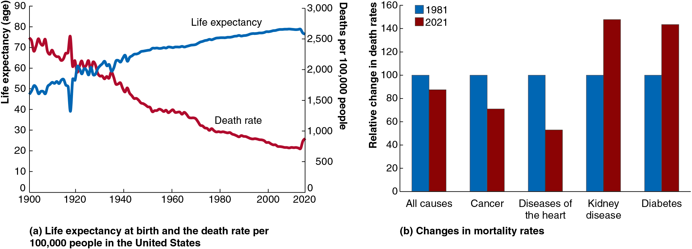
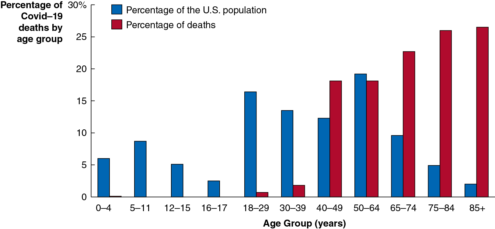
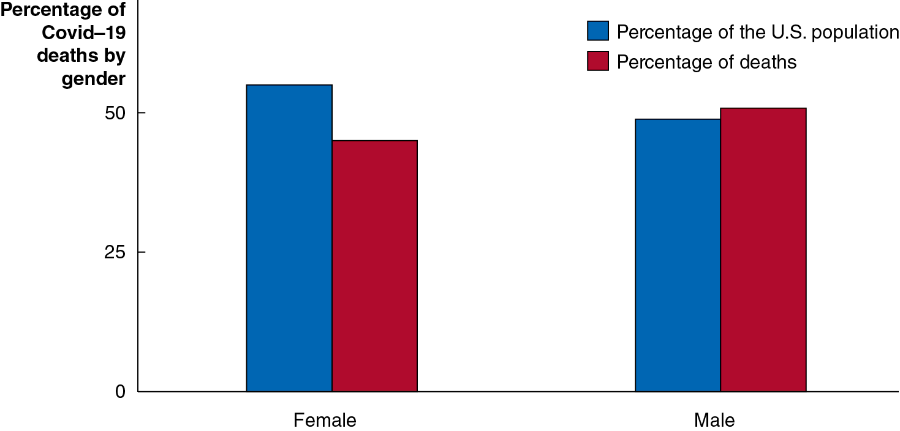
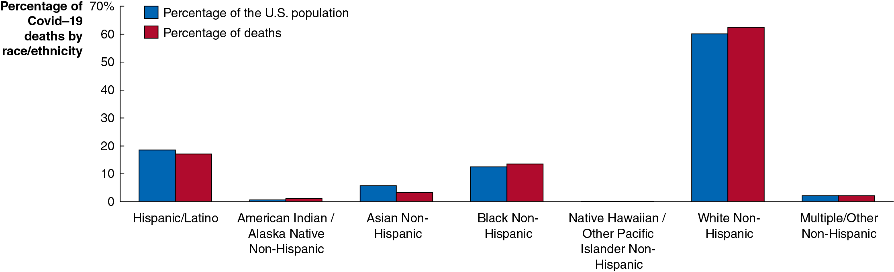
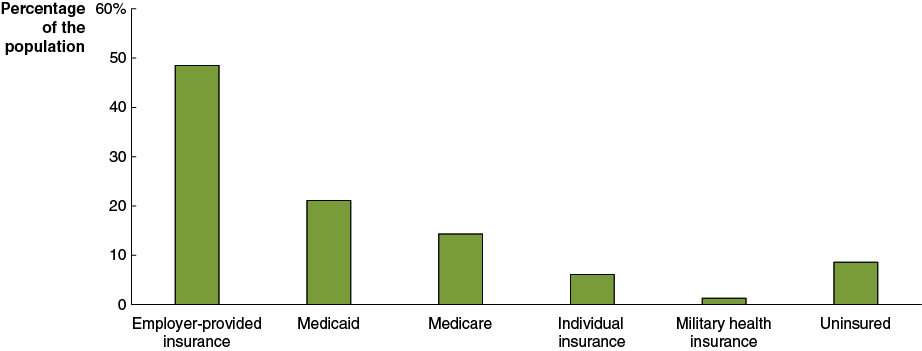
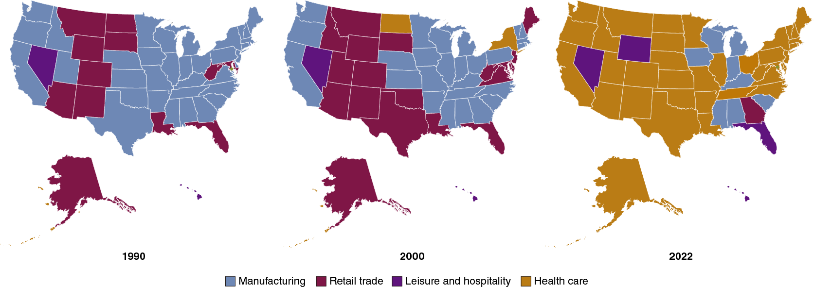
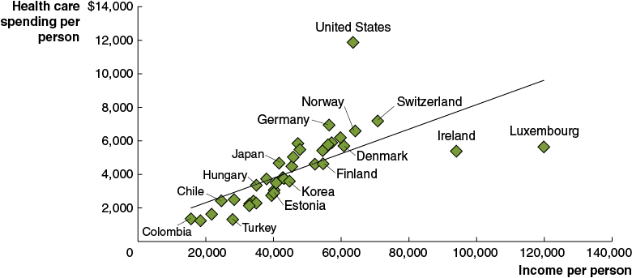
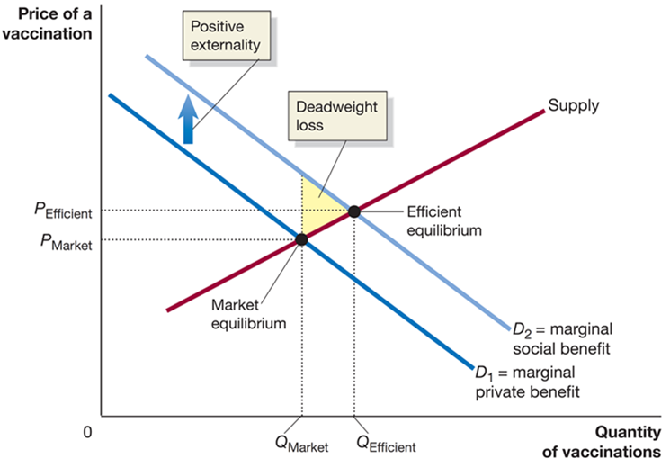
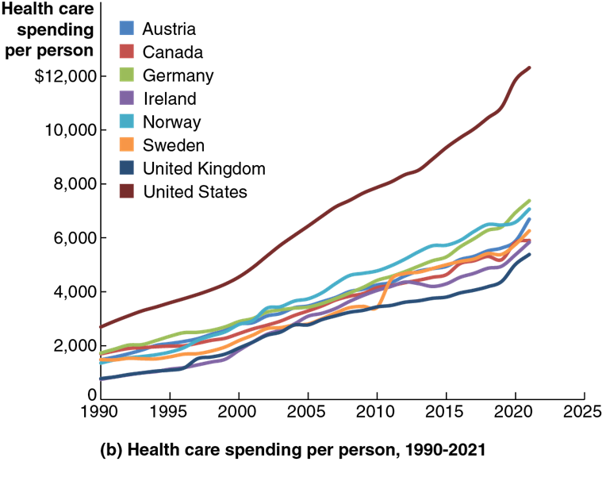
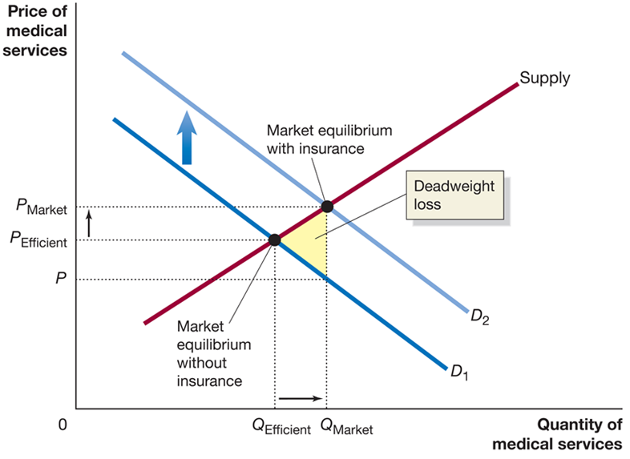

## Macroeconomics

Macroeconomics

Ninth Edition

{height=99%}

Chapter 5

The Economics of Health Care

{height=99%}

Copyright © 2025, 2021, 2018 Pearson Education, Inc. All Rights Reserved

## Chapter Outline

Chapter Outline

5.1 The Improving Health of People in the United States + 5.2 Health Care around the World + 5.3 Information Problems and Externalities in the Market for Health Care + 5.4 The Debate over Health Care Policy in the United States

## Covid-19 and the U.S. Health Care System

Covid-19 and the U.S. Health Care System

The Covid-19 pandemic presented the U.S. health care system with its greatest challenge since the 1918 influenza pandemic. + A strength of the U.S. health care system was shown in the speed with which U.S.-based pharmaceutical firms Pfizer, Moderna, and Johnson & Johnson developed effective vaccines. + The pandemic highlighted debates over health care in the U.S. – Should the government provide health care?

{height=99%}

## 5.1 The Improving Health of People in the United States

5.1 The Improving Health of People in the United States

Use data to discuss trends in U.S. health over time.

Health care expenditure in the United States is higher than anywhere else in the world. + Why is this the case? Ideas: + High quality of health care + System of payment for health care + Higher demand for health care

In this chapter, we will address some of the elements of health care that make it a rich field of study for economists. + Health care: Goods and services, such as prescription drugs, consultations with doctors, and surgeries, that are intended to maintain or improve a person’s health.

## Table 5.1 Health in the United States, 1850 and Today

Table 5.1 Health in the United States, 1850 and Today

The last couple of centuries have brought incredible advances in health outcomes for Americans. + Explanations: + Improvements in nutrition + Public health movement (late 19th, early 20th century) + Improvements in sanitation, food distribution, etc. + Feedback loop: better health to higher incomes to better health

## Figure 5.1 The Improving Health of the U.S. Population (1 of 2)

Figure 5.1 The Improving Health of the U.S. Population (1 of 2)

The most dramatic gains in health have occurred in the twentieth century. + (Mostly) steady increases in life expectancy. + Corresponding decreases in the death rate (adjusted for life expectancy).

{height=99%}

## Figure 5.1 The Improving Health of the U.S. Population (2 of 2)

Figure 5.1 The Improving Health of the U.S. Population (2 of 2)

Medical advances in prevention and treatment are reducing the death rate. + Notice in particular the fall in the death rate from cardiovascular disease. + However, deaths due to some obesity-related illnesses have risen.

{height=99%}

## Apply the Concept: The Demographics of Covid-19 Mortality (1 of 3)

Apply the Concept: The Demographics of Covid-19 Mortality (1 of 3)

{height=99%}

Few diseases affect all demographic groups equally. Half of all deaths from the 1918 influenza pandemic were among 20-40 year olds; but Covid-19 deaths primarily affected older people. Why? Weaker immune systems and proximity in nursing homes.

## Apply the Concept: The Demographics of Covid-19 Mortality (2 of 3)

Apply the Concept: The Demographics of Covid-19 Mortality (2 of 3)

{height=99%}

More men than women died from Covid-19. Why? We don’t know all the reasons yet, but one reason is that vaccination rates among men are lower.

## Apply the Concept: The Demographics of Covid-19 Mortality (3 of 3)

Apply the Concept: The Demographics of Covid-19 Mortality (3 of 3)

{height=99%}

Researchers are still trying to figure out what caused differences in mortality rates across racial and ethnic groups. Vaccination rates and access to health care are two important factors, along with socioeconomic status and different occupational exposure.

## 5.2 Health Care Around the World

5.2 Health Care Around the World

Compare the health care systems and health care outcomes in the United States and other countries.

There are important differences between the health care systems of the United States and those of other countries, both in terms of who provides the health care, and who pays for the health care. + Most health care in the United States is provided by private firms and paid for through health insurance. + Health insurance: A contract under which a buyer agrees to make payments, or premiums, in exchange for the provider’s agreeing to pay some or all of the buyer’s medical bills. + Insurance payments can take the form of fee-for-service, where doctors and hospitals receive a payment for each service they provide; or Health Maintenance Organizations (H M O s), where doctors receive a flat fee per patient.

## Figure 5.2 Sources of Health Insurance in the United States, 2021

Figure 5.2 Sources of Health Insurance in the United States, 2021

{height=99%}

In 2021, about 49 percent of people received health insurance through their employer; about 6 percent of people directly purchased insurance; and about 37 percent of people received it through government sources including Medicare, Medicaid, and Tricare. + Some people have multiple sources of health insurance. + About 9 percent of Americans had no health insurance in 2021.

## Why Are So Many Americans Uninsured?

Why Are So Many Americans Uninsured?

The proportion of Americans without health insurance is lower now than in recent years, partly because of the Affordable Care Act (A C A), health care reform legislation passed by Congress and signed by President Barack Obama in 2010. + This law enacted subsidies for lower-income people and introduced penalties for people not having health insurance and employers not providing it.

However, many people still do not have health insurance, typically because they believe: + They cannot afford it, or + It is unnecessary because they are healthy, or + The cost exceeds the benefits

## Apply the Concept: The Increasing Importance of Health Care in the U.S. Economy

Apply the Concept: The Increasing Importance of Health Care in the U.S. Economy

{height=99%}

In most states, the health care industry is now the industry with the most workers. The figure shows each state’s leading employment sector in 1990, 2000, and 2022. + The B L S forecasts that 4 of the 20 fastest-growing occupations over the next 10 years will be in health care.

## Health Care Systems in Comparison Countries (summary of Table 5.2)

Health Care Systems in Comparison Countries (summary of Table 5.2)

Canada:

Single-payer health care system: The government provides health insurance to all residents, funded through taxes. Private companies provide the care. Individuals pay an annual fee of $744 for services not covered by insurance.

Japan:

Universal health insurance: Every resident is required to enroll in a nonprofit health insurance society or enroll in the national government’s program. + Individuals have substantial copayments, up to 30%.

U K:

Socialized medicine: A health care system under which the government owns most of the hospitals and employs most of the doctors.

Some

people supplement with private health

insurance.

## Figure 5.3 Levels of Income per Person and Spending per Person on Health Care

Figure 5.3 Levels of Income per Person and Spending per Person on Health Care

{height=99%}

Health care is a normal good; higher income leads to higher expenditure on health care. + But the United States spends a greater proportion of income per person on health care than other countries.

## Table 5.3 Health Outcomes in High-Income Countries (1 of 2)

Table 5.3 Health Outcomes in High-Income Countries (1 of 2)

Life Expectancy

Health Risks

Diagnostic Equipment

## Table 5.3 Health Outcomes in High-Income Countries (2 of 2)

Table 5.3 Health Outcomes in High-Income Countries (2 of 2)

Cancer

Covid-19

## How Useful Are Cross-Country Comparisons of Health Outcomes?

How Useful Are Cross-Country Comparisons of Health Outcomes?

Comparing across countries is often difficult, and potentially misleading due to: + Data problems + Countries may not collect data in the same way. + Ex: Classifying deaths related to Covid-19. + Problems with measuring health care delivery + Quality of care is hard to measure. + Ex: Are savings worth longer waiting times? + Lifestyle choices + Obesity and diabetes, for example, may have more to do with the choices of consumers than the effectiveness of health care. + Problems with determining consumer preferences + Disconnect between prices people pay and services received.

## 5.3 Information Problems and Externalities in the Market for Health Care

5.3 Information Problems and Externalities in the Market for Health Care

Define information problems and externalities and explain how they affect the market for health care.

The health care market is characterized by asymmetric information: a situation in which one party to an economic transaction has less information than the other party. + This can lead to market failure, the inability of the market to maximize economic well-being.

Two main forms of asymmetric information: + Adverse selection + Moral hazard

## Asymmetric Information and Insurance Markets

Asymmetric Information and Insurance Markets

Asymmetric information problems can be particularly severe in insurance markets. + Insurance companies need to accurately predict the chance of claims: + Predict too few, and you charge too little and lose money. + Predict too many, and you charge too much and risk losing customers.

The problem is made worse if people buying insurance have a better idea than the insurance company of how many claims they will make.

## Adverse Selection and the Market for “Lemons”

Adverse Selection and the Market for “Lemons”

Suppose you want to buy a used car. If someone offers to sell you one, would you believe: + The car is high quality, and the seller just happens to want to sell it; or + The car is low quality (a “lemon”), and the seller is trying to unload their problems on you.

If you offer a moderate price, then only people with low-quality cars will sell to you. + So, without further information, you don’t want to buy a car from anyone who is willing to sell you one!

“I don’t want to belong to any club that will accept people like me as a member.”

-Groucho Marx

## Adverse Selection in the Market for Health Insurance

Adverse Selection in the Market for Health Insurance

Health insurance suffers from a similar “adverse selection” problem: + Adverse selection: The situation in which one party to a transaction takes advantage of knowing more than the other party to the transaction. + The people who want health insurance are the ones who are likely to use it. + So, the premiums need to be high to cover the expected costs. + But now people with only moderate needs may find health insurance too expensive, causing them to drop out, etc.

This problem is lessened if people are very risk-averse: wanting to avoid risk.

## Coping With Adverse Selection

Coping With Adverse Selection

Health insurance companies have tried to lessen the impact of adverse selection by excluding pre-existing conditions. + It is a normative (value judgment) question whether the gains for society through avoiding adverse selection outweigh the costs to society through reductions in health insurance coverage.

An alternative way around the adverse selection problem is to mandate that individuals carry insurance. + Example: Most states require automobile accident insurance. + 2010 Affordable Care Act (A C A) introduced an individual mandate to buy health insurance and restricted exclusions of pre-existing conditions. (The individual mandate was repealed in 2017.)

## Moral Hazard in Health Insurance—Patients

Moral Hazard in Health Insurance—Patients

Moral hazard refers to actions people take after entering into a transaction, that make the other party to the transaction worse off. + Example: People with car insurance might drive less carefully, knowing they are financially protected if they crash.

People might use more health care when they don’t have to pay for its full cost: + Going to the doctor unnecessarily + Engaging in risky behavior + Accepting excessive treatment options

Such actions would increase the cost of health care to society, perhaps without providing substantial benefits.

## Moral Hazard in Health Insurance—Doctors

Moral Hazard in Health Insurance—Doctors

The financial structure of insurance contracts may make doctors change their behavior also: + Ordering unnecessary tests and procedures + Since patients pay little out-of-pocket for the additional care, they are likely to agree to extra treatment

This illustrates the principal-agent problem:  A problem caused by an agent pursuing the agent’s own interests rather than the interests of the principal who hired the agent. + The insurance company must delegate decision-making power to the doctor, who may not have the same interests as the company.

## Do Doctors Succumb to Moral Hazard?

Do Doctors Succumb to Moral Hazard?

While the number of medical procedures has been increasing, doctors tend to claim that they do not order extra tests and procedures for financial gain, but order them either: + Out of genuine concern for their patients, or + As defensive medicine in order to avoid malpractice lawsuits.

## Coping With Moral Hazard in Health Care

Coping With Moral Hazard in Health Care

The key to coping with moral hazard is to try to make sure people don’t change their behavior too much.

Patients: + Deductibles (patient pays first $X of treatment cost) + Coinsurance (patient pays Y percent of treatment cost)

Doctors: + Standardized payments for particular illnesses

Such methods reduce, but do not eliminate, moral hazard problems.

## Externalities in the Market for Health Care

Externalities in the Market for Health Care

An external cost or benefit will result in market failure because (from society’s perspective) the “wrong” quantity will be consumed.

Positive externalities: + Vaccinations reduce the chance of others getting sick + A healthy population is good for employers (fewer sick days)

Negative externalities: + Poor health choices (like obesity and smoking) are paid for by others (through higher premiums and taxes)

## Figure 5.4 The Effect of a Positive Externality on the Market for Vaccinations

Figure 5.4 The Effect of a Positive Externality on the Market for Vaccinations

In the figure, we assume people pay the full price of vaccinations

Vaccinations have positive externalities, so the marginal

social benefit curve

is higher than the marginal

private benefit curve

Consumers will purchase

vaccinations—too few, resulting in a + deadweight loss. + In practice, subsidized vaccinations reduce this externality problem

{height=99%}

## Should the Government Run the Health Care System?

Should the Government Run the Health Care System?

If health care were a public good, that would be a strong argument for government involvement. + Is health care: + Non-rival in consumption? + Non-excludable?

Neither of these seems likely, so health care seems to be a private good. + However, the externalities and information asymmetries may generate enough market failure to prompt government involvement. + Overall, the government’s role in health care is controversial.

## Or Should There Be Greater Reliance on Market-Based Policies?

Or Should There Be Greater Reliance on Market-Based Policies?

Presently, markets are delivering inaccurate signals to consumers: When buying health care, consumers pay a price well below the true cost of providing the service. + Also, tax treatment of health insurance encourages over-consumption of health insurance and hence health care.

Market-based reforms could re-align the prices consumers pay with the services they receive.

## 5.4 The Debate Over Health Care Policy in the United States

5.4 The Debate Over Health Care Policy in the United States

Explain the major issues involved in the debate over health care policy in the United States.

The Affordable Care Act (A C A) was passed by Congress in 2010 but remains controversial. + The United States spends more per person on health care than any other country. + And this cost appears to continue to rise. + What should be done about this cost? We will explore this topic in this section.

## Figure 5.5 The Trend in U.S. Health Care Spending (1 of 2)

Figure 5.5 The Trend in U.S. Health Care Spending (1 of 2)

Expenditure on health care in the United States, as a percentage of national income, has been rising. + It is projected to continue to rise.

{height=99%}

## Figure 5.5 The Trend in U.S. Health Care Spending (2 of 2)

Figure 5.5 The Trend in U.S. Health Care Spending (2 of 2)

The figure shows health care spending per person, 1990–2021. + Growth in health care spending has been faster in the U.S. than in other high-income countries.

{height=99%}

## Figure 5.6 The Declining Share of U.S. Out-of-Pocket Health Care Spending

Figure 5.6 The Declining Share of U.S. Out-of-Pocket Health Care Spending

{height=99%}

At the same time, Americans are paying a smaller and smaller proportion of health care costs out-of-pocket. + Americans would likely not choose the same level of health care expenditure if they had to pay a higher out-of-pocket share. + Combined with rising health care costs, this presents problems for government budgets.

## Apply the Concept: Are U.S. Firms Disadvantaged by Paying for Their Employees’ Health Insurance?

Apply the Concept: Are U.S. Firms Disadvantaged by Paying for Their Employees’ Health Insurance?

U.S. firms frequently pay for their employees’ health insurance, unlike in most other countries. + This appears to put them at a competitive disadvantage. + Ex: Pay $50,000 salary plus $10,000 health insurance. + But if the government provided health care, it would likely be paid for via payroll taxes; so, the total compensation paid by firms would likely not change much. + Ex: Pay $50,000 salary plus $10,000 “health care tax.”

## Why Are Health Care Costs Rising So Fast? (1 of 2)

Why Are Health Care Costs Rising So Fast? (1 of 2)

Administrative costs? + While paperwork etc. is significant, it’s not increasing fast enough to explain the rise in spending.

Prescription drug prices? + Prescription drugs have higher prices in the United States than in most other high-income countries. But prescription drugs account for only 10 percent of total health care spending.

## Why Are Health Care Costs Rising So Fast? (2 of 2)

Why Are Health Care Costs Rising So Fast? (2 of 2)

Malpractice lawsuits? + Significant cost (Congressional Budget Office says 1%, economists estimate as much as 7% of total health care cost). + But again, not rising fast enough to explain changes.

Uninsured patients? + Increase in costs of between 1% and 4% due to getting treatment in the “wrong places” (emergency room versus doctor’s office). + Still not rising enough to explain changes.

## Primary Reason #1: Health Care Sector “Cost Disease”

Primary Reason #1: Health Care Sector “Cost Disease”

Service providers (like health care providers) have not seen huge productivity gains like in manufacturing or farming. + Labor productivity in health care has risen less than half as much as in the economy as a whole

But in order to keep workers, wages have risen in the service sector also—including health care, of course. + This is known as the service sector “cost disease.”

## Primary Reason #2: Aging Population and Advances in Medical Technology

Primary Reason #2: Aging Population and Advances in Medical Technology

Older people require more health care, and as medical advances keep people alive longer and birth rates slow, the proportion of elderly people will rise. + The C B O estimates federal government spending on healthcare will rise from 5.7% of G D P in 2022 to 8.8% of G D P in 2052.

## Figure 5.7 The Effect of the Third-Party Payer System on the Demand for Medical Services

Figure 5.7 The Effect of the Third-Party Payer System on the Demand for Medical Services

Primary reason #3 is the distorted economic incentives in health care arising from insurance. + The disconnect between service and payment means consumers have little reason to accept fewer services for lower cost. + The overconsumption of health care (relative to efficient levels) creates a deadweight loss.

{height=99%}

## Health Insurance Differs from Other Types of Insurance

Health Insurance Differs from Other Types of Insurance

In most insurance markets, consumers transfer the risk of rare adverse events to the insurance company. + But in health insurance, the ‘events’ covered are often routine and predictable. + Early programs run by Blue Cross and Blue Shield in the 1930s and 1940s were sold as prepaid medical care. + The disconnect between payment and service encourages the overuse of health care services.

## The Continuing Debate Over Health Care Policy

The Continuing Debate Over Health Care Policy

Extending health care coverage to be more universal has been attempted and rejected several times: + 1945: President Harry Truman proposed national health insurance. + 1993: President Bill Clinton proposed a universal public/private plan.

Each time, Congress declined to enact the plans.

## The Affordable Care Act (2010)

The Affordable Care Act (2010)

In 2009, President Barack Obama proposed significant health care reform in the form of the A C A; in March 2010, Congress approved the legislation.

The A C A includes: + Individual mandate to obtain health insurance (repealed by Congress in late 2017) + State health insurance marketplaces to increase access to policies + Employer mandate for most firms to provide health insurance + Regulation of health insurance altering how health insurance companies can act + Expansion of Medicaid eligibility + Increased taxes on high-income individuals, high-cost insurance plans, and some health care related industries

## Market-Based Reforms

Market-Based Reforms

Some economists and policymakers support market-based reforms, changes in the market for health care that would make it more like the markets for other goods and services. + For example, employer-based health insurance is tax-free, encouraging its use in compensation packages. This tax break was worth about $225 billion in 2022; removing it would discourage high-coverage employer-based insurance, reducing spending on these programs by 33%.

## Apply the Concept: Should Congress Increase the Federal Government’s Role in Providing Health Care? (1 of 3)

Apply the Concept: Should Congress Increase the Federal Government’s Role in Providing Health Care? (1 of 3)

A “Medicare for All” (M F A) program would change U.S. health care to a single-payer plan (as in Canada). + Supporters see the following advantages: + Universal coverage + Less paperwork for patients + Less paperwork for administrators + Cost savings due to the bargaining power of the government

## Apply the Concept: Should Congress Increase the Federal Government’s Role in Providing Health Care? (2 of 3)

Apply the Concept: Should Congress Increase the Federal Government’s Role in Providing Health Care? (2 of 3)

Opponents of M F A see the following drawbacks: + Very high cost + Reduced flexibility + Reduced medical innovation + Increased moral hazard problems

Such a dramatic change as M F A seems unlikely to be enacted soon; in surveys, many people dislike the likely outcomes of higher taxes and potential delays in treatment enough to convince them M F A is a bad idea.

## Apply the Concept: Should Congress Increase the Federal Government’s Role in Providing Health Care? (3 of 3)

Apply the Concept: Should Congress Increase the Federal Government’s Role in Providing Health Care? (3 of 3)

President Joe Biden has proposed another alternative: a public option for health insurance, to compete with employer-based insurance; along with lowering the age for Medicare eligibility from 65 to 60. + Premiums would likely be lower with a public option; critics fear this would destroy private insurance companies, resulting in an outcome essentially like M F A. + As of late 2023, it appears unlikely that Congress will pass legislation enacting either M F A or a public option.

## Conclusions About Health Care

Conclusions About Health Care

With health care expenditure projected to consume almost 20 percent of national income by 2030, we must find a way to control costs. + Are people willing to accept service reductions in exchange for cost reductions? + Or can we find a way to reduce costs without giving up the quality and/or quantity of health care consumed?

Health care policy is sure to remain a topic of heated debate.

## Copyright

Copyright

{height=99%}

This work is protected by United States copyright laws and is provided solely for the use of instructors in teaching their courses and assessing student learning. Dissemination or sale of any part of this work (including on the World Wide Web) will destroy the integrity of the work and is not permitted. The work and materials from it should never be made available to students except by instructors using the accompanying text in their classes. All recipients of this work are expected to abide by these restrictions and to honor the intended pedagogical purposes and the needs of other instructors who rely on these materials.

