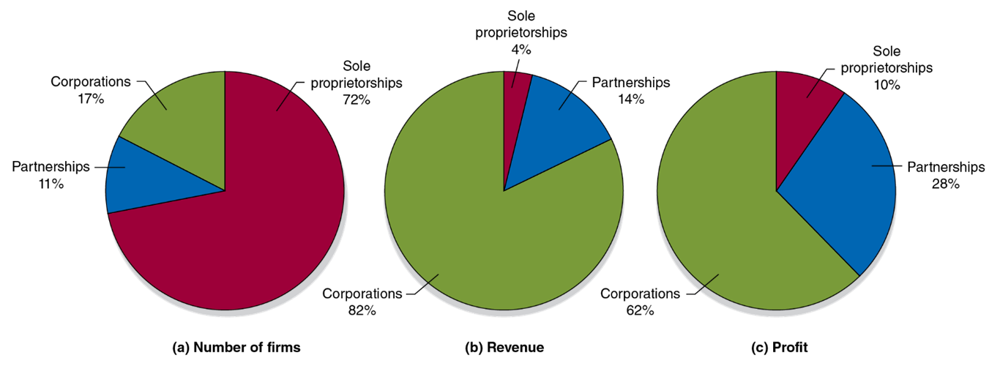
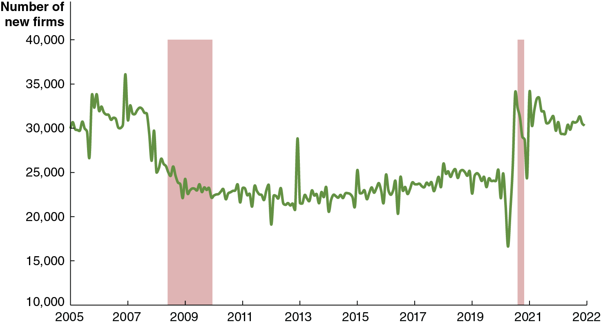
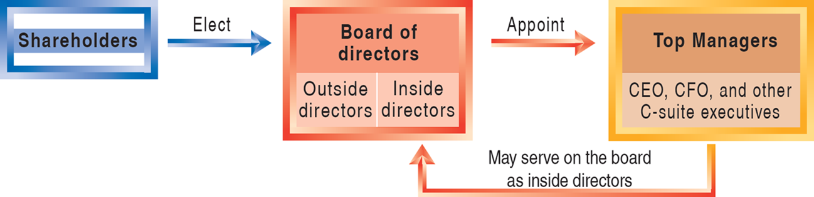
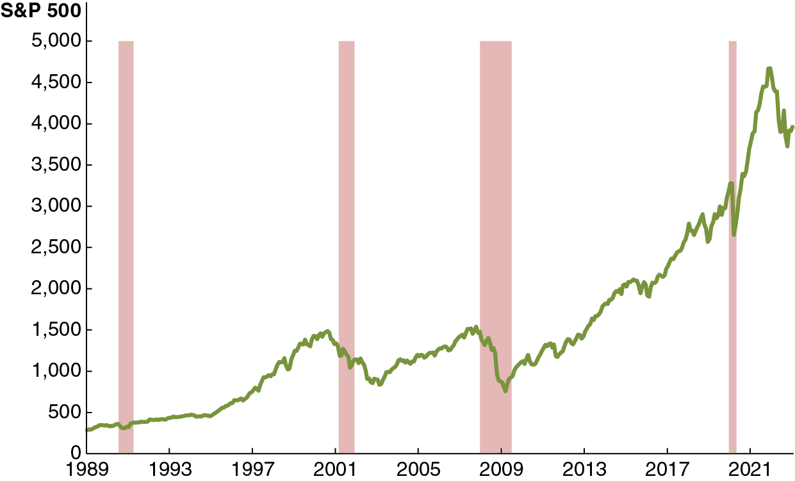
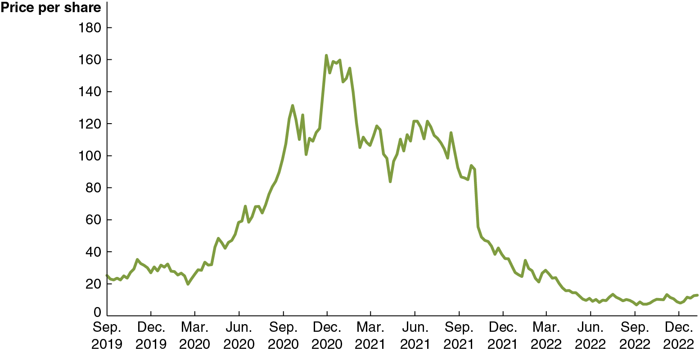
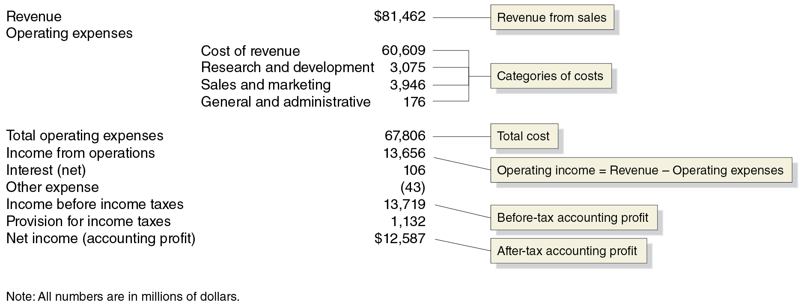

## Macroeconomics

Macroeconomics

Ninth Edition

{height=99%}

Chapter 6

Firms, the Stock Market, and Corporate Governance

{height=99%}

Copyright © 2025, 2021, 2018 Pearson Education, Inc. All Rights Reserved

## Chapter Outline

Chapter Outline

6.1 Types of Firms + 6.2 How Firms Raise Funds + 6.3 Using Financial Statements to Evaluate a Corporation + Appendix Using Present Value + Online Appendix Income Statements and Balance Sheets

## Why Did Elon Musk Turn X into a Private Firm?

Why Did Elon Musk Turn X into a Private Firm?

X was founded in 2006 as Twitter, and at the time was a private firm. In 2013 it became a public firm, with its stock trading on the New York Stock Exchange. + Public firms have greater access to financing, but face pressure from investors to make quick profits, are required to report financial information to the public, and face government regulations. + Elon Musk thought he could run X more effectively as a private firm, without these pressures.

{height=99%}

## Why Study Firm Structure, Finance, and Governance?

Why Study Firm Structure, Finance, and Governance?

In this chapter, we will examine how firms are run: + How they are organized, + How they obtain financing, + How they convey information to the public, and + Whether they act in the best interest of their owners.

Each of these items affect how firms behave and what their overall impact on the economy will be.

## 6.1 Types of Firms

6.1 Types of Firms

Categorize the major types of firms in the United States.

Firms are legally categorized in the U.S. as one of the following: + Sole proprietorship: A firm owned by a single individual and not organized as a corporation. + Partnership: A firm owned jointly by two or more persons and not organized as a corporation. + Corporation: A legal form of business that provides owners with protection from losing more than their investment should the business fail.

## Who Is Liable? Limited and Unlimited Liability

Who Is Liable? Limited and Unlimited Liability

In sole proprietorships and partnerships, no legal distinction is made between the assets of the firm and the assets of its owner(s). + Asset: Anything of value owned by a person or a firm. + This is not the case for corporations. The owners of corporations have limited liability, a legal provision that shields owners of the corporation from losing more than they have invested in the firm. + Limited liability makes raising funds easier for a firm; it also makes investing in firms easier for individuals.

## Table 6.1 Differences among Business Organizations

Table 6.1 Differences among Business Organizations

There is not a unique best business structure. + Corporations benefit from limited liability but are expensive to organize. + Also, their profits may be taxed twice: once as corporate profits and again when the profits are disbursed to investors.

## Figure 6.1 Business Organizations: Sole Proprietorships, Partnerships, and Corporations

Figure 6.1 Business Organizations: Sole Proprietorships, Partnerships, and Corporations

{height=99%}

Nearly three quarters of firms are sole proprietorships, and just one in six is a corporation. + But since larger firms tend to be corporations, most economic activity takes place through them.

## Apply the Concept: What Explains the Recent Surge in New Businesses Being Started? (1 of 2)

Apply the Concept: What Explains the Recent Surge in New Businesses Being Started? (1 of 2)

{height=99%}

After the Great Recession of 2007-2009, new firm formation slowed. It plunged further as the Covid-19 pandemic started, but then sharply increased to pre-Great Recession levels. + What caused low levels of new firm formation in the 2010s? Economists are uncertain, but thought it was some combination of slowing technological progress, increased government regulation, and decreased interest in entrepreneurship among young people.

## Apply the Concept: What Explains the Recent Surge in New Businesses Being Started? (2 of 2)

Apply the Concept: What Explains the Recent Surge in New Businesses Being Started? (2 of 2)

{height=99%}

The surge in new business formation since the start of the Covid-19 pandemic has economists rethinking these reasons. Some of these new firms replaced ones that failed during the pandemic, but others were started by workers whose jobs changed or went away during the pandemic. + As an article in the Wall Street Journal put it, “The coronavirus destroyed jobs. It also created entrepreneurs.”

## Corporate Structure and Corporate Governance

Corporate Structure and Corporate Governance

In sole proprietorships and partnerships, the owners of the firm are typically involved in day-to-day decisions at the firm. + This is not the case for larger corporations; they usually have separation of ownership from control. + Separation of ownership from control: A situation in a corporation in which the top management, rather than the shareholders, controls day-to-day operations. + Owners designate a board of directors, who appoint a chief executive officer (C E O) to oversee day-to-day operations, perhaps along with other members of top management.

## The Structure of Corporations and the Principal-Agent Problem

The Structure of Corporations and the Principal-Agent Problem

Corporate governance is the way in which a corporation is structured and the effect that structure has on the corporation’s behavior. + While the board of directors and top management are, in theory, representing the interests of the firm owners, they may sometimes pursue their own agendas. + Example: Managers may procure for themselves a very high salary or perks such as corporate private jets.

The conflict between the interests of shareholders and the interests of top management is a principal-agent problem. + Principal-agent problem: A problem caused by an agent pursuing the agent’s own interests rather than the interests of the principal who hired the agent.

## Figure 6.2 The Structure of the Typical Corporation

Figure 6.2 The Structure of the Typical Corporation

{height=99%}

While outside directors are intended to represent the interests of shareholders—the owners of the firm—they may not always be willing or able to do so. + Combined with the independent decision-making power that top managers have, it is difficult to overcome the principal-agent problem.

## Can the Principal-Agent Problem Be Resolved?

Can the Principal-Agent Problem Be Resolved?

The principal-agent problem can occur because the top managers know more about how the firm is actually run than do the firm’s shareholders. If top managers have different incentives than shareholders, the principal-agent problem arises. + A remedy for the problem must be based on aligning the interests. + This is why many top managers are paid a large part of the salary in stock or stock options: their salary becomes tied to the performance of the firm. + However, since the managers own only a fraction of the firm, incentives can never be 100 percent aligned.

## Apply the Concept: Multinational Corporations

Apply the Concept: Multinational Corporations

Many corporations operate facilities in different countries than where they are based. For example, Elon Musk’s Tesla opened a factory in 2019 in Shanghai, China, and one in Grünheide, Germany in 2022. + Some typical reasons for this include: + To avoid tariffs or the threat of tariffs. + To gain access to raw materials. + To gain access to low-cost labor. + To reduce exchange rate risk. + To respond to industry competition.

{height=99%}

## 6.2 How Firms Raise Funds

6.2 How Firms Raise Funds

Explain how firms raise the funds they need to operate and expand.

Small business owners have three principal methods of raising funds:

Retained earnings + Profits reinvested in the firm, instead of paid to firm owners.

Recruit additional owners + Such an arrangement would increase the firm’s financial capital.

Borrow + From financial institutions, or from friends or family.

## Sources of External Funds: Indirect Finance

Sources of External Funds: Indirect Finance

As firms get larger, the need to obtain external funds tends to grow. + The economy’s financial system facilitates the transfer of funds from savers to borrowers.

Firms can borrow money from banks. As such, the banks are acting as financial intermediaries, permitting indirect finance of the firm by their savers. + Indirect finance: A flow of funds from savers to borrowers through financial intermediaries such as banks. Intermediaries raise funds from savers to lend to firms (and other borrowers).

## Sources of External Funds: Direct Finance

Sources of External Funds: Direct Finance

Alternatively, firms can appeal directly to potential investors for funds. + This is direct finance: The flow of funds from savers to firms through financial markets, such as the New York Stock Exchange.

Direct finance generally takes the form of one of two financial securities: + Bonds: A financial security that represents a promise to repay a fixed amount of funds. + Stocks: A financial security that represents partial ownership of a firm.

## Bonds

Bonds

A bond is a financial security that is essentially a loan. + A firm sells a bond for its face value, say $1,000, promising to repay this principal at the end of some maturity, say 30 years. + The bond will also include a series of coupon payments, and interest payments on the bond. These are intermediate payments that will be made to the bond-holder; say, $40 every year. + The interest rate is the cost of borrowing funds, usually expressed as a percentage of the amount borrowed; in this case:

The higher the default risk, the higher the coupon payment (hence the interest rate) the firm will have to offer.

## Apply the Concept: Are Governments Likely to Default on Their Bonds? (1 of 2)

Apply the Concept: Are Governments Likely to Default on Their Bonds? (1 of 2)

The three main credit-rating agencies (Moody’s, Standard and Poor’s, and Fitch) assign ratings to bonds.

## Apply the Concept: Are Governments Likely to Default on Their Bonds? (2 of 2)

Apply the Concept: Are Governments Likely to Default on Their Bonds? (2 of 2)

This service helps investors to determine which bonds are safe and which are at risk of default (non-payment). + In 2011, S&P downgraded U.S. Treasury bonds from A A A to A A+, in response to continuing large deficits. + S&P believed there is a chance the U.S. will not make the interest payments on its bonds.

Recent increases in federal borrowing in 2020 and 2021 to fund higher spending to fight the effects of Covid-19 are not sustainable long term and increase the possibility of eventual default.

Are bond ratings honest? Firms and governments pay the rating agencies for their services, so the rating agencies may face a conflict of interest: if one agency gives low ratings, it may find that it loses customers.

## Stocks

Stocks

Unlike bonds, stocks are financial securities that represent partial ownership of the firm. + A corporation that sells a stock acts similarly to a partnership taking on a new partner, though the new shareholder typically owns a tiny fraction of the firm. + When the corporation makes profits, these are either reinvested in the firm—causing a capital gain or increase in value of the stock—or paid out as dividends, payments by a corporation to its shareholders.

By law, corporations must repay bondholders before shareholders. This helps to ensure that bonds are substantially less risky financial securities to hold than stocks.

## Mutual Funds and Exchange-Traded Funds

Mutual Funds and Exchange-Traded Funds

Small investors may find owning individual stocks too risky; but they may lack the funds to diversify by buying stocks in many firms. Two solutions became popular over the last few decades: + Mutual funds: Actively-managed funds that invest in a portfolio of assets and sell shares to investors. Mutual funds can only be sold back to the management company. + Exchange-traded funds: Passively managed funds that invest in a portfolio of assets and sell shares to investors. These can be traded directly between investors.

## Stock and Bond Markets Provide Capital—And Information

Stock and Bond Markets Provide Capital—And Information

After firms sell their stocks and/or bonds, these financial securities can be traded in stock and bond markets. + The existence of these resale markets is beneficial for society, since without them, individuals could not invest in firms without tying up their money for a long time. + The price at which a stock trades indicates the degree of confidence in the firm’s ability to make future profits, since these profits are what is used to generate a return for investors. + The price at which a bond trades is determined by its coupon payment, relative to other coupon payments available. But it also reflects the confidence of investors in the firm’s ability to make those payments.

## The Fluctuating Stock Market

The Fluctuating Stock Market

Instead of relying on the price of individual stocks, observers often rely on stock market indexes, which are averages of stock prices. + Stock market indexes are set to 100 in some base year, so their value is always relative to that base year. + Investors concentrate on changes in these indexes. The S&P 500 decreased from 4273 in 2021 to 4099 in 2022, telling us that, on average, the stock prices of those 500 large companies decreased on average by 4.1%:

## Figure 6.3 Movements in the S&P 500, 1989-2022

Figure 6.3 Movements in the S&P 500, 1989-2022

{height=99%}

The graph shows the S&P 500, a stock index tracking the stock prices of the 500 largest U.S. companies. + Since a stock represents a claim to a share of future profits of a firm, changes in expectations about those profits get reflected in the stock’s price. Recessions and expansions tend to shift many firms’ stock prices similarly—“a rising tide lifts all boats.”

## Why Is It So Hard to Beat the Market?

Why Is It So Hard to Beat the Market?

Since a stock is an ownership share of a firm, you would want to invest in firms that you expect will be profitable in the future. + Predicting the future is hard; investment professionals spend lots of effort to determine which firms will be profitable and determine how new information changes future profitability—changing the value of the stocks. + To “beat the market,” you need to predict better than other people; very few people can do this well.

## Table 6.2 Returns From Investing in Different Assets (1 of 2)

Table 6.2 Returns From Investing in Different Assets (1 of 2)

You can generally obtain a higher return, on average, by taking on more risk: the degree of uncertainty in the return on an asset. + Stocks are riskier than bonds; and smaller companies are typically riskier than larger ones. + The table shows actual long-run returns, 1928-2022.

## Table 6.2 Returns From Investing in Different Assets (2 of 2)

Table 6.2 Returns From Investing in Different Assets (2 of 2)

This table shows hypothetical long-run returns from investing $100 per month from age 22 in different assets. + Under plausible assumptions about future rates of return, investing in stocks is likely to provide you with a much larger amount than investing in safer assets like U.S. Treasury bills or bank certificates of deposit (C D s).

## Apply the Concept: Why Is Peloton a $4 Billion Company if It Almost Always Loses Money? (1 of 2)

Apply the Concept: Why Is Peloton a $4 Billion Company if It Almost Always Loses Money? (1 of 2)

{height=99%}

Peloton Interactive makes internet-connected exercise equipment. It has never made a profit over an entire year, yet its market capitalization or market cap was $4.4 billion in early 2023. + How can a firm that doesn’t earn a profit be worth so much?

## Apply the Concept: Why Is Peloton a $4 Billion Company if It Almost Always Loses Money? (2 of 2)

Apply the Concept: Why Is Peloton a $4 Billion Company if It Almost Always Loses Money? (2 of 2)

{height=99%}

Share prices fluctuate based on expectations about future profits. + During the Covid-19 pandemic, sales of Peloton products rose; investors were uncertain whether the demand increase would be permanent and gambled on high future profits. + Sales fell by 2022, plunging Peloton’s stock price to $7, but rebounded in 2023. Are Peloton investors right to be optimistic?

## 6.3 Using Financial Statements to Evaluate a Corporation

6.3 Using Financial Statements to Evaluate a Corporation

Describe the information corporations include in their financial statements.

Investment decisions are relatively complicated but can be made more intelligently with information from a firm’s financial statements. + In the U.S., publicly owned firms are required to release regular financial statements prepared using standard accounting methods known as generally accepted accounting principles. + Ideally, such statements would present information in an unbiased manner, reducing information costs for investors.

Some accounting firms specialize in auditing, selling their services in verifying and investigating these reports.

## What’s in a Firm’s Financial Statements?

What’s in a Firm’s Financial Statements?

The two principal items in a firm’s financial statements are: + Income statement: A financial statement that shows a firm’s revenues, costs, and profit over a period of time. + Typically, a 12-month fiscal year, which does not necessarily coincide with the calendar year.

Balance sheet: A financial statement that sums up a firm’s financial position on a particular day, usually the end of a quarter or year. + This summarizes the liabilities (anything owed by a person or a firm) and assets of the firm. + A firm’s net worth is calculated as the amount of its assets minus the amount of its liabilities.

## Accounting Profit

Accounting Profit

A firm’s income statement reveals the profit that the firm makes. + Profit on the income statement is referred to as net income and is calculated as revenue minus operating expenses and taxes paid. + Economists refer to this as accounting profit, and call the listed expenses explicit costs, costs that involve actually spending money.

## Purposes of Accountants versus Economists

Purposes of Accountants versus Economists

Economists differ from accountants when calculating profit because economists and accountants have different intents: + Accountants present financial information in order to allow people to make judgments on investments. + Economists are interested in decision-making; whether investing in the firm is wise and whether the firm should continue to operate.

## Economic Profit

Economic Profit

Because of the difference in purposes, economists think of profit differently from accountants. + Economists consider the whole opportunity cost of the firm’s activities, including both explicit and implicit costs.

  

Opportunity cost: The highest valued alternative that must be given up to engage in some activity, + Implicit cost: A nonmonetary opportunity cost. + Implicit costs include items like a firm owner’s time or the next best use for their invested funds.

## Problems in Corporate Governance

Problems in Corporate Governance

Investors need accurate and truthful financial statements to make investment decisions. Investments help guide resource allocation within the economy. + Firms disclose financial statements in periodic filings to the federal government and in annual reports to shareholders. + If these financial statements are inaccurate, the whole economy suffers, as resources are allocated to less productive activities. + This reduces economic growth directly and reduces investor confidence, which further erodes growth.

## Regulations Can Increase Confidence in the Financial System

Regulations Can Increase Confidence in the Financial System

The government creates regulations to try to minimize the chance of such deception. Examples include: + The Sarbanes-Oxley Act (2002), which requires that C E O s personally certify financial statements and requires disclosure of conflicts of interest from auditors, the accountants charged with checking the accuracy of financial statements. + The Wall Street Reform and Consumer Protection Act (Dodd-Frank Act) (2010), which is legislation intended to reform regulation of the financial system. + Created Consumer Financial Protection Bureau + Established Financial Stability Oversight Council + Overall effect on risk of future financial crises: unknown

## Apply the Concept: Should Investors Worry about Corporate Governance at Lyft? (1 of 2)

Apply the Concept: Should Investors Worry about Corporate Governance at Lyft? (1 of 2)

In 2019, Lyft sold stock in an initial public offering (I P O); but investors were only able to purchase Class A shares.

## Apply the Concept: Should Investors Worry about Corporate Governance at Lyft? (2 of 2)

Apply the Concept: Should Investors Worry about Corporate Governance at Lyft? (2 of 2)

Lyft cofounders Logan Green and John Zimmer retained 49% of Lyft voting rights, although they only owned 5% of the company. + This practice has become increasingly common; many founders believe powerful shareholders push managers to boost short-run profits at the expense of long-term goals. + Many investors weren’t too worried; Lyft had no trouble selling its shares. But some large investors stayed away.

{height=99%}

## Appendix A: Using Present Value

Appendix A: Using Present Value

Explain the concept of present value.

When people lend money, they expect to receive back more than they lend. + $1,000 today is worth more than $1,000 a year from now, and that in turn is worth less than $1,000 two years from now.

How much are funds in the future worth to you? Economists refer to this amount as the present value of those funds: the value in today’s dollars of funds to be paid or received in the future. + The general formula is:

## Present and Future Value

Present and Future Value

In this formula,

Future

represents funds that will be received in n years

i is the interest rate

The interest rate to use depends on how the person or firm values future payments compared with present payments: + High if you are very impatient + Low if you are very patient

If you are able to borrow and save easily, these should be related to the interest rates at which you can borrow or save.

## Present Value of a Series of Payments

Present Value of a Series of Payments

When calculating the present value of a series of payments, we add the present values of each individual payment. + For example, suppose you will receive $50,000 immediately, and $50,000 each year for four additional years. The present value of this series of payments, assuming a 10 percent interest rate, is:

## Using Present Value to Calculate Asset Prices

Using Present Value to Calculate Asset Prices

Financial assets represent a claim to future funds: + Bonds: Coupon payments and repayment of principal + Stocks: Dividend payments

To calculate what a financial asset is worth today, we consider the value of these future funds: + The price of a financial asset should be equal to the present value of the payments to be received from owning that asset.

## Using Present Value to Calculate Bond Prices (1 of 2)

Using Present Value to Calculate Bond Prices (1 of 2)

Suppose that in 2024, you are considering buying a $1,000 bond with $80 coupon payments (in 2025 and 2026) and a 2026 maturity date. + So, you will receive $80 in 2025 and $1,080 in 2026.

If the appropriate interest rate is i = 10 percent, you value this bond at:

## Using Present Value to Calculate Bond Prices (2 of 2)

Using Present Value to Calculate Bond Prices (2 of 2)

If, instead, the appropriate interest rate is i = 5 percent, you value this bond at:

More generally,

## Using Present Value to Calculate Stock Prices (1 of 2)

Using Present Value to Calculate Stock Prices (1 of 2)

Valuing a stock is a little trickier since there is no end date on a stock—you own a share of the firm forever. + The value of a stock derives from the expected dividend payments of the stock:

Note that this has no maturity date, so we calculate the present value of an infinite stream of payments. + Because the present value of those payments decreases in value quickly, the value of the underlying stock is not infinite. + Also, note that these are expected or estimated dividends.

## Using Present Value to Calculate Stock Prices (2 of 2)

Using Present Value to Calculate Stock Prices (2 of 2)

We can obtain a simple formula for determining the price of a stock if we assume the dividends will grow at a constant rate:

If a firm currently pays $5.00 per share as a dividend, the interest rate is i =10 percent, and dividends are projected to grow at 5 percent per year, then the stock price is:

## Appendix B: Income Statements and Balance Sheets

Appendix B: Income Statements and Balance Sheets

Describe the information contained on a firm’s income statement and balance sheet.

Corporations disclose substantial information about their business operations and financial position to actual and potential investors through issuing financial statements. + These statements are also legal reporting requirements of the Securities and Exchange Commission (S E C). + The two key financial statements are + The income statement + The balance sheet

## Income Statements

Income Statements

The income statement shows the firm’s revenue and the firm’s costs for a given year. + The difference between the firm’s revenue and costs is the firm’s profit or loss. + The bottom line number is the firm’s net income or after-tax accounting profit. + The next slide shows Tesla’s income statement for 2022.

## Tesla’s Income Statement for 2022

Tesla’s Income Statement for 2022

{height=99%}

Tesla's income statement shows the company’s revenue, costs, and profit for 2022. The difference between its revenue ($81,462 million) and its operating expenses ($67,806 million) is its operating income before taxes of $13,719 million.

## Balance Sheets

Balance Sheets

A firm’s balance sheet summarizes its financial position on a particular day, usually the end of a quarter or year. + The balance sheet equation is;

Assets = Liabilities + Stockholders’ Equity

liability is a debt or an obligation that the firm owes. + Subtracting the value of a firm’s liabilities from the value of its assets leaves its net worth. Because a corporation’s stockholders are its owners, net worth is often listed as stockholders’ equity on a balance sheet. + The next slide shows Tesla’s balance sheet for 2022.

## Twitter’s Balance Sheet as of December 31, 2018

Twitter’s Balance Sheet as of December 31, 2018

Assets are in the left column and liabilities and owners’ equity are in the right column. + The totals must equal or balance; stockholders’ equity balances the totals, since (by definition) it is equal to assets minus liabilities. + Current assets, or assets that can be quickly turned into cash, are listed first. + Current liabilities, those due within one year, are listed first.

## Income Statements and Balance Sheets

Income Statements and Balance Sheets

These two financial statements are prepared by accountants using standardized rules. + This practice makes it easy to compare different firms. + Investors can evaluate profitability and various operational efficiencies by using data from these sources. + Internal users can make comparisons with similar firms in the same industry to benchmark performance. + There are numerous other groups that use the information contained in these financial statements. Lenders, regulators, and managers are among these users.

## Copyright

Copyright

{height=99%}

This work is protected by United States copyright laws and is provided solely for the use of instructors in teaching their courses and assessing student learning. Dissemination or sale of any part of this work (including on the World Wide Web) will destroy the integrity of the work and is not permitted. The work and materials from it should never be made available to students except by instructors using the accompanying text in their classes. All recipients of this work are expected to abide by these restrictions and to honor the intended pedagogical purposes and the needs of other instructors who rely on these materials.

