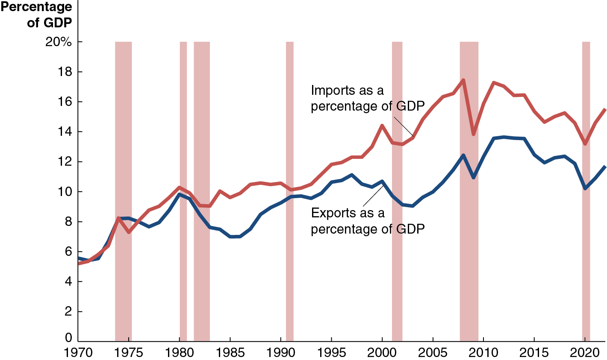

## Macroeconomics

Macroeconomics

Ninth Edition

{height=99%}

Chapter 7

Comparative Advantage and the Gains from International Trade

{height=99%}

Copyright © 2025, 2021, 2018 Pearson Education, Inc. All Rights Reserved

## Chapter Outline

Chapter Outline

7.1 The United States in the International Economy + 7.2 Comparative Advantage in International Trade + 7.3 How Countries Gain from International Trade + 7.4 Government Policies That Restrict International Trade + 7.5 The Debate over Trade Policies and Globalization

## Are We Facing the End of Globalization?

Are We Facing the End of Globalization?

Most large U.S. corporations have substantial foreign sales, as do their global counterparts. + The extensive flow of imports and exports around the world is the result of globalization—countries becoming more open to foreign trade and investment. + Recently some countries have adopted more “protectionist” policies. Supply chain disruptions and increasing political tensions have also led to decreased trade.

{height=99%}

## 7.1 The United States in the International Economy

7.1 The United States in the International Economy

Discuss the role of international trade in the U.S. economy.

International trade has grown more and more important to the world economy over the past 50 years. + Falling shipping, transportation, and communication costs have made international trade more profitable and desirable. Many governments have also changed policies to facilitate trade.

Traditionally, countries imposed high tariffs on imports, believing that such measures made their own firms and consumers better off. + But that meant their exports were similarly taxed.

Tariff: A tax imposed by a government on imports. + Imports: Goods and services bought domestically but produced in other countries. + Exports: Goods and services produced domestically but sold in other countries.

## Figure 7.1 The Increasing Importance of International Trade to the United States

Figure 7.1 The Increasing Importance of International Trade to the United States

{height=99%}

From 1970 to the late 2000s, imports and exports were rising as a fraction of U.S. gross domestic product (G D P), increasing the importance of international trade to the U.S. economy. + World trade declined sharply with the Great Recession of 2007-2009. The importance of trade to the U.S. economy has stayed about the same since then.

## Figure 7.2 The Eight Leading Exporting Countries

Figure 7.2 The Eight Leading Exporting Countries

{height=99%}

The rapid growth of the Chinese economy has made it the world’s largest exporter, with 13.3 percent of world exports. + China took over the lead from the U.S., which accounts for 8.9 percent of world exports.

## Figure 7.3 International Trade as a Percentage of G D P

Figure 7.3 International Trade as a Percentage of G D P

{height=99%}

Trade makes up a relatively small part of the economy for the United States (and China, to a lesser extent), especially compared with smaller countries. + This is mostly due to the relative sizes of the economies.

## 7.2 Comparative Advantage in International Trade

7.2 Comparative Advantage in International Trade

Explain the difference between comparative advantage and absolute advantage in international trade.

Comparative advantage is the ability of an individual, a firm, or a country to produce a good or service at a lower opportunity cost than competitors. + The comparative advantage arises from having a lower opportunity cost than your competitor. + Opportunity cost: The highest-valued alternative that must be given up to engage in an activity.

## Table 7.1 An Example of U.S. Workers Being More Productive Than Chinese Workers

Table 7.1 An Example of U.S. Workers Being More Productive Than Chinese Workers

The U.S. has an absolute advantage in producing both smartphones and wheat. + Absolute advantage: The ability of an individual, a firm, or a country to produce more of a good or service than competitors, using the same amount of resources. + But comparative advantage means that trade can still be advantageous for both nations.

## Table 7.2 The Opportunity Costs of Producing Smartphones and Wheat

Table 7.2 The Opportunity Costs of Producing Smartphones and Wheat

This table shows what has to be given up to create each good: the opportunity cost. + If the nations were in autarky, a situation in which a country does not trade with other countries, these would also be the relative prices in each country: a smartphone would trade for half the price of a bushel of wheat in China and double the price of a bushel of wheat in America. + China would like to trade its smartphones for U.S. wheat, and vice versa.

## 7.3 How Countries Gain From International Trade

7.3 How Countries Gain From International Trade

Explain how countries gain from international trade.

If countries did not trade, they would consume what they produced. + But if countries have different opportunity costs, they might each be willing to trade some of what they have a comparative advantage at producing for what the other country is (relatively) good at producing. + Both countries might be made better off by such a trade.

## Table 7.3 Production Without Trade

Table 7.3 Production Without Trade

Suppose that initially, each country has 1,000 hours to spend. + In that time, China might produce 1,000 smartphones and 1,500 bushels of wheat. + At the same time, the U.S. might produce 1,500 smartphones and 9,000 bushels of wheat.

In total, 2,500 smartphones and 10,500 bushels of wheat are produced.

## Production in Autarky—Preparing for Trade

Production in Autarky—Preparing for Trade

Observe what happens if each country specializes in its comparative advantage: + China can produce 4,000 smartphones. + The U.S. can produce 12,000 bushels of wheat.

In total, 4,000 smartphones and 12,000 bushels of wheat are produced. + Observe that more of both goods are produced.

## Deciding on Terms of Trade

Deciding on Terms of Trade

The terms of trade is the ratio at which a country can trade its exports for imports from other countries. + No country would accept terms of trade worse than its opportunity cost—it would be better off producing by itself the goods that it was importing. + Terms of trade of one-for-one could be acceptable to both China and the United States. + With these terms, they might trade 1,500 smartphones for 1,500 bushels of wheat, ending with the consumption on the following slide:

## Table 7.4 Gains From Trade for China and the United States

Table 7.4 Gains From Trade for China and the United States

{height=99%}

## Why Don’t We See Complete Specialization?

Why Don’t We See Complete Specialization?

In the real world, products are not generally produced by only one nation. Reasons include: + Not all goods and services can be traded internationally (medical services, for example). + Production of many goods involves increasing opportunity costs (so small amounts of production are likely to take place in several countries). + Tastes for products differ (cars, for example); countries might have comparative advantages in different sub-types of products.

## Does Anyone Lose as a Result of International Trade?

Does Anyone Lose as a Result of International Trade?

So far, we have made it appear that international trade is going to be good for everybody. + But this is true only on a national level.

Some individual firms and consumers will lose out due to international trade. In our example: + Chinese wheat farms and their workers + U.S. smartphones firms and their workers

These groups would likely ask their governments to implement protectionist measures like tariffs and quotas in order to protect them from foreign competition.

## Apply the Concept: Who Gains and Who Loses from U.S. Trade With China? (1 of 3)

Apply the Concept: Who Gains and Who Loses from U.S. Trade With China? (1 of 3)

{height=99%}

As China has adopted more market-based reforms, its exports have increased greatly. + Chinese exports to the United States are now worth many times more than U.S. exports to China.

## Apply the Concept: Who Gains and Who Loses from U.S. Trade With China? (2 of 3)

Apply the Concept: Who Gains and Who Loses from U.S. Trade With China? (2 of 3)

Many of the goods imported from China were previously manufactured in the U.S. + Lower-income consumers benefit from the increased availability of these goods; so do the firms at which they spend their saved money.

{height=99%}

## Apply the Concept: Who Gains and Who Loses from U.S. Trade With China? (3 of 3)

Apply the Concept: Who Gains and Who Loses from U.S. Trade With China? (3 of 3)

{height=99%}

The increased competition from Chinese manufacturers has hurt many U.S. manufacturing firms and their workers; though manufacturing employment had been falling long before the “China Shock” began in around 2001. The effect of the China Shock has been greatest in the Midwest and Southeast.

## Where Does Comparative Advantage Come From? (1 of 2)

Where Does Comparative Advantage Come From? (1 of 2)

Comparative advantage can derive from a variety of sources: + Climate and natural resources + Some nations are better suited to particular types of production; particularly important for agricultural goods. + Example: Bananas in Costa Rica versus wheat in the U.S.

Relative abundance of labor and/or capital + Some nations have a lot of high- or low-skilled workers, or relatively much or little infrastructure. + Example: China has many low-skilled workers, versus relatively many high-skilled workers in the U.S.

## Where Does Comparative Advantage Come From? (2 of 2)

Where Does Comparative Advantage Come From? (2 of 2)

Comparative advantage can derive from a variety of sources: + Technological differences + Technologies may not diffuse quickly or uniformly. + Example: U.S. is strong in product technologies—the ability to develop new products; Japan is strong in process technologies, involving the ability to improve processes to make existing products

External economies + External economies are reductions in a firm’s costs that result from an increase in the size of an industry. + Examples: Silicon Valley, Hollywood, Swiss watchmakers

## 7.4 Government Policies That Restrict International Trade

7.4 Government Policies That Restrict International Trade

Analyze the economic effects of government policies that restrict international trade.

When a country loses its comparative advantage in producing a good: + Its income will be higher from the goods it does have a comparative advantage at producing. + It can consume the goods other countries are relatively good at making, at a lower cost.

This suggests countries should not produce goods at which they do not have a comparative advantage. + But there is often political pressure on governments to preserve industries that have lost their comparative advantage, or that never had one in the first place.

## Figure 7.4 The U.S. Market for Ethanol under Autarky

Figure 7.4 The U.S. Market for Ethanol under Autarky

If trade is not allowed in the U.S. market for ethanol, all domestic consumption will be met by domestic production. + Consumers who are willing to pay at least $2.00 per gallon purchase ethanol and obtain consumer surplus. + Domestic producers with costs lower than $2.00 per gallon sell their ethanol and obtain producer surplus.

{height=99%}

## Joining the Global Ethanol Market

Joining the Global Ethanol Market

Now suppose the U.S. government adopts free trade policies in the market for ethanol, allowing unlimited imports and/or exports. + Free trade: Trade between countries that is without government restrictions. + Assume that the world price of ethanol is $1.00 per gallon: + U.S. consumers will import ethanol, benefiting from the lower price. + U.S. ethanol producers will suffer, receiving a lower price.

How can we decide whether allowing free trade makes Americans better off overall? + By comparing the economic surplus in the market with and without free trade.

## Figure 7.5 The Effect of Imports on the U.S. Ethanol Market

Figure 7.5 The Effect of Imports on the U.S. Ethanol Market

When imports are allowed, the price falls to $1.00 per gallon. + U.S. production falls to 3.0 billion; U.S. consumption rises to 9.0 billion. + Therefore, 6.0 million gallons are imported. + Consumer surplus rises to A+B+C+D. + Producer surplus falls to E. + Overall, economic surplus rises; the gains to consumers outweigh the losses to producers.

{height=99%}

## Government Policies Restricting Trade

Government Policies Restricting Trade

Firms that face competition from imported goods lose out when trade is allowed. + These firms appear to deserve sympathy, especially when their workers start to lose their jobs.

Consequently, these firms can often convince governments to restrict trade; usually with one of the following policies: + Tariffs: Taxes imposed by a government on imports. + Quotas and Voluntary export restraints (V E Rs): Numerical limits imposed upon (quotas) or negotiated between (V E Rs) countries on the quantity of a good imported by one country from another country.

## Figure 7.6 The Effects of a Tariff on Ethanol

Figure 7.6 The Effects of a Tariff on Ethanol

If the government imposes a $0.50 per gallon tariff, the U.S. price rises to $1.50. + U.S. production rises, and U.S. consumption falls. + Producer surplus rises by A. + The government gains tariff revenues (T). + But consumer surplus falls by A+C+T+D.

Overall, economic surplus falls by C+D: deadweight loss.

{height=99%}

## Import Quota in the U.S. Sugar Market

Import Quota in the U.S. Sugar Market

Quotas and voluntary export restraints are effectively similar; the difference is that quotas are imposed unilaterally (by one country), whereas V E Rs are negotiated agreements. + The United States imposes a sugar quota, allowing no more than 6.8 billion pounds of sugar to be imported. + This keeps the U.S. price of sugar ($0.36 per pound) higher than the world price ($0.18), generating large benefits for U.S. sugar producers, at the expense of U.S. sugar consumers.

On the next slide, we will calculate just how much each party is hurt or helped.

## Figure 7.7 The Economic Effect of the U.S. Sugar Quota (1 of 2)

Figure 7.7 The Economic Effect of the U.S. Sugar Quota (1 of 2)

If unlimited imports were allowed, America would import almost all of the sugar it consumes. + The sugar quota restricts imports, raising the U.S. price. + Quantity supplied by U.S. firms increases, resulting in increased producer surplus (A) for U.S. firms.

{height=99%}

## Figure 7.7 The Economic Effect of the U.S. Sugar Quota (2 of 2)

Figure 7.7 The Economic Effect of the U.S. Sugar Quota (2 of 2)

Foreign sugar producers also gain (B), by selling at the U.S. price. + Consumer surplus falls by A+C+B+D (lower consumption, higher price). + So deadweight loss of C+D occurs due to the sugar quota.

{height=99%}

## Costs to Society From Maintaining Import Restrictions

Costs to Society From Maintaining Import Restrictions

A common argument in favor of maintaining import restrictions is that it saves domestic jobs. + Economists estimate that without the sugar import restrictions, about 3,000 jobs in the U.S. sugar industry would be lost. + That means each job’s annual cost to U.S. consumers is:

And this is probably an underestimate, since cheaper sugar would open up more jobs (in the candy industry, etc.), and encourage sugar-using manufacturers to remain in America. + Sugar producers are able to lobby for the quota because the cost to society of the quota is spread over many consumers, and the benefit is concentrated among just a few people.

## The High Cost of Preserving Jobs with Tariffs and Quotas

The High Cost of Preserving Jobs with Tariffs and Quotas

The sugar quota is not the only government policy imposing a high cost on U.S. consumers to save jobs at U.S. firms: + Shoe import tariffs cost $300,000 per job, per year. + Tire tariffs cost $900,000 per job, per year.

Even worse: when one industry receives tariff or quota protection, other domestic industries lose jobs.

The 2009 tire tariff cost

jobs in retail stores because

the higher price of tires left U.S. consumers with less money to spend on other goods.

## Apply the Concept: Smoot-Hawley and the Politics of Tariffs (1 of 3)

Apply the Concept: Smoot-Hawley and the Politics of Tariffs (1 of 3)

Tariffs on foreign-made shoes in the U.S. trace back to the 1920s: + U.S. farmers were struggling and lobbied for protection from imports. + Politicians in their districts championed these protections. + Other politicians promised their support in exchange for tariffs on other goods produced in their districts; this process is known as logrolling.

{height=99%}

## Apply the Concept: Smoot-Hawley and the Politics of Tariffs (2 of 3)

Apply the Concept: Smoot-Hawley and the Politics of Tariffs (2 of 3)

These negotiations resulted in the Smoot-Hawley Tariff Act (1930). + Smoot-Hawley raised tariffs to their highest

value in U.S. history

percent of the value of imports, on average)

Its effects continue to this day; e.g., the 2023 U.S. tariff on shoes contains hundreds of entries, detailing tariff levels on different types of shoes.

{height=99%}

## Apply the Concept: Smoot-Hawley and the Politics of Tariffs (3 of 3)

Apply the Concept: Smoot-Hawley and the Politics of Tariffs (3 of 3)

Even worse: these tariffs now protect a very small industry. + Employment in the shoe industry was 275,000 workers, now <15,000 workers.

And other countries imposed retaliatory tariffs on our exports also! + Modern trade negotiations are largely aimed at reducing these trade protections.

{height=99%}

## Gains From Unilateral Elimination of Tariffs and Quotas

Gains From Unilateral Elimination of Tariffs and Quotas

Some politicians argue that we should drop our tariffs and quotas, but only if the other countries agree to do the same. + This makes it easier to gain political support for actions that will genuinely cause economic pain, albeit to a limited number of people.

But our analysis of the sugar quota showed that there is sufficient reason for the U.S. to unilaterally remove its restrictions. + The U.S. economy would gain from the elimination of tariffs and quotas, even if other countries did not reduce their tariffs and quotas!

## Other Barriers to Trade

Other Barriers to Trade

A less-common but still important barrier to trade is the restriction of imports based on health and safety standards. + Example: A government may impose higher standards on imports than it requires for domestic goods.

Many governments also restrict imports of certain products on national security grounds, fearing that in times of war, they would not have access to those products. + Example: The Defense Department gives army recruits a voucher for a new pair of sneakers; New Balance lobbied (unsuccessfully) for these to be restricted to U.S.-made sneakers. + Example: In 2021, President Biden expanded the “Buy American” program partly on national security grounds, arguing (for example) that personal protective equipment (P P E) might become unavailable for import during a future pandemic.

## 7.5 The Debate over Trade Policies and Globalization

7.5 The Debate over Trade Policies and Globalization

Evaluate the debate over trade policies and globalization.

More trade takes place between nations when their governments encourage rather than discourage it. + As trade generally makes nations better off, economists are generally in favor of freer trade. + But there are many people who do not believe free trade makes everyone better off and so oppose it.

## Trade Agreements in the 21st Century

Trade Agreements in the 21st Century

1930: U.S. institutes Smoot-Hawley Tariff, increasing tariffs to >50 percent. Goal is to “protect” domestic industry, encourage employment. Other countries retaliate with their own restrictions. + 1948: Western countries seeking to revive international trade form G A T T (General Agreement on Tariffs and Trade). Several “rounds” of multilateral tariff reduction followed. + 1995: World Trade Organization (W T O) replaces G A T T; 159 member states, as of 2023, agree to liberalize international trade. W T O also provides dispute resolution process for trade disputes. Better coverage for non-physical products (ex: intellectual property). + World Trade Organization (W T O): An international organization that oversees international trade agreements.

## Opposition to W T O and Trade in General (1 of 2)

Opposition to W T O and Trade in General (1 of 2)

Some people oppose changes in economies and cultures caused by globalization. + Globalization: The process of countries becoming more open to foreign trade and investment. + Low-income countries have less strict regulations including worker protections, creating a perception of unfairness. + But regulations are a choice; in rich countries, we choose such regulations because we think they make us better off. + Free trade and foreign investment might “destroy” distinctive cultures. + Whether low-income countries are better off with McDonalds and Walmart is debatable; but if they want to eat and shop there, should we deny them that right? These are normative questions.

## Opposition to W T O and Trade in General (2 of 2)

Opposition to W T O and Trade in General (2 of 2)

An older argument against trade comes from “old-fashioned” protectionists. + Protectionism: The use of trade barriers to shield domestic firms from foreign competition. + Restricting trade “saves jobs” and “protects high wages” + We have seen that, overall, people are better off with trade, even though some individuals are worse off. + “Infant industries” need protection + Industries might need some time to “start up” and become competitive; but tariffs must eventually be removed. + Protecting national security + Maybe we shouldn’t import all our guns, computer microchips, or fighter planes from elsewhere…

## Apply the Concept: Should We Use Tariffs to Slow Climate Change? (1 of 2)

Apply the Concept: Should We Use Tariffs to Slow Climate Change? (1 of 2)

{height=99%}

In 2021, The U.S. and E.U. began exploring tariffs on steel from countries with lax environmental regulations. These carbon border adjustment mechanisms (C B A M s) would level the playing field for domestic steel producers who must comply with more stringent regulations, raising the cost of producing steel for U.S. and E.U. firms. + Imported steel results in 50-100% more carbon dioxide emissions than domestically-produced steel.

## Apply the Concept: Should We Use Tariffs to Slow Climate Change? (2 of 2)

Apply the Concept: Should We Use Tariffs to Slow Climate Change? (2 of 2)

Critics of this approach argue: + Previous attempts to use economic coercion to change other countries’ policies have not generally been successful. + While climate change may be used as an excuse, it just disguises the true anti-trade, protectionist goals of policymakers. + The W T O does not authorize tariffs for climate change reasons, so retaliatory tariffs from other countries may result.

In December 2022, the European Union did announce a C B A M on some products, including steel; the U.S. has not done so, perhaps out of concern that it would raise prices during a time of high inflation.

## Dumping

Dumping

In recent years, the U.S. has protected some domestic industries using a W T O provision against dumping. + Dumping: Selling a product for a price below its cost of production. + In practice it is difficult to tell if foreign companies are dumping goods; true production costs are not easy for governments to calculate. + W T O’s approach: Countries can claim dumping if products are exported for a lower price than they are sold domestically. + This standard is arbitrary; companies might use loss-leaders or different prices in different markets in order to maximize profits. + It’s unclear why these normal business practices should be unacceptable when used in international trade.

## Positive versus Normative Analysis

Positive versus Normative Analysis

Recall positive analysis reflects “what is” and normative analysis “what ought to be.” + Judgments about free trade necessarily reflect values and morals. + Though most economists do not support interference with trade, it is possible to value the costs of free trade more highly than the benefits, and hence believe free trade is undesirable.

## Political Economy and Trade Restrictions

Political Economy and Trade Restrictions

While the costs of tariffs and quotas to consumers may be large, they are spread across many people. The sugar quota makes U.S. consumers about $4.92 billion worse off per year, but this equates to only about $15 per person. + Sugar producers gain $2.08 billion per year; but those gains go to relatively few people, who loudly support the quota.

Similarly, the jobs lost to foreign competition are easy to identify, while the jobs created by foreign trade are less so. + The concentration of benefits from trade restrictions, and low pressure from the public to reduce them, make many politicians reluctant to oppose those restrictions.

## Building Bridges Versus Walls

Building Bridges Versus Walls

Building walls against economic change preserve jobs and profits for a few, with large costs for the rest of us. + Hungarian economist Nicholas Kaldor argued instead that the winners from increased economic efficiency should compensate the losers. + Such bridges to a brighter economic future for those affected by international trade could include increased funding for retraining and tax credits for firms that invest in skill development for their workers.

## Copyright

Copyright

{height=99%}

This work is protected by United States copyright laws and is provided solely for the use of instructors in teaching their courses and assessing student learning. Dissemination or sale of any part of this work (including on the World Wide Web) will destroy the integrity of the work and is not permitted. The work and materials from it should never be made available to students except by instructors using the accompanying text in their classes. All recipients of this work are expected to abide by these restrictions and to honor the intended pedagogical purposes and the needs of other instructors who rely on these materials.

