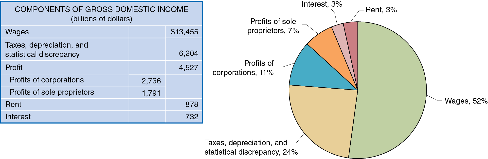

## Macroeconomics

Macroeconomics

Ninth Edition

{height=99%}

Chapter 8

G D P: Measuring Total Production and Income

{height=99%}

Copyright © 2025, 2021, & 2018 Pearson Education, Inc. All Rights Reserved

## Chapter Outline

Chapter Outline

8.1 Gross Domestic Product Measures Total Production + 8.2 Does G D P Measure What We Want It to Measure? + 8.3 Real G D P versus Nominal G D P + 8.4 Other Measures of Total Production and Total Income

## Is FedEx the Canary in the Economic Coal Mine?

Is FedEx the Canary in the Economic Coal Mine?

When the U.S. economy is growing, the demand for services from companies like FedEx increases. + By mid-2023, the amount of freight hauled by trains and trucks was sharply lower than during late 2022, and the demand for diesel fuel was down, prompting W S J headlines like these: + “Trucking Recession Flashes Warning for the U.S. Economy” + “Sliding Diesel Prices Signal Warning for U.S. Economy.”

{height=99%}

## Microeconomics and Macroeconomics

Microeconomics and Macroeconomics

Microeconomics is the study of how households and firms make choices, how they interact in markets, and how the government attempts to influence their choices. + In contrast, macroeconomics is the study of the economy as a whole, including topics such as inflation, unemployment, and economic growth. + When we want to study the overall economy and its participants, the models and tools of macroeconomics become very useful.

## Some Important Macroeconomic Terms

Some Important Macroeconomic Terms

Business cycle: Alternating periods of economic expansion and economic recession. + Expansion: The period of a business cycle during which the total production and total employment are increasing. + Recession: The period of a business cycle during which total production and total employment are decreasing. + Economic growth: The ability of an economy to produce increasing quantities of goods and services. + Inflation rate: The percentage increase in the price level from one year to the next.

## Goal of This Chapter

Goal of This Chapter

Over the coming chapters, we will explore many aspects of the economy, including how all the elements on the previous slides relate to one another. + For this chapter, we have a less lofty goal: to figure out how to measure the total output of an economy. + Being able to measure total output is incredibly important, since much of macroeconomics depends on our ability to measure and predict aggregate economic activity.

## 8.1 Gross Domestic Product Measures Total Production

8.1 Gross Domestic Product Measures Total Production

Explain how total production is measured.

The most common measure used by economists of overall economic activity in an economy is gross domestic product, or G D P. + Gross domestic product (G D P): The market value of all final goods and services produced in a country during a period of time, typically one year. + We will examine each of the parts of this definition in turn.

## “Market Value”

“Market Value”

Gross domestic product: The market value of all final goods and services produced in a country during a period of time, typically one year. + We cannot add together the number of cars, melons, haircuts, and all other goods and services without agreeing on a common way to measure them. + The best practical way is to value each good and service in monetary terms, and the best measure of this that we have is the price that each good or service is sold for.

## “Final Goods and Services”

“Final Goods and Services”

Gross domestic product: The market value of all final goods and services produced in a country during a period of time, typically one year. + A final good or service is a good or service purchased by a final user. These are what are used to calculate G D P. + Why? Intermediate goods and services are inputs into another good or service, such as a tire on a truck.  If we counted these goods and services at each transaction, we would end up double counting.

Example: If we counted the value of the ice cream bought by a store, and also counted the value of that ice cream when it was sold to a consumer, we would be double counting the value of the ice cream.

## “Produced in a Country”

“Produced in a Country”

Gross domestic product: The market value of all final goods and services produced in a country during a period of time, typically one year. + G D P measures output produced within a country’s borders. The ownership of that production is irrelevant, for example, production by a U.S. firm or a foreign firm counts equally, as long as the production takes place in the United States. + However, production overseas does not count, even if it is performed by a U.S. firm.

## “During a Period of Time”

“During a Period of Time”

Gross domestic product: The market value of all final goods and services produced in a country during a period of time, typically one year. + To measure total output in a given year, we measure the goods and services produced only in that given year. + Again, this avoids double counting: if you buy a D V D in 2021, that D V D counts in 2021’s G D P. If you resell it in 2022, it will not count again in 2022. + So, G D P counts only new goods and services. Used items were previously produced and counted, so don’t need to be counted again.

## Production and Income

Production and Income

There are two main conceptual ways to measure the total economic activity in an economy: (1) Total production or (2) total income. + When we measure one, we are also measuring the other. Why? + Everything that is produced and sold constitutes income for someone; so, we have the choice of measuring the value of products produced and sold or the value of incomes. + Each is a valid way of measuring economic activity.

## Figure 8.1 The Circular Flow and the Measurement of G D P (1 of 4)

Figure 8.1 The Circular Flow and the Measurement of G D P (1 of 4)

In a very simple model of the economy, we could start with households and firms. + To measure overall economic activity, we could measure the amount of money that households spend on goods and services. + Or we could measure income to households.

{height=99%}

## Figure 8.1 The Circular Flow and the Measurement of G D P (2 of 4)

Figure 8.1 The Circular Flow and the Measurement of G D P (2 of 4)

Let’s add in some more layers. We’ll start with government. + How does the government affect economic activity? + It takes in taxes from households and firms. + It uses those taxes to buy goods and services, and to make transfer payments—payments by the government to households for which the government does not receive a new good or service in return.

{height=99%}

## Figure 8.1 The Circular Flow and the Measurement of G D P (3 of 4)

Figure 8.1 The Circular Flow and the Measurement of G D P (3 of 4)

Some economic activity takes place between households, firms, and the rest of the world. + Households buy goods and services from firms in other countries; these are known as imports. + Firms sell goods and services to households in other countries; these are known as exports.

{height=99%}

## Figure 8.1 The Circular Flow and the Measurement of G D P (4 of 4)

Figure 8.1 The Circular Flow and the Measurement of G D P (4 of 4)

Finally, there are firms that deal specifically in flows of money; we label these firms the financial system. + Households elect not to spend some of their income and instead save it with financial system firms like banks. + These financial system firms lend money to other firms and the government.

{height=99%}

## Follow the Spending to Measure G D P

Follow the Spending to Measure G D P

To measure G D P, the Bureau of Economic Analysis (B E A) in the Department of Commerce measures four major categories of expenditures: + Personal consumption expenditures, or consumption (C) + Gross private domestic investment, or investment (I) + Government consumption and gross investment, or government purchases (G) + Net exports of goods and services, or net exports (N X)

G D P can be expressed as the sum of these:

We will examine each component of G D P in turn.

## Consumption

Consumption

Consumption is spending by households on goods and services, not including spending on new houses (which are counted instead in investment). + In B E A statistics, consumption is further divided into expenditure on: + Services, such as medical care, education, and haircuts; + Nondurable goods, such as food and clothing; and + Durable goods, such as automobiles and furniture.

## Investment

Investment

Investment is spending by firms on new factories, office buildings, machinery, and additions to inventories, plus spending by households and firms on new houses. + The B E A measures the following categories of investment: + Business fixed investment, such as new factories, office buildings, machinery, and research and development. + Residential investment, that is, new single-family and multi-unit houses. + Changes in business inventories, that is, goods that have been produced but not yet sold.

Note: in economics, “Investment” does not mean buying stocks and bonds, etc., like it does in finance.

## Government Purchases

Government Purchases

Government purchases are spending by federal, state, and local governments on goods and services. + This includes both government consumption (like teachers’ salaries and office supplies) and government investment (like highways and military bases). + This does not include transfer payments, since those do not result in immediate production of new goods and services.

## Net Exports

Net Exports

Net exports are exports minus imports. + This difference might be positive or negative; in recent years, this has been negative in the United States. + Since we want to count domestic production (production in the United States), we add up the value of the goods and services sold to foreigners and subtract the value of the goods and services sold to Americans by foreigners. + An export is not counted otherwise (in C, I, or G), so we need to count it somehow as production. + An import is counted (in C, usually) but we are trying to measure domestic production, so we don’t want to count it. Subtracting it achieves this goal.

## Figure 8.2 Components of G D P in 2022

Figure 8.2 Components of G D P in 2022

{height=99%}

Consumption is the largest component of G D P; within that, services are the largest component—almost half of G D P. + American net exports are negative, since the value of our imports exceeds the value of our exports.

## Table 8.1 Calculating Value Added

Table 8.1 Calculating Value Added

An alternative method to measure G D P is to measure the value added: The market value a firm adds to a product. + The final selling price of a product must equal the sum of the values added to the product at each stage of production. + The table illustrates this method for a shirt sold on L.L.Bean’s website.

## 8.2 Does G D P Measure What We Want It to Measure?

8.2 Does G D P Measure What We Want It to Measure?

Discuss whether G D P is a good measure of well-being.

G D P can be a useful tool to measure total output in an economy. Many people go further than this, interpreting G D P as a measure of the well-being of citizens. + However, G D P has shortcomings as both a + Measure of total production and a + Measure of well-being.

## Shortcomings of G D P as a Measure of Total Production

Shortcomings of G D P as a Measure of Total Production

Two important types of production are omitted from the B E A’s measurement of G D P: + Household production such as childcare, cleaning, and cooking is not typically paid for with money. + But such contributions are real—if they were performed by a non-household member, they would be paid for and counted in G D P.

Underground economy: Buying and selling of goods and services that is concealed from the government to avoid taxes or regulations, or because the goods and services are illegal. + This is at most 10 percent of the measured economy in the United States, but often substantially more in low-income countries.

## How Important Are These Shortcomings?

How Important Are These Shortcomings?

If we are comparing G D P from year to year, the size of household production and the underground economy is probably about the same from year to year, so G D P growth is a reasonable measure of the growth in total production. + However over long periods of time, these shortcomings might be more serious. + Example: As women have entered the workforce in larger numbers, some household production has been replaced by paid childcare and restaurant meals. So, increases in G D P may exaggerate the increase in actual total production.

## Apply the Concept: Underground Economies in Developing Countries (1 of 2)

Apply the Concept: Underground Economies in Developing Countries (1 of 2)

In developing countries, the underground economy is also called the informal sector, as opposed to the formal sector, in which output of goods and services is measured. + In many developing countries, the informal sector is very large; often above 50 percent of total output.

Economists studying economic development say this often reflects poor government policies: high taxes and regulations and low confidence in the security of private property from government seizure.

{height=99%}

## Apply the Concept: Underground Economies in Developing Countries (2 of 2)

Apply the Concept: Underground Economies in Developing Countries (2 of 2)

Because firms in the informal sector are operating illegally, they tend to be smaller and have less capital than firms that are operating legally. + The entrepreneurs who start firms in the informal sector may be afraid the government could someday close or confiscate their firms. + Therefore, the entrepreneurs limit their investments in these firms, reducing growth rates in countries with large informal sectors.

## Shortcomings of G D P as a Measure of Well-Being

Shortcomings of G D P as a Measure of Well-Being

G D P per capita (i.e., G D P divided by population) is often used to represent differences in standards of living from country to country. However, even if it accurately measured total production, it would not reflect: + The value of leisure + Pollution and other negative effects of production + Crime and other social problems + The distribution of income

In fact, improvements in many of these will result in lower G D P per capita. + Example: Lower crime would allow lower spending on police, prisons, and private security. This would decrease G D P but would result in improvements in economic well-being.

## 8.3 Real G D P versus Nominal G D P

8.3 Real G D P versus Nominal G D P

Discuss the difference between real G D P and nominal G D P.

Suppose G D P increases; is the increase in G D P due to production increasing or due to prices increasing? + To separate these effects, the B E A calculates both nominal G D P—the value of final goods and services evaluated at current-year prices—and real G D P—the value of final goods and services evaluated at base-year prices.

The choice of a base-year is arbitrary; we might use any year’s prices to compare real G D P. The current standard is 2017. + Unfortunately, the relative prices also change from year to year, distorting real G D P calculations. Since 1996, the B E A has overcome this problem by using chain-weighted prices, using previous-year prices to adjust current-year production.

## Calculating Real G D P: An Example

Calculating Real G D P: An Example

The table shows output and prices in 2017 and 2025. + Calculating the total value of output in 2017 gives:

$3,200 + $990 + $1,350 = $5,540.

To calculate real G D P in 2025, we use the prices from 2017. + This gives real 2025 G D P in 2017 dollars of $6,680. + Compare this to nominal G D P in 2025 of $7,800.

## Figure 8.3 Nominal G D P and Real G D P, 1995–2022

Figure 8.3 Nominal G D P and Real G D P, 1995–2022

{height=99%}

The current base year for calculating prices is 2017, so real and nominal G D P are equal in 2017. + Growth figures reported in the media are the growth in real G D P. + Since prices have generally increased since 2017, real G D P is less than nominal G D P, and the opposite is true before 2017.

## Apply the Concept: The Unusual Movements in Real G D P during the Covid-19 Pandemic (1 of 2)

Apply the Concept: The Unusual Movements in Real G D P during the Covid-19 Pandemic (1 of 2)

{height=99%}

The figure shows quarterly changes in real G D P between 1999 and 2022 (seasonally adjusted to account for predictable changes in production patterns throughout the year). + Real G D P in the second quarter of 2020 declined by 29.9 percent; the next quarter saw a 35.3 percent increase, by far the largest increase in U.S. history.

## Apply the Concept: The Unusual Movements in Real G D P during the Covid-19 Pandemic (2 of 2)

Apply the Concept: The Unusual Movements in Real G D P during the Covid-19 Pandemic (2 of 2)

{height=99%}

This figure shows the (annualized) changes in each of the components of G D P in the second and third quarters of 2020. + These swings in real G D P took a toll on households and firms: nearly 22 million people lost their jobs, and many business never reopened after closing at the beginning of the pandemic.

## The G D P Deflator

The G D P Deflator

Economists and policymakers are interested in the price level: A measure of the average prices of goods and services in the economy. + Why? Stable prices are desirable because they allow households and firms to plan for the future appropriately.

In order to know whether we are achieving price stability, we need to measure the price level. + One way to do this is using the G D P deflator: a measure of the price level, calculated by dividing nominal G D P by real G D P and multiplying by 100:

Since nominal and real G D P will be the same in the base year, the G D P deflator will be 100 in the base year.

## Calculating G D P Deflator: An Example

Calculating G D P Deflator: An Example

The first table gives nominal and real G D P for 2021 and 2022. + We can use this to calculate the G D P deflator in each year. + The G D P deflator increased from 110.2 to 118.0:

So, we can say the price level rose by 7.1 percent over this period: this inflation rate was the highest the United States had experienced since 1981.

## 8.4 Other Measures of Total Production and Total Income

8.4 Other Measures of Total Production and Total Income

Describe other measures of total production and total income.

Each quarter, the B E A publishes the National Income and Product Accounts (N I P A) tables. These include G D P computations but also: + Gross national product (G N P): Production performed by citizens of a nation, including overseas production. + National income: G D P minus the consumption of fixed capital; that is, G D P minus depreciation. + Personal income: Income received by households; includes transfer payments but excludes firms’ retained earnings. + Disposable personal income: Personal income minus personal tax payments; this measures the amount that households are able to spend or save.

## Figure 8.4 Measures of Total Production and Total Income, 2022

Figure 8.4 Measures of Total Production and Total Income, 2022

{height=99%}

The table and graph show the various measures of the national income accounts for the United States in 2022. + National income must be smaller than G D P, since it is just G D P minus depreciation. + Similarly, disposable personal income must be less than personal income, since it is just personal income minus taxes.

## Figure 8.5 The Division of Income, 2020

Figure 8.5 The Division of Income, 2020

{height=99%}

All production must be rewarded with income; so, in theory, we could count either production or income in order to calculate G D P. + In practice, data limitations make us unlikely to come up with the same number; there will always be some statistical discrepancy.

The figure illustrates the division of income as measured by the B E A in 2022.

## Apply the Concept: Was There a Recession during 2022? G D P versus G D I (1 of 2)

Apply the Concept: Was There a Recession during 2022? G D P versus G D I (1 of 2)

{height=99%}

G D P measures output by focusing on production; we also measure from the income side: G D I, or Gross Domestic Income. + Often changes in G D P and G D I are similar, but sometimes not; and some economists believe G D I does a better job of indicating a recession. + Many countries, including the U K and Canada, average the values for a better overall picture.

## Apply the Concept: Was There a Recession during 2022? G D P versus G D I (2 of 2)

Apply the Concept: Was There a Recession during 2022? G D P versus G D I (2 of 2)

{height=99%}

During the first two quarters of 2022, real G D P fell; but real G D I rose during both those quarters. During the fourth quarter, real G D I fell, while real G D P rose. + These measures tell different stories about short-run changes in the state of the economy.

## Copyright

Copyright

{height=99%}

This work is protected by United States copyright laws and is provided solely for the use of instructors in teaching their courses and assessing student learning. Dissemination or sale of any part of this work (including on the World Wide Web) will destroy the integrity of the work and is not permitted. The work and materials from it should never be made available to students except by instructors using the accompanying text in their classes. All recipients of this work are expected to abide by these restrictions and to honor the intended pedagogical purposes and the needs of other instructors who rely on these materials.

