## Macroeconomics

Macroeconomics

Ninth Edition

{height=99%}

Chapter 9

Unemployment and Inflation

{height=99%}

Copyright © 2025, 2021, & 2018 Pearson Education, Inc. All Rights Reserved

## Chapter Outline

Chapter Outline

9.1 Measuring the Unemployment Rate, the Labor Force Participation Rate, and the Employment-Population Ratio + 9.2 Types of Unemployment + 9.3 Explaining Unemployment + 9.4 Measuring Inflation + 9.5 Using Price Indexes to Adjust for the Effects of Inflation + 9.6 Nominal Interest Rates versus Real Interest Rates + 9.7 Does Inflation Impose Costs on the Economy?

## Want to Know How the U.S. Economy Is Doing? Check Out Georgetown, K Y

Want to Know How the U.S. Economy Is Doing? Check Out Georgetown, K Y

Scott County, K Y is home to the Georgetown Toyota plant, the largest Toyota factory in the world. Manufacturers of durable goods (like cars) are very sensitive to changes in the economy, as seen in the table below.

{height=99%}

## Measuring Unemployment and Inflation

Measuring Unemployment and Inflation

In Chapter 18, we learned how to measure total output—a critical first step in understanding the economy. + In this chapter, we continue along these lines by learning how to measure unemployment and inflation. + These are very important and commonly used macroeconomic concepts; we want to solidify our understanding of what they mean so that we can talk intelligently about them.

## 9.1 Measuring the Unemployment Rate, the Labor Force Participation Rate, and the Employment–Population Ratio

9.1 Measuring the Unemployment Rate, the Labor Force Participation Rate, and the Employment–Population Ratio

Define the unemployment rate, the labor force participation rate, and the employment–population ratio and understand how they are computed.

There around 330 million people in the United States, so monitoring and reporting on their activities regularly would be very difficult and costly, not to mention invasive. + Instead, the U.S. Department of Labor reports estimates of employment, unemployment, and other statistics related to the labor force each month. + Labor force: The sum of employed and unemployed workers in the economy. + Of these statistics, the most watched is known as the unemployment rate: The percentage of the labor force that is unemployed.

## The Household Survey

The Household Survey

Each month, the U.S. Census Bureau conducts the Current Population Survey (a.k.a. the household survey).

  

households selected to be “representative”

Household members of “working age” (16+ years old) + Asked about employment during “reference week” + Also asked about recent job search activities

People are then classified as: + Employed: In government statistics, someone who currently has a job or who is temporarily away from his or her job. + Unemployed: In government statistics, someone who is not currently at work but who is available for work and who has actively looked for work during the previous month. + Not in the labor force, if neither of the above apply

## Figure 9.1 The Employment Status of the Civilian Working-Age Population, June 2023 (1 of 4)

Figure 9.1 The Employment Status of the Civilian Working-Age Population, June 2023 (1 of 4)

Discouraged workers: People who are available for work but have not looked for a job during the previous four weeks because they believe no jobs are available for them.

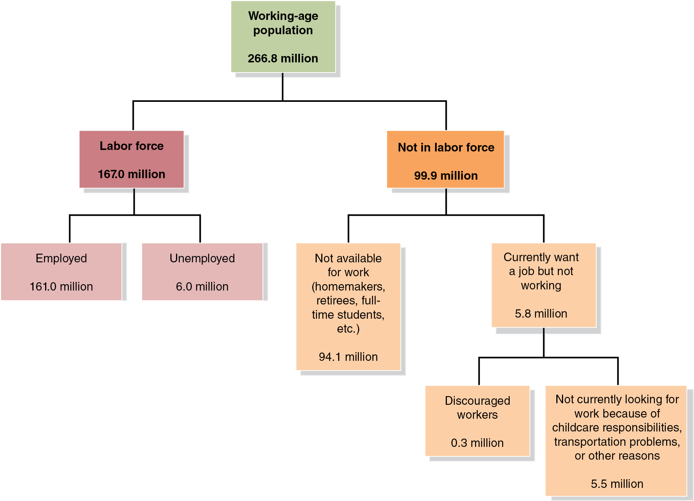{height=99%}

## Figure 9.1 The Employment Status of the Civilian Working-Age Population, June 2023 (2 of 4)

Figure 9.1 The Employment Status of the Civilian Working-Age Population, June 2023 (2 of 4)

Based on the B L S estimates, we calculate several important macroeconomic indicators. + The most watched is the unemployment rate:

This most common measure of unemployment is known formally as B L S series U-3.

{height=99%}

## Figure 9.1 The Employment Status of the Civilian Working-Age Population, June 2023 (3 of 4)

Figure 9.1 The Employment Status of the Civilian Working-Age Population, June 2023 (3 of 4)

Also important are the labor-force participation rate: The percentage of the working-age population in the labor force...

{height=99%}

## Figure 9.1 The Employment Status of the Civilian Working-Age Population, June 2023 (4 of 4)

Figure 9.1 The Employment Status of the Civilian Working-Age Population, June 2023 (4 of 4)

… and the employment-population ratio: The percentage of the working-age population that is employed:

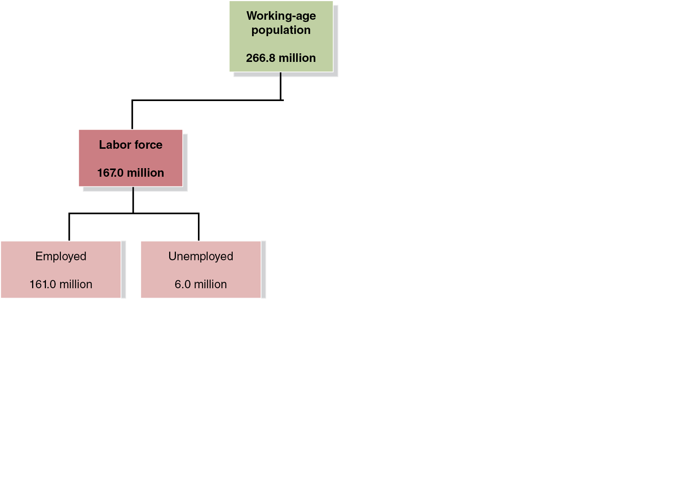{height=99%}

## Problems with Measuring the Unemployment Rate

Problems with Measuring the Unemployment Rate

The unemployment rate measured by the B L S is not a perfect measure of joblessness. Why? + It may understate unemployment: + Distinguishing between people who are unemployed and not in the labor force requires judgment (should we exclude “discouraged workers?”) + Only measures employment, not intensity of employment (full-time versus. part-time; some people are underemployed) + It may overstate unemployment: + People might claim falsely to be actively looking for work + May claim not to be working to evade taxes or keep criminal activity unnoticed

## Figure 9.2 The Official Unemployment Rate and a Broad Measure of the Unemployment Rate, Jan 2000–June 2023

Figure 9.2 The Official Unemployment Rate and a Broad Measure of the Unemployment Rate, Jan 2000–June 2023

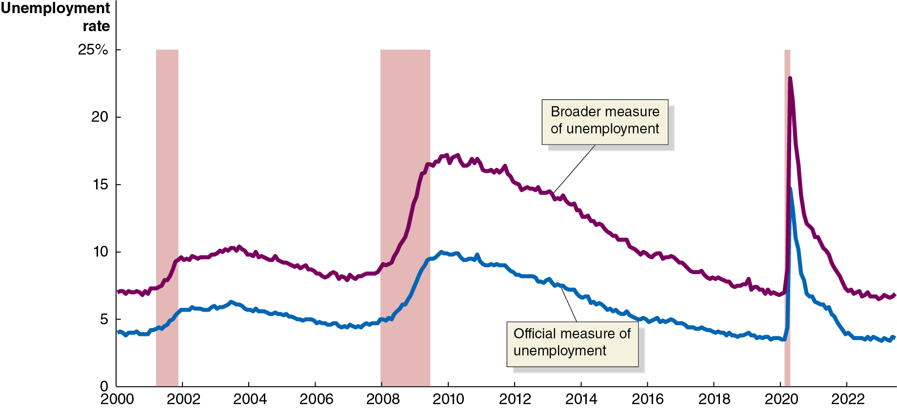{height=99%}

Some people suggest that we should include discouraged workers and underemployed workers in the unemployment statistics, to create a broader measure of unemployment. + The B L S measures this, calling it B L S series U-6.

## Figure 9.3 Unemployment Rates in the United States, June 2023

Figure 9.3 Unemployment Rates in the United States, June 2023

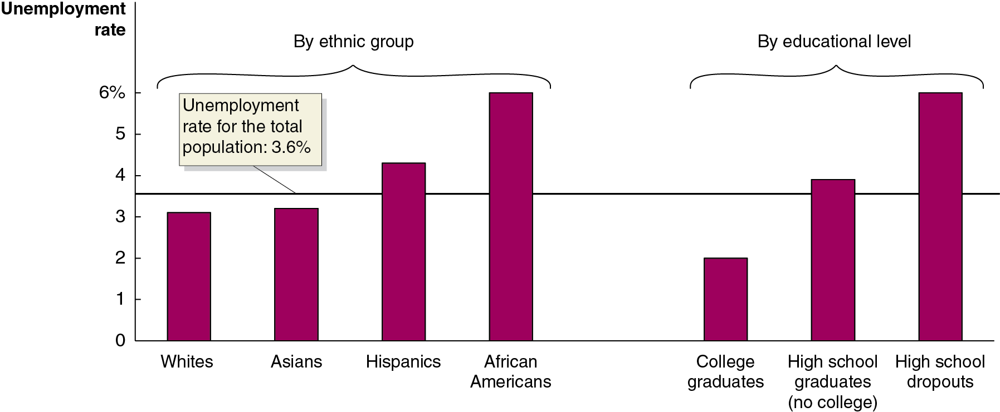{height=99%}

Unemployment rates vary by ethnic group… + … and by education level. + These two observations are statistically related.

## How Long Are People Typically Unemployed?

How Long Are People Typically Unemployed?

Long periods of unemployment are bad for workers, as their skills decay and they risk becoming discouraged and depressed. + During the Great Depression of the 1930s, some people were unemployed for years at a time.

Since World War

the length of unemployment has been

relatively low, but that changed dramatically with the 2007–2009 recession.

The average length of unemployment more than doubled, from 4 months to 10 months. + After the 2020 Covid recession, the average length of unemployment exceeded 6 months.

## Figure 9.4 Trends in the Labor Force: Participation Rates of Adult Men and Women since 1948

Figure 9.4 Trends in the Labor Force: Participation Rates of Adult Men and Women since 1948

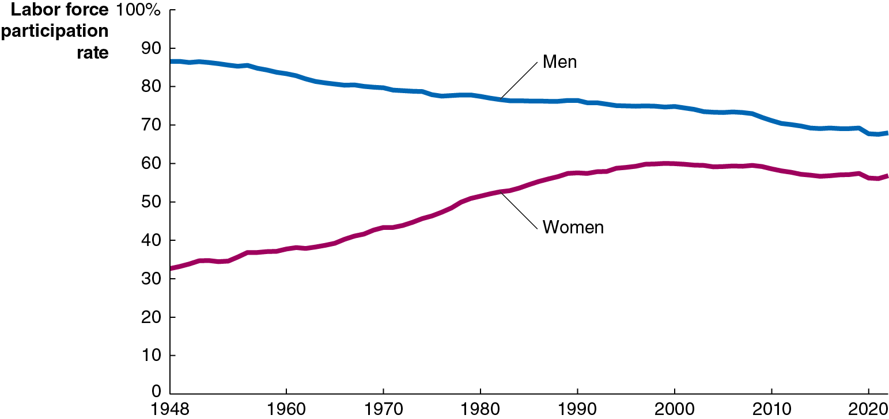{height=99%}

The labor force participation rate of adult men has declined gradually since 1948… + … but it has increased significantly for adult women, making the overall rate higher today than it was then. + Recently, the rate for women has declined also.

## The Establishment Survey

The Establishment Survey

In addition to the household survey, the B L S also uses the establishment survey, (a.k.a. the payroll survey).

This survey samples

establishments, or places of

employment, about their employees. Disadvantages include:

Self-employed people not surveyed (not on a company payroll) + Newly opened firms often omitted + Information on employment only, not unemployment + Numbers fluctuate depending on establishments included, often requiring large revisions

However, a big advantage is that the data are determined by real payrolls, not self-reporting like the household survey.

## Table 9.1 Household and Establishment Survey Data for May and June 2023

Table 9.1 Household and Establishment Survey Data for May and June 2023

Source: U.S. Department of Labor, Bureau of Labor Statistics, The Employment Situation—February 2023, July 7, 2023.

Even if all surveys are truthfully and accurately answered, we do not expect the numbers to be identical between the two surveys: + Different groups are measured + All surveys have measurement errors

But we get a more complete picture by considering both surveys.

## Apply the Concept: Problems with Labor Market Data during the Covid–19 Pandemic

Apply the Concept: Problems with Labor Market Data during the Covid–19 Pandemic

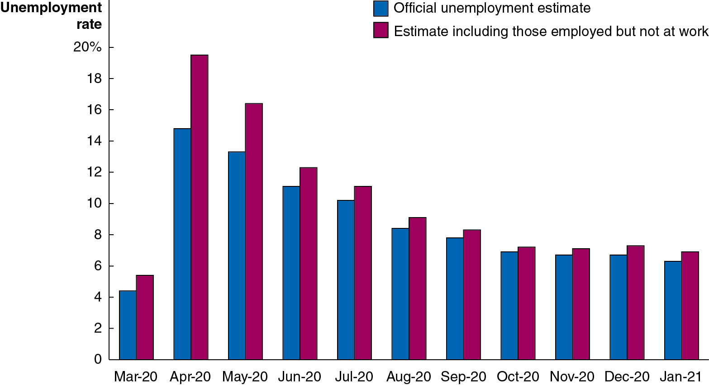{height=99%}

During the pandemic, many people were not working because of business closures. Should we count those people as “unemployed” or “employed but absent from work”? + The B L S prepared both unemployment rates both ways, but decided to treat people officially as “employed but absent from work.”

## Apply the Concept: Problems Measuring Unemployment during the Covid-19 Pandemic

Apply the Concept: Problems Measuring Unemployment during the Covid-19 Pandemic

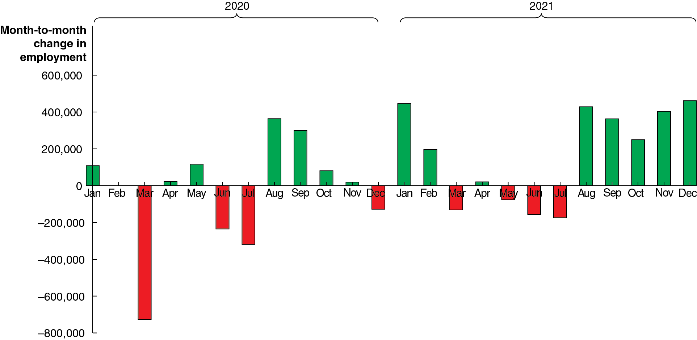{height=99%}

Another problem: the pandemic affected different sectors of the economy unequally, so seasonal adjustments became more difficult to perform. Later revisions for accuracy (shown in the figure above) ended up being larger than normal.

## Job Creation and Job Destruction over Time

Job Creation and Job Destruction over Time

Jobs are continually being created and destroyed in the U.S. economy. + In 2021, about 35.0 million jobs were created, while about 29.9 million jobs were destroyed. + This is a natural and normal process for the economy.

The B L S reports net changes in the number of people employed and unemployed; this does not fully represent how dynamic the U.S. job market really is.

## Figure 9.5 Measuring Changes in Wages Using Average Hourly Earnings and the Employment Cost Index

Figure 9.5 Measuring Changes in Wages Using Average Hourly Earnings and the Employment Cost Index

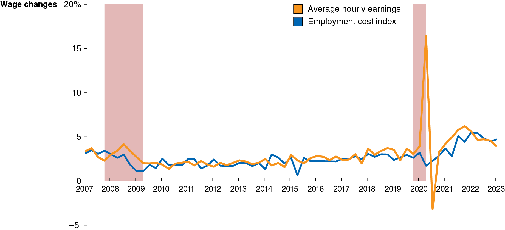{height=99%}

The B L S also publishes data on average hourly earnings (A H E), and the employment cost index (E C I), which includes benefits in addition to wages and salaries. + E C I data are usually more useful, because they include benefits and are adjusted for changes in the mix of occupations.

## 9.2 Types of Unemployment

9.2 Types of Unemployment

Identify the three types of unemployment.

The three types of unemployment are: + Frictional unemployment: Short-term unemployment that arises from the process of matching workers with jobs. + Structural unemployment: Unemployment that arises from a persistent mismatch between the skills or attributes of workers and the requirements of jobs. + Cyclical unemployment: Unemployment causes by a business cycle recession.

We will examine each type in turn over the coming slides.

## Figure 9.6 The Annual Unemployment Rate in the United States since 1948

Figure 9.6 The Annual Unemployment Rate in the United States since 1948

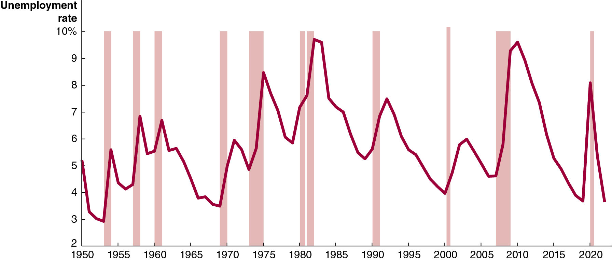{height=99%}

Unemployment rates rise when the economy is faltering and fall when the economy is doing well. But they never fall to zero. + The types of unemployment can help us to understand why.

## Frictional Unemployment

Frictional Unemployment

Frictional unemployment: Short-term unemployment that arises from the process of matching workers with jobs. + Frictional unemployment occurs mostly because of job search: Entering or re-entering the labor force or being between jobs. + It also occurs because of seasonal unemployment: Some jobs fluctuate in availability due to seasonal demand, like ski instructor or farm work. + To control for this, the B L S releases raw and seasonally adjusted employment figures.

Some frictional unemployment actually increases economic efficiency by allowing for better job matches.

## Structural Unemployment

Structural Unemployment

Structural unemployment: Unemployment that arises from a persistent mismatch between the skills or attributes of workers and the requirements of jobs. + Structural unemployment is associated with longer unemployment spells. + Workers who are structurally unemployed may require retraining in order to obtain “modern” jobs. + Example: In the film and T V animation industry, jobs in hand-drawn 2-D illustration have fallen, and jobs in computer-assisted 3-D animation have risen. Even workers with the best hand-drawing skills may find themselves structurally unemployed.

## Cyclical Unemployment and the Natural Rate of Unemployment

Cyclical Unemployment and the Natural Rate of Unemployment

Cyclical unemployment: Unemployment caused by a business cycle recession. + In normal recoveries after a recession, unemployment due to cyclical factors will fall. + When all unemployment is due to frictional and structural factors, we say that the economy is at full employment. This means there will always be some unemployment in the economy. + Economists call this the natural rate of unemployment: The normal rate of unemployment, consisting of frictional unemployment and structural unemployment. + The general consensus of economists is that the U.S. natural rate of unemployment is somewhere between 4.0 percent and 5.0 percent.

## Apply the Concept: Will Chatbots and Other Advances in Technology Permanently Increase Structural Unemployment?

Apply the Concept: Will Chatbots and Other Advances in Technology Permanently Increase Structural Unemployment?

Progress in robotics, automation, and A I are changing the way goods and services are produced and sold. + Similar disruption has happened for a long time; but some economists and policymakers believe these changes will be more disruptive to the labor force than previously. + The “technologically unemployed” are finding it harder to find comparable jobs than ever before.

{height=99%}

## 9.3 Explaining Unemployment

9.3 Explaining Unemployment

Explain what factors determine the unemployment rate.

Governments often attempt to directly influence unemployment. + Example: The federal government’s Trade Adjustment Assistance program offers training to workers whose firms laid them off as a result of competition from foreign firms. This would reduce structural unemployment. + Other policies try to reduce frictional unemployment, for example, by subsidizing new hires. + However, some other government policies probably increase unemployment, such as: + Unemployment insurance + Minimum wage laws

## Unemployment Insurance

Unemployment Insurance

Suppose you have just lost your job. You want to find another and have two main options: + Take a new low-paying job immediately or + Search for a better job

If unemployment insurance payments are available to you, you will probably be more likely to choose the second option. + In the United States, unemployment insurance payments are typically not very generous, compared with other high-income countries; and there are relatively short time limits. + Unemployment benefits are more generous, and unemployment rates higher, in Western European countries. + Do you think these facts are related?

## Minimum Wage Laws

Minimum Wage Laws

Federal minimum wage law was introduced in 1938: $0.25/hour. + In mid-2021, the federal minimum wage was $7.25/hour. + Many states and cities have higher minimum wages. + Example: In 2023, California’s minimum wage was $15.50/hour, and San Francisco’s minimum wage was $18.07/hour.

Studies suggest a 10 percent increase in the minimum wage reduces teenage employment by about 2 percent. + Overall effect on unemployment rate is probably small at current levels, since relatively few people earn minimum wage.

## Labor Unions

Labor Unions

Labor unions are organizations of workers that bargain with employers for higher wages and better working conditions. + Unions are probably not a significant cause of unemployment in the United States. While they raise the wage, only about 6 percent of private sector workers are unionized, limiting the effect that unions have on the wider economy.

## Efficiency Wages

Efficiency Wages

Efficiency wage: An above-market wage that a firm pays to increase workers’ productivity. + Firms want to get the best performance they can out of their workers. + Sometimes monitoring workers is difficult or costly. An alternative is to pay them a relatively high wage, making them motivated to perform well in order to keep their job. + These above-market wages are probably another reason why unemployment exists even when cyclical unemployment is zero: more people want these high-paying jobs than there are jobs available.

## 9.4 Measuring Inflation

9.4 Measuring Inflation

Define the price level and the inflation rate and understand how they are computed.

In Chapter 18, we introduced the idea of the price level: A measure of the average prices of goods and services in the economy. + We refer to the percentage increase in the price level from one year to the next as the inflation rate. + In the last chapter, we used the G D P deflator to measure changes in the price level. By measuring changes in the prices of different baskets of goods, we would come up with different measures. + Two commonly used measures are: + The consumer price index (C P I) + The producer price index (P P I)

## Figure 9.7 The C P I Market Basket, December 2020

Figure 9.7 The C P I Market Basket, December 2020

The consumer price index (C P I) is a measure of the average of the prices a typical urban family of four pays for the goods and services they purchase. + The chart shows the composition of the basket of goods used to create the C P I. This basket of goods derives from a survey of 14,000 households by the B L S.

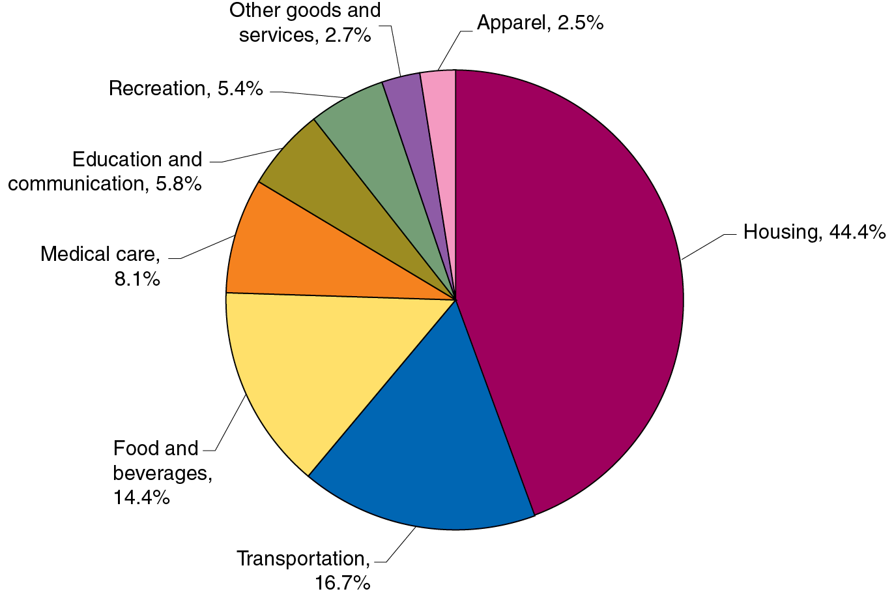{height=99%}

## Calculating the C P I

Calculating the C P I

To calculate the C P I in a given year, we need: + A basket of goods + The cost to purchase the basket of goods in a base year + The prices in the current year

The C P I in the current year is the cost to purchase the basket of goods this year, divided by the cost in the base year. By convention, we multiply this by 100, so that the C P I in the base year is 100.

## A Simple C P I Calculation (1 of 2)

A Simple C P I Calculation (1 of 2)

The table above gives the information we need to create the C P I in 2024 and 2025, using the basket of goods from 2015.

## A Simple C P I Calculation (2 of 2)

A Simple C P I Calculation (2 of 2)

Based on these data, the inflation rate from 2024 to 2025 is the percentage change in the C P I:

Since the C P I measures consumer prices, it is called the cost- of-living index. C P I inflation is sometimes used to generate “fair” increases in wages for workers and government benefits.

## Is the C P I an Accurate Measure of Inflation?

Is the C P I an Accurate Measure of Inflation?

Some potential problems with the C P I include: + Substitution bias: Consumers may change their purchasing habits away from goods that have increased in price. + Increase in quality bias: Difficult to separate improvement in quality from increase in price, say in cars or computers. + New product bias: The basket of goods used to change only every 10 years. (Now it updates every 2 years.) There is a delay to including new goods like cell phones. + Outlet bias: C P I used to only survey prices at traditional retail outlets. Now, it tries to minimize this bias by surveying people about where they actually buy products, including discount stores and online sellers.

Economists believe the C P I overstates true inflation by 0.5 to 1 percentage point (an improvement over previous methods).

## Producer Price Index

Producer Price Index

The producer price index (P P I) is an average of the prices received by producers of goods and services at all stages of the production process. + It is conceptually similar to the C P I, in that it uses a basket of goods, but the goods are those used by producers. + Includes raw materials like coal and crude petroleum and intermediate goods like flour, yarn, steel, and lumber.

The P P I can give early warning of future movements in consumer prices. + Can you suggest why this is true?

## 9.5 Using Price Indexes to Adjust for the Effects of Inflation

9.5 Using Price Indexes to Adjust for the Effects of Inflation

Use price indexes to adjust for the effects of inflation.

Suppose your mother received a salary of $30,000 in 1997. This would have bought much more than a salary of $30,000 in 2022. + We can use the C P I to estimate the purchasing power of that $30,000 in 2022 dollars:

So, $30,000 in 1997 would have bought about as much as $54,596 in 2022.

## Nominal and Real Variables

Nominal and Real Variables

The current standard base “year” for the C P I is an average of 1982–1984 prices. + Values like wages in current-year dollars are called nominal variables. When we adjust them for inflation, by dividing by the current year’s price index and multiplying by 100, we convert them to real variables. + This is useful for comparing variables across time.

## 9.6 Nominal Interest Rates versus Real Interest Rates

9.6 Nominal Interest Rates versus Real Interest Rates

Distinguish between the nominal interest rate and the real interest rate.

When you lend money to someone, they typically agree to pay you back with interest. If the interest rate is 4 percent, for example, then a $1,000 loan paid back in a year will be paid back with $1,040. + 4 percent is the nominal interest rate: The stated interest rate on a loan. + We can adjust for inflation by calculating the real interest rate, equal to the nominal interest rate minus the inflation rate. + This is an approximation, but it is quite accurate for low interest and inflation rates.

If prices rise by 2 percent from this year to next, then your real interest rate on the loan is only 2 percent. This more accurately reflects the cost of borrowing and lending money.

## Figure 9.8 Nominal and Real Interest Rates, 1972–2023

Figure 9.8 Nominal and Real Interest Rates, 1972–2023

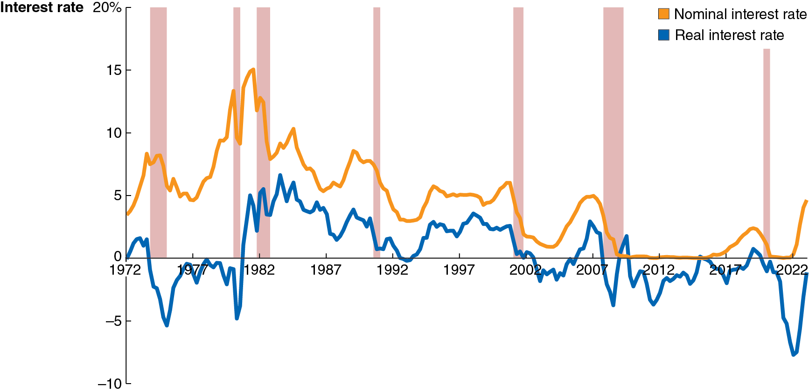{height=99%}

The chart shows the interest rate on three-month treasury bills, a good measure of the nominal interest rate. + The real interest rate adjusts them for changes in the C P I.

In 2009 and again in 2015, the real interest rate was above the nominal interest rate. The change in the C P I was negative then, indicating a rare deflation, or decline in the price level.

## 9.7 Does Inflation Impose Costs on the Economy?

9.7 Does Inflation Impose Costs on the Economy?

Discuss the problems that inflation causes.

Sometimes inflation seems unimportant. + If all prices doubled overnight, it seems like nothing much would change: the prices of goods and services would have doubled, but so would your wage. + So, you could afford exactly as much as before.

But not all prices and wages rise at the same rate. + So, some people will see their real wage increase due to inflation, while others will see it decrease. + Particularly for people on fixed incomes (e.g., retirees), inflation can seem unfair because the purchasing power of their income falls.

## The Problem with Anticipated Inflation

The Problem with Anticipated Inflation

Even if inflation is anticipated, it still causes problems: + Because some prices and incomes will remain fixed, some redistribution of income will occur. + People and firms have increased real costs of holding cash. (The cash that they hold will decrease in value.) + Firms have menu costs: The cost to firms of changing prices. Frequently changing prices are inconvenient for firms (and consumers too!) to deal with. + Investors are taxed on nominal returns, rather than real returns; so, this can increase the tax due.

## The Problem with Unanticipated Inflation

The Problem with Unanticipated Inflation

When people cannot predict the rate of inflation, they find it hard to make good borrowing and lending decisions. + For example, in 1980 banks were charging 18 percent or more on home loans because the rate of inflation was very high. People who bought homes were locked into high rates even when inflation subsided.

On the other hand, if banks lend money at a low rate and then high inflation takes place, the real interest rate they receive may be zero or negative; therefore, the risk of inflation makes banks wary of lending. + Unpredictable inflation makes borrowing and lending risky.

## Apply the Concept: Does Inflation Have a Larger Effect on People with Lower Incomes than on People with Higher Incomes? (1 of 3)

Apply the Concept: Does Inflation Have a Larger Effect on People with Lower Incomes than on People with Higher Incomes? (1 of 3)

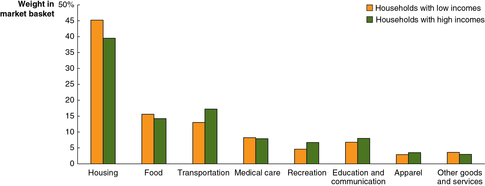{height=99%}

Increases in unemployment during recessions affect people with lower incomes; employers are more likely to lay off those workers. + What about inflation? Does that affect people with lower incomes more than those with higher incomes? + The graph above illustrates the possibility of this differential effect: different types of households spend differently.

## Apply the Concept: Does Inflation Have a Larger Effect on People with Lower Incomes than on People with Higher Incomes? (2 of 3)

Apply the Concept: Does Inflation Have a Larger Effect on People with Lower Incomes than on People with Higher Incomes? (2 of 3)

The high inflation during 2021 affected people with higher incomes more than those with lower incomes. + Why? Primarily because the prices of new and used cars increased so much in 2021, and those constitute a larger proportion of spending for higher-income households than lower-income ones.

## Apply the Concept: Does Inflation Have a Larger Effect on People with Lower Incomes than on People with Higher Incomes? (3 of 3)

Apply the Concept: Does Inflation Have a Larger Effect on People with Lower Incomes than on People with Higher Incomes? (3 of 3)

For most people, the most important aspect of inflation is whether prices are increasing more quickly or more slowly than their wages—that is, the effect on their real wage. + During the period after the beginning of the Covid-19 pandemic, wage growth for workers with the lowest incomes was actually higher than for higher-income workers, and their wage growth did outpace inflation.

## Copyright

Copyright

{height=99%}

This work is protected by United States copyright laws and is provided solely for the use of instructors in teaching their courses and assessing student learning. Dissemination or sale of any part of this work (including on the World Wide Web) will destroy the integrity of the work and is not permitted. The work and materials from it should never be made available to students except by instructors using the accompanying text in their classes. All recipients of this work are expected to abide by these restrictions and to honor the intended pedagogical purposes and the needs of other instructors who rely on these materials.

