## Macroeconomics

Macroeconomics

Ninth Edition

{height=99%}

Chapter 10

Economic Growth, the Financial System, and Business Cycles

{height=99%}

Copyright © 2025, 2021, & 2018 Pearson Education, Inc. All Rights Reserved

## Chapter Outline

Chapter Outline

10.1 Long-Run Economic Growth + 10.2 Saving, Investment, and the Financial System + 10.3 The Business Cycle

## Gen Z Experience the iPhone, Snapchat, … and a Pandemic

Gen Z Experience the iPhone, Snapchat, … and a Pandemic

Gen Z is the segment of the population born between 1997 and 2012. + Gen Z has lived through the introduction of new goods and services resulting from the process of long-run economic growth. + But short-run fluctuations—like the Great Recession of 2007–2009—have also shaped their lives in important ways as many struggled to find jobs. + The Covid-19 pandemic also limited job prospects for new graduates. + You can see that both the long run and the short run affect people’s lives significantly.

{height=99%}

## Obtaining Economic Growth

Obtaining Economic Growth

We all want the United States to have a “strong” economy, since this will hopefully result in a better life for us and the people we care about. + What does it mean for the economy to be “strong” versus. “weak?”

In this chapter, we will explore what the concepts mean in the long term, and also in the short term. + We will also explore what sorts of things seem to lead to a stronger versus weaker economy.

## 10.1 Long-Run Economic Growth

10.1 Long-Run Economic Growth

Discuss the importance of long-run economic growth.

When we speak of long-run economic growth, we mean the process by which rising productivity increases the average standard of living. + This is in contrast to the short-run swings in the economy inherent to the business cycle, the alternating periods of economic expansion and economic recession.

The most commonly used measure of this average standard of living is real G D P per capita: The amount of production in the economy, per person, adjusted for changes in the price level.

## Figure 10.1 The Growth in Real G D P per Capita, 1900–2022

Figure 10.1 The Growth in Real G D P per Capita, 1900–2022

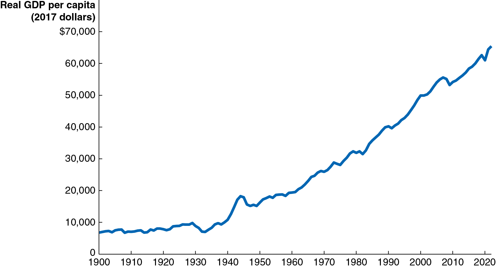{height=99%}

Real G D P per capita has risen more than nine-fold since 1900; the average American can buy more than nine times as many goods and services now as in 1900.

## Apply the Concept: Economic Prosperity and Health (1 of 2)

Apply the Concept: Economic Prosperity and Health (1 of 2)

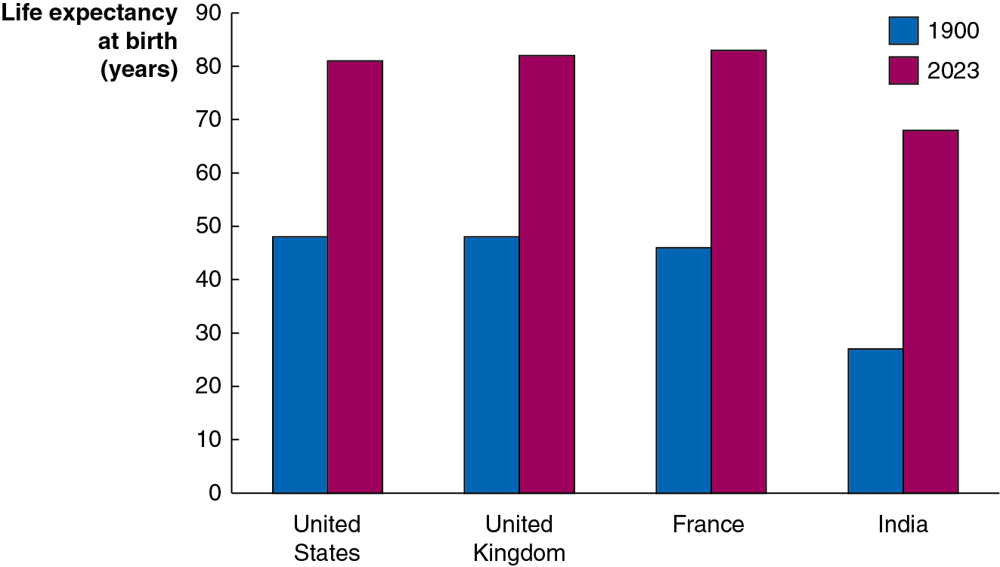{height=99%}

Economic prosperity and health go hand in hand: richer nations can devote more resources to improving the health of their citizens, and healthier citizens are more productive. + While growth in real G D P per capita is an important measure of our improvement, another important measure is the increase in our lifespans. These have also increased markedly over the last century.

## Apply the Concept: Economic Prosperity and Health (2 of 2)

Apply the Concept: Economic Prosperity and Health (2 of 2)

Another good measure of our economic prosperity is the amount of time we can spend on leisure. + As our lifespan grows, we can spend more time on leisure; and also, as we grow more productive, we can devote less time to work, and hence more to leisure. + Nobel Prize-winner Robert Fogel predicts improvements will continue.

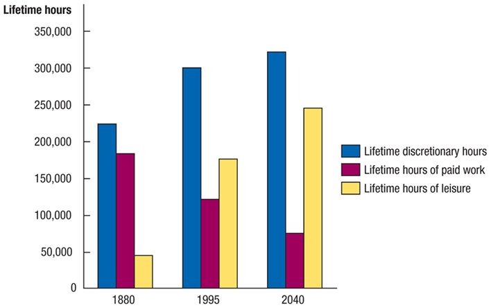{height=99%}

## Calculating Growth Rates

Calculating Growth Rates

The growth rate of an economic variable like real G D P or real G D P per capita is equal to the percentage change from one year to the next. + In 2021, Real G D P was $21.4 trillion + In 2022, Real G D P was $21.8 trillion

## Growth Rates over a Few Years

Growth Rates over a Few Years

Over periods of a few years, we can average the growth rates to find the approximate annual rate of growth. + In 2020, real G D P growth was −2.2% + In 2021, real G D P growth was 5.8% + In 2022, real G D P growth was 1.9% + So, the average annual growth rate over this three-year period was;

## Growth Rates over Longer Periods

Growth Rates over Longer Periods

For longer time periods, we wouldn’t want to calculate each of the annual growth rates and then take an average in order to find the average annual growth rate; instead we would solve for the growth rate g, where:

with t representing the number of time periods between the previous and current periods. + A useful shortcut called the Rule of 70 can help us determine how long it will take for an economic variable to double:

If the growth rate is 5 percent, the variable will double in

## What Determines the Rate of Long-Run Growth?

What Determines the Rate of Long-Run Growth?

Increases in real G D P per capita rely on increases in labor productivity: The quantity of goods and services that can be produced by one worker or by one hour of work. + Why can the average American consume more than nine times as many goods and services now than in 1900? + Because the average American produces more than nine times as many goods and services in an hour now than in 1900.

So, most of the answer to “what determines the rate of long-run growth?” is the same as the answer to “what determines labor productivity growth?”

## Factors Affecting Labor Productivity Growth (1 of 2)

Factors Affecting Labor Productivity Growth (1 of 2)

Increases in capital per hour worked

Capital is physical assets and intellectual property that are used to produce other goods and services. + The more capital a worker has available to use (including human capital, the accumulated knowledge and skills workers possess), the more productive he or she will be.

Technological change

Improvements in capital or methods to combine inputs into outputs (i.e., new technologies) allow workers to produce more in a given period of time. + The role of entrepreneurs here is critical in pioneering new ways to bring together the factors of production to produce better or lower-cost products.

## Factors Affecting Labor Productivity Growth (2 of 2)

Factors Affecting Labor Productivity Growth (2 of 2)

Property rights

A market system cannot function unless rights to private property are secure. + Governments can aid growth by establishing independent court systems to enforce contracts between private individuals.

## Apply the Concept: Can India Sustain Its Rapid Growth? (1 of 2)

Apply the Concept: Can India Sustain Its Rapid Growth? (1 of 2)

To many people, the rapid economic rise of India was unexpected. + Before its independence from England in 1947, growth rates in India were very low, and India was desperately poor. + In 1991, the Indian government decided to scale back central planning, reduce regulations, and introduce market-based reforms, leading to the growth rate in India’s real G D P per capita doubling.

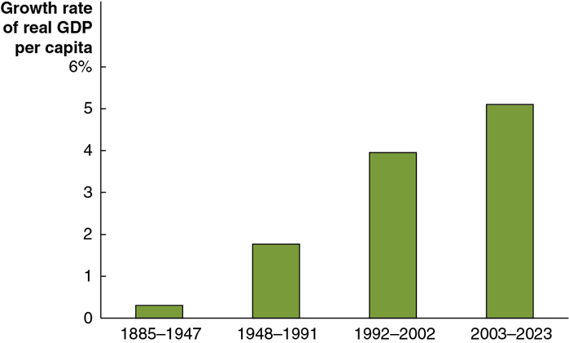{height=99%}

## Apply the Concept: Can India Sustain Its Rapid Growth? (2 of 2)

Apply the Concept: Can India Sustain Its Rapid Growth? (2 of 2)

Continued growth will require upgraded infrastructure, improved educational and health services, and commitment to the rule of law and market-based reforms. + Recent key policies in India include: + Regulatory reforms to reduce corruption and improve the ability to operate businesses. + Modernizing infrastructure, including roads, railroads, and internet access.

{height=99%}

## Potential G D P

Potential G D P

Potential G D P is the level of real G D P attained when all firms are operating at capacity. Capacity here refers to “normal” hours and a “normal” sized workforce. + Potential G D P rises when the labor force expands, when a nation acquires more capital stock, or when new technologies are created.

The growth in potential G D P in the United States has been relatively steady at about 3.1 percent; that is, the potential to produce final goods and services has been growing in the United States at about this rate over time. + The recessions of 2007–2009 and 2020 resulted in a wider than usual gap between potential and actual G D P, as the next slide illustrates.

## Figure 10.2 Actual and Potential G D P

Figure 10.2 Actual and Potential G D P

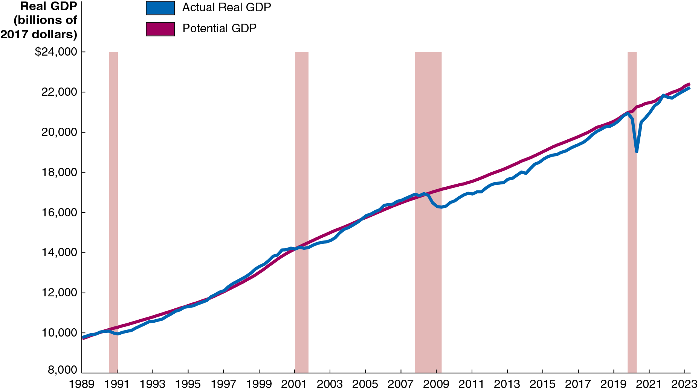{height=99%}

## 10.2 Saving, Investment, and the Financial System

10.2 Saving, Investment, and the Financial System

Discuss the role of the financial system in facilitating long-run economic growth.

Firms can finance some of their own expansion through retained earnings, reinvesting profits back into the firm. + But often firms want to obtain more funds for expansion than are available in this way.

Firms obtain these funds via the financial system: The system of financial markets and financial intermediaries through which firms acquire funds from households.

## Financial Markets and Financial Intermediaries

Financial Markets and Financial Intermediaries

Financial markets are markets where financial securities, such as stocks and bonds, are bought and sold. + Financial security: A document (sometimes electronic) stating the terms under which funds pass from the buyer of the security to the seller. + Stock: A financial security representing partial ownership of a firm. + Bond: A financial security promising to repay a fixed amount of funds. A bond is essentially a loan from a household to a firm.

Financial intermediaries are firms, such as banks, mutual funds, pension funds, and insurance companies, that borrow funds from savers and lend them to borrowers.

## The Services the Financial System Provides

The Services the Financial System Provides

Risk sharing + By allowing investors to spread their money over many different assets, investors can reduce their risk while maintaining a high expected return on their investment.

Liquidity + The financial system allows savers to quickly convert their investments into cash.

Information + The prices of financial securities represent the beliefs of other investors and financial intermediaries about the future revenue stream from holding those securities. + This aggregation of information makes funds flow to the right firms.

## The Macroeconomics of Savings and Investment

The Macroeconomics of Savings and Investment

We will now derive the result that the total value of saving in the economy must equal the total value of investment. + Recall that we can express the G D P of a nation (Y) as the sum of consumption (C), investment (I), government purchases (G), and net exports (N X). That is,

We will assume a closed economy, with no exports or imports; so

We can rearrange this to obtain an expression for investment:

That is, investment in a closed economy is equal to income minus consumption and government purchases.

## Savings

Savings

Savings is composed of private savings (by households,

and public savings (by the government,

is household income that is not spent; household income includes

payments for factors of production (Y) and transfer payments (T R); households consume (C) and pay taxes (T). So,

The government “saves” whatever it brings in but does not spend (this may be negative, known as dissaving):

So, total saving is:

## Savings Equals Investment

Savings Equals Investment

The two previous slides led us to the same expressions for savings and investment. So we conclude that savings must equal investment:

When

is zero, the government spends as much as it

brings in; this is known as a balanced budget. Negative and

positive values for

are known as budget deficits and

budget surpluses, respectively.

Since the federal government funds its current deficits with borrowing (selling Treasury bonds), this takes away from the money available for investment spending.

## The Market for Loanable Funds

The Market for Loanable Funds

If savings must equal investments, how exactly does this occur? + The financial system is composed of many different markets—the market for stocks, for bonds, for certificates of deposits at banks, etc. + A convenient way to model these is as a single market: the market for loanable funds, a (conceptual) interaction of borrowers and lenders that determines the market interest rate and the quantity of loanable funds exchanged.

For now, we will assume that interactions are only between domestic households and firms—there is no interaction with foreign lenders and borrowers.

## Figure 10.3 The Market for Loanable Funds

Figure 10.3 The Market for Loanable Funds

Firms borrow loanable funds from households. They borrow more when households demand a lower return on their money—a lower real interest rate. + Households supply loanable funds to firms. They provide more when firms offer them a greater reward for delaying consumption—a higher real interest rate. + Governments, through their saving or dissaving, affect the quantity of funds that “pass through” to firms.

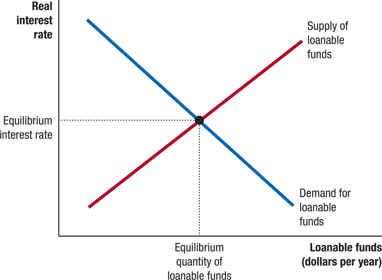{height=99%}

## Apply the Concept: Ebenezer Scrooge: Accidental Promoter of Economic Growth?

Apply the Concept: Ebenezer Scrooge: Accidental Promoter of Economic Growth?

In Charles Dickens’s A Christmas Carol, Ebenezer Scrooge initially spends little. In the book, this is portrayed negatively, but is this really fair? + By declining to consume, Scrooge elects to save. Society’s resources can then be set toward investment, increasing productive capacity and hence future consumption.

Eventually, Scrooge starts to spend his wealth. While this encourages current production, society was probably better served—and achieved stronger growth—when Scrooge chose to save instead.

{height=99%}

## Figure 10.4 An Increase in the Demand for Loanable Funds

Figure 10.4 An Increase in the Demand for Loanable Funds

Suppose that technological change occurs so that investments become more profitable for firms. + This will increase the demand for loanable funds. + The real interest rate will rise, as will the quantity of funds loaned.

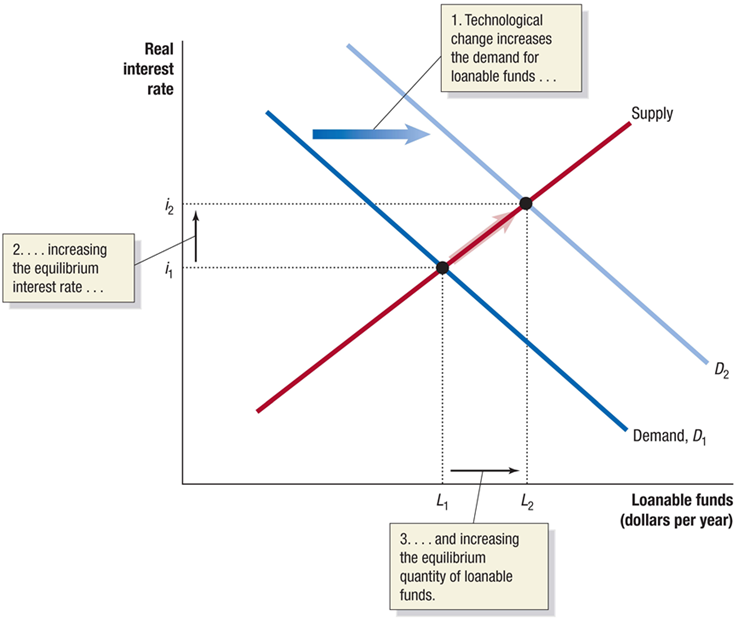{height=99%}

## Figure 10.5 The Effect of a Budget Deficit on the Market for Loanable Funds

Figure 10.5 The Effect of a Budget Deficit on the Market for Loanable Funds

Suppose the government runs a budget deficit. + To fund the deficit, it sells bonds to households, decreasing the supply of funds available to firms. + This raises the equilibrium real interest rate and decreases the funds loaned to firms. + This is crowding out: a decline in private expenditure as a result of increases in government purchases.

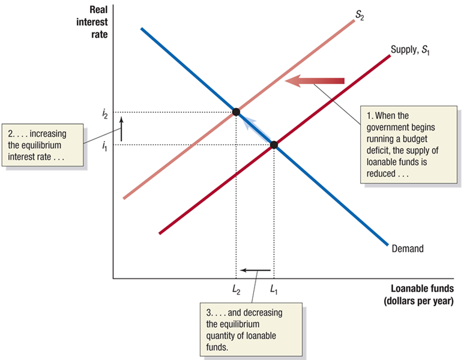{height=99%}

## How Important Is Crowding Out?

How Important Is Crowding Out?

In practice, the effect of government budget deficits and surpluses on the equilibrium interest rate is relatively small. + How small? According to one study, increasing borrowing by 1 percent of G D P would increase the real interest rate 0.003 points.

Why would the effect be so small? + Interest rates are influenced by global markets, so even a few hundred billion dollars is a relatively minor amount.

## Table 10.1 Summary of the Loanable Funds Model (1 of 2)

Table 10.1 Summary of the Loanable Funds Model (1 of 2)

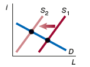{height=99%}

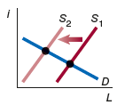{height=99%}

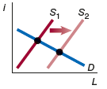{height=99%}

## Table 10.1 Summary of the Loanable Funds Model (2 of 2)

Table 10.1 Summary of the Loanable Funds Model (2 of 2)

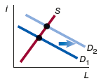{height=99%}

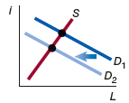{height=99%}

## 10.3 The Business Cycle

10.3 The Business Cycle

Explain what happens during the business cycle.

While real G D P per capita has risen about nine-fold since the start of the twentieth century, it has not risen consistently every year. + Since at least the early nineteenth century, the American economy has experienced alternating periods of expanding and contracting economic activity. + These alternating periods are called the business cycle.

## Figure 10.6 The Business Cycle (1 of 2)

Figure 10.6 The Business Cycle (1 of 2)

The figure shows a typical idealized path for real G D P—rising, falling, then rising again. + The phases of rising are known as expansion; the periods of falling are recessions. + We refer to the points at which the economy changes from one phase to the other as peaks or troughs, respectively.

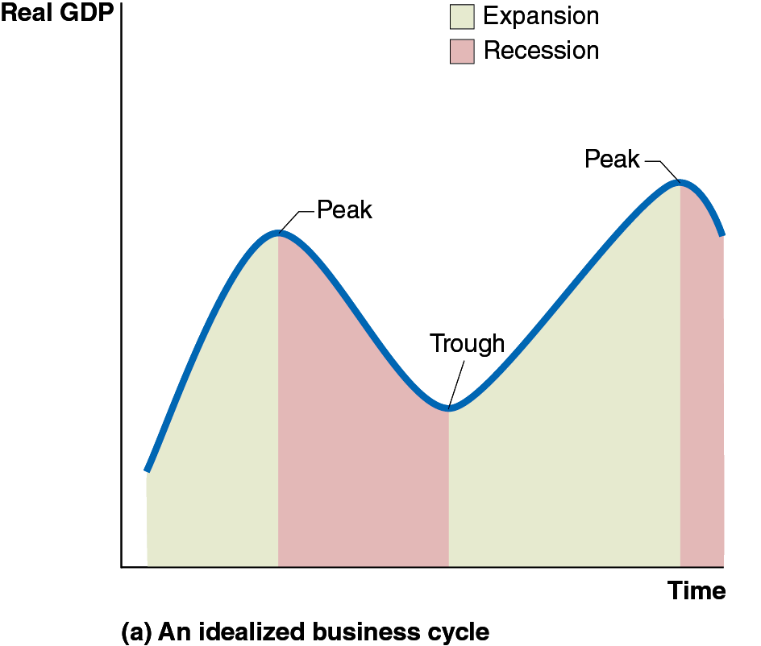{height=99%}

## Figure 10.6 The Business Cycle (2 of 2)

Figure 10.6 The Business Cycle (2 of 2)

This figure shows the movements in real G D P in the United States from 2006 to 2022. + The period of recession starting in late 2007 and ending in mid-2009 was the longest and most severe since the Great Depression of the 1930s, prompting some to refer to it as the Great Recession. + A short but severe recession occurred during the first months of the Covid-19 pandemic.

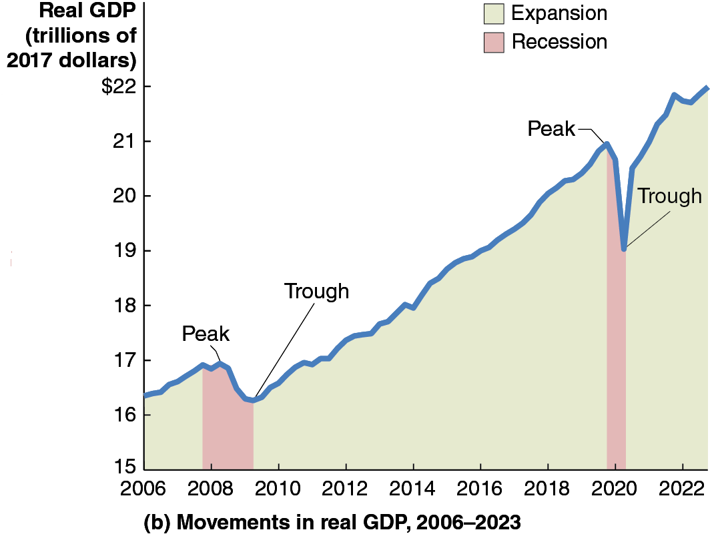{height=99%}

## Table 10.2 The U.S. Business Cycle Since 1950 (1 of 2)

Table 10.2 The U.S. Business Cycle Since 1950 (1 of 2)

How do we know when the economy is in a recession? + The federal government does not define when a recession starts or ends. + The typical media definition of a recession is “two consecutive quarters of declining real G D P.”

Source: National Bureau of Economic Research.

## Table 10.2 The U.S. Business Cycle Since 1950 (2 of 2)

Table 10.2 The U.S. Business Cycle Since 1950 (2 of 2)

Most economists defer to the judgment of the National Bureau of Economic Research (N B E R): + “A recession is a significant decline in activity spread across the economy, lasting more than a few months, visible in industrial production, employment, real income, and wholesale-retail trade.”

Source: National Bureau of Economic Research.

## What Happens during the Business Cycle?

What Happens during the Business Cycle?

While each business cycle is different, most share these features: + Near the end of an expansion, interest rates are rising, and the wages of workers are rising faster than other prices.

Firm profits are falling.

As a recession begins, firms decrease their investment spending, and households consume less.

Firms cut back on employment, leading to further declines in spending.

Eventually economic conditions improve; firms anticipate the future expansion and begin investing again.

Households do too, and eventually employment recovers.

## The Effect of the Business Cycle on Inflation

The Effect of the Business Cycle on Inflation

The inflation rate measures the change in the price level from one year to the next. + During expansions, demand for products is high relative to supply, resulting in prices increasing—high inflation. + During recessions, demand for products is low relative to supply, resulting in prices increasing more slowly or even decreasing—low inflation or possibly deflation.

The graph on the next slide shows the movements in the (C P I) inflation rate over the last two decades.

## Figure 10.7 The Effect of Recessions on the Inflation Rate

Figure 10.7 The Effect of Recessions on the Inflation Rate

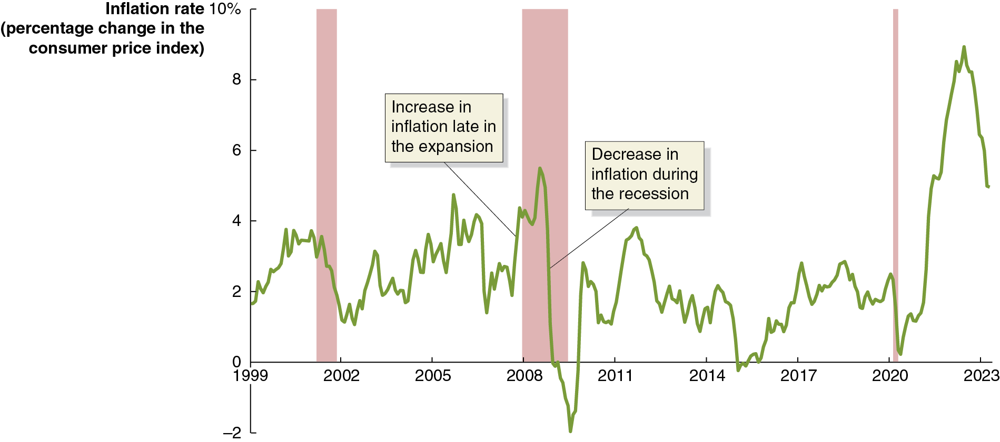{height=99%}

Inflation tends to rise toward the end of an expansion and fall over the course of each recession.

## Figure 10.8 How Recessions Affect the Unemployment Rate

Figure 10.8 How Recessions Affect the Unemployment Rate

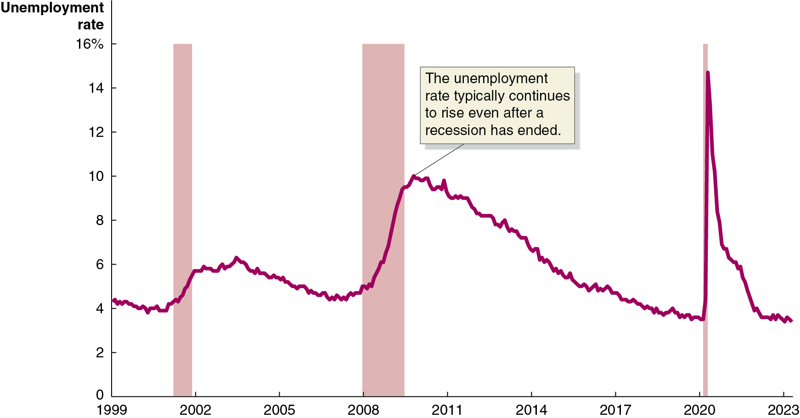{height=99%}

As firms see their sales start to fall in a recession, they generally reduce production and lay off workers. + Notice that unemployment often continues to rise after the end of each recession.

## Figure 10.9 The Effect of the Great Recession and the 2020 Covid-19 Recession on Younger Workers

Figure 10.9 The Effect of the Great Recession and the 2020 Covid-19 Recession on Younger Workers

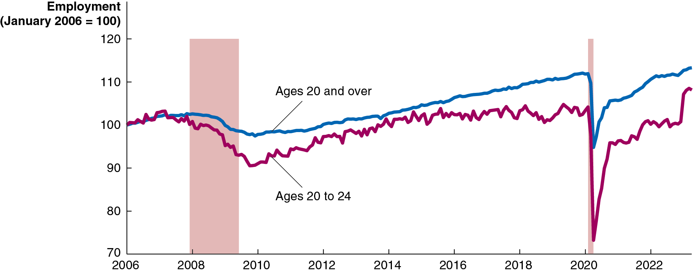{height=99%}

Younger millennials were hit especially hard by the Great Recession. Even now, those who were aged 20–24 in 2006 are less likely to be employed than older workers. They saw similar impacts during the Covid-19 recession of 2020. + Older millennials were also affected, but less dramatically.

## Apply the Concept: Why Can’t Economists Predict Recessions?

Apply the Concept: Why Can’t Economists Predict Recessions?

Queen Elizabeth

visited the

London School of Economics during the 2008 financial crisis, and asked “Why did nobody notice it?” + Why can’t economists predict recessions? + Business cycles are not uniform. + Leading economic indicators are not reliable. + Events that trigger a recession are hard to predict.

{height=99%}

## Figure 10.10 Fluctuations in Real G D P, 1900–2022

Figure 10.10 Fluctuations in Real G D P, 1900–2022

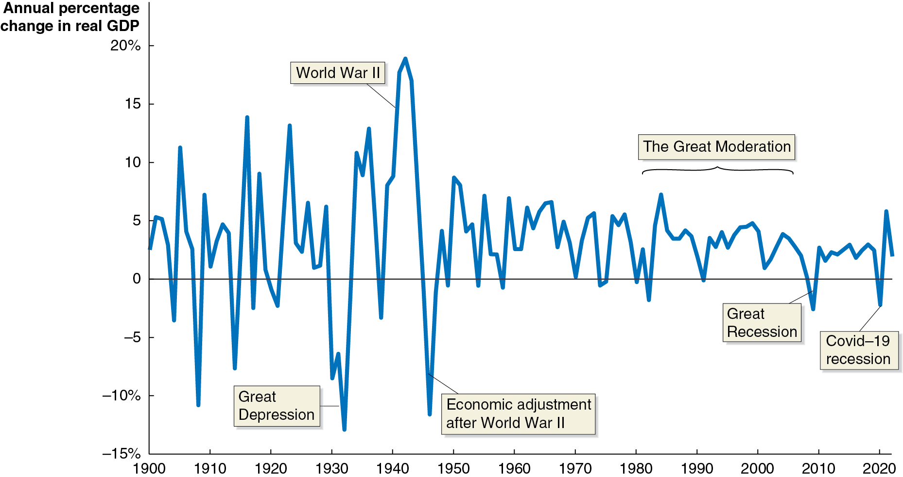{height=99%}

Annual fluctuations in real G D P were typically greater before 1950 than after 1950. + Business cycles have been particularly mild since the mid-1980s, with some economists calling the ensuing period the Great Moderation.

## Table 10.3 Until 2007, the Business Cycle Had Become Milder

Table 10.3 Until 2007, the Business Cycle Had Become Milder

The length and severity of the recession of 2007–2009 made some economists and policymakers wonder if we would return to the previous pattern of long expansions and short, mild recessions. + But except for the Covid-19 recession in 2020 and the subsequent strong recovery, growth has been exceptionally stable.

## Can the U.S. Economy Return to Stability?

Can the U.S. Economy Return to Stability?

Several factors help to explain the Great Moderation, and their continuation suggests the U.S. economy will return to stability: + The increasing importance of services + Manufacturing (especially of durable goods) is more strongly affected by recessions. The economy is based more on services now, decreasing the effect of the business cycle on G D P.

The establishment of unemployment insurance + Before the 1930s, unemployment insurance and other government transfer programs like Social Security did not exist. These programs increase the ability of consumers to purchase goods and services during recessions.

## Explaining the Great Moderation

Explaining the Great Moderation

Several factors help to explain the Great Moderation, and their continuation suggests the U.S. economy will return to stability: + Active federal government stabilization policies + Many, though not all, economists believe that active government policies to lengthen expansions and minimize the effects of recessions have had the desired effect. The debate over the role of government in this way became particularly intense during the recession of 2007–2009.

Increased stability of the financial system + The severity of the Great Depression of the 1930s was in part caused by instability in the financial system; similar instability exacerbated the recession of 2007–2009. Returning to macroeconomic stability will require a stable financial system.

## Copyright

Copyright

{height=99%}

This work is protected by United States copyright laws and is provided solely for the use of instructors in teaching their courses and assessing student learning. Dissemination or sale of any part of this work (including on the World Wide Web) will destroy the integrity of the work and is not permitted. The work and materials from it should never be made available to students except by instructors using the accompanying text in their classes. All recipients of this work are expected to abide by these restrictions and to honor the intended pedagogical purposes and the needs of other instructors who rely on these materials.

