## Macroeconomics

Macroeconomics

Ninth Edition

{height=99%}

Chapter 11

Long-Run Economic Growth: Sources and Policies

{height=99%}

Copyright © 2025, 2021, & 2018 Pearson Education, Inc. All Rights Reserved

## Chapter Outline

Chapter Outline

11.1 Economic Growth over Time and around the World + 11.2 What Determines How Fast Economies Grow? + 11.3 Economic Growth in the United States + 11.4 Why Isn’t the Whole World Rich? + 11.5 Growth Policies

## Technological Change, Creative Destruction, and Rising Living Standards

Technological Change, Creative Destruction, and Rising Living Standards

Few firms had a rise and fall as spectacular as that of Blockbuster. + Founded in 1985, Blockbuster Video used sophisticated software to track inventories of movies and the rental habits of customers. + In the early 2000s, Blockbuster had more than 4,000 stores in the United States; but competition from new services like Netflix led to only a single Blockbuster remaining in 2023. + Will other firms like Apple, Facebook, and G M be wiped out in the same way?

{height=99%}

## Obtaining Economic Growth

Obtaining Economic Growth

In Chapter 20, we looked at ways to measure economic growth in the long and short terms. + In this chapter, we will consider the effects of different government policies on long-term economic growth. + Economic growth, after all, is not inevitable; history has seen long periods of stagnation where no sustained increases in output per capita occurred.

Why have some countries been able to achieve rapidly increasing real G D P per capita, while other countries have failed to keep pace? + Our goal in this chapter is to develop a model of economic growth to help answer questions like this.

## 11.1 Economic Growth Over Time and around the World

11.1 Economic Growth Over Time and around the World

Define economic growth, calculate economic growth rates, and describe global trends in economic growth.

Most worldwide economic growth has occurred within the last two centuries. + But for most of human existence, two centuries of growth amounted to very little: the standard of living was essentially the same as for people two centuries prior.

## Figure 11.1 Average Annual Growth Rates for the World Economy (1 of 2)

Figure 11.1 Average Annual Growth Rates for the World Economy (1 of 2)

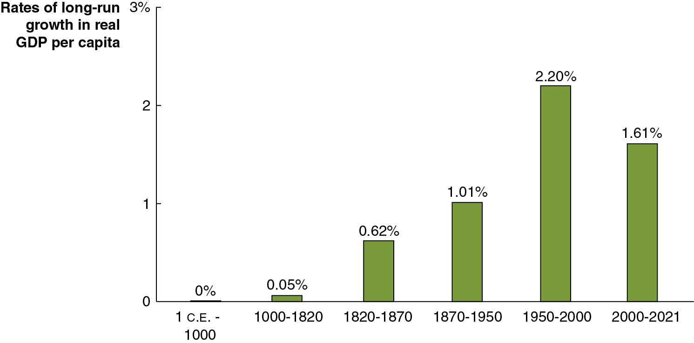{height=99%}

British economist Angus Maddison began a project estimating worldwide growth rates beginning with the year 1 C.E. + The Industrial Revolution and its subsequent spread throughout the world resulted in sustained increases in real G D P per capita.

## Figure 11.1 Average Annual Growth Rates for the World Economy (2 of 2)

Figure 11.1 Average Annual Growth Rates for the World Economy (2 of 2)

{height=99%}

The difference between 1.61 percent and 2.2 percent may not seem like much, but over a long period it makes a big difference. + Over 50 years, a 1.61 percent growth rate leads to about a 122 percent increase in real G D P per capita. + But a 2.20 percent growth rate leads to about a 197 percent increase.

## The Industrial Revolution

The Industrial Revolution

Significant economic growth did not really begin until the Industrial Revolution: The application of mechanical power to the production of goods, beginning in England around 1750. + Before this, production of most goods had relied on human or animal power.

The use of mechanical power allowed England and other countries—like the United States, France, and Germany—to begin to experience long-run economic growth.

## Apply the Concept: Why Did the Industrial Revolution Begin in England? (1 of 2)

Apply the Concept: Why Did the Industrial Revolution Begin in England? (1 of 2)

Nobel Laureate Douglass North argues that the Glorious Revolution of 1688 was a key turning point in the economic history of Britain. + After that date, the British Parliament, rather than the king, controlled the government. The court system also became independent of the king.

{height=99%}

## Apply the Concept: Why Did the Industrial Revolution Begin in England? (2 of 2)

Apply the Concept: Why Did the Industrial Revolution Begin in England? (2 of 2)

The government was then able to make credible promises to uphold property rights, protect wealth, and remove arbitrary tax increases. + North claims these changes incentivized entrepreneurs to make the investments necessary for the Industrial Revolution to take hold.

{height=99%}

## Table 11.1 The Effects of Different Growth Rates on Living Standards

Table 11.1 The Effects of Different Growth Rates on Living Standards

Notice that the three countries in the table had similar real G D P per capita in 1960, but have diverged since then. + In the long run, small differences in economic growth rates result in big differences in living standards.

## The Problem with Slow Economic Growth

The Problem with Slow Economic Growth

A country that grows too slowly fails to raise living standards. + This doesn’t just mean i Phones and flat-screen T Vs. + In high-income countries, 6 or fewer out of 1,000 babies die before age one. In the poorest countries, the rate is more than 50 out of 1,000. + Poor growth has resulted in previously rich countries like Ghana lagging behind, with higher rates of poverty, lower life expectancy, and higher infant mortality than their prior peers.

## The Variation in per Capita Income around the World

The Variation in per Capita Income around the World

Economists often refer to the high-income countries (or industrial or developed countries) of Western Europe, Australia, Canada, Japan, New Zealand, and the United States, in comparison to the poorer developing countries of the rest of the world. + The 1980s and 1990s have seen some countries progress out of the developing category, like Singapore, South Korea, and Taiwan; these are often referred to as newly industrializing countries. + Real G D P per capita is markedly different across the world, even after correcting for cost-of-living differences.

## Figure 11.2 G D P per Capita, 2022

Figure 11.2 G D P per Capita, 2022

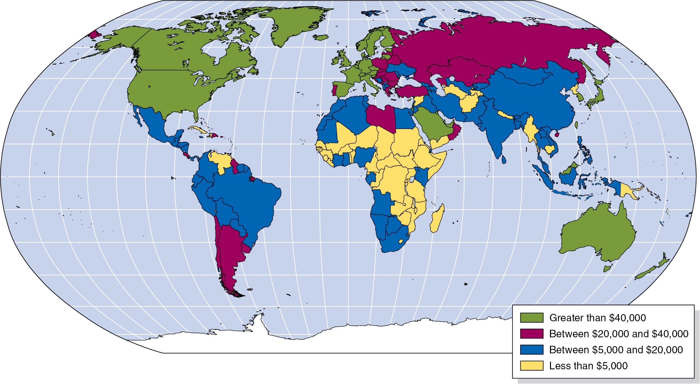{height=99%}

The figure shows G D P per capita (in $U S) in 2020 for each of the world’s nations, adjusted for differences in the cost of living.

## Is Income All That Matters?

Is Income All That Matters?

By concentrating on income differences between countries, are economists missing something important? + While incomes have not been rising in, for example, sub-Saharan Africa, economist Charles Kenny argues that those countries have made rapid advances in health, education, and civil and political liberties. + These increases in living standards do not require significant increases in income. The key factors in raising living standards in low-income countries have been increases in technology and knowledge. + However there are limits to how much standards of living can improve while incomes stagnate.

## 11.2 What Determines How Fast Economies Grow?

11.2 What Determines How Fast Economies Grow?

Use the economic growth model to explain why growth rates differ across countries.

An economic growth model explains growth rates in real G D P per capita over the long run. + As we saw in Chapter 20, the key to this is labor productivity: The quantity of goods and services that can be produced by one worker or by one hour of work. + Two main factors affect labor productivity: + The quantity of capital per hour worked and + The level of technology.

So, our model will concentrate on changes in the quantity of capital and technological change: Positive or negative change in the ability of a firm to produce a given level of output with a given quantity of inputs.

## Three Main Sources of Technological Change

Three Main Sources of Technological Change

Better machinery and equipment

Inventions like the steam engine, machine tools, electric generators, and computers have allowed faster economic growth. + Increases in human capital

Human capital is the accumulated knowledge and skills that workers acquire from education and training or from their life experiences. + Better means of organizing and managing production

If managers can do a better job of organizing production, then labor productivity can increase. An example of this is the just-in-time system, first developed by Toyota; this involves assembling goods from parts that arrive at the factory exactly when they are needed.

## Figure 11.3 The Per-Worker Production Function (1 of 2)

Figure 11.3 The Per-Worker Production Function (1 of 2)

Suppose we wanted to describe a per-worker production function: The relationship between real G D P per hour worked and capital per hour worked, holding the level of technology constant. + The first units of capital would be the most effective, allowing output per hour to increase most.

{height=99%}

## Figure 11.3 The Per-Worker Production Function (2 of 2)

Figure 11.3 The Per-Worker Production Function (2 of 2)

Subsequent increases would result in diminishing returns: Smaller incremental increases in output. + Why? Imagine running a pizza store with 10 workers and 1 oven. + A second oven would allow the workers to be productive. + But if you already had 19 pizza ovens, a 20th would not increase output by much, if at all.

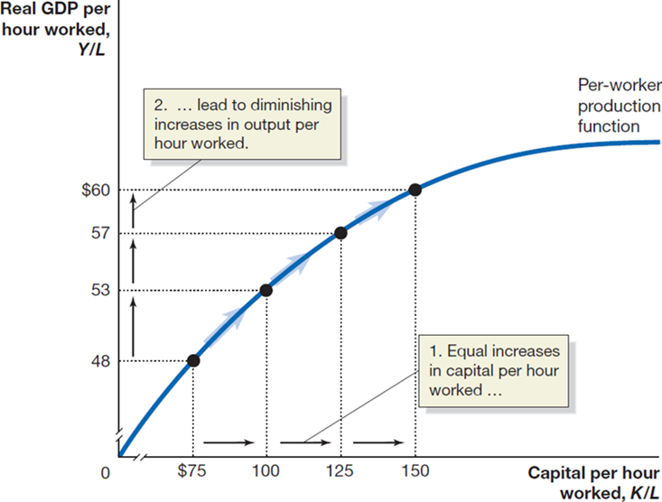{height=99%}

## Figure 11.4 Technological Change Increases Output per Hour Worked (1 of 3)

Figure 11.4 Technological Change Increases Output per Hour Worked (1 of 3)

If a country is relatively lacking in capital—like many of the developing countries—increases in capital will be very effective at increasing real G D P per capita. + In countries where the amount of capital is already relatively high, technological change becomes a more effective way to increase output per hour.

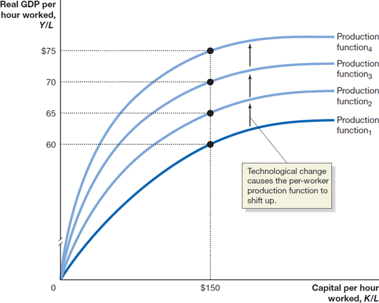{height=99%}

## Figure 11.4 Technological Change Increases Output per Hour Worked (2 of 3)

Figure 11.4 Technological Change Increases Output per Hour Worked (2 of 3)

While growth through improving capital per hour can be effective, it is necessarily limited by diminishing returns. + But technological change does not have this limitation. + Technological changes in making pizza could include better ovens that can cook pizzas faster, or process improvements like assembly-line pizza construction.

{height=99%}

## Figure 11.4 Technological Change Increases Output per Hour Worked (3 of 3)

Figure 11.4 Technological Change Increases Output per Hour Worked (3 of 3)

In the long run, a country will experience an increasing standard of living only if it experiences continuing technological change.

{height=99%}

## Apply the Concept: What Explains the Economic Failure of the Soviet Union?

Apply the Concept: What Explains the Economic Failure of the Soviet Union?

Under Communism, the Soviet Union was a centrally planned economy, where the government owned nearly every business and made all production and pricing decisions. + The Soviets concentrated on improving their capital stock, and in the 1950s, their output per hour improved faster than in the United States. + But Soviet managers had little incentive to develop new ways of doing things, and they did not have to worry about competition. This held back technological change and resulted in slowing growth rates for output in the Soviet Union.

{height=99%}

## New Growth Theory

New Growth Theory

The model of economic growth we have developed was first developed by Nobel Laureate Robert Solow in the 1950s. + Solow did not seek to explain technological change, instead he considered technological change to be the result of chance scientific discoveries.

Paul Romer developed the new growth theory, a model of long-run economic growth that emphasizes that technological change is influenced by economic incentives and so is determined by the working of the market system.

## New Growth Theory and Knowledge Capital

New Growth Theory and Knowledge Capital

Romer argues that the accumulation of knowledge capital is a key determinant of economic growth. Increases in knowledge capital result from research and development and other technological advances. + Physical capital is rival and excludable—a private good—and this results in its diminishing returns. + But knowledge capital is nonrival and nonexcludable—a public good—and so results in increasing returns—not at the firm level but at the economy level.

## Government’s Role in Knowledge Capital Generation

Government’s Role in Knowledge Capital Generation

Public goods such as the creation of knowledge capital result in free riding: Benefitting from goods and services you do not pay for. + Example: Bell Labs’ development of transistor technology resulted in immense profits for other firms. + Because firms do not enjoy the entire benefit of their knowledge capital, they do not produce enough of it. + The public good nature of knowledge capital leads to a role for government policy in: + Protecting intellectual property with patents and copyrights + Subsidizing research and development + Subsidizing education

## Protecting Intellectual Property

Protecting Intellectual Property

Governments seek to protect intellectual property through the use of patents and copyrights. + Allowing firms to benefit from their own research and development increases their incentive to perform it.

Patents are the exclusive legal right to produce a product for a period of 20 years from the date the patent application is filed with the government. This period of time is designed to balance the chance for a firm to benefit from its invention against the need of society to benefit from it. + Copyrights act similarly for creative works like books and films, granting the exclusive right to use the creation during and 70 years after the creator’s lifetime.

## Subsidizing R&D and Education

Subsidizing R&D and Education

Subsidizing research and development + Governments might perform research directly—like NASA and the National Institutes of Health—or subsidize researchers at institutions like universities. + Similarly, they can provide tax incentives to firms performing R&D.

Subsidizing education + In order to perform research and development, workers need to be technically trained. If firms provide this training, they recoup the cost by paying workers lower wages, decreasing the incentive for workers to take such jobs. + A solution to this is to have the government subsidize education, as it does in all high-income countries.

## Joseph Schumpeter and Creative Destruction

Joseph Schumpeter and Creative Destruction

Joseph Schumpeter was born in Austria in 1883 and grew up there before moving to the United States. + Schumpeter developed a model of growth emphasizing his view that new products unleashed a gale of creative destruction. + Example: The automobile replaced the horse-drawn carriage by better serving the needs of consumers. This “creation” “destroyed” carriage makers and associated firms.

To Schumpeter, the entrepreneur is central to economic growth, and the profits of entrepreneurs provide the incentive for bringing together the factors of production—labor, capital, and natural resources—in new ways.

## 11.3 Economic Growth in the United States

11.3 Economic Growth in the United States

Discuss fluctuations in productivity growth in the United States.

The experience of the United States can help us understand how capital accumulation and technological change help to drive economic growth.

## Figure 11.5 Average Annual Growth Rates in Real G D P per Hour Worked in the United States, 1800–2022

Figure 11.5 Average Annual Growth Rates in Real G D P per Hour Worked in the United States, 1800–2022

Growth rates in the United States were relatively modest prior to 1900. + In the twentieth century, firms and the U.S. government invested heavily in research and development, resulting in increasing growth rates. + Growth rates remained high until the mid-1970s, when they fell unexpectedly, before picking up again in the mid-1990s.

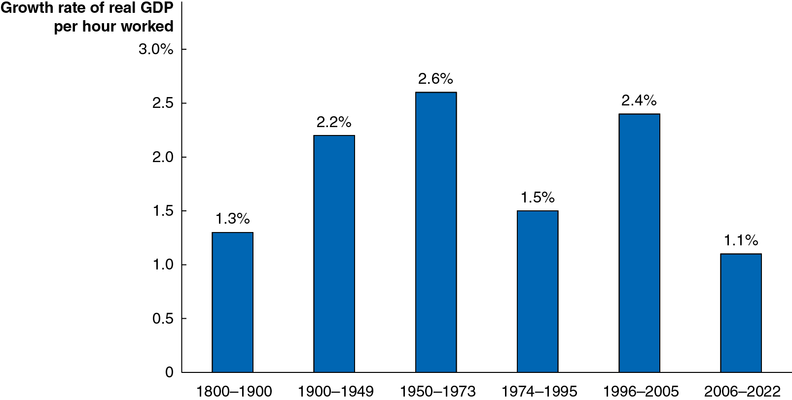{height=99%}

## Is the United States Headed for a Long Period of Slow Growth?

Is the United States Headed for a Long Period of Slow Growth?

Economists have yet to reach a consensus on explaining swings in U.S. productivity growth since the mid-1970s. There are two views; + The optimistic view is that productivity is simply more difficult to measure. High rates of productivity growth in the long run will yield significant increases in future standards of living. + The pessimistic view is that productivity growth entered a long-run decline in the mid-1970s that was briefly offset by the revolution in information technology. Economists in this camp believe future productivity growth rates will remain low and generate only small increases in the standard of living of the average person.

## Measurement Issues

Measurement Issues

Some economists argue that recent productivity growth rates appear worse due to problems in measuring output. + Services became a larger fraction of the U.S. economy after 1970 and service output is more difficult to measure relative to goods output. + The increased convenience of many services increase consumer surplus but is not captured in G D P statistics. + Examples include being able to access funds at any time through an A T M, communicating with people across the world for free, or access to vast amounts of information instantly on the internet.

## The Role of Information Technology

The Role of Information Technology

New technology was an important driver of improvements in labor productivity from 1996–2020. + Examples: Faster data processing (computers, etc.), better communication (cell phones, the internet). + Some economists argue that changes in quality of services have been particularly important over the last decade and a half. + G D P growth has understated the actual growth in living standards. + Artificial intelligence (A I) has the potential to have significant impacts on many sectors of the economy and result in increases in productivity. + Others disagree and believe the productivity gains from I T largely occurred in the 1990s and future growth will remain below 0.5 percent or less.

## Secular Stagnation? Or a Return to Faster Growth?

Secular Stagnation? Or a Return to Faster Growth?

Recently, Harvard economist Larry Summers, among others, has argued that growth rates are likely to remain low in coming years: + Slowing population growth will reduce the demand for housing. + Modern I T firms require less capital than older firms. + This price of capital has fallen relative to the price of other goods.

As a consequence of little need for capital, Summers expects rates of return to  investment to remain low. + Critics of this idea say that investment has just been low because of the severity of the recession of 2007–2009, and it will bounce back soon. + And, in fact, higher levels of investment started in 2017 and persisted into early 2021 despite the effects of the Covid-19 pandemic. Economic growth in other countries may also increase the demand for U.S. goods and spur growth.

## 11.4 Why Isn’t the Whole World Rich?

11.4 Why Isn’t the Whole World Rich?

Explain economic catch-up and discuss why many poor countries have not experienced rapid economic growth.

The economic growth model predicts that poor countries will grow faster than rich countries. + This is because: + The effect of additional capital is greater for countries with smaller capital stocks. + There are greater advances in technology immediately available to poorer countries.

## Figure 11.6 The Catch-Up Predicted by the Economic Growth Model

Figure 11.6 The Catch-Up Predicted by the Economic Growth Model

If poorer countries grow faster than richer ones, they will start to catch up to, or converge to, the richer countries. + Catch-up: The prediction that the level of G D P per capita (or income per capita) in poor countries will grow faster than in rich countries.

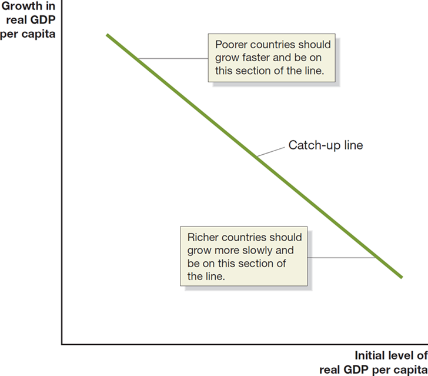{height=99%}

## Figure 11.7 There Has Been Catch-Up among High-Income Countries

Figure 11.7 There Has Been Catch-Up among High-Income Countries

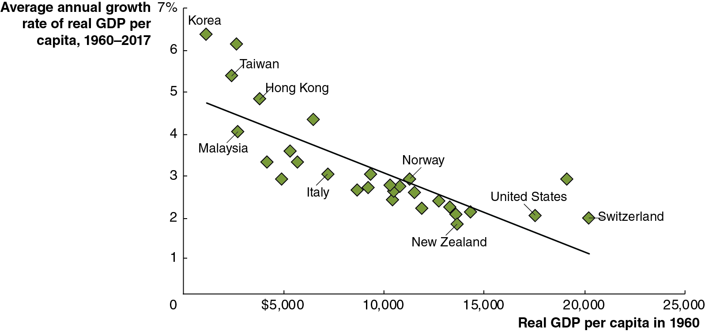{height=99%}

Examining high-income countries, we appear to see strong evidence of the catch-up hypothesis. + Countries that were richer in 1960, like the United States and Switzerland, experienced lower growth rates over the next decades than countries that were initially poorer, like Hong Kong and Korea.

## Figure 11.8 Many Countries Haven’t Been Catching Up

Figure 11.8 Many Countries Haven’t Been Catching Up

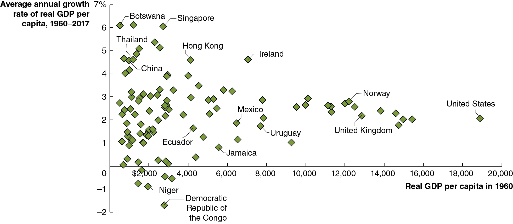{height=99%}

However, if we extend the set of countries to all countries for which statistics are available, our catch-up model appears to be worthless. + We need to address the failures of the catch-up model.

## Figure 11.9 Other High-Income Countries Have Stopped Catching up to the United States

Figure 11.9 Other High-Income Countries Have Stopped Catching up to the United States

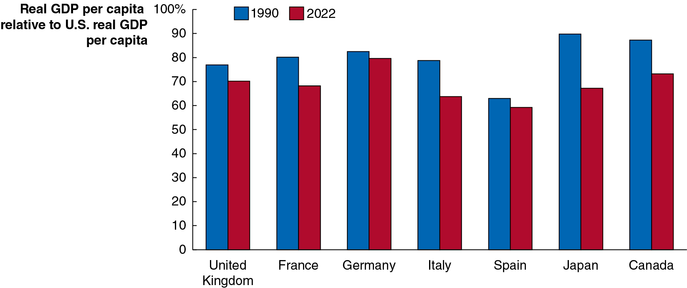{height=99%}

The blue bars show real G D P per capita in 1990 relative to the United States. + The red bars show real G D P per capita in 2022 relative to the United States. + In each case, the red bar is equal or lower; these countries are not catching up to the United States. Why?

## Why Are Other High-Income Countries Not Catching up to the U.S.? (1 of 2)

Why Are Other High-Income Countries Not Catching up to the U.S.? (1 of 2)

A combination of reasons explain this: + U.S. labor markets are relatively flexible; hiring and firing workers is relatively unrestricted by government regulation. + Similarly, U.S. workers tend to enter the work force sooner and retire later than do workers in Europe. + People in the United States are more willing to accept the effects of creative destruction + Historically, the United States has regulated businesses and interfered with market outcomes less than other countries. + As a result, new technologies are more likely to be adopted quickly in the United States, raising standards of living.

## Why Are Other High-Income Countries Not Catching up to the U.S.? (2 of 2)

Why Are Other High-Income Countries Not Catching up to the U.S.? (2 of 2)

A combination of reasons explain this: + The U.S. financial system is relatively efficient, and the high volume of trading ensures high liquidity, making the United States an attractive place to invest. + Small firms find obtaining capital relatively easy in the United States due to the advent of venture capital firms.

## Why Don’t More Low-Income Countries Experience Rapid Growth?

Why Don’t More Low-Income Countries Experience Rapid Growth?

Economists point to four key factors in explaining why many low-income countries are growing so slowly: + Weak institutions + Wars and revolutions + Poor public education and health + Low rates of saving and investment

We will address each of these over the following slides.

## Weak Institutions

Weak Institutions

The rule of law refers to the ability of a government to enforce the laws of the country, particularly with respect to protecting private property and enforcing contracts. + For entrepreneurs in a market economy to succeed, the government must guarantee property rights: The rights individuals or firms have to the exclusive use of their property, including the right to buy or sell it. + Otherwise, entrepreneurs will not risk starting a business.

Also important is an independent court system to enforce contracts.

## Apply the Concept: Why Hasn’t Mexico Grown as Fast as China?

Apply the Concept: Why Hasn’t Mexico Grown as Fast as China?

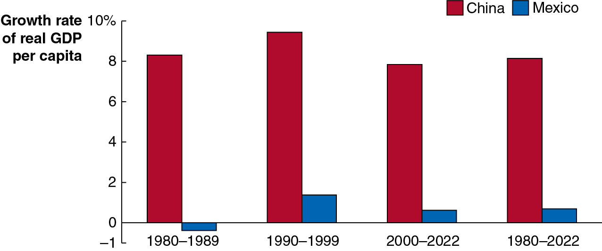{height=99%}

Turning away from central planning toward a market system unleashed economic growth in China. + On the other hand, Mexico still suffers from a corrupt government, weak rule of law, and a weak court system that discourages financial contracting. + Faster Chinese growth has now removed the gap between Mexican and Chinese real G D P.

## Other Reasons for Lack of Growth in Poor Countries

Other Reasons for Lack of Growth in Poor Countries

Wars and revolutions + Wars and revolutions make investment and technological growth difficult. + Example: Sri Lanka’s real G D P per capita was the same in 1991 that it was in 1969 due to a civil war between the government and the Tamil minority. + When it returned to peace, it experienced growth: 4.5 percent per year, from 2009 to 2019.

Poor public education and health + With weak public schools and poor health care, workers are less productive.

Low rates of saving and investment + Undeveloped and insecure financial systems create a “vicious cycle” of low savings and investment, preventing growth.

## The Benefits of Globalization (1 of 2)

The Benefits of Globalization (1 of 2)

In the Great Depression and World War

many low-

income countries were hurt by falling exports, but they took the wrong lesson, cutting themselves off from foreign trade and investment. + By the 1980s, many countries started to realize their mistake and started to reverse these policies. + This resulted in globalization, the process of countries becoming more open to foreign trade and investment. + Countries embracing globalization experienced much higher rates of growth than countries that didn’t.

## The Benefits of Globalization (2 of 2)

The Benefits of Globalization (2 of 2)

Globalization has allowed countries to exit the vicious cycle of low savings and investment through foreign investment: + Foreign direct investment (F D I): A firm’s purchasing or building of a facility in a foreign country. + Foreign portfolio investment: The purchase by an individual or a firm of stocks or bonds issued in another country. + Foreign investment can take the place of insufficient domestic investment, whether from private or government sources.

## 11.5 Growth Policies

11.5 Growth Policies

Discuss government policies that foster economic growth.

By now, we can summarize the types of policies that are essential to fostering economic growth: + Enhancing property rights and the rule of law

Working toward independent courts and eliminating corruption is important for encouraging growth. + Although the United States is relatively free from corruption today, in the 1800s this was not the case. Reform efforts were important in setting the stage for growth.

## Apply the Concept: Will China’s Standard of Living Exceed That of the United States? (1 of 2)

Apply the Concept: Will China’s Standard of Living Exceed That of the United States? (1 of 2)

If Chinese and U.S. growth rates continue, China’s standard of living would exceed that of the United States in 2042. + Will this really happen? Several factors suggest that it will not: + Much of Chinese growth is due to capital investment, which will have diminishing returns.

{height=99%}

## Apply the Concept: Will China’s Standard of Living Exceed That of the United States? (2 of 2)

Apply the Concept: Will China’s Standard of Living Exceed That of the United States? (2 of 2)

Some of Chinese growth is due to transition to a market economy. + China’s growth has depended on moving workers from low-productivity agriculture to higher-productivity manufacturing. + Aging Chinese population due to population control policies. + China remains largely autocratic, with lingering concerns about security of property rights and independent rule of law.

Growth in China is already showing signs of slowing: while it averaged 8.3 percent per year since 1990, it was only 5.8 percent per year from 2012–2022.

## Pro-Growth Policies

Pro-Growth Policies

Improving health and education

Health care and education have increasing returns for a country, with their benefits spilling over to other members of the country. + Improvements in these can help prevent brain drain, where highly educated and successful people leave developing countries to go to high-income countries. + Policies that promote technological change

Technological change is essential for growth—as we have seen, often more important than acquiring capital. + Low-income countries can encourage technological change by encouraging foreign direct investment.

## More Pro-Growth Policies

More Pro-Growth Policies

Policies that promote savings and investment

Eliminating corruption is important here, so that people know their assets won’t be seized. + Once this is done, governments can encourage savings and investment through tax incentives, like tax-advantaged savings plans, or investment tax credits.

## Apply the Concept: Is Sub-Saharan Africa on the Road to Economic Growth?

Apply the Concept: Is Sub-Saharan Africa on the Road to Economic Growth?

According to the World Bank, in 1990, 80 percent of the world’s poor lived in Asia. However, strong economic growth in India and Asia has reduced the poverty level. + Now 50 percent of the world's poor live in sub-Saharan Africa. In the past, most foreign direct investment in Africa was in extractive industries which did not lead to growth. + Recently, F D I has concentrated on manufacturing and services, an encouraging trend. But improved governance will be essential for obtaining catch-up growth, including political stability and the absence of violence.

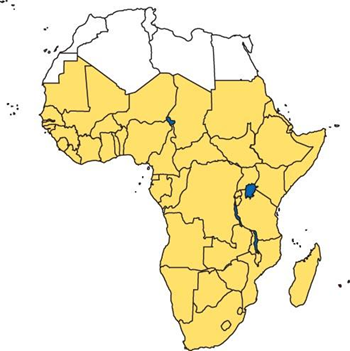{height=99%}

{height=99%}

## Is Economic Growth Good or Bad?

Is Economic Growth Good or Bad?

A central assumption of this chapter is that economic growth is beneficial for citizens. + This seems relatively clear for low-income countries, but some people maintain that further economic growth may not be desirable in high-income countries.

Arguments against growth might include: + Negative effects on the environment + Depletion of natural resources + Diminishment of distinctive cultures

Since many of these arguments are normative, economic analysis can contribute to the debate but cannot settle the issue.

## Copyright

Copyright

{height=99%}

This work is protected by United States copyright laws and is provided solely for the use of instructors in teaching their courses and assessing student learning. Dissemination or sale of any part of this work (including on the World Wide Web) will destroy the integrity of the work and is not permitted. The work and materials from it should never be made available to students except by instructors using the accompanying text in their classes. All recipients of this work are expected to abide by these restrictions and to honor the intended pedagogical purposes and the needs of other instructors who rely on these materials.

