## Macroeconomics

Macroeconomics

Ninth Edition

{height=99%}

Chapter 12

Aggregate Expenditure and Output in the Short Run

{height=99%}

Copyright © 2025, 2021, & 2018 Pearson Education, Inc. All Rights Reserved

## Chapter Outline

Chapter Outline

12.1 The Aggregate Expenditure Model + 12.2 Determining the Level of Aggregate Expenditure in the Economy + 12.3 Graphing Macroeconomic Equilibrium + 12.4 The Multiplier Effect + 12.5 The Aggregate Demand Curve + Appendix The Algebra of Macroeconomic Equilibrium

## Glamping and Airstream’s Ride on the Business Cycle

Glamping and Airstream’s Ride on the Business Cycle

Elkhart County, I N, experiences the ups and downs of the business cycle more than most. + More than 80 percent of U.S. R V s are manufactured there, and R V sales rise during economic expansions and fall sharply during recessions. + Unemployment in the county swung from 2.7 percent in March 2020 to 28.6 percent after the Covid-19 shutdown. + But with foreign travel unavailable, demand for R V s surged, before declining again with the high interest rates in 2023.

{height=99%}

## 12.1 The Aggregate Expenditure Model

12.1 The Aggregate Expenditure Model

Explain how macroeconomic equilibrium is determined in the aggregate expenditure model.

In this chapter, we will build up a simple mathematical model of the economy known as the aggregate expenditure model. + Aggregate expenditure model: A macroeconomic model that focuses on the short-run relationship between total spending and real G D P, assuming that the price level is constant. + This model will focus on short-run determination of total output in an economy.

## Four Components of Aggregate Expenditure

Four Components of Aggregate Expenditure	

The four components in our model will be the same four that we introduced previously as the components of G D P: + Consumption (C): Spending by households on goods and services + Planned investment (I): Planned spending by firms on capital goods and by households on new homes + Government purchases (G): Spending by all levels of government on goods and services + Net exports (N X): The value of exports minus the value of imports

Aggregate expenditure (A E) is total spending in the economy: the sum of consumption, planned investment, government purchases, and net exports.

## The Difference between Planned Investment and Actual Investment

The Difference between Planned Investment and Actual Investment

Our aggregate expenditure model uses planned investment, rather than actual investment; in this way, the definition of aggregate expenditures is slightly different from G D P. + The difference is that planned investment spending does not include the build-up of inventories: goods that have been produced but not yet sold:

Although the Bureau of Economic Analysis (B E A) measures actual investment, we will assume that their measurement is close enough to planned investment to use in our estimates of aggregate expenditures.

## Table 12.1 The Relationship Between Actual and Planned Investment

Table 12.1 The Relationship Between Actual and Planned Investment

For example, Doubleday Publishing may print 1.5 million copies of the latest John Grisham novel, expecting to sell them all. + If Doubleday does sell all 1.5 million, its inventories will be unchanged, but if it sells only 1.2 million, it will have an unplanned increase in inventories.

## Macroeconomic Equilibrium

Macroeconomic Equilibrium

Equilibrium in the economy occurs when spending on output is equal to the value of output produced; that is:

This should look “obvious”:

The difference is that in the first equation, I is planned investment, whereas in the second, I is actual investment. + So, macroeconomic equilibrium occurs when planned investment equals actual investment, that is, no unplanned change in inventories.

## Table 12.2 The Relationship between Aggregate Expenditure and G D P

Table 12.2 The Relationship between Aggregate Expenditure and G D P

Just like markets for a particular product may not be in equilibrium (quantity supplied may not equal quantity demanded at the current price), the economy may not be in equilibrium. + The table summarizes how the economy adjusts to macroeconomic equilibrium.

## 12.2 Determining the Level of Aggregate Expenditure in the Economy

12.2 Determining the Level of Aggregate Expenditure in the Economy

Discuss the determinants of the four components of aggregate expenditure and define marginal propensity to consume and marginal propensity to save.

Each of the components of aggregate expenditure plays a different role in the determination of equilibrium aggregate expenditure. + We will explore them in this section. + Throughout this chapter, all values are in real terms rather than nominal. + Values are in billions of 2017 dollars.

## Table 12.3 Components of Real Aggregate Expenditure, 2022

Table 12.3 Components of Real Aggregate Expenditure, 2022

The table shows the values of the components of expenditure in 2022. + Consumption is the largest portion, with investment and government expenditures being roughly similarly sized. + Net exports were negative in 2022; the value of U.S. imports was greater than the value of U.S. exports.

## Figure 12.1 Real Consumption, 1979–2023

Figure 12.1 Real Consumption, 1979–2023

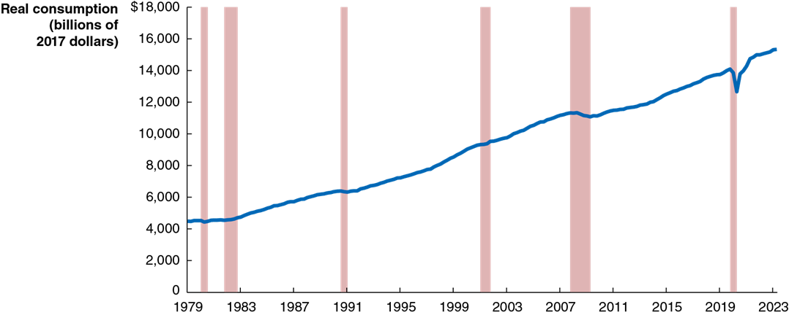{height=99%}

Consumption tends to follow a relatively smooth, upward trend; its growth declines during periods of recession. + What affects the level of consumption?

Current disposable income + Household wealth + Expected future income + The price level + The interest rate

## Determinants of Consumption (1 of 2)

Determinants of Consumption (1 of 2)

Current disposable income

Consumer expenditure is largely determined by how much money consumers receive in a given year:

  

Income expands most years; hence so does consumption.

Household wealth

A household’s wealth can be thought of as its assets (like homes, stocks and bonds, and bank accounts) minus its liabilities (mortgages, student loans, etc.). + Households with greater wealth spend more on consumption; an extra $1,000 in wealth will result in $40–$50 in extra annual consumption spending, holding constant the effect of income.

## Determinants of Consumption (2 of 2)

Determinants of Consumption (2 of 2)

Expected future income

Most people prefer to keep their consumption fairly stable from year to year even if their income fluctuates a lot from year to year. + So, consumption relates both to current and future income.

The price level

As prices rise, household wealth falls. Consequently, higher prices result in lower (real) consumption spending.

The interest rate

Higher real interest rates encourage saving rather than spending, so they result in lower spending, especially on durable goods.

## Figure 12.2 Real Consumption and Spending on Motor Vehicles and R Vs, 1985–2022

Figure 12.2 Real Consumption and Spending on Motor Vehicles and R Vs, 1985–2022

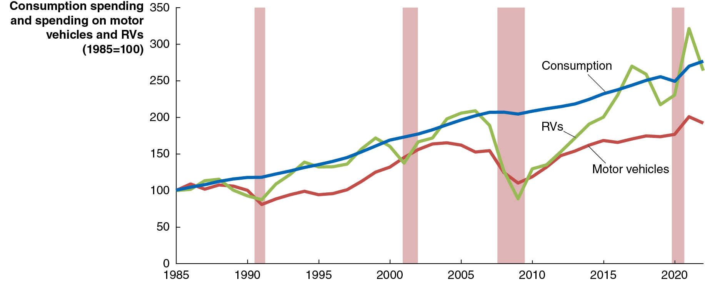{height=99%}

Household spending on all consumption goods is less volatile than spending on consumer durables like motor vehicles (cars and trucks) or recreational vehicles (R V s). + The consumption of other consumer durables behaves similarly.

## The Volatility of Consumer Spending on Durables

The Volatility of Consumer Spending on Durables

Why is spending on durable goods like cars and R Vs so volatile? + Durable goods are long-lived—households can postpone buying them when incomes are down. + Good substitutes exist—like used cars/R Vs. + High prices make them risky purchases—in times of uncertainty, the risk of not being able to pay back loans is important for consumers. + Pent-up demand typically follows a recession—purchases postponed during a recession will eventually be made. + Interest rates fluctuate—rising late in an expansion (discouraging large purchases) and falling during and after a recession (encouraging those purchases).

## Figure 12.3 The Relationship between Consumption and Income, 1980–2022

Figure 12.3 The Relationship between Consumption and Income, 1980–2022

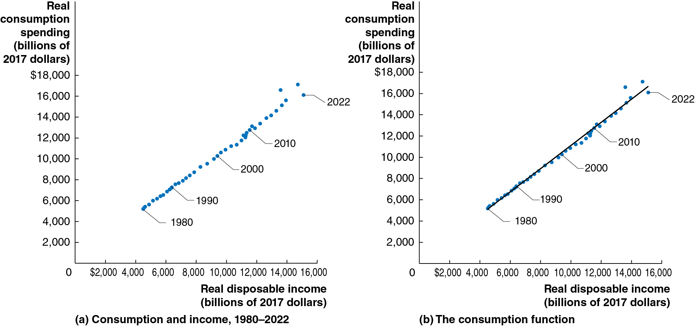{height=99%}

The relationship between consumption and income is very strong. A straight line describes this consumption function very well: households spend a consistent fraction of each extra dollar on consumption. + Consumption function: the relationship between consumption spending and disposable income.

## Marginal Propensity to Consume

Marginal Propensity to Consume

The graphs showed that consumers seem to have a relatively constant marginal propensity to consume. + Marginal propensity to consume (M P C): The slope of the consumption function: the amount by which consumption spending changes when disposable income changes. + The marginal propensity to consume is the slope of the consumption function.

## Estimating the M P C

Estimating the M P C

We can estimate the M P C by estimating the slope of the consumption function:

From 2017 to 2018, consumption increased by $364 billion, while disposable income increased by $530 billion:

We can use this to tell us the change in consumption to expect from a given change in income, say $10 billion:

## Consumption and National Income

Consumption and National Income

The distinction between national income and G D P is relatively minor; for this simple model, we will assume they are equal and use the terms interchangeably. Since:

where “net taxes” are equal to taxes minus transfer payments, we can write:

If we assume that net taxes do not change as national income changes, we have the result that any change in disposable income is the same as the change in national income. + We will use this in the graph on the next slide.

## Figure 12.4 The Relationship between Consumption and National Income

Figure 12.4 The Relationship between Consumption and National Income

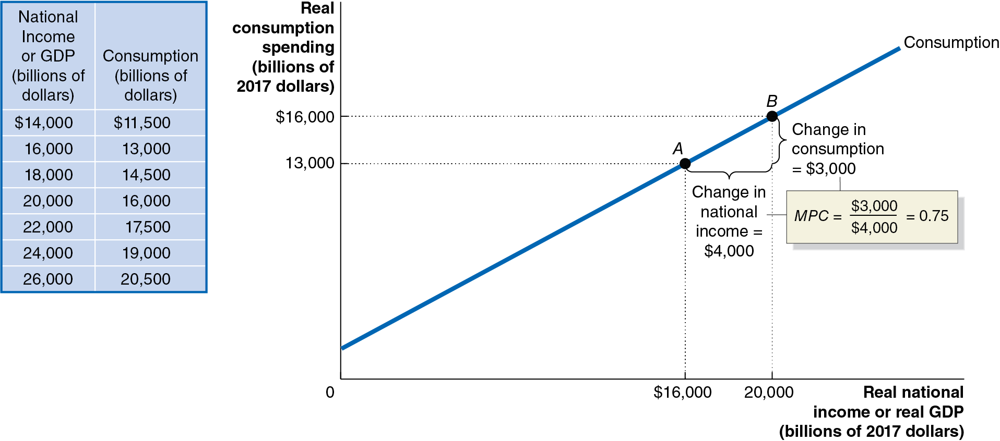{height=99%}

The table shows the relationship between consumption and national income for an economy, keeping net taxes constant. + As national income rises by $4,000 billion, consumption rises by $3,000 billion. + So, the marginal propensity to consume for this economy is:

## Income, Consumption, and Saving

Income, Consumption, and Saving

By definition, disposable income not spent is saved. Therefore

Any change in national income can be decomposed into changes in the items on the right side:

We assume net taxes do not change, so

then

Dividing through by

gives:

## Marginal Propensity to Save

Marginal Propensity to Save

is the amount by which savings changes, when (disposable)

income changes. This is known as the marginal propensity to save. We can rewrite the equation above as:

That is, the marginal propensity to consume plus the marginal propensity to save must equal 1. + Part of any increase in income is consumed, and the rest is saved.

## Figure 12.5 Real Investment, 1979-2022

Figure 12.5 Real Investment, 1979-2022

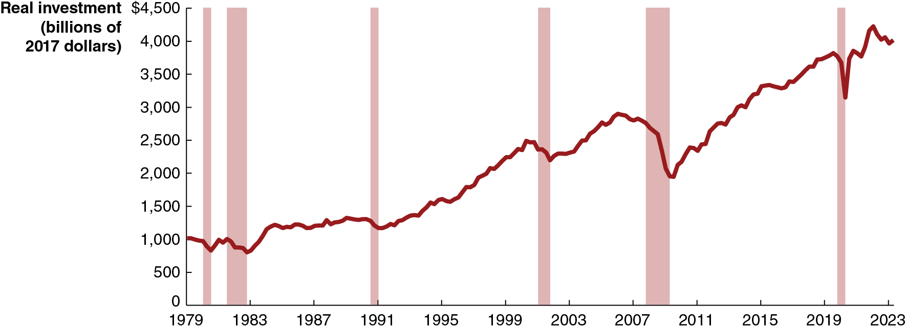{height=99%}

Investment has increased over time; but unlike consumption, it has not increased smoothly, and recessions decrease investment more. + What affects the level of investment?

Expectations of future profitability + The interest rate + Taxes + Cash flow

## Determinants of Planned Investment (1 of 2)

Determinants of Planned Investment (1 of 2)

Expectations of future profitability

Investment goods, such as factories, office buildings, machinery, and equipment, are long-lived. Firms build more of them when they are optimistic about future profitability. + Purchases of new housing are included in planned investment. In recessions, households have reduced wealth and therefore less incentive to invest in new housing.

The interest rate

Since business investment is sometimes financed by borrowing, the real interest rate is an important consideration for investing. + Higher real interest rates result in less investment spending, and lower real interest rates result in more investment spending.

## Determinants of Planned Investment (2 of 2)

Determinants of Planned Investment (2 of 2)

Taxes

Higher corporate income taxes on profits decrease the money available for reinvestment and decrease incentives to invest by diminishing the expected profitability of investment. + Similarly, investment tax incentives tend to increase investment.

Cash flow

Firms often pay for investments out of their own cash flow, the difference between the cash revenues received by a firm and the cash spending by the firm. + The largest contributor to cash flow is profit. During recessions, profits fall for most firms, decreasing their ability to finance investment.

## Apply the Concept: Young Buyers Help Boost the Housing Market (1 of 3)

Apply the Concept: Young Buyers Help Boost the Housing Market (1 of 3)

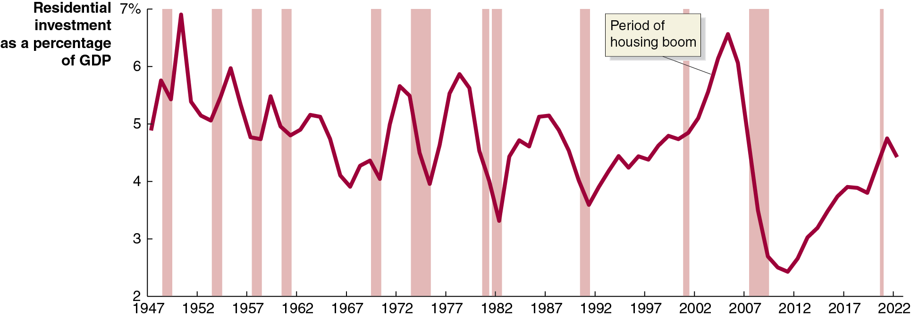{height=99%}

For the period of the economic expansion between 2010 and 2019, residential investment averaged only a little over 3 percent of G D P. + One cause was low home ownership by millennials, caused by factors like high student loan debt, delays in family formation, choosing to live in large cities with high real estate costs, and the slow labor market recovery after the Great Recession.

## Apply the Concept: Young Buyers Help Boost the Housing Market (2 of 3)

Apply the Concept: Young Buyers Help Boost the Housing Market (2 of 3)

{height=99%}

As the 2020s began, things started to change: the labor market had recovered, and student loan payments had been paused due to the Covid-19 pandemic. Additionally, the rise of remote work increased the desirability of making a permanent home. + In 2023, for the first time, more millennials owned homes than rented them, and homebuying by Generation Z was also increasing.

## Apply the Concept: Young Buyers Help Boost the Housing Market (3 of 3)

Apply the Concept: Young Buyers Help Boost the Housing Market (3 of 3)

{height=99%}

However since the second half of 2022, home buying had decreased due to sharp increases in mortgage interest rates. Several questions remain, including: + Will mortgage interest rates stay high, or return to 2010s levels? + If student loan repayments return to “normal,” will younger borrowers have greater difficulty buying homes?

## Figure 12.6 Real Government Purchases, 1979–2023

Figure 12.6 Real Government Purchases, 1979–2023

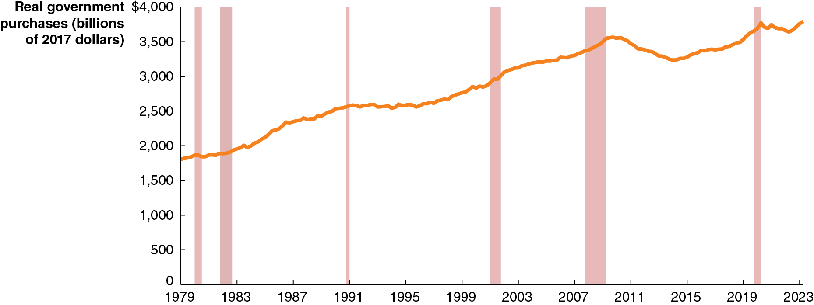{height=99%}

Real government purchases include purchases at all levels of government: federal, state, and local. + Not transfer payments; only purchases for which the government receives some good or service.

Government purchases have generally, though not consistently, increased over time; exceptions include the early 19 90s (end of the Cold War) and after the recession of 2007–2009.

## Figure 12.7 Real Net Exports, 1979–2023

Figure 12.7 Real Net Exports, 1979–2023

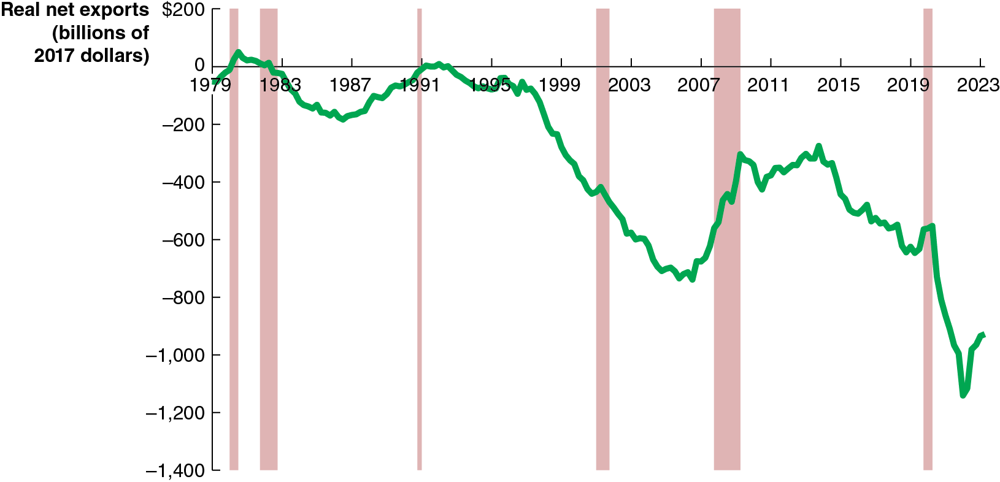{height=99%}

Net exports equals exports minus imports; it is affected by: + Price level in United States versus. the price level in other countries + U.S. growth rate versus. growth rate in other countries + U.S. dollar exchange rate

U.S. net exports have been negative for the last few decades. The value typically becomes higher (less negative) during a recession, as spending on imports falls.

## Determinants of Net Exports

Determinants of Net Exports

## Apply the Concept: The iPhone Is Made in China… or Is It?

Apply the Concept: The iPhone Is Made in China… or Is It?

When an iPhone is shipped from China to the United States, G D P

statistics register a

import from China to the United States. + But iPhones are only assembled in China; no Chinese firm makes any of the iPhone’s components. + Only 4 percent of the value of the iPhone should be attributed to the assembly, according to one study.

Pascal Lamy of the W T O: “The concept of country of origin for manufactured goods has gradually become obsolete.”

{height=99%}

## 12.3 Graphing Macroeconomic Equilibrium

12.3 Graphing Macroeconomic Equilibrium

Use a

-line diagram to illustrate macroeconomic equilibrium.

Suppose in the whole economy there is a single product: Pepsi. + For the Pepsi economy to be in equilibrium, the amount of Pepsi produced must equal the amount of Pepsi sold. + Otherwise, inventories of Pepsi rise or fall.

## Figure 12.8 An Example of a 45 degrees       -Line Diagram

Figure 12.8 An Example of a 45 degrees       -Line Diagram

Any point on the

line could be

an equilibrium—like points A or B.

At point C, the economy’s inventories of Pepsi are being depleted, and production must rise to restore equilibrium. + At point D, inventories of Pepsi are growing, so production must fall.

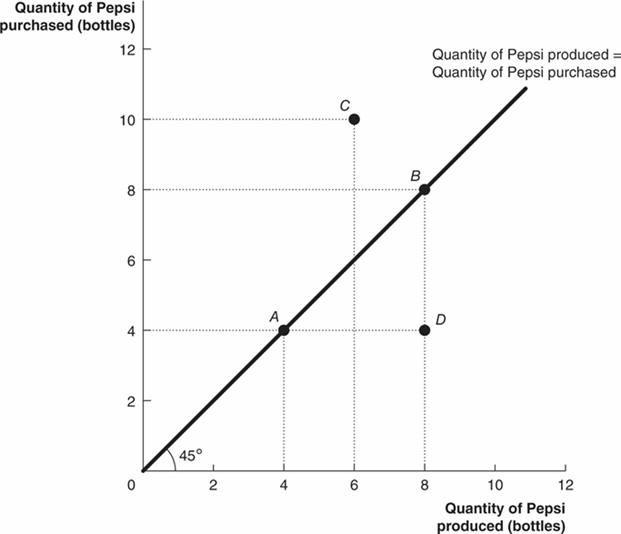{height=99%}

## Figure 12.9 The Relationship between Planned Aggregate Expenditure and G D P on a 45 degrees     -Line Diagram

Figure 12.9 The Relationship between Planned Aggregate Expenditure and G D P on a 45 degrees     -Line Diagram

We can apply this model to a real economy, with real national income (G D P) on the x-axis and real aggregate expenditure on the y-axis. + This model is also known as the Keynesian cross.

Only points on the

line

can be a macroeconomic equilibrium, with planned aggregate expenditure equal to G D P.

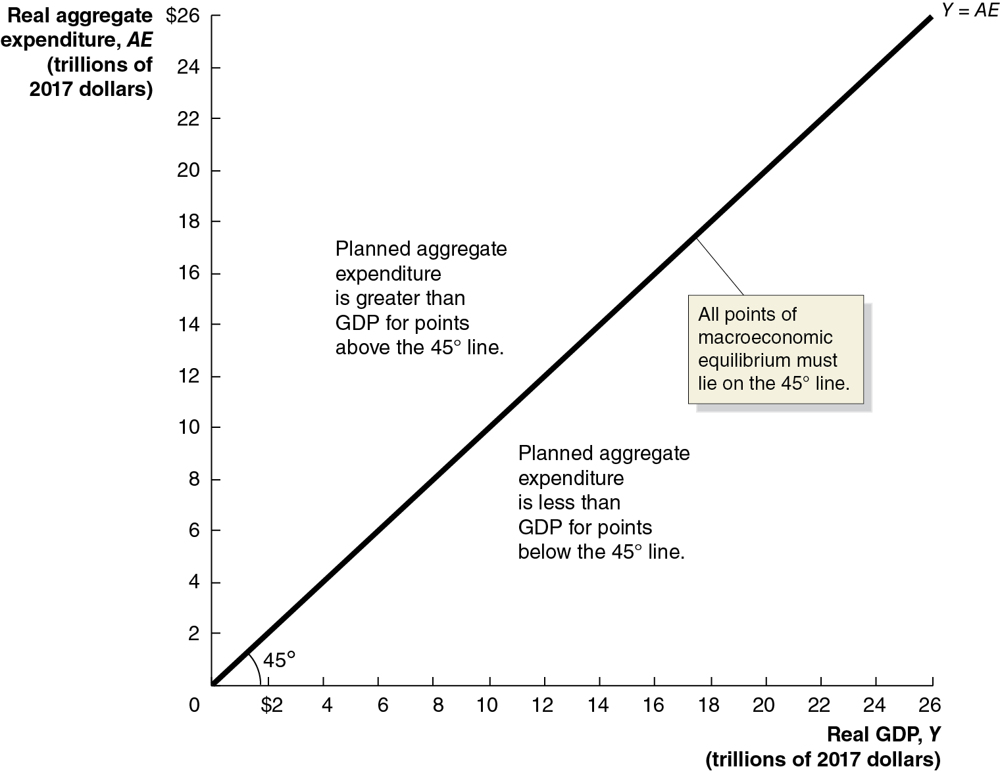{height=99%}

## Determining the Macroeconomic Equilibrium

Determining the Macroeconomic Equilibrium

Any point on the

-line could be an equilibrium, but how do we know

which one will be the equilibrium in a given year?

To determine this, recall that when they receive additional income, households consume some of it and save some of it. + The resulting consumption function tells us how much consumers will spend (real expenditure) when they have a particular income (real G D P).

This will determine Consumption (C) in the equation

Macroeconomic equilibrium simply means the left side (real G D P) must equal the right side (planned aggregate expenditure).

The trick is to find the “right” level of C. For that, we use the

line diagram.

## Figure 12.10 Macroeconomic Equilibrium on the 45 degrees      -Line Diagram (1 of 3)

Figure 12.10 Macroeconomic Equilibrium on the 45 degrees      -Line Diagram (1 of 3)

We start by placing the consumption function on the diagram. + If there was no other expenditure in the economy, then the macroeconomic equilibrium would be where the consumption

function crossed the

line; there, income (G D P) equals expenditure.

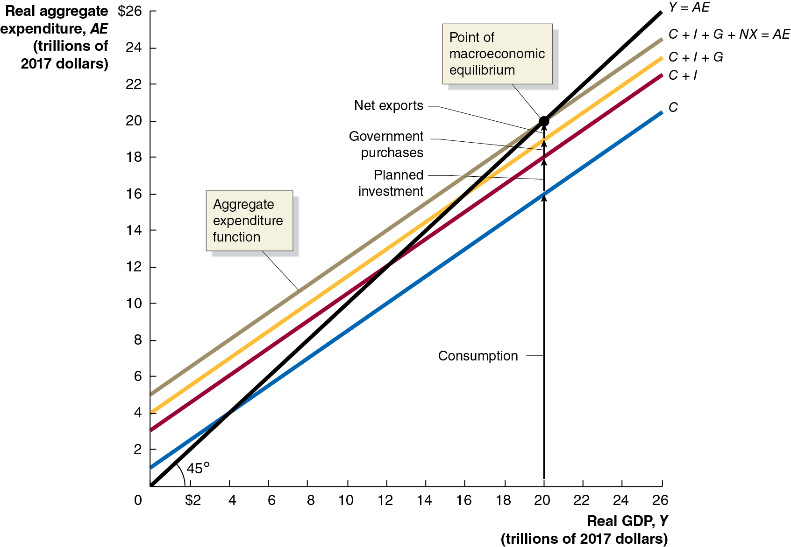{height=99%}

## Figure 12.10 Macroeconomic Equilibrium on the 45 degrees      -Line Diagram (2 of 3)

Figure 12.10 Macroeconomic Equilibrium on the 45 degrees      -Line Diagram (2 of 3)

But there are other expenditures. We will assume they are not affected by income, that they are predetermined. + Then we add the other expenditures: planned investment, government purchases, and net exports. + These are vertical shifts in real expenditure because their values do not depend on real G D P.

{height=99%}

## Figure 12.10 Macroeconomic Equilibrium on the 45 degrees      -Line Diagram (3 of 3)

Figure 12.10 Macroeconomic Equilibrium on the 45 degrees      -Line Diagram (3 of 3)

At last, we have macroeconomic equilibrium: the point at which + Income equals expenditure, that is,

The level of consumption is consistent with the level of income, according to the consumption function.

We call this top-most line the aggregate expenditure function.

{height=99%}

## Figure 12.11 Macroeconomic Equilibrium

Figure 12.11 Macroeconomic Equilibrium

In this economy, macroeconomic equilibrium occurs at $20 trillion. + What if real G D P were lower, say $16 trillion? + Aggregate expenditure would be higher than G D P, so inventories would fall. + This would signal firms to increase production, increasing G D P.

The reverse would occur if real G D P were above $20 trillion.

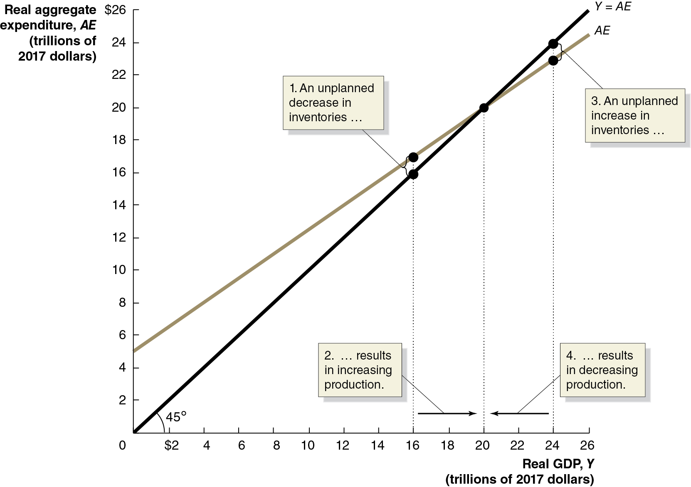{height=99%}

## Figure 12.12 Showing a Recession on the

Figure 12.12 Showing a Recession on the45 degrees      -Line Diagram

Macroeconomic equilibrium can

occur anywhere on the

line. Ideally, we would like it to occur at the level of potential G D P. + If equilibrium occurs at this level, unemployment will be low—at the natural rate of unemployment or the full employment level. + But this might not occur; maybe firms are pessimistic and reduce investment spending. + Then the equilibrium will occur below potential G D P—a recession.

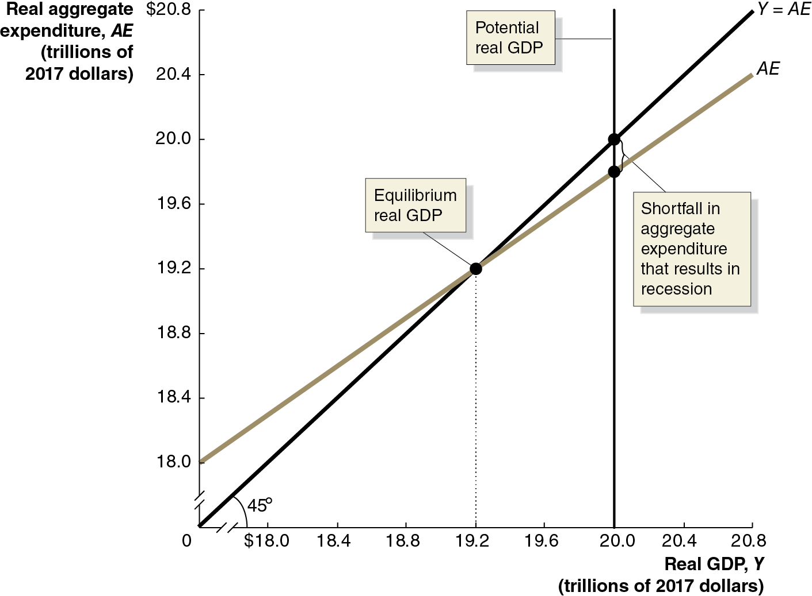{height=99%}

## The Important Role of Inventories

The Important Role of Inventories

Inventories play a critical role in this model of the economy. + When planned aggregate expenditure is less than real G D P, firms will experience unplanned increases in inventories. + Then even if spending returns to normal levels, firms have excess inventories to sell, and they will do this instead of increasing production to normal levels.

Example: In 2009, the Great Recession was about to end. But real + G D P fell sharply in the first quarter of 2009—at a 4.5 percent annualized rate. + Economists estimate that almost half of this decline was due to firms cutting production as they sold off their unintended accumulation of inventories.

## Table 12.4 Macroeconomic Equilibrium

Table 12.4 Macroeconomic Equilibrium

The table shows several hypothetical combinations of real G D P and planned aggregate expenditure. + As real G D P changes, consumption changes but planned investment, government purchases, and net exports stay constant. + Macroeconomic equilibrium can occur only at $20,000 billion; otherwise, the unplanned change in inventories will cause firms to change production and hence real G D P will change.

## 12.4 The Multiplier Effect

12.4 The Multiplier Effect

Describe the multiplier effect and use the multiplier formula to calculate changes in equilibrium G D P.

You may have noticed that a small change in planned aggregate expenditure causes a larger change in equilibrium real G D P. + In our model, planned investment, government purchases, and net exports are autonomous expenditures: expenditures that do not depend on the level of G D P. + But, consumption has both an autonomous and induced effect. + So, its level does depend on the level of G D P, and this produces the upward-sloping A E line.

## Figure 12.13 The Multiplier Effect

Figure 12.13 The Multiplier Effect

An increase in an autonomous expenditure shifts the aggregate expenditure line upward. + When this happens, real + G D P increases by more than the change in autonomous expenditures; this is the multiplier effect. + The change in equilibrium real G D P divided by the change in autonomous expenditures is the multiplier.

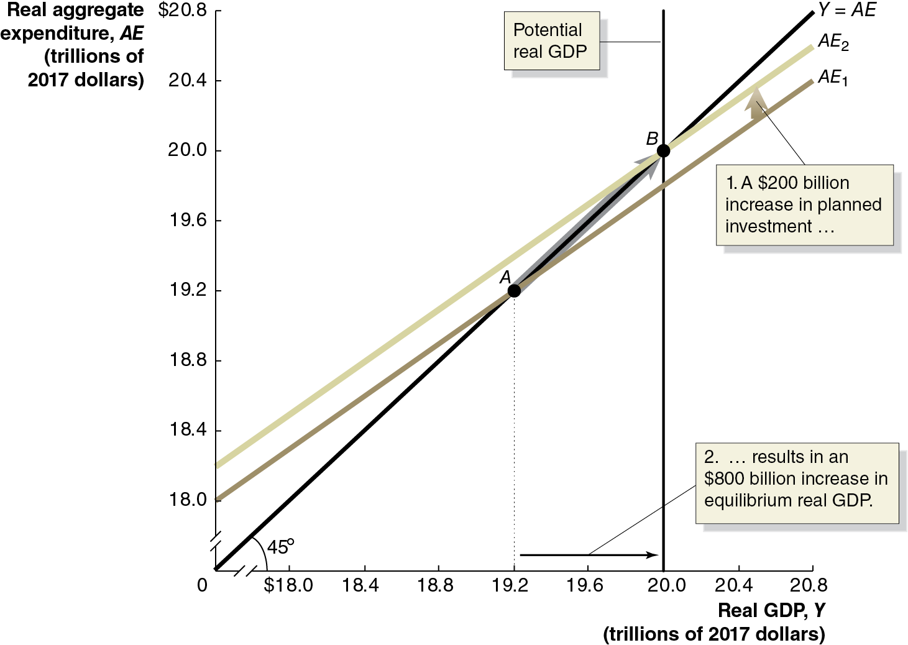{height=99%}

## Table 12.5 The Multiplier Effect in Action

Table 12.5 The Multiplier Effect in Action

Initially, real G D P rises by the amount of the increase in autonomous expenditure. + This causes an increase in real G D P, which causes an increase in production, which causes an increase in real G D P, and so on.

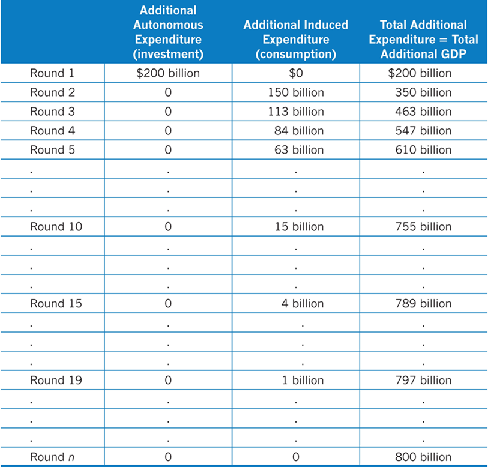{height=99%}

## Eventual Effect of the Multiplier

Eventual Effect of the Multiplier

We cannot say how long this adjustment to macroeconomic equilibrium will take—how many “rounds,” back and forth. + But we can calculate the value of the multiplier, as the eventual change in real G D P divided by the change in autonomous expenditures (planned investment, in this case):

With a multiplier of 4, each $1 increase in planned investment (or any other autonomous expenditure) eventually increases equilibrium real G D P by $4.

## Apply the Concept: The Multiplier in Reverse: the Great Depression (1 of 2)

Apply the Concept: The Multiplier in Reverse: the Great Depression (1 of 2)

The multiplier can work in reverse too, like it did during the Great Depression of the 1930s. + Several events, including the stock market crash of October 1929, led to reductions in investments by firms. + Real G D P fell, so consumers cut back on spending, prompting firms to reduce production more, so consumers spent even less….

{height=99%}

## Apply the Concept: The Multiplier in Reverse: the Great Depression (2 of 2)

Apply the Concept: The Multiplier in Reverse: the Great Depression (2 of 2)

The

-line diagram can help

to illustrate this process.

Aggregate expenditures fell initially, due to the decrease in investment. + This prompted a multiplied effect on equilibrium real G D P.

Recovery from the Great Depression took many years; unemployment remained above 10 percent until

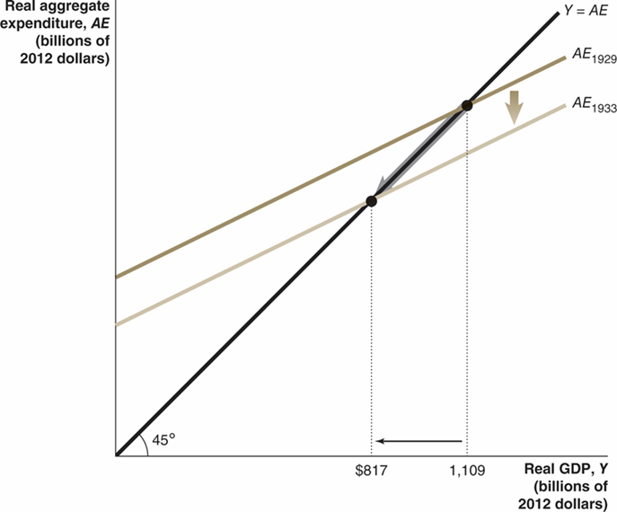{height=99%}

## The Multiplier and the Marginal Propensity to Consume

The Multiplier and the Marginal Propensity to Consume

How can we know the eventual value of the multiplier? + In each “round,” the additional income prompts households to consume some fraction (the marginal propensity to consume). + The total change in equilibrium real G D P equals:

The initial increase in planned investment spending

Plus the first induced increase in consumption

Plus the second induced increase in consumption

Plus the third induced increase in consumption

And so on…

## A Formula for the Multiplier

A Formula for the Multiplier

This becomes the infinite sum: + Total change in G D P

In our case, M P C = 0.75, so the multiplier is

A $200 billion increase in investment eventually results in a $800 billion increase in equilibrium real G D P.

The general formula for the multiplier is

## Summarizing the Multiplier Effect

Summarizing the Multiplier Effect

The multiplier effect occurs both for an increase and a decrease in planned aggregate expenditure. + Because the multiplier is greater than 1, the economy is sensitive to changes in autonomous expenditure. + The larger the M P C, the larger the value of the multiplier. + Our model is somewhat simplified, omitting some real-world complications. For example, as real G D P changes, imports, inflation, interest rates, and income taxes will change.

The last point generally means that the value we estimate for the multiplier, from the M P C, is too high. In Chapter 23, we will address some of these shortcomings.

## The Paradox of Thrift

The Paradox of Thrift

Recall the savings identity: savings equals investment. + This implied that savings were the key to long-term growth.

In the short term, if people save more, then consumption decreases, and hence incomes decrease, so consumption decreases… potentially pushing the economy into recession. + John Maynard Keynes referred to this as the paradox of thrift: what appears to be favorable in the long run may be counterproductive in the short run.

Economists debate whether this paradox of thrift really exists; increasing savings decreases the real interest rate; the consequent increase in investment spending may offset the decrease in consumption spending. + We cannot settle this with our simple model.

## 12.5 The Aggregate Demand Curve

12.5 The Aggregate Demand Curve

Understand the relationship between the aggregate demand curve and aggregate expenditure.

As demand for a product rises, we expect that two things will occur: production will increase and so will the product’s price. + Our model has concentrated on the first of these, but what about price changes?

In the larger economy, we also expect that an increase in aggregate expenditure would increase the price level. + Will this price level change have a feedback effect on aggregate expenditures? + We generally expect that it will: increases in the price level will cause aggregate expenditure to fall; and decreases in the price level will cause aggregate expenditures to rise.

## How Does the Price Level Affect Aggregate Expenditures?

How Does the Price Level Affect Aggregate Expenditures?

The price level affects aggregate expenditures in three ways: + Rising price levels decrease the real value of household wealth, causing consumption to fall. + If price levels rise in the United States faster than in other countries, U.S. exports fall and imports rise, causing net exports to fall. + When prices rise, firms and households need more money to finance buying and selling. If the supply of money doesn’t change, the interest rate must rise; this will cause investment spending to fall.

Of course, these effects work in reverse if the price level falls. + Each effect works in the same direction, so rising price levels decrease aggregate expenditures, while falling price levels increase aggregate expenditures.

## Figure 12.14 The Effect of a Change in the Price Level on Real G D P

Figure 12.14 The Effect of a Change in the Price Level on Real G D P

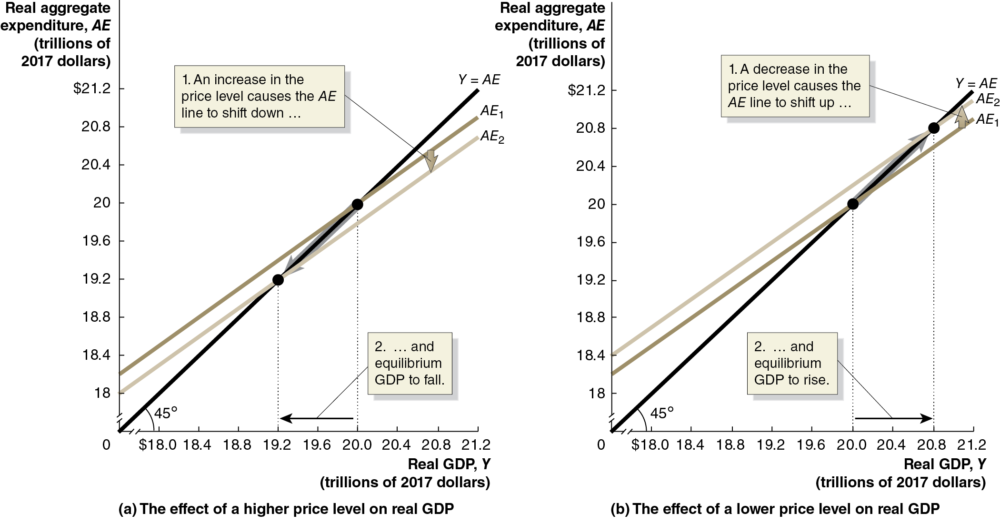{height=99%}

The diagrams show the effects described on the previous slide: + Panel (a):  Increases in the price level cause A E and real G D P to fall. + Panel (b):  Decreases in the price level cause A E and real G D P to rise.

## Figure 12.15 The Aggregate Demand Curve

Figure 12.15 The Aggregate Demand Curve

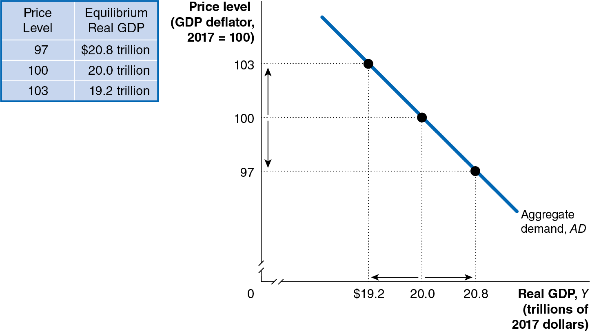{height=99%}

Consequently, there is an inverse relationship between the price level and real G D P. + This relationship is known as the aggregate demand curve. + Aggregate demand (A D) curve: A curve that shows the relationship between the price level and quantity of real G D P demanded by households, firms, and the government (both inside and outside the country).

## Appendix: The Algebra of Macroeconomic Equilibrium

Appendix: The Algebra of Macroeconomic Equilibrium

Apply the algebra of macroeconomic equilibrium.

Graphical analysis of macroeconomic equilibrium can tell us the qualitative changes that take place. + But an equation-based model can allow us to make quantitative or numerical estimates of what will occur.

Economists in universities, firms, and the government rely on econometric models in which they statistically estimate the relationships between economic variables.

## Aggregate Expenditure Equations

Aggregate Expenditure Equations

Based on the example in the text, we can generate the following equations (changing the M P C so as to generate different results):

Consumption function:

Planned Investment function:

Government purchases function:

Net export function:

Equilibrium condition

In using the model, researchers would estimate the parameters of the model—such as the M P C or the values of the autonomous expenditure components like planned investment—using statistical methods and years of observations of data.

## Solving the Model

Solving the Model

The first four equations can be used to form the aggregate expenditure function—the right-hand side of the fifth equation. + The fifth equation is the essential “equilibrium condition,” representing

the effect of the

line.

Substituting the first four equations into the fifth gives:

Subtracting 0.65Y from both sides gives:

Which simplifies to:

## General Aggregate Expenditure Equations

General Aggregate Expenditure Equations

More generally, we could allow the parameters of the model to be represented by letters:

Consumption function:

Planned Investment function:

Government purchases function:

Net export function:

Equilibrium condition:

The letters with bars over them are parameters—fixed (autonomous) values.

## Solving the General Aggregate Expenditure Equations

Solving the General Aggregate Expenditure Equations

Solving now for equilibrium, we get:

The last equation makes clear that:

## Copyright

Copyright

{height=99%}

This work is protected by United States copyright laws and is provided solely for the use of instructors in teaching their courses and assessing student learning. Dissemination or sale of any part of this work (including on the World Wide Web) will destroy the integrity of the work and is not permitted. The work and materials from it should never be made available to students except by instructors using the accompanying text in their classes. All recipients of this work are expected to abide by these restrictions and to honor the intended pedagogical purposes and the needs of other instructors who rely on these materials.

