## Macroeconomics

Macroeconomics

Ninth Edition

{height=99%}

Chapter 13

Aggregate Demand and Aggregate Supply Analysis

{height=99%}

Copyright © 2025, 2021, & 2018 Pearson Education, Inc. All Rights Reserved

## Chapter Outline

Chapter Outline

13.1 Aggregate Demand + 13.2 Aggregate Supply + 13.3 Macroeconomic Equilibrium in the Long Run and the Short Run + 13.4 A Dynamic Aggregate Demand and Aggregate Supply Model + Appendix Macroeconomic Schools of Thought

## A M C and D. R. Horton Switch Places

A M C and D. R. Horton Switch Places

If the U.S. economy was about to enter a recession, would you prefer to work for movie chain A M C or home builder D. R. Horton? + In normal recessions, A M C would win out. However, in the Covid-19 recession spending on services declined by 3 percent while residential construction increased 21 percent, spurred on by record low interest rates and stimulus checks. + A M C was hit hard by social distancing rules and forced closures while D. R. Horton’s revenues increased.

{height=99%}

## 13.1 Aggregate Demand

13.1 Aggregate Demand

Identify the determinants of aggregate demand and distinguish between a movement along the aggregate demand curve and a shift of the curve.

Real G D P has four components: + Consumption (C) + Investment (I) + Government purchases (G) + Net exports (N X)

Adding these gives real G D P:

Government purchases are generally determined by the decisions of policymakers and are independent of changes in the price level. + However, consumption, investment, and net exports are affected by changes in the price level. We will examine each in turn.

## Aggregate Demand and Aggregate Supply Model

Aggregate Demand and Aggregate Supply Model

We have now modeled long-run economic growth and also how real G D P is determined in the short run. + New goal: extend the model of the economy in the short run in order to explain why the following fluctuate: + Real G D P + Employment + The price level

New model: Aggregate demand and aggregate supply model, a model that explains short-run fluctuations in real G D P and the price level.

## Figure 13.1 Aggregate Demand and Aggregate Supply (1 of 3)

Figure 13.1 Aggregate Demand and Aggregate Supply (1 of 3)

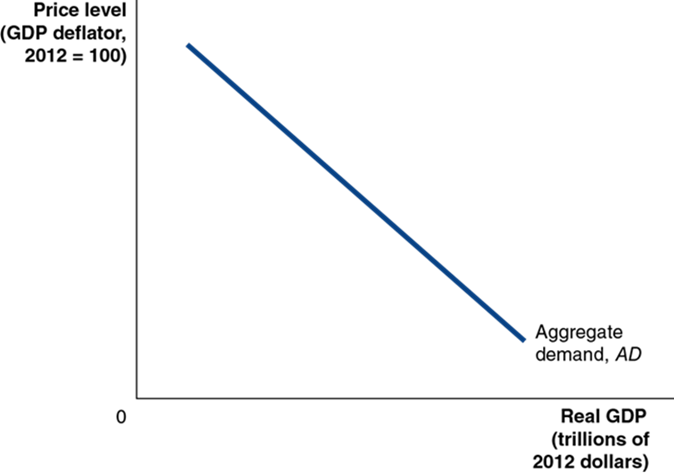{height=99%}

In the short run, real G D P and the price level are determined by the intersection of the aggregate demand curve. . . + Aggregate demand (A D) curve: A curve that shows the relationship between the price level and the quantity of real G D P demanded by households, firms, and the government (both inside and outside of the country).

## Figure 13.1 Aggregate Demand and Aggregate Supply (2 of 3)

Figure 13.1 Aggregate Demand and Aggregate Supply (2 of 3)

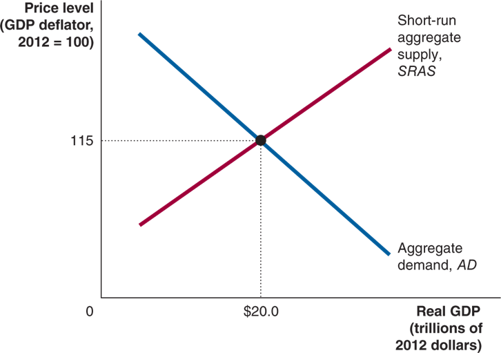{height=99%}

…and the short-run aggregate supply curve. + Short-run aggregate supply (S R A S) curve: A curve that shows the relationship in the short run between the price level and the quantity of real G D P supplied by firms.

## The Wealth Effect: How a Change in the Price Level Affects Consumption

The Wealth Effect: How a Change in the Price Level Affects Consumption

Household consumption is most strongly determined by income, but it is also affected by wealth. + Some household wealth is held in nominal assets, so as price levels rise, the real value of household wealth declines. This results in less consumption. + Implication: higher price level leads to lower consumption.

## The Interest-Rate Effect: How a Change in the Price Level Affects Investment

The Interest-Rate Effect: How a Change in the Price Level Affects Investment

When prices rise, households and firms need more money to finance buying and selling. + So, households and firms borrow and withdraw funds from banks and sell financial assets such as bonds in order to have more funds available. + This increase in demand for money causes the “price” of holding money (the interest rate) to rise, discouraging firm investment. + Implication: higher price level leads to lower investment.

## The International-Trade Effect: How a Change in the Price Level Affects Net Exports

The International-Trade Effect: How a Change in the Price Level Affects Net Exports

When U.S. price levels rise, U.S. exports become more expensive and imports become relatively cheaper. + Fewer exports and more imports mean net exports falls. + Implication: higher price level leads to lower net exports.

## Figure 13.1 Aggregate Demand and Aggregate Supply (3 of 3)

Figure 13.1 Aggregate Demand and Aggregate Supply (3 of 3)

{height=99%}

Each of the three effects show higher price levels leading to lower values of components of real G D P. + This establishes that the aggregate demand curve slopes downward.

## Shifts of the Aggregate Demand Curve versus Movements along It

Shifts of the Aggregate Demand Curve versus Movements along It

The aggregate demand curve shows the relationship between the price level and real G D P demanded, holding everything else constant. + A movement along the A D curve will occur when the price level changes, and the change in prices is not caused by a component of real G D P changing. + A shift of the A D curve will occur when some component of real G D P changes; for example, a change in government purchases.

## Table 13.1 Variables That Shift the Aggregate Demand Curve (1 of 4)

Table 13.1 Variables That Shift the Aggregate Demand Curve (1 of 4)

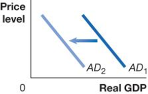{height=99%}

A government policy change could shift aggregate demand. There are two categories of government policies here: + Monetary policy: The actions the Federal Reserve takes to manage the money supply and interest rates to pursue macroeconomic policy objectives.

If the Federal Reserve causes interest rates to rise, investment spending will fall; if it causes interest rates to fall, investment spending will rise.

## Table 13.1 Variables That Shift the Aggregate Demand Curve (2 of 4)

Table 13.1 Variables That Shift the Aggregate Demand Curve (2 of 4)

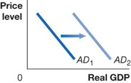{height=99%}

{height=99%}

Fiscal policy: Changes in federal taxes and purchases that are intended to achieve macroeconomic policy objectives.

Increasing or decreasing personal income taxes affects disposable income and hence consumption. The government can also alter its level of government purchases. It could also alter business taxes, affecting the level of investment spending.

## Table 13.1 Variables That Shift the Aggregate Demand Curve (3 of 4)

Table 13.1 Variables That Shift the Aggregate Demand Curve (3 of 4)

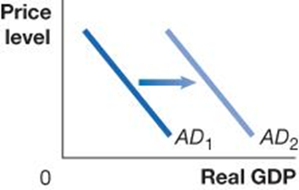{height=99%}

{height=99%}

Households or firms could become more optimistic about the future, increasing consumption or investment, respectively. + Of course, the opposite could also occur.

## Table 13.1 Variables That Shift the Aggregate Demand Curve (4 of 4)

Table 13.1 Variables That Shift the Aggregate Demand Curve (4 of 4)

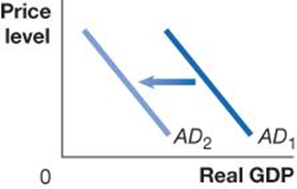{height=99%}

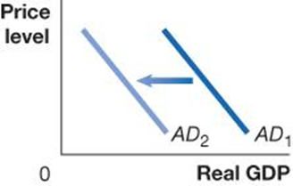{height=99%}

If foreign incomes rise more slowly than ours, their imports of our goods fall; if ours rise more slowly, our imports fall. + If our exchange rate (the value of the $U S) rises, our exports become more expensive, so foreigners buy less of them (and we buy more imports, also).

## Apply the Concept: Which Components of Aggregate Demand Changed the Most during the 2020 Recession? (1 of 3)

Apply the Concept: Which Components of Aggregate Demand Changed the Most during the 2020 Recession? (1 of 3)

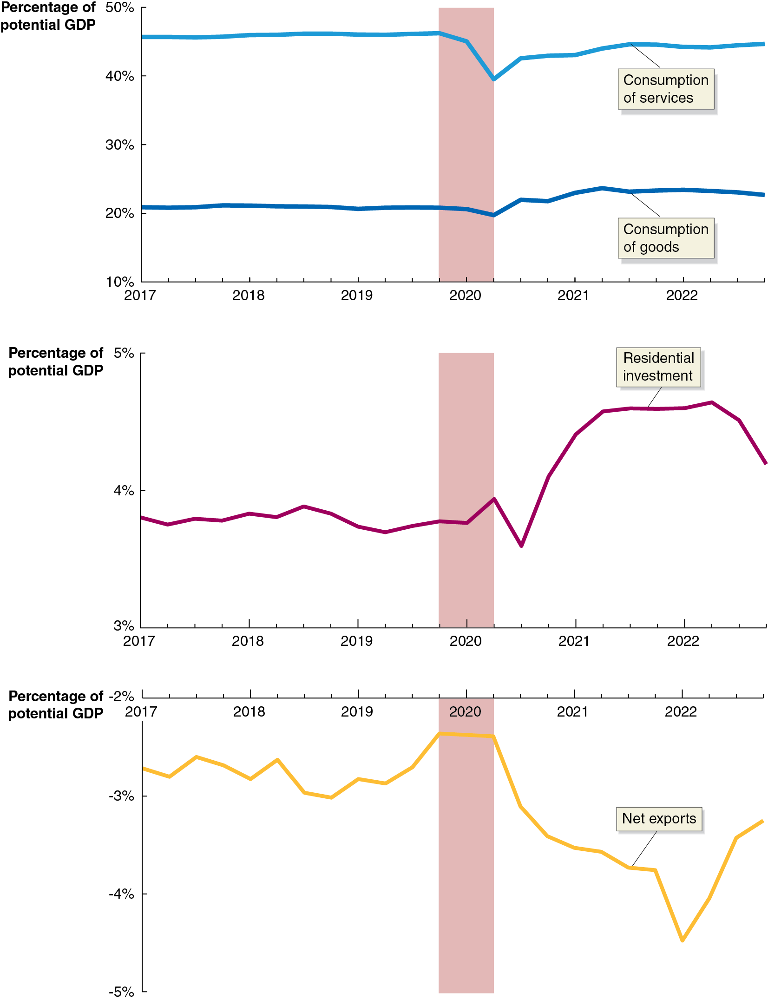{height=99%}

We can understand the 2020 recession better by examining what happened to the components of real G D P. + Consumption spending fell, relative to potential G D P, during the recession. + Spending on services fell sharply while spending on goods fell slightly before increasing and then stabilizing.

## Apply the Concept: Which Components of Aggregate Demand Changed the Most during the 2020 Recession? (2 of 3)

Apply the Concept: Which Components of Aggregate Demand Changed the Most during the 2020 Recession? (2 of 3)

{height=99%}

Residential investment had been stable before the recession and initially fell during the first part of the 2020 recession. + However, the housing market pulled residential investment up due to continued low interest rates and consumers with excess stimulus cash. + Residential investment increased sharply in the latter part of the 2020 recession, and stayed high for the following couple of years.

## Apply the Concept: Which Components of Aggregate Demand Changed the Most during the 2020 Recession? (3 of 3)

Apply the Concept: Which Components of Aggregate Demand Changed the Most during the 2020 Recession? (3 of 3)

{height=99%}

Net exports decreased during and after the recession. (Because net exports was negative throughout this period, it decreased by becoming a larger negative number.) + This was in part due to a sharp increase in the value of the $U S. + U .S. G D P also fell less than our trading partners, pushing net exports lower.

## 13.2 Aggregate Supply

13.2 Aggregate Supply

Identify the determinants of aggregate supply and distinguish between a movement along the short-run aggregate supply curve and a shift of the curve.

Aggregate supply refers to the quantity of goods and services that firms are willing and able to supply. + The relationship between this quantity and the price level is different in the long and short run. + So, we will develop both a short-run and long-run aggregate supply curve.

Long-run aggregate supply (L R A S) curve: A curve that shows the relationship in the long run between the price level and the quantity of real G D P supplied.

## Figure 13.2 The Long-Run Aggregate Supply Curve

Figure 13.2 The Long-Run Aggregate Supply Curve

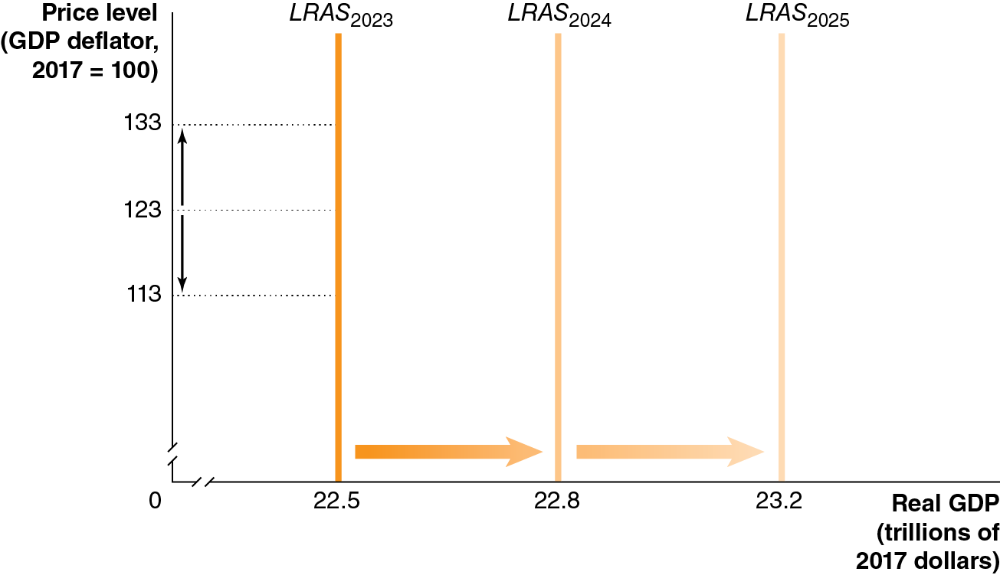{height=99%}

In the long run, the level of real G D P is determined by the number of workers, the level of technology, and the capital stock (factories, machinery, etc.). + None of these elements is affected by the price level, so L R A S does not depend on the price level; it is a vertical line. + L R AS occurs at the level of potential or full-employment G D P, which advances each year.

## The Short-Run Aggregate Supply Curve

The Short-Run Aggregate Supply Curve

While the L R A S is vertical, the S R A S is upward sloping. Why? + As prices of final goods and services rise, prices of inputs—such as the wages of workers or the price of natural resources—rise more slowly. + A secondary reason is that some firms are slow to adjust their prices when the price level rises or falls.

Economists tend to believe that some firms and workers fail to accurately predict changes in the price level. This gives us three potential explanations for why the S R A S curve is upward sloping: + Contracts make some wages and prices “sticky”. + Firms are often slow to adjust wages. + Menu costs make some prices sticky.

## Why Is the S R A S Curve Upward Sloping?

Why Is the S R A S Curve Upward Sloping?

Contracts make some wages and prices “sticky”

Prices and wages are said to be “sticky” when they do not respond quickly to changes in demand or supply. + Some firms and workers fail to predict price level changes, and so do not correctly build them into long-term contracts.

Firms are often slow to adjust wages

Salary reviews typically only happen annually. + Also, firms dislike cutting wages—it’s bad for morale.

Menu costs make some prices sticky

Firms have menu costs: The costs to firms of changing prices. + A small “optimal” change in price may not be worth the hassle for a firm to perform.

## Apply the Concept: How Sticky Are Wages?

Apply the Concept: How Sticky Are Wages?

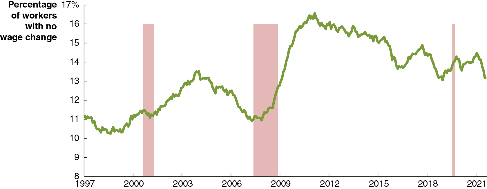{height=99%}

It is unclear how sticky wages are. There is good evidence that wages are at least sticky downward. + Instead of cutting (nominal) wages, firms tend to fire current workers, freeze pay, and offer lower salaries to new workers. This “gets misery out of the door.”

The graph shows the percentage of workers with no wage change in a given year.

## Shifts of the S R A S Curve versus Movements Along It

Shifts of the S R A S Curve versus Movements Along It

The short-run aggregate supply curve (S R A S) describes the relationship between the price level and the quantity of goods and services firms are willing to supply, holding constant all other variables that affect the willingness of firms to supply goods and services. + A change in the price level not caused by factors that would otherwise affect short-run aggregate supply results in a movement along a stationary S R A S curve. + But some factors cause the S R A S curve to shift; we will consider them in turn.

## Figure 13.3 How Expectations of the Future Price Level Affect the Short-Run Aggregate Supply Curve

Figure 13.3 How Expectations of the Future Price Level Affect the Short-Run Aggregate Supply Curve

If workers and firms believe the price level will rise by a certain amount, say 3 percent, they will try to adjust their wages and prices accordingly. + Holding constant all other variables that affect aggregate supply, the S R A S will shift to the left. + Widely held expectations of future price-level increases are self-fulfilling!

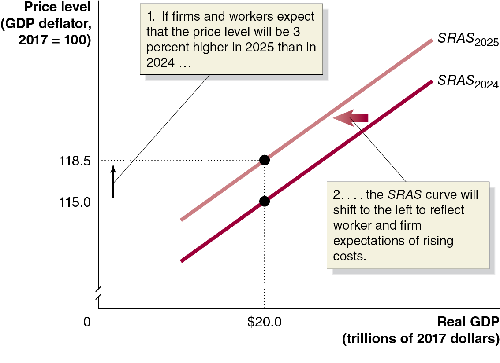{height=99%}

## Table 13.2 Variables That Shift the Short-Run Aggregate Supply Curve (1 of 3)

Table 13.2 Variables That Shift the Short-Run Aggregate Supply Curve (1 of 3)

{height=99%}

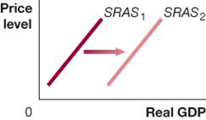{height=99%}

An increase in the availability of the factors of production, i.e. labor and capital, allows more production at any price level. + A decrease in the availability of these factors decreases S R A S.

Improvements in technology allow productivity to improve, and hence the level of production at any given price level.

## Table 13.2 Variables That Shift the Short-Run Aggregate Supply Curve (2 of 3)

Table 13.2 Variables That Shift the Short-Run Aggregate Supply Curve (2 of 3)

{height=99%}

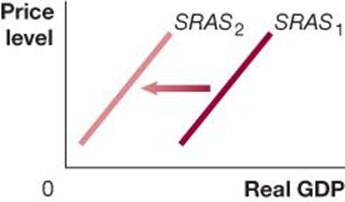{height=99%}

If workers and firms expect higher prices in the future, S R A S shifts to the left. This could happen because: + Inflation expectations increase or + Workers and firms realize they previously underestimated the price level.

## Table 13.2 Variables That Shift the Short-Run Aggregate Supply Curve (3 of 3)

Table 13.2 Variables That Shift the Short-Run Aggregate Supply Curve (3 of 3)

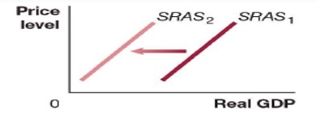{height=99%}

A supply shock is an unexpected event that causes the short-run aggregate supply curve to shift. + Examples: Oil prices increase suddenly. Firms immediately anticipate rising input prices and will only produce the same amount of output if their own prices rise. The pandemic shutdown closed businesses and reduced supply in 2020. + Unexpected input price increases cause a decrease in the S R A S; unexpected input price decreases would shift S R A S to the right instead.

## 13.3 Macroeconomic Equilibrium in the Long Run and the Short Run

13.3 Macroeconomic Equilibrium in the Long Run and the Short Run

Use the aggregate demand and aggregate supply model to illustrate the difference between short-run and long-run macroeconomic equilibrium.

Now we are ready to introduce the long-run aggregate supply curve into our model. + Remember, the L R A S shows the level of potential, or full-employment, G D P.

## Figure 13.4 Long-Run Macroeconomic Equilibrium

Figure 13.4 Long-Run Macroeconomic Equilibrium

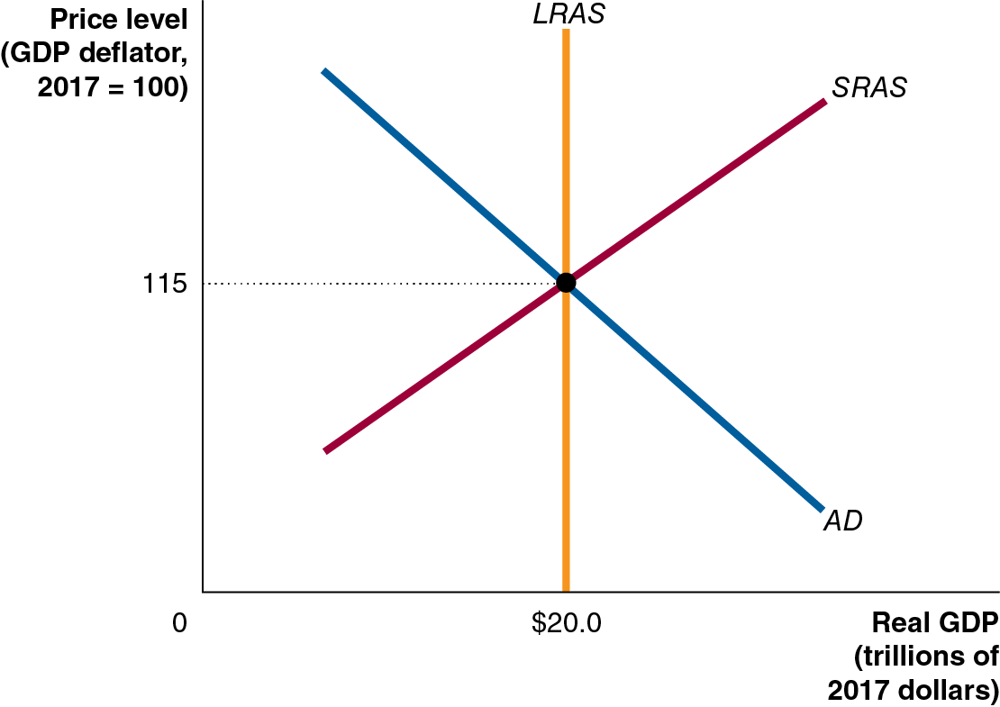{height=99%}

Long-run macroeconomic equilibrium occurs when the A D and S R A S curves intersect at the L R A S level, that is, when the economy is in short-run equilibrium, and G D P is at its full-employment level. + For simplicity, assume no inflation (current and expected price level is 115) and no growth (L R A S fixed at $20.0 trillion).

## Figure 13.5 The Short-Run and Long-Run Effects of a Decrease in Aggregate Demand (1 of 2)

Figure 13.5 The Short-Run and Long-Run Effects of a Decrease in Aggregate Demand (1 of 2)

Suppose interest rates rise. + Planned investments fall: A D shifts left, and the short-run macroeconomic equilibrium moves from A to B. + Workers lose their jobs, firms lose sales: a recession

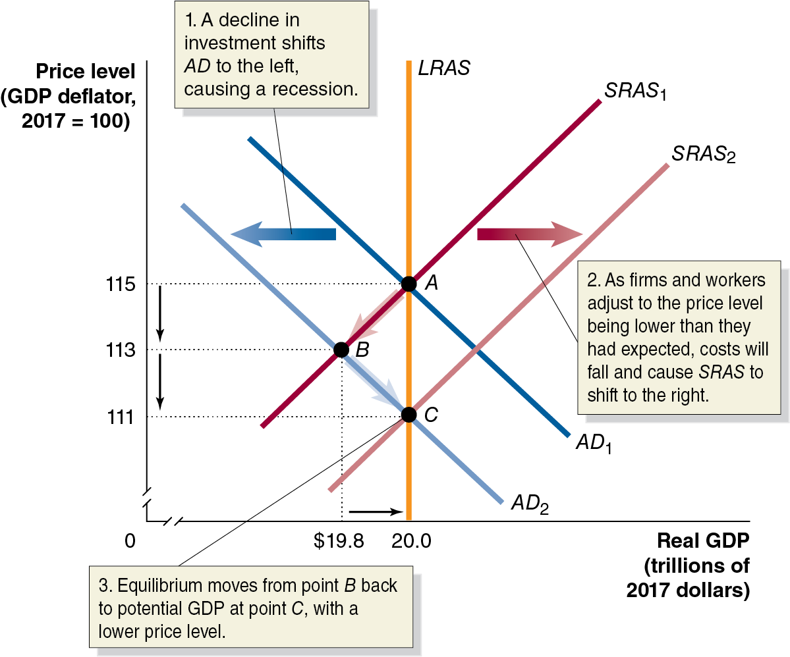{height=99%}

## Figure 13.5 The Short-Run and Long-Run Effects of a Decrease in Aggregate Demand (2 of 2)

Figure 13.5 The Short-Run and Long-Run Effects of a Decrease in Aggregate Demand (2 of 2)

Workers accept lower wages and firms expect lower prices, including lower input costs: S R A S shifts right, moving the short-run macroeconomic equilibrium from B to C. + S R A S shifting right restores long-run macroeconomic equilibrium, with a lower price level.

{height=99%}

## Apply the Concept: Does It Matter What Causes a Decline in Aggregate Demand?

Apply the Concept: Does It Matter What Causes a Decline in Aggregate Demand?

G D P has four components; a decrease in any of the four could cause a recession. Does it make any difference which component causes the recession?

Ed Leamer of U C L A: “housing is the business cycle.” + Recent research suggests that recessions caused by financial crises tend to be larger and more long-lasting than declines due to other factors.

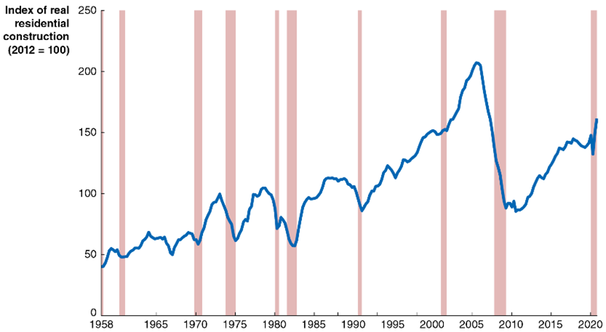{height=99%}

## Figure 13.6 The Short-Run and Long-Run Effects of an Increase in Aggregate Demand (1 of 2)

Figure 13.6 The Short-Run and Long-Run Effects of an Increase in Aggregate Demand (1 of 2)

Suppose that firms become more optimistic about the future. + They increase investment, shifting A D to the right, shifting the short-run macroeconomic equilibrium from A to B. + Unemployment falls below its natural rate, raising wages; the increased demand for goods raises prices.

{height=99%}

## Figure 13.6 The Short-Run and Long-Run Effects of an Increase in Aggregate Demand (2 of 2)

Figure 13.6 The Short-Run and Long-Run Effects of an Increase in Aggregate Demand (2 of 2)

Firms and workers raise expectations about the price level, shifting S R A S to the left—restoring long- run macroeconomic equilibrium at point C.

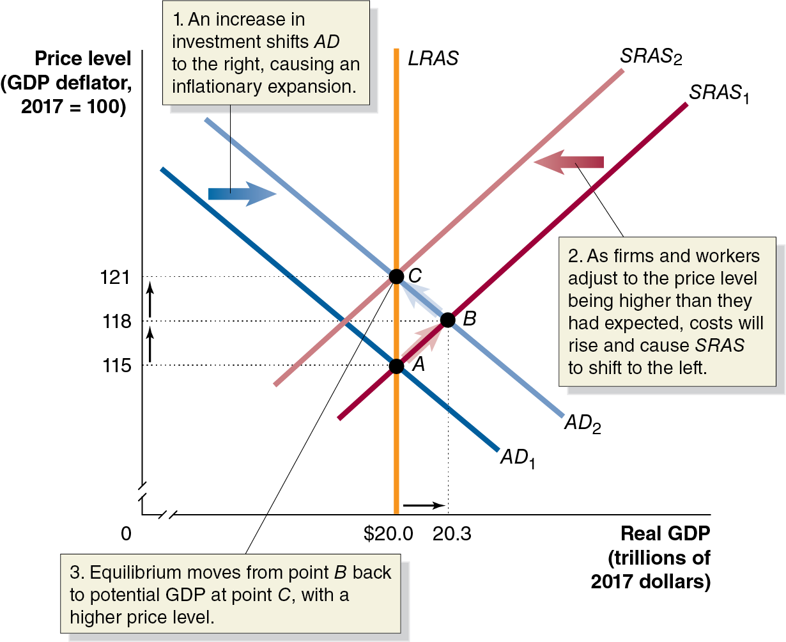{height=99%}

## Figure 13.7 The Short-Run and Long-Run Effects of a Supply Shock (1 of 3)

Figure 13.7 The Short-Run and Long-Run Effects of a Supply Shock (1 of 3)

In the previous analyses, A D moved suddenly. What if instead S R A S moved suddenly? We call this a supply shock. + For example, suppose a sudden increase in oil prices shifts S R A S to the left. + This causes stagflation, a combination of inflation and recession, usually resulting from a supply shock.

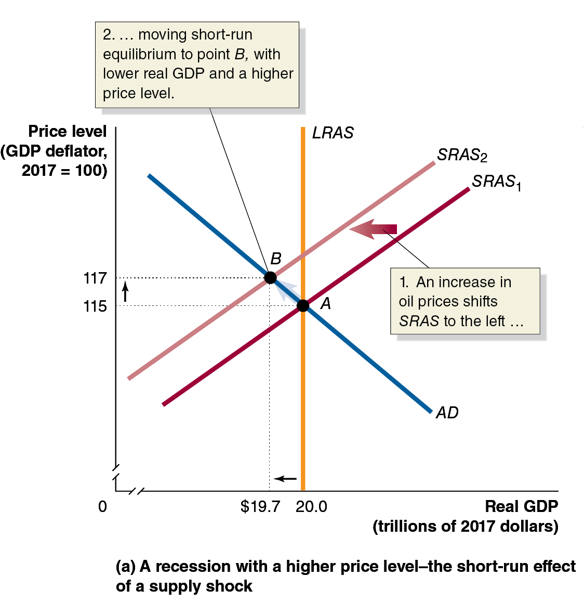{height=99%}

## Figure 13.7 The Short-Run and Long-Run Effects of a Supply Shock (2 of 3)

Figure 13.7 The Short-Run and Long-Run Effects of a Supply Shock (2 of 3)

With the lower level of output, people are unemployed and products go unsold. + Workers accept a lower wage, and firms decrease prices in order to clear inventories. + With the decrease in expectations about prices, S R A S moves to the right, restoring long-run equilibrium.

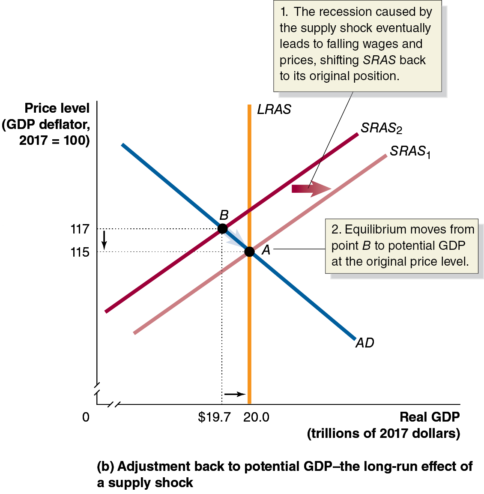{height=99%}

## Figure 13.7 The Short-Run and Long-Run Effects of a Supply Shock (3 of 3)

Figure 13.7 The Short-Run and Long-Run Effects of a Supply Shock (3 of 3)

How long does it take to restore full employment? + It depends on the severity of the supply shock, but it is likely to take several years.

An alternative to waiting this long is to use fiscal or monetary policy to increase aggregate demand. + This will result in permanently higher prices but may be worth the cost.

{height=99%}

## Figure 13.8 The Effects of the Covid-19 Pandemic

Figure 13.8 The Effects of the Covid-19 Pandemic

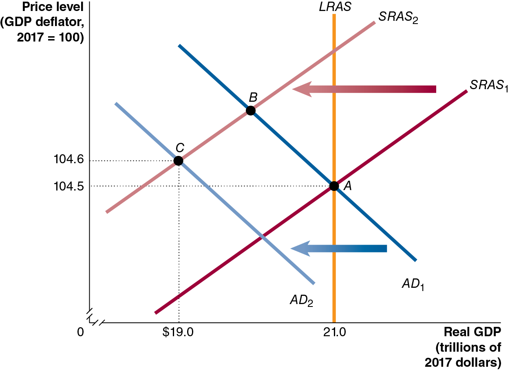{height=99%}

Before the pandemic, the economy was in long-run equilibrium at Point A. + The pandemic created a supply shock, which would normally push the short-run supply curve to the left and create a new equilibrium at Point B. + However, the pandemic also affected A D resulting in a new equilibrium at Point C.

## The Effects of the Covid-19 Pandemic

The Effects of the Covid-19 Pandemic

Point B was not the new short-run equilibrium for three key reasons: + Reduced consumption spending. State and local governments closed many businesses, which directly reduced output and consumption spending, particularly spending on services like restaurant meals and movie tickets. + Reduced investment spending. Many residential and business construction projects had to be suspended, reducing investment spending. + Reduced exports. U.S. exports declined because the pandemic also led to closures of businesses in Europe, Canada, Japan, and other U.S. trading partners.

Because the Covid-19 pandemic caused both the S R A S and A D curves to shift to the left, the new short-run equilibrium occurred at point C, with real G D P having fallen to $19.0 trillion in the second quarter of 2020, with prices approximately steady at 104.6.

## Apply the Concept: Is the Business Cycle Really a Cycle? (1 of 2)

Apply the Concept: Is the Business Cycle Really a Cycle? (1 of 2)

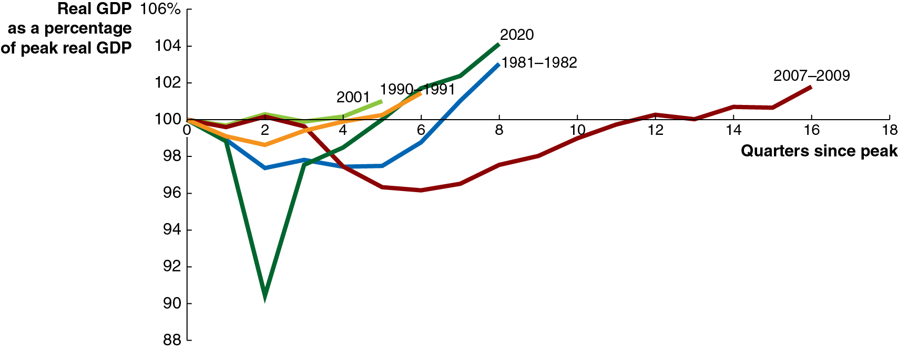{height=99%}

The word cycle suggests a process that is uniform. + In the late 1800s, some argued the business cycle was 11 years, the same as cycles in sunspot activity. + This caused natural phenomena that drove the business cycle.

## Apply the Concept: Is the Business Cycle Really a Cycle? (2 of 2)

Apply the Concept: Is the Business Cycle Really a Cycle? (2 of 2)

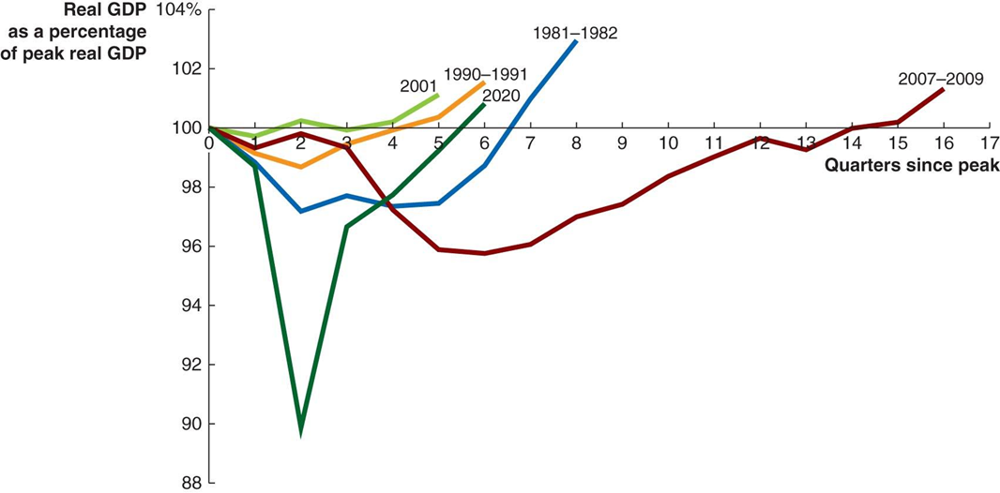{height=99%}

It is clear now that business cycles vary greatly in length and severity. + The graph shows how long the economy took to return to its previous peak following each of the last five recessions.

## 13.4 A Dynamic Aggregate Demand and Aggregate Supply Model

13.4 A Dynamic Aggregate Demand and Aggregate Supply Model

Use the dynamic aggregate demand and aggregate supply model to analyze macroeconomic conditions.

Our model of aggregate demand and aggregate supply so far has been static, in the sense that: + Price levels were constant (no inflation) + There was no long-run growth

We will now form a dynamic aggregate demand and aggregate supply model, incorporating: + Continually increasing real G D P, shifting L R A S to the right + A D also ordinarily shifting to the right + S R A S shifting to the right, except when workers and firms expect high rates of inflation

## Figure 13.9 A Dynamic Aggregate Demand and Aggregate Supply Model

Figure 13.9 A Dynamic Aggregate Demand and Aggregate Supply Model

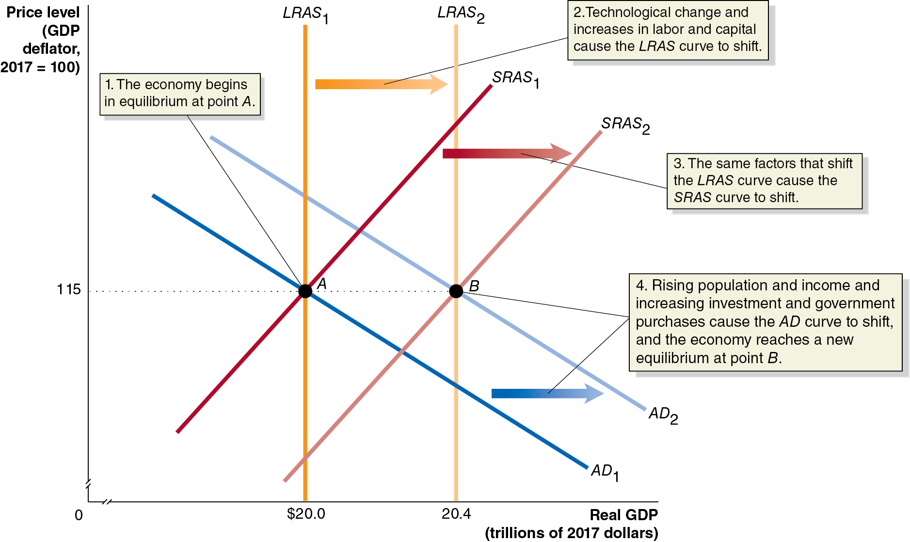{height=99%}

## Figure 13.10 Using Dynamic Aggregate Demand and Aggregate Supply to Understand Inflation

Figure 13.10 Using Dynamic Aggregate Demand and Aggregate Supply to Understand Inflation

The usual cause of inflation is total spending increasing faster than production. + A D moves further right than does L R A S. + S R A S moves to the right; but the anticipated rise in the price level causes it to shift less than L R A S. + Long-run equilibrium is restored but with a higher price level.

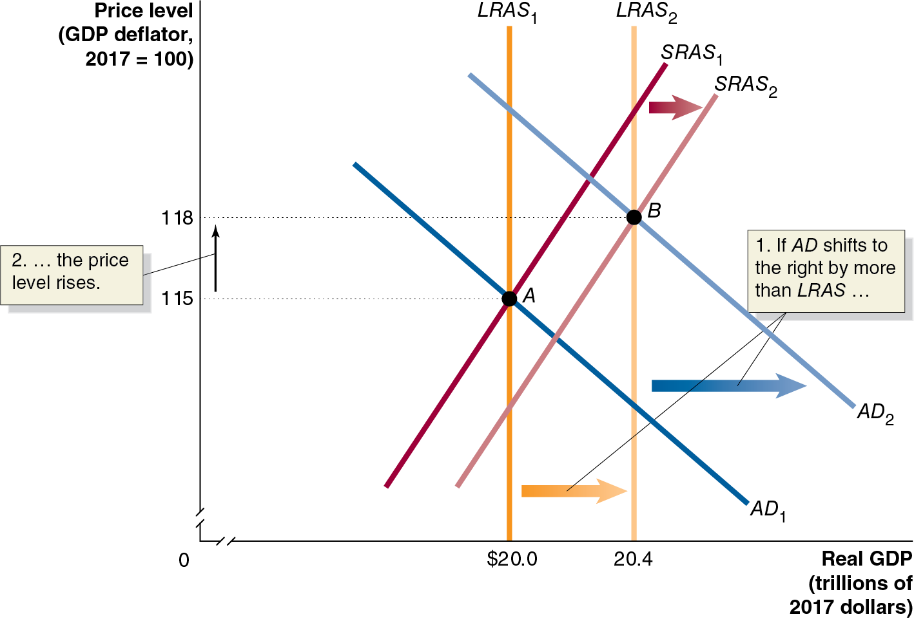{height=99%}

## Main Factors Causing the Recession of 2007–2009

Main Factors Causing the Recession of 2007–2009

The end of the housing bubble

House prices rose in the early 2000s—initially due to low interest rates, but then due to speculation. In 2006, the speculative bubble began to deflate, and the spending on residential investment fell.

The 2007–2009 financial crisis

As many people defaulted on their mortgages, many financial institutions took heavy losses. This financial crisis led to a credit crunch, decreasing consumption and investment spending.

The rapid increase in oil prices during 2008

Several factors combined to increase the price of oil from $34 per barrel in 2004 to $140 per barrel in mid-2008. This supply shock exacerbated the ongoing recession.

## Figure 13.11 The Recession of 2007–2009 (1 of 2)

Figure 13.11 The Recession of 2007–2009 (1 of 2)

In 2007, the economy was a little below long-run equilibrium. + As usual, potential G D P increased from 2007 to 2009. + But aggregate demand did not keep pace (housing bubble, financial crisis).

{height=99%}

## Figure 13.11 The Recession of 2007–2009 (2 of 2)

Figure 13.11 The Recession of 2007–2009 (2 of 2)

At the same time, increasing oil prices shifted short-run aggregate supply to the left. + The result: higher prices and real G D P that was well below potential.

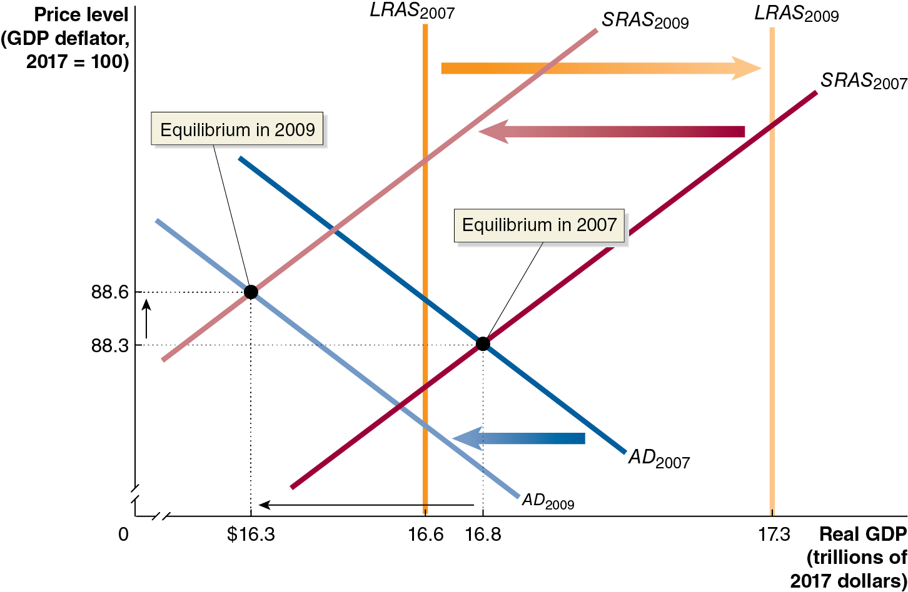{height=99%}

## Appendix: Macroeconomic Schools of Thought

Appendix: Macroeconomic Schools of Thought

Compare macroeconomic schools of thought.

Macroeconomic theory is relatively less settled than microeconomic theory. + Macroeconomics developed as a separate field within economics after the Great Depression. + John Maynard Keynes’s 19 36 book The General Theory of Employment, Interest, and Money inspires the model we have addressed in this chapter. + Widespread acceptance during the 19 30s and 19 40s of Keynes’s model became known as the Keynesian revolution.

## New Keynesian Economics

New Keynesian Economics

Modern followers of Keynes refer to themselves as new Keynesians. + Emphasize the stickiness of wages and prices in explaining fluctuations in real G D P—a concept that Keynes did not include in his original model.

## The Monetarist Model

The Monetarist Model

Monetarism refers to the macroeconomic theories of Milton Friedman and his followers, particularly the idea that the quantity of money should be increased at a constant rate. + Friedman argued in the 19 40s that most fluctuations in real output were caused by fluctuations in the money supply. + Therefore, the Federal Reserve should concentrate less on interest rates and more on following a monetary growth rule, a plan for increasing the quantity of money at a fixed rate that does not respond to changes in economic conditions.

Monetarism is based on the quantity theory of money, which we’ll examine in Chapter 24.

## The New Classical Model

The New Classical Model

New classical macroeconomics emerged in the 1970s; it consists of the macroeconomic theories of Robert Lucas and others, particularly the idea that workers and firms have rational expectations. + In the new classical school of thought, workers and firms develop expectations about price levels. If these expectations are wrong, then the real wage will be too high or too low, causing firms to reduce or increase employment, respectively—recession or expansion. + New classical economists believe these fluctuations can be minimized by helping workers and firms to form correct expectations—again, a consistent monetary growth rule.

## The Real Business Cycle Model

The Real Business Cycle Model

The real business cycle model of the economy focuses on real, rather than monetary, causes of the business cycle. + Adherents to this model also believe that workers and firms form rational expectations about prices and wages, which adjust quickly to supply and demand. + But they argue that the main sources of fluctuations in real G D P are temporary productivity shocks. + They maintain that aggregate supply is vertical even in the short run, unaffected by the price level. It is supply shocks that affect the level of real output.

## The Austrian Model (1 of 2)

The Austrian Model (1 of 2)

The Austrian school of economics: + Began in the late nineteenth century with the writings of Carl Menger. + Was advanced by Ludwig von Mises and Friedrich von Hayek.

The Austrian school argues for the superiority of the market system over economic planning. + Hayek particularly argued that only the price system could use all the dispersed information to achieve efficiency.

## The Austrian Model (2 of 2)

The Austrian Model (2 of 2)

Hayek also developed a theory of the business cycle, wherein central bank-induced low interest rates cause the business cycle by prompting overinvestment. + Austrians argue the 2007–2009 recession fits this model. They claim the Fed cut interest rates too low in fighting the 2001 recession.

## Apply the Concept: Karl Marx: Capitalism’s Severest Critic

Apply the Concept: Karl Marx: Capitalism’s Severest Critic

The schools of thought so far presented are “mainstream”; one vocal critic of mainstream economic thought was nineteenth-century German Karl Marx. + He believed in the labor theory of value, which attributed all the value of a good or service to the labor embodied in it. + Marx argued that the market system would eventually be replaced by a Communist economy, in which the workers would control production. + This would happen because workers would rebel against exploitation by large firms, unable to afford an above-subsistence standard of living.

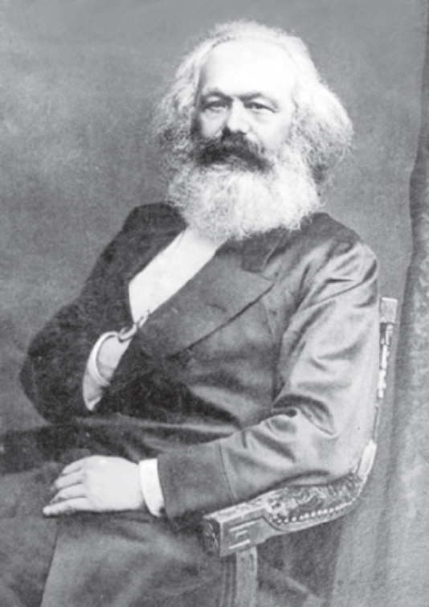{height=99%}

## Which School of Thought Is Correct?

Which School of Thought Is Correct?

To date, we do not know which school of thought is correct about the economy. + Many pieces of evidence can be interpreted in several different ways. + Economists cannot isolate particular elements to study and conduct controlled experiments.

So, it is likely that debate about the applicability of schools of thought, and hence optimal policies for governments to pursue, will continue for the foreseeable future.

## Copyright

Copyright

{height=99%}

This work is protected by United States copyright laws and is provided solely for the use of instructors in teaching their courses and assessing student learning. Dissemination or sale of any part of this work (including on the World Wide Web) will destroy the integrity of the work and is not permitted. The work and materials from it should never be made available to students except by instructors using the accompanying text in their classes. All recipients of this work are expected to abide by these restrictions and to honor the intended pedagogical purposes and the needs of other instructors who rely on these materials.

