## Macroeconomics

Macroeconomics

Ninth Edition

{height=99%}

Chapter 14

Banks, Money, and the Federal Reserve System

{height=99%}

Copyright © 2025, 2021, & 2018 Pearson Education, Inc. All Rights Reserved

## Chapter Outline

Chapter Outline

14.1 What Is Money, and Why Do We Need It? + 14.2 How Is Money Measured in the United States Today? + 14.3 How Do Banks Create Money? + 14.4 The Federal Reserve System + 14.5 The Quantity Theory of Money

## Silicon Valley Bank and the Fragility of Banking

Silicon Valley Bank and the Fragility of Banking

{height=99%}

Wednesday, March 8, 2023: Silicon Valley Bank (S V B) is seemingly sound, with assets of over $200 billion and more than $175 billion in deposits. + Friday, March 10, 2023: S V B fails and is taken over by the Federal Deposit Insurance Corporation (F D I C). + Banks are critically important to the economy, but banking involves more risks than nearly any other kind of business, making government supervision of the banking system crucial for the economy.

## Money

Money

Money is one of our most important inventions. + Economists consider money to be any asset that people are generally willing to accept in exchange for goods and services or for payment of debts. + Asset: Anything of value owned by a person or a firm.

We begin this chapter by considering what role money serves, and what can be used as money. + Then, we consider modern forms of money and the roles of banks and the government in creating and managing money. + Finally, we create a model relating prices to the amount of money.

## 14.1 What Is Money, and Why Do We Need It?

14.1 What Is Money, and Why Do We Need It?

Define money and discuss the four functions of money.

Suppose you were living before the invention of money. + If you wanted to trade, you would have to barter, trading goods and services directly for other goods and services. + Trades would require a double coincidence of wants.

Eventually, societies started using commodity money—goods used as money that also have value independent of their use as money—like animal skins or precious metals. + The existence of money makes trading much easier and allows specialization, an important step for developing an economy.

## The Four Primary Functions of Money

The Four Primary Functions of Money

Medium of exchange + Money is acceptable to a wide variety of parties as a form of payment for goods and services.

Unit of account + Money allows a way of measuring value in a standard manner.

Store of value + Money allows people to defer consumption till a later date by storing value. Other assets can do this too, but money does it particularly well because it is liquid, easily exchanged for goods.

Standard of deferred payment + Money facilitates exchanges across time when we anticipate that its value (purchasing power) in the future will be predictable.

## What Can Serve as Money?

What Can Serve as Money?

In order to serve as an acceptable medium of exchange (and hence a potential “money”), a good should have the following characteristics: + The good must be acceptable to (usable by) most people. + It should be of standardized quality so any two units are alike. + It should be durable so that value is not lost by wearing out. + It should be valuable relative to its weight, so that it can easily be transported even in large quantities. + It should be divisible enough to be used for purchases of both low-priced and high-priced goods.

## Commodity Money

Commodity Money

Commodity money has a value independent of its use as money. + Some important historical and modern commodity moneys: + Cowrie shells in Asia (the classical Chinese character for

money/currency,

{height=99%}

originated as a pictograph of a

cowrie shell)

Precious metals, such as gold or silver + Animal pelts and skins in colonial North America + Cigarettes in prisons and prisoner-of-war camps

## Paper Money to Fiat Money

Paper Money to Fiat Money

Beginning in China in the tenth century and spreading throughout the world, paper money was issued by banks and governments. The paper money was exchangeable for some commodity, typically gold, on demand. + In modern economies, paper money is generally issued by a central bank run by the government. + The Federal Reserve is the central bank of the United States. However, money issued by the Federal Reserve is no longer exchangeable for gold, nor is any current world currency. Instead, the Fed issues currency known as fiat money.

Fiat money is any money, such as paper currency, that is authorized by a central bank or governmental body and that does not have to be exchanged by the central bank for gold or some other commodity money.

## Fiat Money—Advantages and Disadvantages

Fiat Money—Advantages and Disadvantages

Fiat money has the advantage that governments do not have to be willing to exchange it for gold or some other commodity on demand. + This makes central banks more flexible in creating money.

However, it also creates a potential problem: fiat money is only acceptable as long as households and firms have confidence that if they accept paper dollars in exchange for goods and services, the dollars will not lose much value during the time they hold them. + If people stop “believing” in the fiat money, it will cease to be useful.

## Apply the Concept: Your Money Is No Good Here! (1 of 2)

Apply the Concept: Your Money Is No Good Here! (1 of 2)

In 2017 Dig Inn, a Manhattan-based food chain, chose to require customers to pay ahead or with a mobile wallet payment app at most locations. + By not taking cash, Dig Inn hoped to speed up service, and eliminate the chance of robberies.

Can they do this legally? Yes! Firms are not obliged to accept currency as payment. (Debts are a different story.)

{height=99%}

## Apply the Concept: Your Money Is No Good Here! (2 of 2)

Apply the Concept: Your Money Is No Good Here! (2 of 2)

Similarly, many convenience stores and gas stations refuse to take large-denomination bills (typically $50 or more). + Some whole countries (like Sweden) are almost cashless now; will the United States follow suit? + The Covid-19 pandemic accelerated the cashless society in the United States when many people preferred “contactless” purchases.

{height=99%}

## 14.2 How Is Money Measured in the United States Today?

14.2 How Is Money Measured in the United States Today?

Discuss the definitions of the money supply used in the United States today.

How much money is there in the United States? This is harder to answer than it first appears, because we have to decide what to count as “money.” + M1 is the narrower definition of the money supply: the sum of currency in circulation and checking account and savings account deposits in banks. + M2 is a broader definition of the money supply that includes M1, plus small-denomination time deposits, and noninstitutional money market fund shares.

## How Big Is the Money Supply?

How Big Is the Money Supply?

In September 2023, M1 was about $18.1 trillion and M2 was about $20.8 trillion. + About 13 percent of M1 is currency: about $2.3 trillion. This is more than $6,600 per person living in the United States. + 75 percent of U.S. paper currency is $100 bills, the largest U.S. banknotes currently in circulation. + U.S. currency holdings are unusually high by world standards. People in other countries sometimes hold and use U.S. dollars, typically either because + Confidence in the value of the local currency is low, or + To facilitate a large underground economy.

## M1 versus M2: Which One Should We Use?

M1 versus M2: Which One Should We Use?

When we want to talk about the money supply, which definition should we use? + Recent changes in how the Fed defines M1 and M2 mean that they are quite similar, so it doesn’t matter which monetary aggregate we use. + In our discussion of money, we will keep in mind that: + The money supply includes both checking and savings account balances as well as currency. + Banks play an important role in the money supply, since they control what happens to money when it is in a checking account or savings account.

## What about Debit and Credit Cards?

What about Debit and Credit Cards?

Debit cards directly access checking accounts, but the card is not money, the checking account balance is. + Credit cards are a convenient way to obtain a short-term loan from the bank issuing the card. But transactions are not really complete until you pay the loan off—transferring money to pay off the credit card loan. + So, credit cards do not represent money.

## Apply the Concept: Is Bitcoin Money? (1 of 2)

Apply the Concept: Is Bitcoin Money? (1 of 2)

When we think of money, we typically think of currency issued by a government. + But currency is only a small part of the money supply. + Over the last decade or so, consumers have come to trust forms of e-money or digital funds, such as PayPal, Apple Pay, and Google Pay.

{height=99%}

## Apply the Concept: Is Bitcoin Money? (2 of 2)

Apply the Concept: Is Bitcoin Money? (2 of 2)

Bitcoins are a new form of e-money, made not by a government or firm, but by a decentralized system of linked computers. + Bitcoins can be traded for other currencies on websites. + Some websites accept bitcoins as a form of payment.

Should bitcoins be included in a measure of the money supply? + For now, they are not; if they grow popular, maybe they should be.

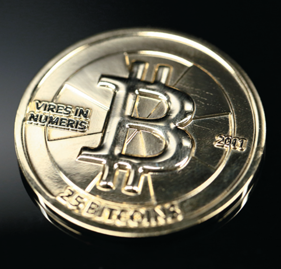{height=99%}

## 14.3 The Role of Banks in the Economy

14.3 The Role of Banks in the Economy

Explain the role of banks in the economy.

Banks play a critical role in the economy. + Recall that there is more money held in checking accounts than there is actual currency in the economy. + So, somehow money is being created by banks.

Further, banks are generally profit-making private firms: some small, but some among the largest corporations in the country. + Their activities are designed to allow themselves to make a profit.

To understand the role that banks play, we will first consider how banks operate as a business.

## Figure 14.1 The Balance Sheet of a Typical Large Bank (1 of 2)

Figure 14.1 The Balance Sheet of a Typical Large Bank (1 of 2)

Assets (in billions)

## Figure 14.1 The Balance Sheet of a Typical Large Bank (2 of 2)

Figure 14.1 The Balance Sheet of a Typical Large Bank (2 of 2)

Liabilities and Stockholders’ Equity (in billions)

On a balance sheet, a firm’s assets are listed on the left, and its liabilities (and stockholders’ equity, or net worth) are listed on the right. The left and right sides must add to the same amount. + Banks use money deposited with them to make loans and buy securities (investments). + Their largest liabilities are their deposit accounts: money they owe to their depositors.

## Reserves

Reserves

Reserves are deposits that a bank keeps as cash in its vault or on deposit with the Federal Reserve. + A bank does not keep enough deposits on hand to cover all of its deposits. This is how the bank makes a profit: lending out or investing money deposited with it. + Banks in the United States used to be required to hold a particular fraction of their checking account deposits as required reserves—previously 10 percent of all checking deposits, plus a little depending on the size of the bank—but this is no longer the case. + In March 2020, the Fed eliminated the reserve requirement by setting it equal to 0 percent of a bank’s checking account deposits. + The Fed indicated it had no plans to reinstate reserve requirements for checking deposits.

## The Economic Importance of Bank Lending (1 of 2)

The Economic Importance of Bank Lending (1 of 2)

Depositors earn a low rate of interest on their deposits, while borrowers may a higher rate of interest. Why do they need banks, when they could just borrow from, and lend to, one another? + Banks reduce transactions costs, the costs in time and other resources that parties incur in the process of agreeing to and carrying out an exchange of goods or services. + They do this by using economies of scale, allowing their employees to specialize in tasks like loan evaluation, processing, or legal documentation.

## The Economic Importance of Bank Lending (2 of 2)

The Economic Importance of Bank Lending (2 of 2)

Depositors earn a low rate of interest on their deposits, while borrowers may a higher rate of interest. Why do they need banks, when they could just borrow from, and lend to, one another? + Banks reduce information problems, particularly those of asymmetric information, a situation in which one party to an economic transaction has less information than the other party.

Banks can evaluate the characteristics of borrowers to identify who is a good risk to lend to.They do this through statistical analysis and relationship banking, the ability of banks to assess credit risks on the basis of private information about borrowers.

## Apply the Concept: Help for Young Borrowers: Fintech or Ceilings on Interest Rates? (1 of 2)

Apply the Concept: Help for Young Borrowers: Fintech or Ceilings on Interest Rates? (1 of 2)

In recent years, some new financial technology or fintech companies—such as LendingClub and UpStart—have emerged to offer peer-to-peer lending on the Internet. + These firms earn flat fees for facilitating a loan and charge fees for collecting payments but take none of the risk of the loans defaulting. + Will these firms facilitate too many risky loans? Early evidence suggests “yes.”

{height=99%}

## Apply the Concept: Help for Young Borrowers: Fintech or Ceilings on Interest Rates? (2 of 2)

Apply the Concept: Help for Young Borrowers: Fintech or Ceilings on Interest Rates? (2 of 2)

Some U.S. politicians have proposed capping credit card interest rates at 15 percent. + Would this be a better way to help younger borrowers or people with low credit scores, who often face 25–30 percent credit card interest rates? + Bankers: “Arbitrary, one-size-fits-all caps might be good headlines but are bad policy because they would make loans harder for Americans, particularly those with lower credit scores or non-traditional sources of income, to receive.”

{height=99%}

## Do Banks Create Money?

Do Banks Create Money?

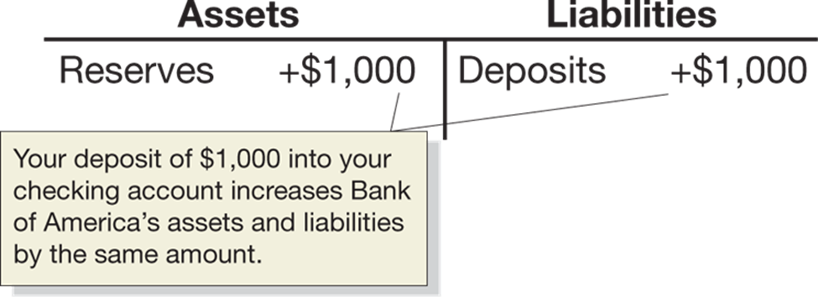{height=99%}

A T-account is a stripped-down version of a bank balance sheet, showing only how a transaction changes a bank’s balance sheet. + When you deposit $1,000 in currency at Bank of America, its reserves increase by $1,000 and so do its deposits. + The currency component of the money supply decreases by the $1,000, since that $1,000 is no longer in circulation, but the checking deposits component increases by $1,000. So, there is no net change in the money supply—yet.

## Bank of America Lends Money Out

Bank of America Lends Money Out

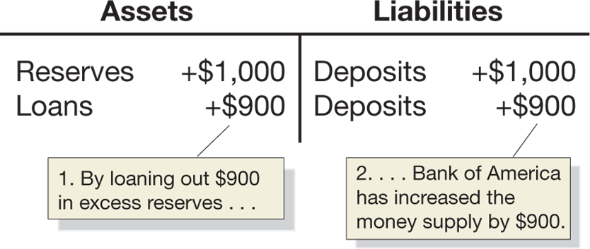{height=99%}

But Bank of America needs to make a profit, so it keeps 10 percent of the deposit as reserves and lends out the rest, creating a $900 checking account deposit. + This is characteristic of a fractional reserve banking system, in which banks keep less than 100 percent of deposits as reserves.

## Follow the Money

Follow the Money

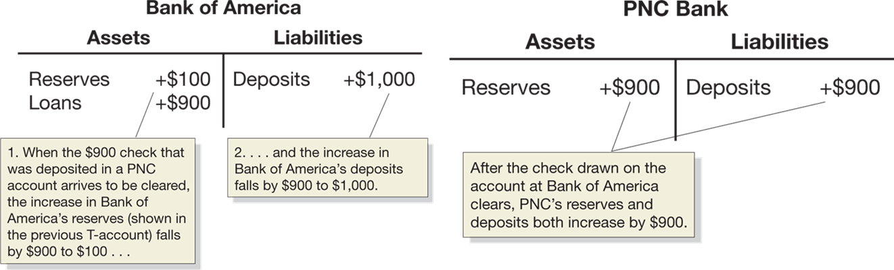{height=99%}

The $900 initially appears in a Bank of America checking account, but will soon be spent, and Bank of America will transfer $900 in currency to the bank at which the $900 check is deposited—P N C in this case.

## So, Do Banks Create Money?

So, Do Banks Create Money?

{height=99%}

The original $1,000 deposit has now become $1,900 in deposits; but the process won’t end here, as P N C will now lend out some of its deposits—the multiple expansion of deposits. + So yes, in the process of making loans as their reserves increase, banks create money in the form of new deposits.

## Figure 14.2 The Instability of the Money

Figure 14.2 The Instability of the MoneyMultiplier

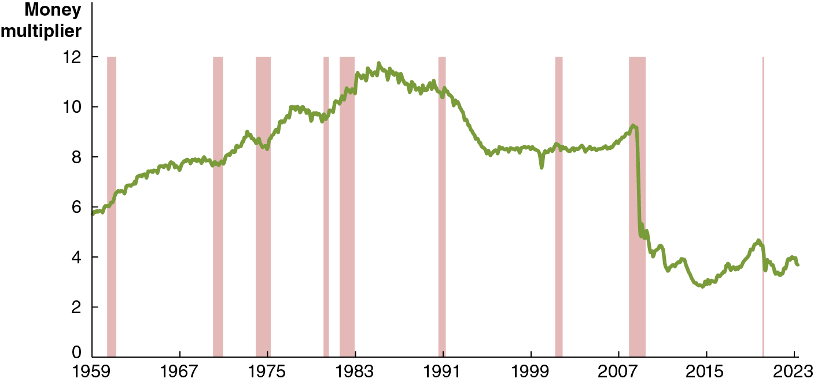{height=99%}

The multiple expansion of deposits creates results in a money multiplier, the ratio of money supply to the monetary base, or M/B. + The money multiplier was stable from the mid-1990s through 2007, but since 2007 it has become unstable. + Because of this instability, the Fed now has limited control of the money supply, and focuses on controlling interest rates instead.

## Interest on Reserve Balances

Interest on Reserve Balances

Prior to 2008, the Fed did not pay banks interest on their reserves, resulting in a scarce-reserves regime, in which banks hold few reserves beyond those the central bank requires them to hold. + In October 2008, the Fed began paying interest on reserve balances banks keep with the Fed, called the interest rate on reserve balances (I O R B). + Now, we are in an ample-reserves regime, in which banks hold substantially more reserves than the central bank requires them to hold.

## Why Does the Money Multiplier Fluctuate? (1 of 2)

Why Does the Money Multiplier Fluctuate? (1 of 2)

Fluctuations in the amount of reserves banks hold relative to their deposits.

While banks are not required to keep a particular level of reserves, they do keep reserves to comply with other banking regulations, and to ensure they have enough cash-on-hand for their depositors. + They change their reserves in response to market conditions; when they decide to lend more, they create more new demand deposits, and raise the money multiplier.

## Why Does the Money Multiplier Fluctuate? (2 of 2)

Why Does the Money Multiplier Fluctuate? (2 of 2)

Fluctuations in the amount of currency households and firms hold relative to their deposits.

Sometimes firms and households might change how much currency they choose to hold. + If they choose to hold more currency, less money is available for banks to create new deposits by lending their reserves, so the monetary base (the sum of currency in circulation and bank reserves) is smaller. + A smaller monetary base means the money multiplier (the money supply (M) divided by the monetary base (B)) is larger.

## 14.4 The Federal Reserve System

14.4 The Federal Reserve System

Describe the role the Fed plays in the financial system.

We have described that, in the United States (and all other countries), banks keep less than 100 percent of deposits as reserves: a fractional reserve banking system. + But what if many depositors simultaneously lost confidence in a bank and tried to withdraw their money? This situation is known as a bank run, and was what caused Silicon Valley Bank’s failure. + If many banks experience bank runs at the same time, a bank panic occurs.

## Figure 14.3 The Feedback Loop during a Bank Panic

Figure 14.3 The Feedback Loop during a Bank Panic

The figure shows how a bank panic can take place. + Central banks, like the Federal Reserve, can help to prevent bank runs and panics by acting as a lender of last resort, promising to make loans to banks in order to pay off depositors. + This assurance can break the negative feedback loop.

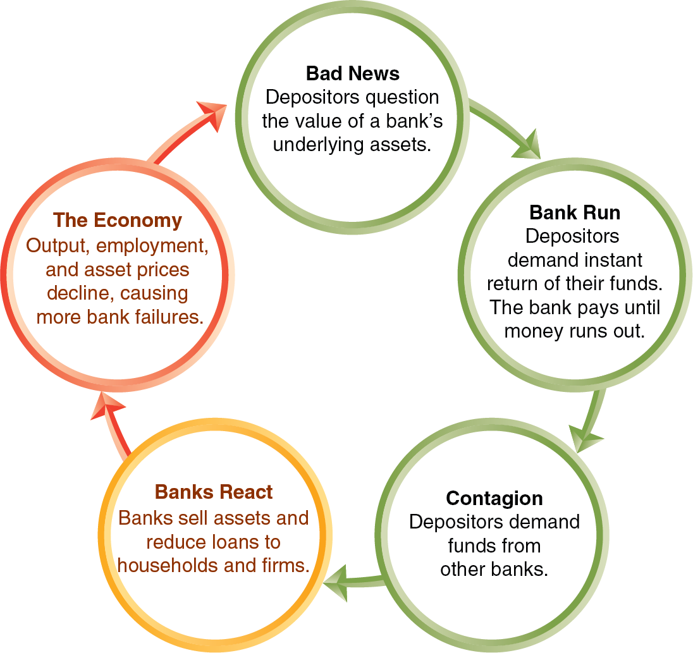{height=99%}

## The Establishment of the Federal Reserve System

The Establishment of the Federal Reserve System

In the late nineteenth and early twentieth centuries, the United States experienced several bank panics. + In 19 14, the Federal Reserve system started. “The Fed” makes loans to banks called discount loans, charging a rate of interest called the discount rate.

During the Great Depression of the 19 30s, many banks were hit by bank runs. Afraid of encouraging bad banking practices, the Fed refused to make discount loans to many banks, and more than 9,000 banks failed. + Today, many economists are critical of the Fed’s decisions in the early 19 30s, believing they made the Great Depression worse.

## Response to the Great Depression

Response to the Great Depression

In 1934, Congress established the Federal Deposit Insurance Corporation (F D I C). + The F D I C insures deposits in many banks, up to a limit (currently $250,000). This government guarantee has helped to limit bank panics.

Bank runs are still possible; during the recession of 2007–2009, a few banks experienced runs from large depositors whose deposits exceeded the F D I C limit; the same situation was what caused the failure of Silicon Valley Bank.

## Figure 14.4 The Federal Reserve System (1 of 2)

Figure 14.4 The Federal Reserve System (1 of 2)

Board of Governors + Responsible for overseeing the Federal Reserve System. Seven members are appointed by the president and serve 14-year, nonrenewable terms. One member is appointed chair and serves a 4-year, renewable term.

{height=99%}

In 1913, Congress divided the country into 12 Federal Reserve districts, each of which provides services to banks in the district. + But the real power of the Fed lies in Washington D C, with the Board of Governors. + In 2023, the chair of the Board of Governors was Jerome (Jay) Powell.

## Figure 14.4 The Federal Reserve System (2 of 2)

Figure 14.4 The Federal Reserve System (2 of 2)

Federal Open Market Committee (F O M C) + Responsible for open market operations. Twelve members, consisting of the 7 members of the Board of Governors, the president of the Federal Reserve Bank of New York, and 4 presidents of the other 11 district banks, who serve rotating 1-year terms. The chair of the Board of Governors also serves as chair of the F O M C.

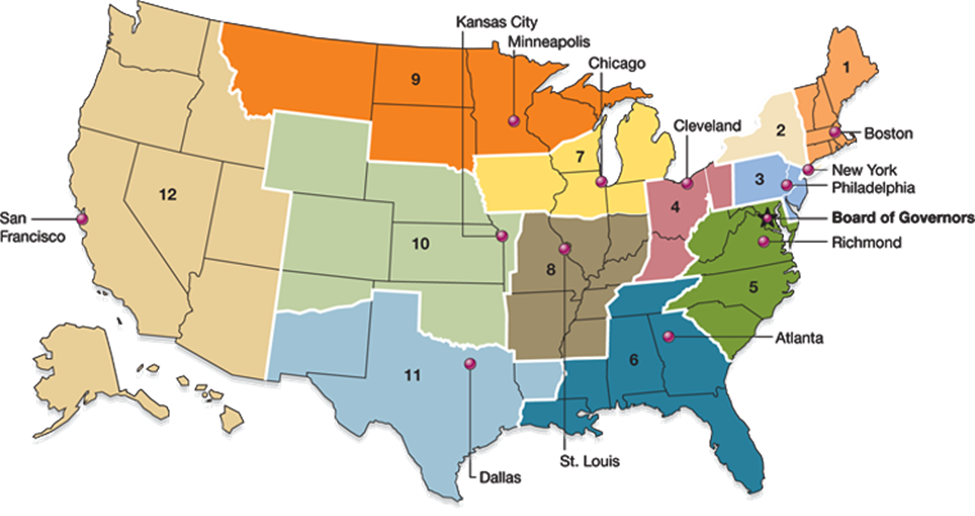{height=99%}

Meeting eight times per year, the Federal Open Market Committee (F O M C) is the Federal Reserve committee that is responsible for open market operations and managing the money supply in the United States.

## The Fed, Banks, and the Money Supply

The Fed, Banks, and the Money Supply

While the Fed was established primarily to stop bank panics by acting as a lender of last resort, today it performs a variety of actions. + This includes engaging in monetary policy: The actions the Federal Reserve takes to manage interest rates to pursue macroeconomic policy objectives.

## Open Market Operations

Open Market Operations

Open market operations: The buying and selling of Treasury securities by the Federal Reserve in order to control the money supply. + To increase the money supply, the Fed directs its trading desk in New York to conduct an open market purchase of U.S. Treasury securities—Treasury bills, notes, and bonds, which are short-term (1 year or less), medium-term (2–10 years), or long-term (30 years) tradable loans to the U.S. Treasury. + To decrease the money supply, the Fed sells its securities—an open market sale. + These open market operations can occur very quickly and are easily reversible.

## Open Market Operations in Action

Open Market Operations in Action

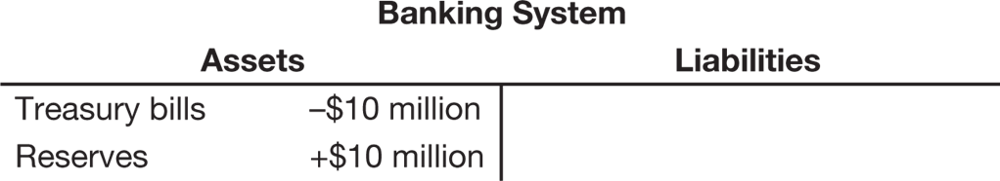{height=99%}

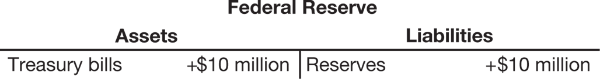{height=99%}

Suppose the Fed engages in an open market purchase of $10 million. + The banking system’s T-account reflects an increase in reserves and a corresponding decrease in assets due to its debt to the Fed. + The banking system’s reserves are liabilities for the Fed, but it gains assets equal to the debt owed to it by the banking system.

## How the Fed Can Control the Money Supply

How the Fed Can Control the Money Supply

The Fed can affect the money supply through open market operations by changing the monetary base: + An open market purchase will increase bank reserves and, therefore, the monetary base. The money supply will increase by the change in the monetary base multiplied by the money multiplier. + An open market sale will decrease bank reserves, the monetary base, and hence the money supply.

## Figure 14.5 Fluctuations in the Growth Rate of M2, 1981–2023

Figure 14.5 Fluctuations in the Growth Rate of M2, 1981–2023

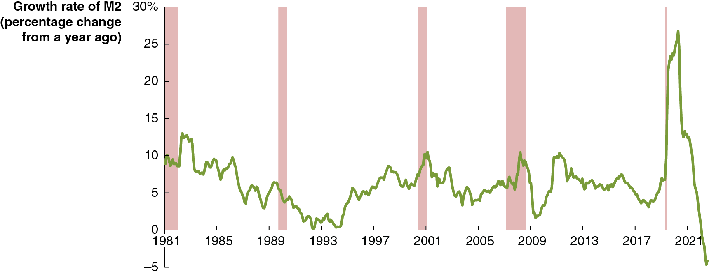{height=99%}

In recent decades, the Fed has not concentrated on controlling the money supply, because most economists and Fed policymakers don’t believe short-run movements in M2 have much effect on inflation and unemployment. + As a result, there have been wide fluctuations from month to month in the growth rate of M2.

## The Fed and Other Financial Regulators

The Fed and Other Financial Regulators

Because of their importance in the financial system and the economy, banks are subject to substantial regulation, from the Fed, the F D I C, state regulators, and the federal Office of the Comptroller of the Currency. + Banks also follow regulations from Congress, including being required to fulfill a liquidity coverage ratio (L C R), that is, holding sufficient high-quality liquid assets to meet the bank’s expected cash outflows even when the financial system is under stress.

## Moral Hazard in the Banking System

Moral Hazard in the Banking System

When a bank like Silicon Valley Bank fails, the Fed and other regulators face conflicting goals: + They want to prevent a run on one bank turning into a bank crisis or panic. + They want to avoid encouraging risky behavior by bank managers in the future: moral hazard.

To avoid this moral hazard, when the F D I C takes control of a failed bank, it must resolve the bank, selling its assets and paying off creditors (including depositors) in the least costly way. + Consequently bank owners will typically lose their investment, and some large depositors will lose a fraction of their deposits.

## Moral Hazard and the Bank Runs of 2023

Moral Hazard and the Bank Runs of 2023

Decreasing the risk of moral hazard has the downside of increasing the chance of a bank panic. + If a bank’s failure would pose systemic risk to the financial system, the F D I C can decide to reimburse all deposits, even above the usual $250,000 limit. + The F D I C chose to protect the funds of Silicon Valley Bank depositors in this way. + This raises the risk of moral hazard, since large depositors will anticipate similar protections in the future, and not push their banks to avoid risky behavior.

## The “Shadow Banking System” and the Financial Crisis of 2007–2009

The “Shadow Banking System” and the Financial Crisis of 2007–2009

The banks we have been discussing so far are commercial banks, whose primary role is to accept funds from depositors and make loans to borrowers. + In the last 25 years, two important developments have occurred in the financial system: + Banks have begun to resell many of their loans rather than keep them until they are paid off. + Financial firms other than commercial banks have become sources of credit to businesses.

## Securitization Comes to Banking

Securitization Comes to Banking

A security is a financial asset—such as a stock or a bond—that can be bought and sold in a financial market. + Traditionally, when a bank made a loan like a residential mortgage loan, it would “keep” the loan and collect payments until the loan was paid off.

In the 1970s, secondary markets developed for securitized loans, allowing them to be traded, much like stocks and bonds. + Securitization: The process of transforming loans or other financial assets into securities.

## Figure 14.6 The Process of Securitization

Figure 14.6 The Process of Securitization

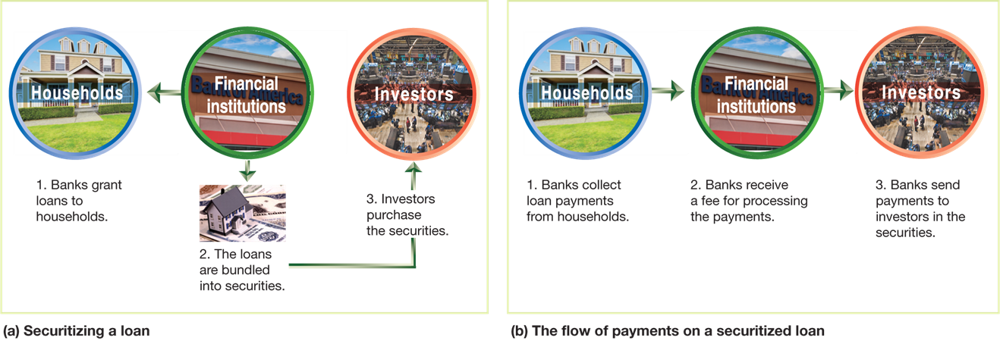{height=99%}

The first set of three images show the securitization process of a bank loan. + The next set follows the money repaying the loan.

## The Shadow Banking System

The Shadow Banking System

The 1990s and 2000s brought increasing importance of nonbank financial firms, including: + Investment banks: Banks that do not typically accept deposits from or make loans to households; they provide investment advice and also engage in creating and trading securities such as mortgage-backed securities. + Money market mutual funds: Funds that sell shares to investors and use the money to buy short-term Treasury bills and commercial paper (loans to corporations). + Hedge funds: Funds that raise money from wealthy investors and make “sophisticated” (often nonstandard, high-risk) investments.

By raising funds from investors and providing them directly or indirectly to firms and households, these firms have become a “shadow banking system.”

## The Financial Crisis of 2007–2009

The Financial Crisis of 2007–2009

What made this “shadow banking system” different from commercial banks? + These firms were less regulated by the government, including not being F D I C-insured. + These firms were highly leveraged, relying more heavily on borrowed money; hence their investments had more risk, both of gaining and losing value.

Beginning in 2007, firms in the shadow banking system were quite vulnerable to runs. + As housing prices fell, some borrowers defaulted on their mortgages, so the value of mortgage-backed securities fell. + Highly leveraged firms experienced large losses, and some went bankrupt.

## The Fed’s Response

The Fed’s Response

The Fed and the U.S. Treasury took vigorous action to deal with the financial crisis. + The Fed modified its discount policy, granting loans to previously ineligible financial firms. + The Fed bought commercial paper (short-term unsecured commercial debt) for the first time since the 1930s. + The Fed took similar actions in the Covid-19 recession.

These and other actions eventually stabilized the financial system, though it took several years for the flow of funds from savers to borrowers to return to normal levels.

## 14.5 The Quantity Theory of Money

14.5 The Quantity Theory of Money

Explain the quantity theory of money and use it to explain how high rates of inflation occur.

Beginning in the sixteenth century, Spain sent gold and silver from Mexico and Peru back to Europe. + These metals were minted into coins, increasing the money supply.

Prices in Europe rose steadily during those years. + This helped people make the connection between the amount of money in circulation and the price level.

## Connecting Money and Prices: The Quantity Equation

Connecting Money and Prices: The Quantity Equation

In the early twentieth century, Irving Fisher formalized the relationship between money and prices as the quantity equation:

M: Money supply + V: Velocity of money: The average number of times each dollar in the money supply is used to purchase goods and services included in G D P. + P: Price level + Y: Real output

Rewriting this equation by dividing through by M, we obtain:

## Calculating the Velocity of Money

Calculating the Velocity of Money

Measuring the: + Money supply (M) with M2, + Price level (P) with the G D P deflator, and + Level of real output (Y) with real G D P, so

is nominal G D P,

We obtain the following value for velocity (V) in 2022:

We can always calculate V. But will we always get the same answer? The quantity theory of money asserts that, subject to measurement error, we will: + Quantity theory of money: A theory about the connection between money and prices that assumes that the velocity of money is constant.

## The Quantity Theory Explanation of Inflation

The Quantity Theory Explanation of Inflation

When variables are multiplied together in an equation, we can form the same equation with their growth rates added together. + So, the quantity equation:

generates: + Growth rate of the money supply + Growth rate of velocity = Growth rate of the price level (or the inflation rate) + Growth rate of real output + Rearranging this to make the inflation rate the subject, and assuming that the velocity of money is constant, we obtain:

## The Inflation Rate According to the Quantity Theory

The Inflation Rate According to the Quantity Theory

This equation provides the following predictions: + If the money supply grows faster than real G D P, there will be inflation. + If the money supply grows slower than real G D P, there will be deflation (a decline in the price level). + If the money supply grows at the same rate as real G D P, there will be neither inflation nor deflation: the price level will be stable.

Is velocity truly constant from year to year? The answer is no. + But the quantity theory of money can still provide insight: + In the long run, inflation results from the money supply growing at a faster rate than real G D P.

## Figure 14.7 The Relationship between Money Growth and Inflation Over Time and around the World (1 of 2)

Figure 14.7 The Relationship between Money Growth and Inflation Over Time and around the World (1 of 2)

Real G D P growth has been relatively consistent over time. + So based on the quantity theory of money, there should be a predictable, positive relationship between the annual rates of inflation and growth rates of the money supply. + Historical U.S data shows a positive relationship, but not the consistent relationship implied by a constant velocity of money.

{height=99%}

## Figure 14.7 The Relationship between Money Growth and Inflation Over Time and around the World (2 of 2)

Figure 14.7 The Relationship between Money Growth and Inflation Over Time and around the World (2 of 2)

We see a similar story when we compare average rates of inflation and growth rates of the money supply across different countries. + Although the relationship is not entirely predictable, countries with higher growth in the money supply do have higher rates of inflation.

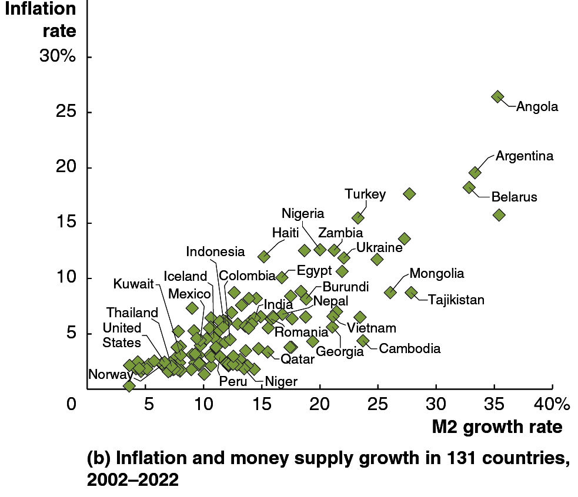{height=99%}

## High Rates of Inflation

High Rates of Inflation

Very high rates of inflation—in excess of 50 percent per month—are known as hyperinflation. + Hyperinflation results when central banks increase the money supply at a rate far in excess of the growth rate of real G D P. + This might happen when governments want to spend much more than they raise through taxes, so they force their central bank to “buy” government bonds.

## Recent Examples of Hyperinflation

Recent Examples of Hyperinflation

Recently, hyperinflation has occurred in Zimbabwe. During the 2000s, prices increased by more than 10,000 percent per year. + At that rate, a can of soda costing $1 this year would cost over $100 next year and over $10,000 the year after that. + In 2008 the Zimbabwe inflation rate reached 15 billion percent. + In 2019 Venezuela experienced inflation rates over 2 million percent.

Hyperinflation tends to be associated with slow growth, if not severe recession.

## Apply the Concept: The German Hyperinflation of the Early 19 20s (1 of 2)

Apply the Concept: The German Hyperinflation of the Early 19 20s (1 of 2)

After Germany lost World War

the Allies forced Germany to pay reparations. + Unable to cover both its regular spending and the reparations, the German government sold bonds to its central bank, the Reichsbank.

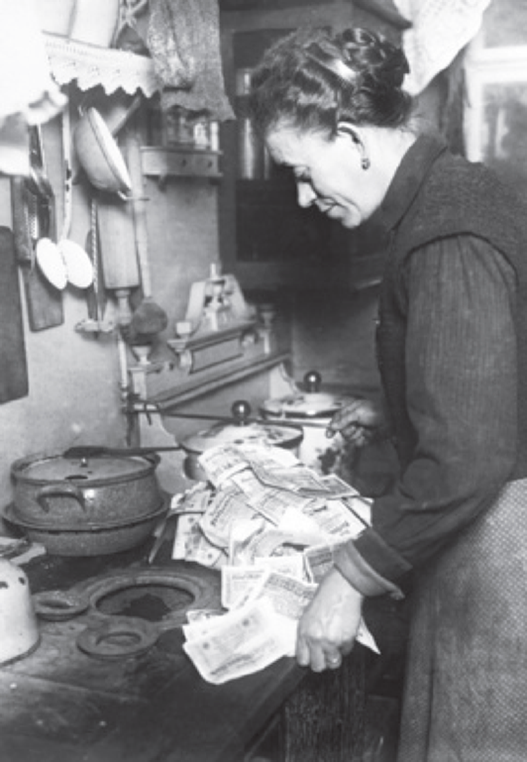{height=99%}

## Apply the Concept: The German Hyperinflation of the Early 19 20s (2 of 2)

Apply the Concept: The German Hyperinflation of the Early 19 20s (2 of 2)

The value of the German mark started to fall, and the Allies demanded payment in their own currencies; so Germany was forced to buy their currency with its own. + This required massive expansion of the money supply. + From 1922–1923, the German price index rose from 1,440 to 126,160,000,000,000, making the German mark (and any savings held in German currency) worthless.

{height=99%}

## Copyright

Copyright

{height=99%}

This work is protected by United States copyright laws and is provided solely for the use of instructors in teaching their courses and assessing student learning. Dissemination or sale of any part of this work (including on the World Wide Web) will destroy the integrity of the work and is not permitted. The work and materials from it should never be made available to students except by instructors using the accompanying text in their classes. All recipients of this work are expected to abide by these restrictions and to honor the intended pedagogical purposes and the needs of other instructors who rely on these materials.

