## Macroeconomics

Macroeconomics

Ninth Edition

{height=99%}

Chapter 15

Monetary Policy

{height=99%}

Copyright © 2025, 2021, 2018 Pearson Education, Inc. All Rights Reserved

## Chapter Outline

Chapter Outline

15.1 What Is Monetary Policy? + 15.2 The Federal Funds Rate and How the Fed Conducts Monetary Policy + 15.3 Monetary Policy and Economic Activity + 15.4 Monetary Policy in the Dynamic Aggregate Demand and Aggregate Supply Model + 15.5 A Closer Look at the Fed’s Setting of Monetary Policy Targets + 15.6 Fed Policies during the 2007–2009 and 2020 Recessions + Online Appendix The Money Market and the Fed

## The Fed Deals with Two “Once in a Lifetime” Crises in 15 Years

The Fed Deals with Two “Once in a Lifetime” Crises in 15 Years

The financial crisis of 2007–2009 was the first to hit the United States since the bank panics of the early 1930s. + The Covid-19 pandemic was the first disease outbreak to push the U.S. economy into a recession since the 1918 influenza pandemic. + Many experts believe the Fed’s rapid responses to both events saved the financial system from collapse and limited the severity of the recessions. + However, the Fed actions were not without criticism.

{height=99%}

## 15.1 What Is Monetary Policy?

15.1 What Is Monetary Policy?

Define monetary policy and describe the Federal Reserve’s monetary policy goals.

In Chapter 24, we introduced the monetary policy tools that the Federal Reserve can use to influence the money supply. In this chapter, + We’ll address how and why the Fed takes the actions that it does. + We’ll pay special attention to the unique circumstances surrounding the recessions of 2007–2009 and 2020 and the Fed’s responses to those circumstances.

## What Is the Role of the Federal Reserve?

What Is the Role of the Federal Reserve?

When the Federal Reserve was created in 19 13, its main responsibility was to prevent bank panics. + After the Great Depression of the 19 30s, Congress gave the Fed these broader responsibilities: To act “so as to promote effectively the goals of maximum employment, stable prices, and moderate long-term interest rates.”

Since World War

the Fed has carried out active monetary

policy. + Monetary policy: The actions the Federal Reserve takes to manage the money supply and interest rates to pursue macroeconomic policy objectives.

## The Goals of Monetary Policy

The Goals of Monetary Policy

The Fed pursues four main monetary policy goals: + Price stability + High employment + Stability of financial markets and institutions + Economic growth

We will consider each goal in turn.

## Fed Goal #1: Price Stability

Fed Goal #1: Price Stability

Rising prices reduce the purchasing power of money. + During the 1970s high inflation became problematic in the United States, reaching over 10 percent per year; Fed Chair Paul Volcker used monetary policy to get inflation under control. + High rates of inflation returned in 2021, catching many Fed policymakers by surprise. Debate continues about how much this inflation was due to Covid, and now much was due to monetary and fiscal policy actions.

## Figure 15.1 The Inflation Rate, January 1952–June 2023

Figure 15.1 The Inflation Rate, January 1952–June 2023

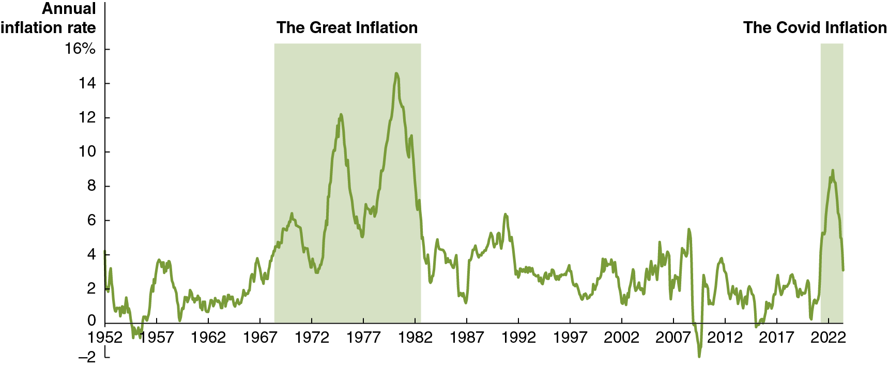{height=99%}

The figure shows C P I inflation in the United States. + Since rising prices erode the value of money as a medium of exchange and a store of value, policymakers in most countries pursue price stability as a primary goal.

## Fed Goal #2: High Employment

Fed Goal #2: High Employment

At the end of World War

Congress passed the Employment

Act of 19 46, which stated that it was the: + “responsibility of the Federal Government… to foster and promote… conditions under which there will be afforded useful employment, for those able, willing, and seeking to work, and to promote maximum employment, production, and purchasing power.” + Price stability and high employment are often referred to as the dual mandate of the Fed.

## Fed Goal #3: Stability of Financial Markets and Institutions

Fed Goal #3: Stability of Financial Markets and Institutions

Stable and efficient financial markets are essential to a growing economy. + The Fed makes funds available to banks in times of crisis, ensuring confidence in those banks. + In 2008, the Fed temporarily made these discount loans available to investment banks also, to ease their liquidity problems. + In 2020, the Fed did the same during the Covid-19 pandemic, in addition to some new lending facilities.

## Fed Goal #4: Economic Growth

Fed Goal #4: Economic Growth

Economic growth, particularly stable economic growth, encourages long-run investment, which is itself necessary for growth. + It is not clear to what extent the Fed can really encourage long-run investment, beyond meeting the previous three goals; Congress and the president may be in a better position to address this goal.

## 15.2 The Federal Funds Rate and How the Fed Conducts Monetary Policy

15.2 The Federal Funds Rate and How the Fed Conducts Monetary Policy

Describe how the Fed uses changes in interest rates to conduct monetary policy.

The Fed would like to see aggregate demand increase at a rate that keeps real G D P close to potential G D P. + The main way the Fed can influence aggregate demand is through interest rates. + The interest rates that have the most effect on aggregate demand are the real interest rates on mortgage loans, corporate bonds, and U.S. Treasury bonds—all long-term interest rates. + One problem the Fed faces is that it can mostly affect short-term interest rates rather than long-term interest rates.

## The Importance of the Federal Funds Rate

The Importance of the Federal Funds Rate

While banks are no longer required to hold substantial reserves, they still do so because: + The interest they earn on reserves is risk-free. + Large banks must maintain enough high-quality liquid assets to comply with regulations.

When banks need additional reserves, they borrow in the federal funds market, paying the federal funds rate on these very short-term loans—often just overnight. + Federal funds rate: The interest rate banks charge each other for overnight loans.

## How the Fed Uses the Federal Funds Rate

How the Fed Uses the Federal Funds Rate

The Federal Open Market Committee (F O M C) does not control the federal funds rate directly, but instead sets targets for it; in October 2023 the target was 5.25 to 5.50 percent. + The Fed uses different monetary policy tools in different circumstances to influence the federal funds rate.

## Controlling the Federal Funds Rate

Controlling the Federal Funds Rate

The Fed uses different tools to control the federal funds rate depending on the level of reserves banks choose to keep:

## Figure 15.2 Equilibrium in the Federal Funds Market in a Scarce-Reserves Regime (1 of 3)

Figure 15.2 Equilibrium in the Federal Funds Market in a Scarce-Reserves Regime (1 of 3)

{height=99%}

The demand for reserves is downward sloping because as the federal funds rate increases, the opportunity cost to banks of holding excess reserves increases. + The discount rate is a ceiling on the demand for reserves, and the interest rate on reserve balances (I O R B) is a floor.

## Figure 15.2 Equilibrium in the Federal Funds Market in a Scarce-Reserves Regime (2 of 3)

Figure 15.2 Equilibrium in the Federal Funds Market in a Scarce-Reserves Regime (2 of 3)

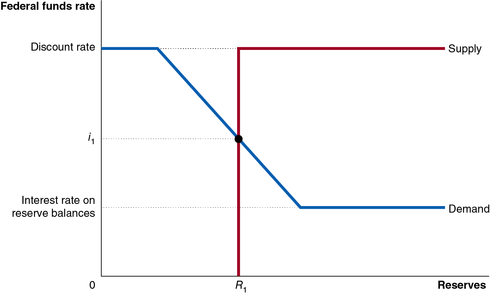{height=99%}

The supply of reserves is a vertical line because we assume the Fed can supply the quantity of reserves it needs to achieve its target federal funds rate. + Supply becomes horizontal because we assume that the Fed will supply banks with whatever reserves they want at the discount rate.

## Figure 15.2 Equilibrium in the Federal Funds Market in a Scarce-Reserves Regime (3 of 3)

Figure 15.2 Equilibrium in the Federal Funds Market in a Scarce-Reserves Regime (3 of 3)

{height=99%}

Equilibrium occurs where the quantity of reserves demanded by banks equals the quantity of reserves supplied by the Fed. + By controlling the quantity of reserves supplied, the Fed can change the federal funds rate.

## Figure 15.3 The Fed Increases the Federal Funds Rate in an Ample-Reserves Regime (1 of 2)

Figure 15.3 The Fed Increases the Federal Funds Rate in an Ample-Reserves Regime (1 of 2)

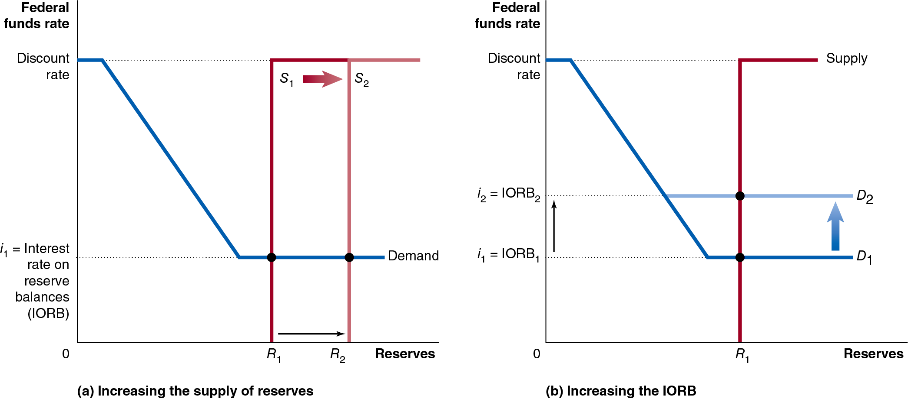{height=99%}

When banks hold more reserves than they need, changing the supply of reserves does not change the equilibrium federal funds rate—panel (a). + In this situation, the federal funds rate equals the interest on reserve balances (I O R B).

## Figure 15.3 The Fed Increases the Federal Funds Rate in an Ample-Reserves Regime (2 of 2)

Figure 15.3 The Fed Increases the Federal Funds Rate in an Ample-Reserves Regime (2 of 2)

{height=99%}

Instead, the Fed can affect the equilibrium federal funds rate by controlling the I O R B. + Raising the I O R B will raise the federal funds rate—panel (b).

## Figure 15.4 The I O R B and the Federal Funds Rate

Figure 15.4 The I O R B and the Federal Funds Rate

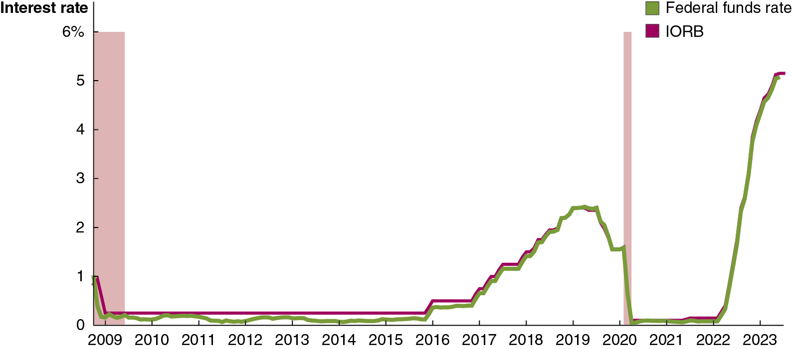{height=99%}

Even in an ample-reserves regime, the federal funds rate and I O R B don’t exactly match; the federal funds rate can be lower than the I O R B. + Why? Some government-sponsored enterprises like Fannie Mae can borrow and lend in the federal funds market, but they earn no interest on their deposits with the Fed; so they are willing to lend funds at below the I O R B.

## The Interest Rate on Overnight Reverse Repurchase Agreements (O N R R P)

The Interest Rate on Overnight Reverse Repurchase Agreements (O N R R P)

In order to put a true floor under the value of the federal funds rate, the Fed uses the interest rate it pays on overnight reverse repurchase agreements (O N R R P): financial transactions in which the Fed borrows funds overnight from a financial firm. + Under a reverse repurchase agreement, the Fed sells a security to a financial firm with the promise to buy it back the next day. This results in the firm investing funds overnight with the Fed. + G S E s like Fannie Mae are allowed to use these O N R R P s, and they are risk-free, so this creates a true lower bound for the federal funds rate.

## Effectiveness of Administered Rates

Effectiveness of Administered Rates

The interest rate on reserve balances (I O R B) and the interest rate on overnight reverse repurchase agreements (O N R R P) are set by the Fed, rather than resulting from a market equilibrium; we call those administered rates. + Using these rates, the Fed can tightly control the federal funds rate: in October 2023, the I O R B was 5.40 percent, the federal funds rate was 5.33 percent, and the interest rate on O N R R P s was 5.40 percent. + Because the Fed is putting a floor under the federal funds rate, we say it is using a floor operating system: The current system under which the Fed uses the interest rate on banks’ reserve balances and the interest rate on overnight loans with financial firms to establish a floor under the federal funds rate.

## Figure 15.5 Quantitative Easing Led to Large Increases in Bank Reserves (1 of 3)

Figure 15.5 Quantitative Easing Led to Large Increases in Bank Reserves (1 of 3)

{height=99%}

When the economy is in a recession, the Fed would like to lower the federal funds rate to increase aggregate demand. + But the rate cannot go below zero: financial firms won’t pay to lend money to the Fed. This is the zero lower bound. + To conduct more expansionary monetary policy, the Fed performs quantitative easing and forward guidance.

## Figure 15.5 Quantitative Easing Led to Large Increases in Bank Reserves (2 of 3)

Figure 15.5 Quantitative Easing Led to Large Increases in Bank Reserves (2 of 3)

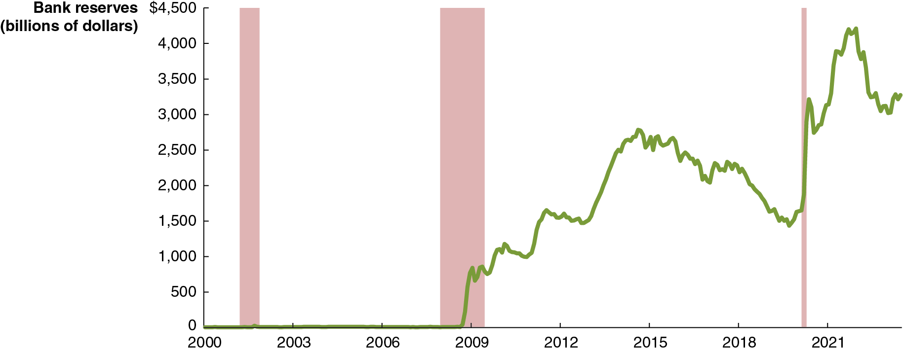{height=99%}

Quantitative easing: The Fed policy that attempts to increase aggregate demand by buying long-term securities, such as 10-year Treasury notes. + The Fed relied on quantitative easing when facing the zero lower bound for the federal funds rate, both during the Great Recession and during the Covid-19 pandemic. + Buying these long-term Treasury securities and mortgage-backed securities increased their prices and hence reduced their interest rates or yields.

## Figure 15.5 Quantitative Easing Led to Large Increases in Bank Reserves (3 of 3)

Figure 15.5 Quantitative Easing Led to Large Increases in Bank Reserves (3 of 3)

{height=99%}

To be effective, monetary policy needs to affect long-term interest rates, such as the interest rates on corporate bonds and on mortgages. + Forward guidance refers to statements by the Federal Open Market Committee about how it will conduct monetary policy in the future. + Forward guidance signals to households, firms, and investors that the Fed intends to keep the target for the federal funds rate near zero for a prolonged period, encouraging investors to believe rates will remain low in the future.

## Summary of the Fed’s Monetary Policy Tools (1 of 2)

Summary of the Fed’s Monetary Policy Tools (1 of 2)

The Fed’s two most important tools:

Interest on reserve balances (I O R B)—to manage the federal funds rate + The interest rate on overnight reverse repurchase agreements (O N R R P)—for a lower bound on the federal funds rate

The two tools the fed uses when faces with a zero lower bound:

Quantitative easing—when the Fed faces the zero lower bound on the federal funds rate + Forward guidance—to signal the Fed’s intent to keep the federal funds rate close to zero for a prolonged time

## Summary of the Fed’s Monetary Policy Tools (2 of 2)

Summary of the Fed’s Monetary Policy Tools (2 of 2)

The Fed’s three traditional tools:

Open market operations—buying and selling Treasury securities to adjust the level of reserves in order to control the federal funds rate; the main tool the Fed used in a scarce-reserves regime + Discount rate—the interest rate the Fed charges for discount loans, made to firms in the Fed’s capacity as the lender of last resort; set higher than the federal funds rate, and sometimes called the penalty rate + Reserve requirements—until March 2020 the Fed specified a minimum percentage of checking deposits banks needed to keep, called the required reserve ratio; in practice, the Fed hadn’t used this tool in decades

## 15.3 Monetary Policy and Economic Activity

15.3 Monetary Policy and Economic Activity

Use aggregate demand and aggregate supply graphs to show the effects of monetary policy on real G D P and the price level.

The ability of the Fed to affect economic variables such as real G D P depends on its ability to affect long-term real interest rates. + It uses the federal funds rate (a short-term nominal interest rate) for this—an imperfect tool.

## Figure 15.6 How the Fed Attempts to Achieve Its Policy Goals

Figure 15.6 How the Fed Attempts to Achieve Its Policy Goals

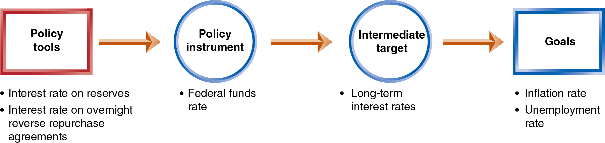{height=99%}

For monetary policy to be effective, the links in the chain above must be reliable. + The first link is very reliable, but the remaining ones are more uncertain. + We will assume in this section that the Fed can affect long-term real interest rates using its policy tools.

## How Interest Rates Affect Aggregate Demand

How Interest Rates Affect Aggregate Demand

Consumption + Lower interest rates encourage buying on credit, which typically affects the sale of durables. Lower rates also discourage saving.

Investment + Lower interest rates encourage capital investment by firms: + By making it cheaper to borrow (sell corporate bonds). + By making stocks more attractive for households to purchase, allowing firms to raise funds by selling additional stock. + Lower rates also encourage new residential investment.

Net exports + High U.S. interest rates attract foreign funds, raising the $U S exchange rate, causing net exports to fall.

## Figure 15.7 Monetary Policy (1 of 2)

Figure 15.7 Monetary Policy (1 of 2)

The Fed conducts expansionary monetary policy when it takes actions to decrease interest rates to increase real G D P. + This works because decreases in interest rates raise consumption, investment, and net exports.

The Fed would take this action when short-run equilibrium real G D P was below potential real G D P. + The increase in aggregate demand encourages increased employment, one of the Fed’s primary goals.

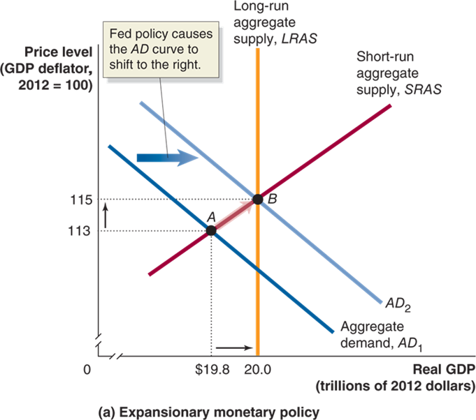{height=99%}

## Figure 15.7 Monetary Policy (2 of 2)

Figure 15.7 Monetary Policy (2 of 2)

Sometimes the economy may be producing above potential G D P. + In that case, the Fed may perform contractionary monetary policy: increasing interest rates to reduce inflation.

Why would the Fed intentionally reduce real G D P? + The Fed is mostly concerned with long-run growth. If it determines that inflation is a danger to long-run growth, it can contract the money supply to discourage inflation, that is, encouraging price stability.

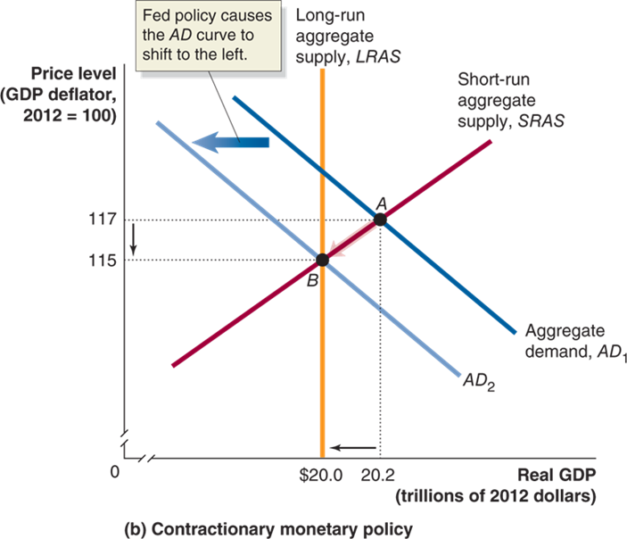{height=99%}

## Can the Fed Eliminate Recessions?

Can the Fed Eliminate Recessions?

In our demonstration of monetary policy, the Fed + knew how far to shift aggregate demand, and + was able to shift aggregate demand exactly this far.

In practice, monetary policy is much harder to get right than the graphs make it appear. + Completely offsetting a recession is not realistic; the best the Fed can hope for is to make recessions milder and shorter.

Another complicating factor is that current economic variables are not known; we usually can only know them for the past—that is, with a lag. + In November 2001, N B E R announced that the economy was in a recession that had begun in March 2001; several months later, it announced the recession ended… in November 2001.

## Figure 15.8 The Effect of a Poorly Timed Monetary Policy on the Economy

Figure 15.8 The Effect of a Poorly Timed Monetary Policy on the Economy

Suppose a recession begins in August 2026. + The Fed finds out about the recession with a lag. + In June 2027, the Fed starts expansionary monetary policy, but the recession has already ended.

By keeping interest rates low for too long, the Fed encourages real G D P to go far beyond potential G D P. The result: + High inflation + The next recession will be more severe.

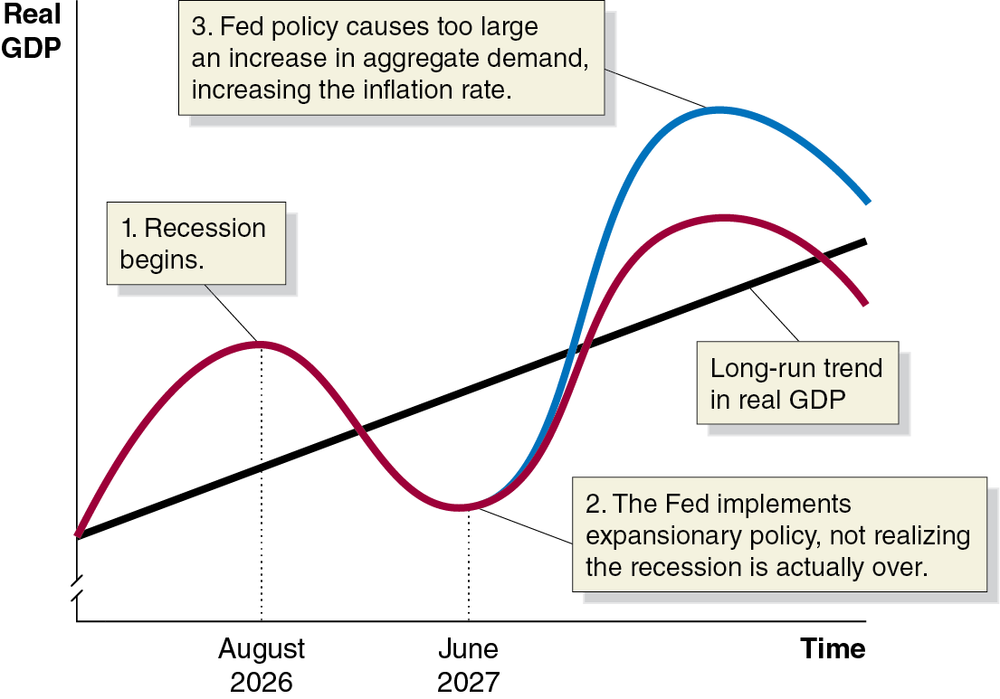{height=99%}

## Table 15.1 Fed Forecasts of Real G D P Growth During 2007 and 2008

Table 15.1 Fed Forecasts of Real G D P Growth During 2007 and 2008

The Fed tries to set policy according to what it forecasts the state of the economy will be in the future. + Good policy requires accurate forecasts.

The forecasts of most economists in

did not anticipate the

severity of the coming recession. + So the Fed missed the opportunity to dampen the effects of the recession

## Apply the Concept: Trying to Hit a Moving Target

Apply the Concept: Trying to Hit a Moving Target

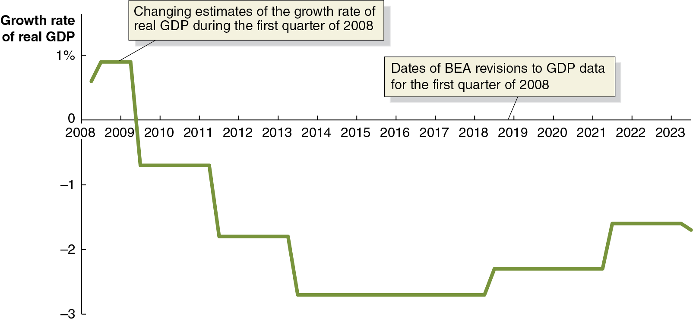{height=99%}

As if the Fed’s job wasn’t hard enough, it also has to deal with changing estimates of important economic variables. + G D P from the first quarter of 2008 was initially estimated to have increased by 0.6 percent. But the estimate changed over time. + Not only was it revised later in 2008, it was revised in 2009, 2011, 2013, and even again in 2018 and 2021!

## Figure 15.9 Expansionary and Contractionary Monetary Policies

Figure 15.9 Expansionary and Contractionary Monetary Policies

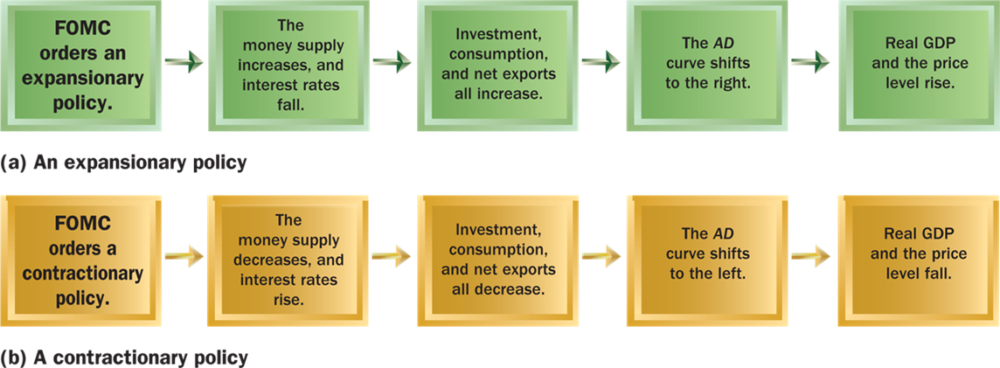{height=99%}

In each of these steps, the changes are relative to what would have happened without the monetary policy. + Expansionary monetary policy is sometimes called “loose” or “easy” monetary policy. + Contractionary monetary policy is “tight” monetary policy.

## 15.4 Monetary Policy in the Dynamic Aggregate Demand and Aggregate Supply Model

15.4 Monetary Policy in the Dynamic Aggregate Demand and Aggregate Supply Model

Use the dynamic aggregate demand and aggregate supply model to analyze monetary policy.

We used the static A D-A S model initially for simplicity. + But in reality, potential G D P increases every year (long-run growth) and the economy generally experiences inflation every year.

We can account for these in the dynamic aggregate demand and aggregate supply model. Recall that this features: + Annual increases in long-run aggregate supply (potential G D P) + Typically, larger annual increases in aggregate demand + Typically, smaller annual increases in short-run aggregate supply + Typically, therefore, annual increases in the price level

## Figure 15.10 An Expansionary Monetary Policy (1 of 2)

Figure 15.10 An Expansionary Monetary Policy (1 of 2)

In period 1, the economy is in long-run equilibrium at $20.0 trillion. + The Fed forecasts that aggregate demand will not rise fast enough, so that in period 2, the short-run equilibrium will fall below potential G D P, at $20.3 trillion.

{height=99%}

## Figure 15.10 An Expansionary Monetary Policy (2 of 2)

Figure 15.10 An Expansionary Monetary Policy (2 of 2)

So the Fed uses expansionary monetary policy to increase aggregate demand. + The result: real G D P at its potential and a higher level of inflation than would otherwise have occurred.

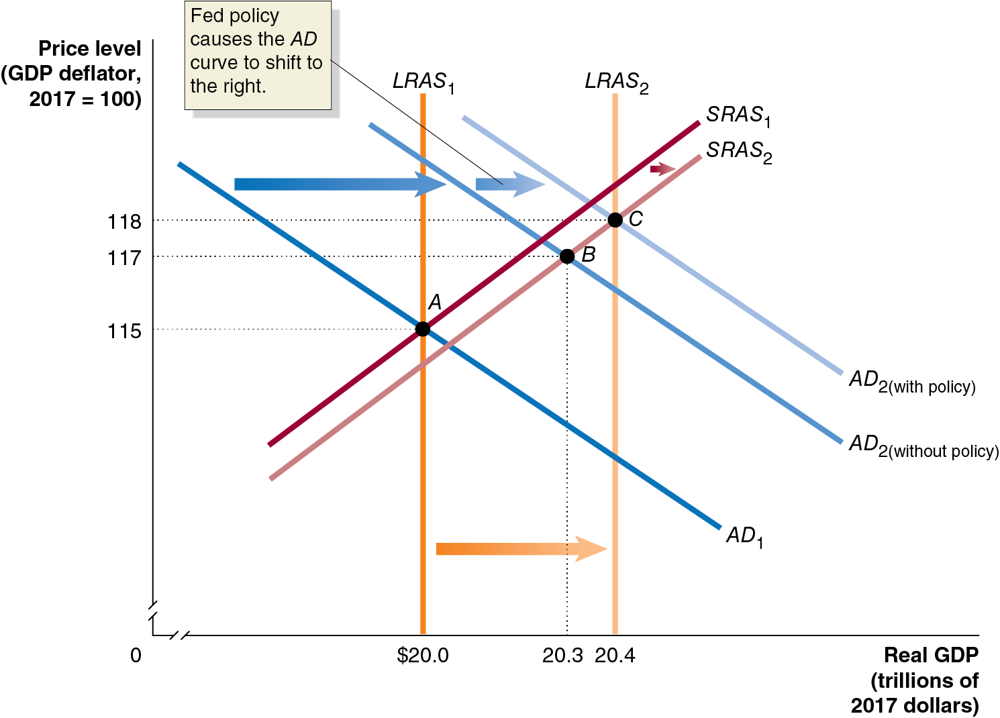{height=99%}

## Figure 15.11 A Contractionary Monetary Policy in 2006 (1 of 2)

Figure 15.11 A Contractionary Monetary Policy in 2006 (1 of 2)

In 2005, the Fed believed the economy was in long-run equilibrium. + In 2006, the Fed believed aggregate demand growth + was going to be “too high,” resulting in excessive inflation.

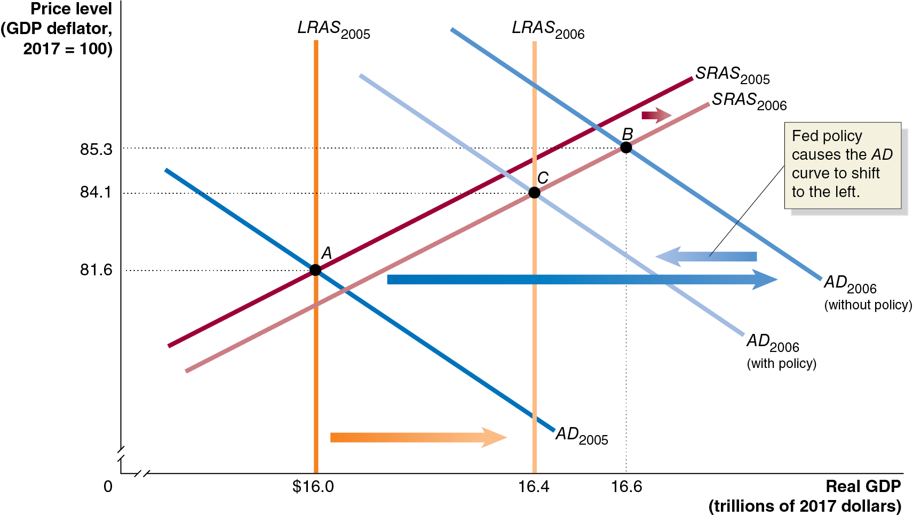{height=99%}

## Figure 15.11 A Contractionary Monetary Policy in 2006 (2 of 2)

Figure 15.11 A Contractionary Monetary Policy in 2006 (2 of 2)

So the Fed raised the federal funds rate—a contractionary monetary policy, designed to decrease inflation. + The result: lower real G D P and less inflation in 2006 than would otherwise have occurred.

{height=99%}

## 15.5 A Closer Look at the Fed’s Setting of Monetary Policy Targets

15.5 A Closer Look at the Fed’s Setting of Monetary Policy Targets

Describe the Fed’s setting of monetary policy targets.

In normal times, the Fed targets the federal funds rate. + One alternative to this is to target the money supply instead. + Should it use the money supply as its monetary policy target instead?

## Should the Fed Target the Money Supply?

Should the Fed Target the Money Supply?

Monetarists, led by Nobel Laureate Milton Friedman, said “yes.” + Friedman advocated a monetary growth rule, increasing the money supply at about the long-run rate of real G D P growth. + He argued that an active countercyclical monetary policy would serve to destabilize the economy; the monetary growth rule would provide stability instead.

Monetarism was popular in the 1970s, but since the 1980s, the link between the money supply and real G D P seems to have broken down: M1 and M2 seem to change “wildly,” but real G D P and inflation do not react in the same way. + Now, targeting the money supply is not seriously considered.

## The Taylor Rule

The Taylor Rule

The Taylor rule is a rule developed by John Taylor of Stanford University that links the Fed’s target for the federal funds rate to economic variables. Taylor estimates that the fed funds target rate should be defined as follows:

Federal funds target rate

where: + The equilibrium real federal funds rate is the estimate of the inflation-adjusted federal funds rate that would be consistent with maintaining real G D P at its potential level in the long run. + Inflation gap is the difference between current inflation and the Fed’s target rate of inflation (could be positive or negative) + Output gap is the difference between current real G D P and potential G D P (could be positive or negative)

## Figure 15.12 The Taylor Rule and Fed Behavior, 1960–2023 (1 of 2)

Figure 15.12 The Taylor Rule and Fed Behavior, 1960–2023 (1 of 2)

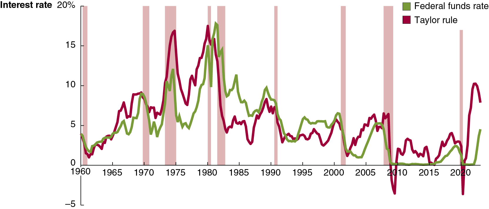{height=99%}

The Taylor rule does a good job of predicting the federal funds rate during most of this period, apart from the periods of high inflation in the 1970s and from early 2021 to early 2023, when the Taylor rule gives a higher target federal funds rate than the Fed used. + The Taylor rule also indicates a negative federal funds rate during 2009 and 2020, which isn’t possible because of the zero lower bound.

## Figure 15.12 The Taylor Rule and Fed Behavior, 1960–2023 (2 of 2)

Figure 15.12 The Taylor Rule and Fed Behavior, 1960–2023 (2 of 2)

{height=99%}

Following the Taylor rule would have resulted in a faster response to the Covid inflation than what the Fed actually enacted. + Taylor has proposed that the Fed adopt an explicit rule, like the Taylor rule, to guide its monetary policy actions. While the Fed need not exactly follow such a rule, it would be obliged to justify deviations. + The Fed resists such an approach, as it would limit its flexibility.

## Inflation Targeting and the Fed’s New Monetary Policy Strategy

Inflation Targeting and the Fed’s New Monetary Policy Strategy

Inflation targeting: A framework for conducting monetary policy that involves the central bank announcing its target level of inflation. + In 2012, the Fed announced its first explicit inflation target: an average inflation rate of 2 percent per year. + The Fed can deviate from this target during severe recessions. + Some economists and policymakers oppose an explicit inflation target, believing it reduces the Fed’s flexibility.

## Arguments For and Against Inflation Targeting

Arguments For and Against Inflation Targeting

For: + Makes it clear that the Fed cannot affect real G D P in the long run. + Easier for firms and households to form expectations about future inflation, improving their planning. + Promotes Fed account-ability—provides a yardstick against which performance can be measured.

Against: + Reduces the Fed’s flexibility to address, and accountability for, other policy goals. + Assumes the Fed can correctly forecast inflation rates, which may not be true. + Increased focus on inflation rate may result in Fed being less likely to address other beneficial goals.

## Average-Inflation Targeting

Average-Inflation Targeting

In August 2020, Fed Chair Powell announced a policy change: + “We will seek to achieve inflation that averages 2 percent over time. Therefore, following periods when inflation has been running below 2 percent, appropriate monetary policy will likely aim to achieve inflation moderately above 2 percent for some time… . Our approach could be viewed as a flexible form of average inflation targeting.” + This policy would affect inflation expectations: when inflation is higher than 2 percent, people would anticipate tighter monetary policy, and vice versa.

## Should the Fed Target Nominal G D P?

Should the Fed Target Nominal G D P?

Other economists and policymakers have suggested that the Fed should adopt nominal G D P targeting. + Example: If the Fed expected 3 percent annual real G D P growth and wanted 2 percent inflation, it would target 5 percent nominal real G D P growth. + If real G D P growth slowed, the policy would be expansionary. + If real G D P growth was faster than expected, the policy would be contractionary.

This policy is similar to a monetary growth rule, as desired by monetarists. + As of 2023, many central banks have adopted inflation targeting, while none had yet adopted nominal G D P targeting.

## Apply the Concept: Should the Fed Worry about the Prices of Food and Gasoline? (1 of 2)

Apply the Concept: Should the Fed Worry about the Prices of Food and Gasoline? (1 of 2)

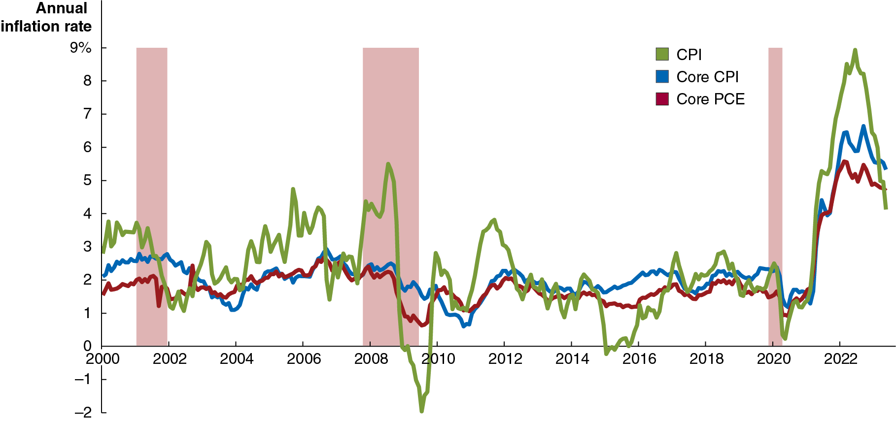{height=99%}

Which inflation rate does the Fed actually pay attention to? + Not the C P I: it is too volatile and probably overstates inflation. + It used to use the P C E (personal consumption expenditures) index, a broad price index similar to the G D P deflator.

## Apply the Concept: Should the Fed Worry about the Prices of Food and Gasoline? (2 of 2)

Apply the Concept: Should the Fed Worry about the Prices of Food and Gasoline? (2 of 2)

{height=99%}

Which inflation rate does the Fed actually pay attention to? + Since 2004, it has used the “core P C E”: the P C E without food and energy prices. The core P C E is more stable; the Fed believes it estimates true long-run inflation better.

## 15.6 Fed Policies During the 2007–2009 and 2020 Recessions

15.6 Fed Policies During the 2007–2009 and 2020 Recessions

Describe the policies the Federal Reserve used during the 2007–2009 and 2020 recessions.

A bubble in a market refers to a situation in which prices are too high relative to the underlying value of the asset. + Bubbles can form due to: + Herding behavior: Failing to correctly evaluate the value of the asset and instead relying on other people’s apparent evaluations; and/or + Speculation: Believing that prices will rise even higher and buying the asset intending to sell it before prices fall.

Example: Stock prices of internet-related companies were “optimistically” high in the late 19 90s, before the “dot-com bubble” burst, starting in March 2000.

## The Inflation and Deflation of the Housing Market Bubble

The Inflation and Deflation of the Housing Market Bubble

By 2005, many economists argued that a bubble had formed in the U.S. housing market. + The high prices resulted in high levels of investment in new home construction, along with optimistic sub-prime loans.

During 2006 and 2007, house prices started to fall, in part because of mortgage defaults, and new home construction fell considerably. + Banks became less willing to lend, and the resulting credit crunch further depressed the housing market.

## The Changing Mortgage Market

The Changing Mortgage Market

Until the 19 70s, when a commercial bank granted a mortgage, it would “keep” the loan until it was paid off. + This limited the number of mortgages banks were willing to provide.

A secondary market in mortgages was made possible by the formation of the Federal National Mortgage Association (“Fannie Mae”) and the Federal Home Loan Mortgage Corporation (“Freddie Mac”). + These government-sponsored enterprises (G S E s) sell bonds to investors and use the funds to purchase mortgages from banks. + This allowed more funds to flow into mortgage markets.

## The Role of Investment Banks

The Role of Investment Banks

By the 2000s, investment banks had started buying mortgages also, packaging them as mortgage-backed securities and reselling them to investors. + These securities were appealing to investors because they paid high interest rates with apparently low default risk.

But with more money flowing into mortgage markets, “worse” loans started to be made to people: + With worse credit histories (sub-prime loans) + Without evidence of income (“Alt-A” loans) + With lower down-payments + Who couldn’t initially afford traditional mortgages (adjustable-rate mortgages start with low interest rates)

## Apply the Concept: The Wonderful World of Leverage

Apply the Concept: The Wonderful World of Leverage

Why does the size of the down payment matter? + By owning a house, you become exposed to increases or decreases in the price of that large asset. + With a smaller down payment, you are said to be highly leveraged, exposed to large potential changes in the value of your investment.

## Result of the Lower Quality Loans

Result of the Lower Quality Loans

When the housing bubble burst, more of these lower-quality loans were defaulted on than investors were expecting. + The market for securities based on these loans became very illiquid—few people or firms were willing to buy them, and their prices fell quickly. + Many commercial and investment banks were invested heavily in these mortgage-backed securities, and so suffered heavy losses.

These problems were so profound that the Fed and the U.S. Treasury decided to take unprecedented actions.

## Table 15.2 Treasury and Fed Actions at the Beginning of the Financial Crisis of 2007–2009 (1 of 2)

Table 15.2 Treasury and Fed Actions at the Beginning of the Financial Crisis of 2007–2009 (1 of 2)

## Table 15.2 Treasury and Fed Actions at the Beginning of the Financial Crisis of 2007–2009 (2 of 2)

Table 15.2 Treasury and Fed Actions at the Beginning of the Financial Crisis of 2007–2009 (2 of 2)

## Responses to the Failure of Lehman Brothers

Responses to the Failure of Lehman Brothers

Many economists were critical of the Fed underwriting Bear Stearns, as managers would now have less incentive to avoid risk: a moral hazard problem. + So in September 2008, the Fed did not step in to save Lehman Brothers, another investment bank experiencing heavy losses. This was supposed to signal to firms not to expect the Fed to save them from their own mistakes.

Lehman Brothers declared bankruptcy on September 15, 2008. + Financial markets reacted adversely—more strongly than expected. + When American International Group (A I G) began to fail a few days later, the Fed reversed course, providing them with a $85 billion loan.

## The Fed Responds to the Covid-19 Recession

The Fed Responds to the Covid-19 Recession

The Fed cut its target for the federal funds rate to zero and introduced temporary lending facilities that would allow it to make loans to businesses other than commercial banks. + The Fed used two types of lending facilities: + Liquidity facilities: expanding its role as lender of last resort to firms in the shadow banking system, and aggressively lending in the repurchase market + Credit facilities: allowing the Fed to provide funds directly to nonfinancial firms, and to state and local governments

These actions helped to avoid a credit crunch like during the 2007–2009 recession; but they probably prevented the Fed from acting quickly to combat inflation.

## Online Appendix: The Money Market

Online Appendix: The Money Marketand the Fed

Describe how the Federal Reserve can use control of the money supply to affect short-term interest rates.

A model of the money market provides some insight into factors that can affect short-term interest rates. + This model was more important when there seemed to be stronger links between the money supply and economic variables of interest, like output, unemployment, and the price level. + The Fed stopped setting targets for the money supply in 1993.

## Figure 15A.1 The Demand for Money

Figure 15A.1 The Demand for Money

Higher interest rates result in a lower quantity of money demanded. + Why? When the interest rate is high, interest-earning alternatives to holding money begin to look attractive—like U.S. Treasury bills. + The opportunity cost of holding money is higher when the interest rate is high.

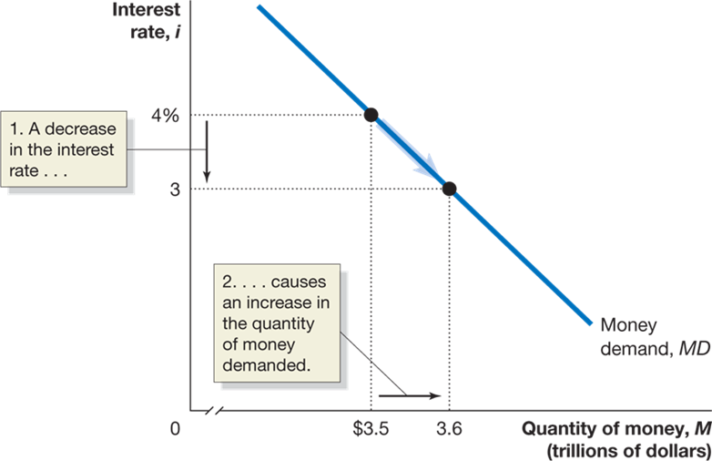{height=99%}

## Figure 15A.2 Shifts in the Money Demand Curve

Figure 15A.2 Shifts in the Money Demand Curve

What could cause the money demand curve to shift? + A change in the need to hold money, to engage in transactions.

For example, if more transactions are taking place (higher real G D P) or more money is needed for each transaction (higher price level), the demand for money will be higher. + Decreases in real G D P or the price level decrease money demand.

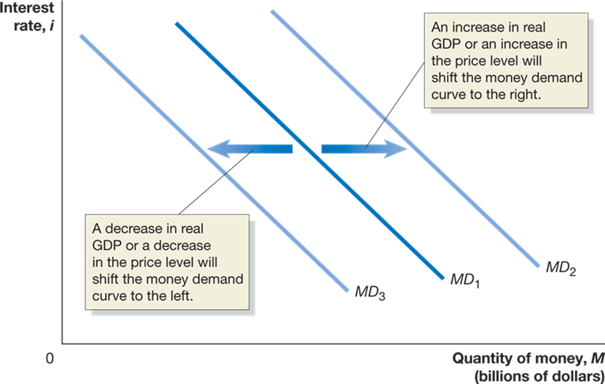{height=99%}

## How Does the Fed Manage the Money Supply?

How Does the Fed Manage the Money Supply?

We saw in Chapter 24 that the Fed could alter the money supply by buying and selling U.S. Treasury securities—open market operations. + To increase the money supply, the Fed buys those securities; the sellers deposit the sale proceeds in a checking account; and the money gets loaned out—increasing the money supply. + Contracting the money supply would require selling securities.

## Figure 15A.3 The Effect on the Interest Rate When the Fed Increases the Money Supply

Figure 15A.3 The Effect on the Interest Rate When the Fed Increases the Money Supply

For simplicity, we assume the Fed can completely control the money supply. + Then the money supply + curve is a vertical line— it does not depend on the interest rate.

Equilibrium occurs in the money market where the two curves cross. + When the Fed increases the money supply, the short-term interest rate must fall until it reaches a level at which households and firms are willing to hold the additional money.

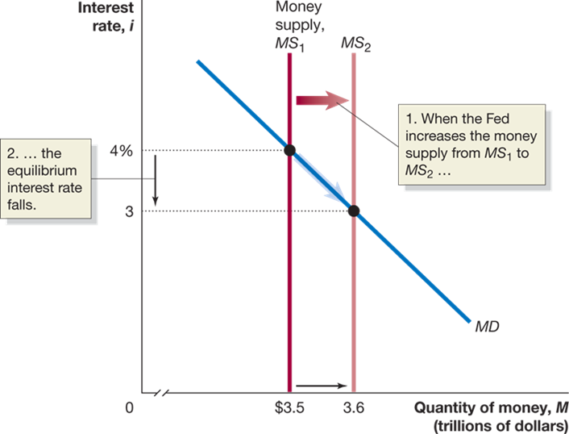{height=99%}

## Figure 15A.4 The Effect on the Interest Rate When the Fed Decreases the Money Supply

Figure 15A.4 The Effect on the Interest Rate When the Fed Decreases the Money Supply

Alternatively, the Fed may decide to lower the money supply by selling Treasury securities. + Now firms and households (who bought the securities with money) hold less money than they want, relative to other financial assets. + To retain depositors, banks are forced to offer a higher interest rate on interest-bearing accounts.

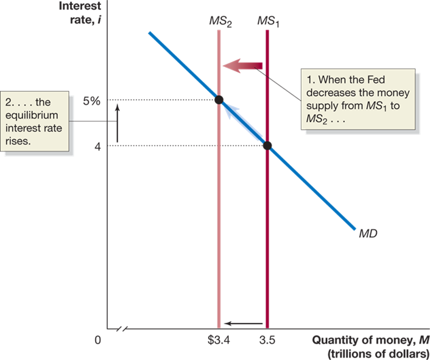{height=99%}

## A Tale of Two Interest Rates

A Tale of Two Interest Rates

We now have two models of the interest rate: + The loanable funds model (Chapter 20) + Concerned with long-term real rate of interest + Relevant for long-term investors (firms making capital investments, households building new homes, etc.)

The money market model (this chapter) + Concerned with short-term nominal rate of interest + Most relevant for the Fed: changes in money supply directly affect this interest rate

Usually, the two interest rates are closely related; an increase in one results in the other increasing also.

## Choosing a Monetary Policy Target

Choosing a Monetary Policy Target

The Fed can choose to target a particular level of the money supply or a particular short-term nominal interest rate. + Apart from a period in the late 1970s and early 1980s, the Fed has focused on interest rates rather than the money supply. + One reason: the relationship between the money supply (M1 or M2) and real G D P growth broke down in the early 1980s (M1) and 1990s (M2).

## Figure 15A.5 The Fed Can’t Target Both the Money Supply and the Interest Rate

Figure 15A.5 The Fed Can’t Target Both the Money Supply and the Interest Rate

It might seem that the Fed could “get the best of both worlds” by targeting both interest rates and the money supply. + But this is impossible: the two are linked through the money demand curve, which the Fed does not control. + So a decrease in the money supply will increase interest rates; an increase in the money supply will decrease interest rates.

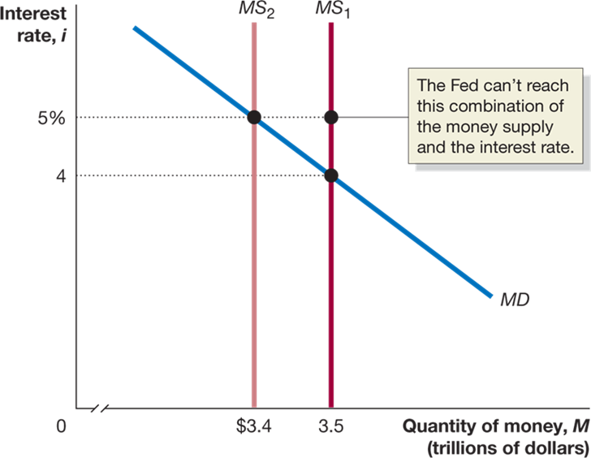{height=99%}

## Copyright

Copyright

{height=99%}

This work is protected by United States copyright laws and is provided solely for the use of instructors in teaching their courses and assessing student learning. Dissemination or sale of any part of this work (including on the World Wide Web) will destroy the integrity of the work and is not permitted. The work and materials from it should never be made available to students except by instructors using the accompanying text in their classes. All recipients of this work are expected to abide by these restrictions and to honor the intended pedagogical purposes and the needs of other instructors who rely on these materials.

