## Macroeconomics

Macroeconomics

Ninth Edition

{height=99%}

Chapter 16

Fiscal Policy

{height=99%}

Copyright © 2025, 2021, 2018 Pearson Education, Inc. All Rights Reserved

## Chapter Outline

Chapter Outline

16.1 What Is Fiscal Policy? + 16.2 The Effects of Fiscal Policy on Real G D P and the Price Level + 16.3 Fiscal Policy in the Dynamic Aggregate Demand and Aggregate Supply Model + 16.4 The Government Purchases, Tax, and Transfer Payment Multipliers + 16.5 The Limits to Using Fiscal Policy to Stabilize the Economy + 16.6 Deficits, Surpluses, and Federal Government Debt + 16.7 Long-Run Fiscal Policy and Economic Growth + Online Appendix A Closer Look at the Multiplier

## Can Fiscal Policy Increase Economic Growth?

Can Fiscal Policy Increase Economic Growth?

To offset the worst effects of the Covid-19 recession, the federal government enacted the largest discretionary policy actions in U.S. history. + The federal government distributed around $800 billion directly to households. This kept households spending during the recession, helping firms and households. + This spending had a cost: large federal budget deficits. + What are the short-term and long-term consequences of these actions?

{height=99%}

## 16.1 What Is Fiscal Policy?

16.1 What Is Fiscal Policy?

Define fiscal policy.

Fiscal policy refers to changes in federal government purchases, transfer payments, and taxes that are intended to achieve  macroeconomic policy objectives. + (State taxes and spending are not generally aimed at affecting national level objectives.) + Some forms of government spending and taxes automatically increase or decrease along with the business cycle; these are automatic stabilizers. + Example: Unemployment insurance payments are larger during a recession. + Discretionary fiscal policy, on the other hand, refers to intentional actions the government takes to change spending or taxes.

## Figure 16.1 The Federal Government’s Share of Total Government Expenditures, 1929–2022

Figure 16.1 The Federal Government’s Share of Total Government Expenditures, 1929–2022

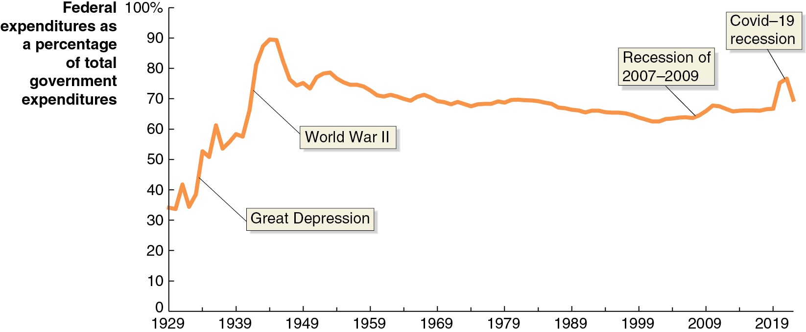{height=99%}

Before the Great Depression of the 1930s, most government spending was at the state or local level; now the federal government’s share is two-thirds to three-quarters.

## Figure 16.2 Federal Purchases and Federal Expenditures as a Percentage of G D P, 1950–2022

Figure 16.2 Federal Purchases and Federal Expenditures as a Percentage of G D P, 1950–2022

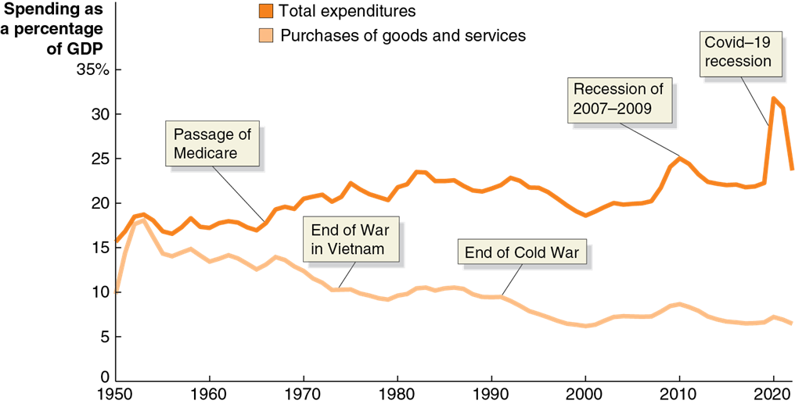{height=99%}

As a percentage of G D P, federal expenditures are now higher than ever—over 30 percent of G D P. + However, a smaller proportion is now spent on government purchases of goods and services (mostly military spending).

## Figure 16.3 Federal Government Expenditures, 2022

Figure 16.3 Federal Government Expenditures, 2022

Federal government purchases consist of defense spending and “everything else,” like salaries of + F B I agents, operating national parks, and funding scientific research. + Around half of federal expenditures are spent on transfer payments, like Social Security, Medicare, and unemployment insurance. + The rest is spent on grants to state and local governments to support their activities, like crime prevention and education, and on paying interest on the federal debt.

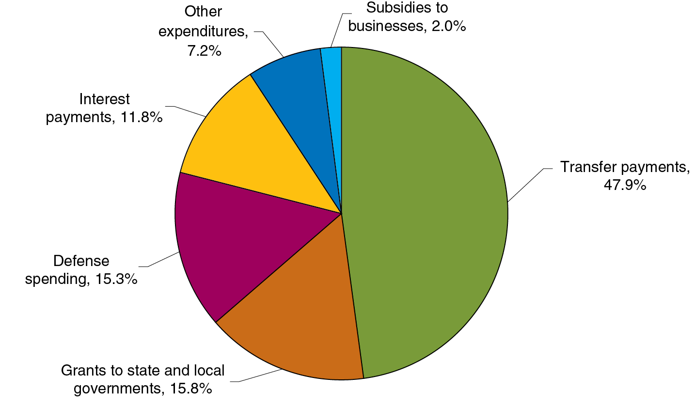{height=99%}

## Figure 16.4 Federal Government Revenue, 2022

Figure 16.4 Federal Government Revenue, 2022

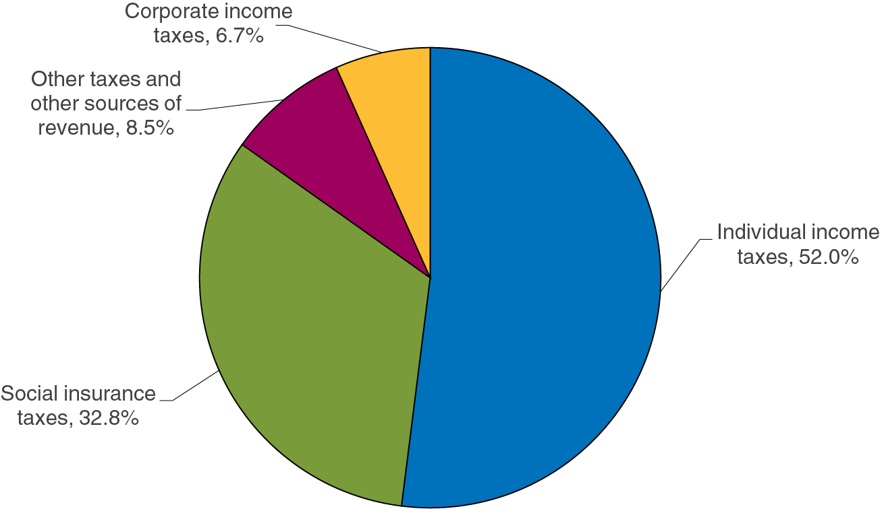{height=99%}

Most federal revenues come from taxes on individual employment: individual income taxes and payroll taxes earmarked to fund Social Security and Medicare. + Taxes on firm profits constitute about 6.7 percent of federal receipts. + The remainder of federal revenue comes from excise taxes, tariffs on imports, and other fees from firms and individuals.

## Apply the Concept: Social Security and Medicare: Fiscal Time Bombs? (1 of 2)

Apply the Concept: Social Security and Medicare: Fiscal Time Bombs? (1 of 2)

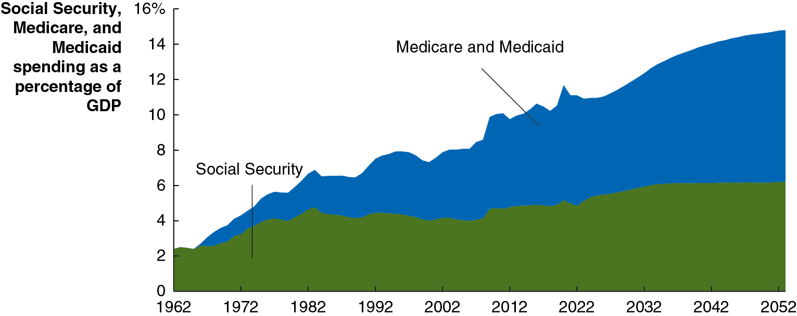{height=99%}

Social Security and Medicare have helped to reduce poverty among the elderly, while Medicaid helps improve the health of poor people. + But the aging population and rising health care costs are combining to put those programs in jeopardy. + Through 2092, the budget shortfall for these programs is estimated to be enormous: almost $16.8 trillion (in present value terms).

## Apply the Concept: Social Security and Medicare: Fiscal Time Bombs? (2 of 2)

Apply the Concept: Social Security and Medicare: Fiscal Time Bombs? (2 of 2)

How can these programs continue to exist? + It is likely that a combination of these measures will eventually need to be adopted: + Increasing taxes + Decreasing benefits (including slower benefit growth, perhaps differently for different income groups) + Decreasing eligibility (S S I age already increasing from 65 to 67)

But perhaps the most important element will be finding a way to reduce medical costs.

## 16.2 The Effects of Fiscal Policy on Real G D P and the Price Level

16.2 The Effects of Fiscal Policy on Real G D P and the Price Level

Explain how fiscal policy affects aggregate demand and how the government can use fiscal policy to stabilize the economy.

Congress and the president carry out fiscal policy through: + Changes in government purchases + Changes in taxes

A change in government purchases directly affects aggregate demand. + A change in taxes changes income; this in turn affects consumption, and so it has an indirect effect on aggregate demand.

## Figure 16.5 Fiscal Policy (1 of 2)

Figure 16.5 Fiscal Policy (1 of 2)

Expansionary fiscal policy involves increasing government purchases or decreasing taxes. + If the government believes real G D P will be below potential G D P, it can enact expansionary fiscal policy to restore long-run equilibrium—decreasing unemployment.

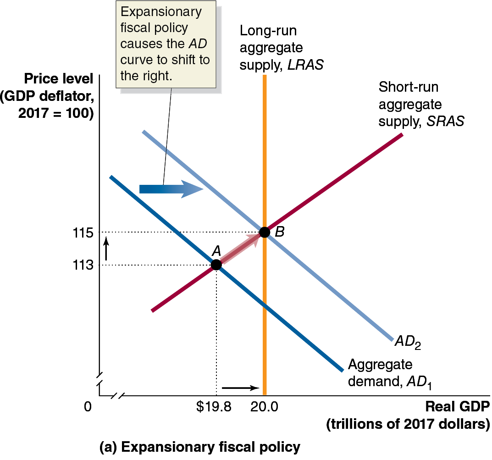{height=99%}

## Figure 16.5 Fiscal Policy (2 of 2)

Figure 16.5 Fiscal Policy (2 of 2)

Contractionary fiscal policy involves decreasing government purchases or increasing taxes. + This works just like expansionary fiscal policy, only in reverse. + If the government believes real G D P will be above potential G D P, it can enact contractionary fiscal policy to restore long-run equilibrium—decreasing inflation.

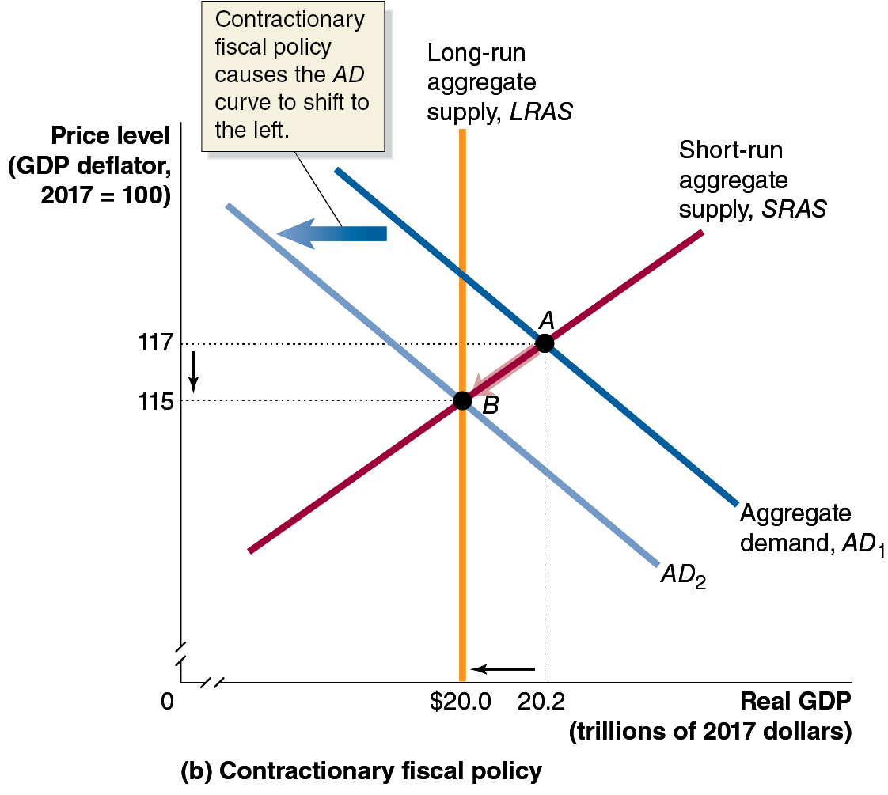{height=99%}

## Figure 16.6 The Covid-19 Pandemic: Aggregate Supply Shock and Aggregate Demand Shock

Figure 16.6 The Covid-19 Pandemic: Aggregate Supply Shock and Aggregate Demand Shock

Economic shutdowns shifted the S R A S to the left. + An A D shock also shifted the A D curve to the left. + The government enacted a large expansionary fiscal policy package, shifting A D to the right, to try to restore real G D P to its potential. + One cost: high inflation.

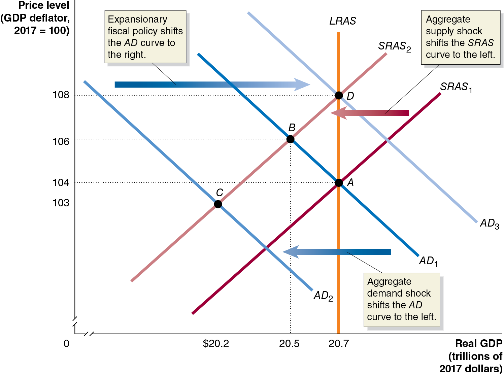{height=99%}

## Table 16.1 Countercyclical Fiscal Policy

Table 16.1 Countercyclical Fiscal Policy

The federal government’s actions described on the previous slides constitute a countercyclical fiscal policy. + Bear in mind that: + The effects described assume ceteris paribus: everything else is staying the same, including monetary policy. + Contractionary fiscal policy does not typically cause prices to fall; it causes inflation to be lower than it otherwise would have been.

## 16.3 Fiscal Policy in the Dynamic Aggregate Demand and Aggregate Supply Model

16.3 Fiscal Policy in the Dynamic Aggregate Demand and Aggregate Supply Model

Use the dynamic aggregate demand and aggregate supply model to analyze fiscal policy.

Our model of fiscal policy so far is static: it assumes long-run potential G D P does not change and that the price level is constant. + While the lessons from this model are still appropriate—Congress and the president can use fiscal policy to affect real G D P and the price level—our understanding of fiscal policy can be improved by seeing it in the dynamic aggregate demand and aggregate supply model.

## Figure 16.7 An Expansionary Fiscal Policy in the Dynamic Model

Figure 16.7 An Expansionary Fiscal Policy in the Dynamic Model

Initially, the economy is in long-run equilibrium. + The federal government projects that aggregate demand will not rise by enough to maintain full employment. + It enacts an expansionary fiscal policy to increase aggregate demand, hopefully to the full employment level.

The price level is higher than it would have been without the expansionary fiscal policy.

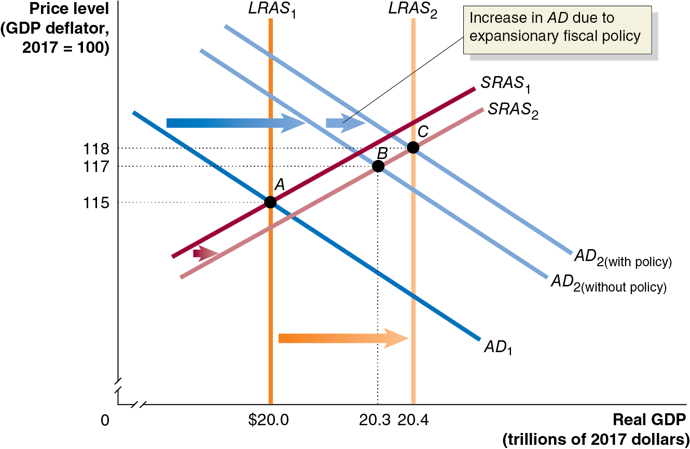{height=99%}

## Figure 16.8 A Contractionary Fiscal Policy in the Dynamic Model

Figure 16.8 A Contractionary Fiscal Policy in the Dynamic Model

The economy starts once more in long-run equilibrium. + The federal government projects that aggregate demand will rise so much that employment is beyond the full-employment level, causing high inflation. + It enacts a contractionary fiscal policy to decrease aggregate demand, again ideally to the full- employment level.

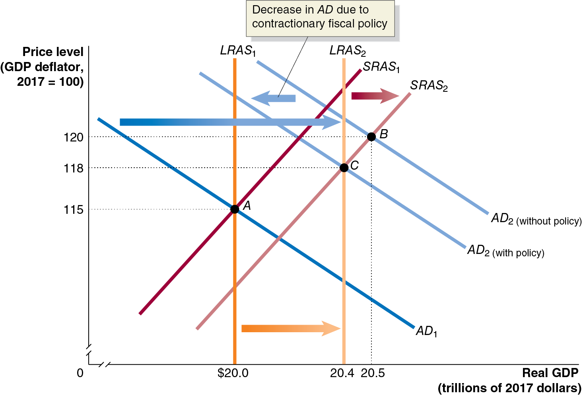{height=99%}

## 16.4 The Government Purchases, Tax,

16.4 The Government Purchases, Tax,and Transfer Payments Multipliers

Explain how the government purchases, tax, and transfer payments multipliers work.

If the government increases its spending on goods and services, then aggregate demand increases immediately. This is the autonomous increase in aggregate demand. + But then people receive this increased spending as increased income, increasing their consumption spending accordingly. This is the induced increase in aggregate demand. The autonomous increase is multiplied because of these induced increases. + Multiplier effect: The process by which a change in autonomous expenditure leads to a larger change in real G D P.

## Figure 16.9 The Multiplier Effect and Aggregate Demand

Figure 16.9 The Multiplier Effect and Aggregate Demand

Predicting the eventual (multiplied) effect of a change in autonomous expenditures requires knowing how big the multiplier is.

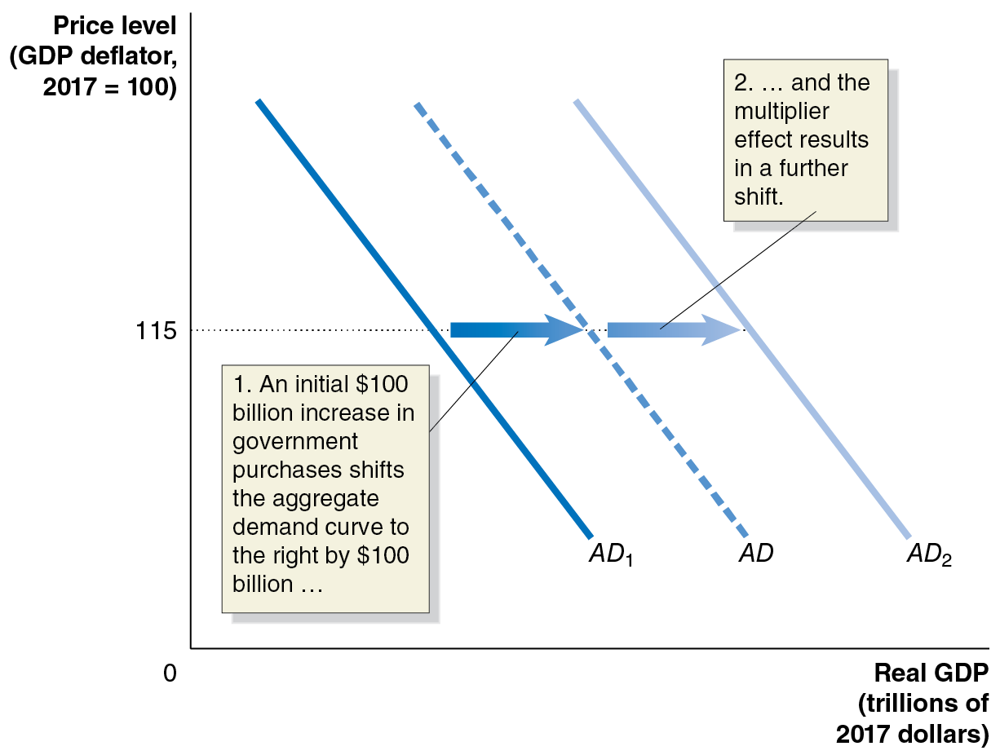{height=99%}

## Figure 16.10 The Multiplier Effect of an Increase in Government Purchases

Figure 16.10 The Multiplier Effect of an Increase in Government Purchases

Suppose each increase in spending induces by half as much consumption spending. + Over time, a $100 billion increase in government purchases will result in an additional $100 billion in induced consumption spending.

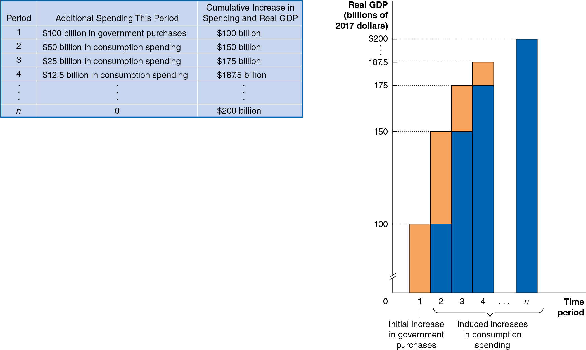{height=99%}

{height=99%}

## Multipliers for Government Purchases and Taxes

Multipliers for Government Purchases and Taxes

We can describe the total effect of a change (increase or decrease) in government purchases or taxes by measuring the change in equilibrium real G D P.

The tax multiplier will be a negative number: an increase in taxes will decrease equilibrium real G D P and vice versa. + We expect the tax multiplier to be smaller (in absolute value) than the government purchases multiplier. + Why? A $100 billion increase in purchases initially increases spending by $100 billion; but a $100 billion tax cut is partially spent and partially saved.

## The Transfer Payments Multiplier

The Transfer Payments Multiplier

Transfer payments are spending by the federal government for which it doesn’t receive a good or service in return. + Example: The American Rescue Plan, signed into law in March 2021, sent $1,400 checks to many people with “no strings attached.” + An increase in transfer payments increases household disposable income, which will increase consumption spending and have a multiplier effect. This multiplier is a positive number.

## The Effect of Changes in the Tax Rate

The Effect of Changes in the Tax Rate

The tax multiplier applies to changes in the amount of taxes, without changes in tax rates. + Example: In 2009 and 2010, the federal government enacted the Making Work Pay Tax Credit: a $400 reduction in taxes for working individuals ($800 for households). + Decreases in tax rates have a slightly different effect: + Increasing the disposable income of households, leading them to increase their consumption spending + Increasing the size of the multiplier effect, since more of any increase in income becomes disposable income

## Figure 16.11 The Multiplier Effect and Aggregate Supply

Figure 16.11 The Multiplier Effect and Aggregate Supply

An increase in aggregate demand will not only raise real G D P; it will also raise the price level because the short-run aggregate supply curve is upward sloping. + Suppose that between the autonomous and induced effects fiscal policy causes aggregate demand to increase by $0.2 trillion. + The resulting real G D P increase is smaller—only $0.1 trillion. The price level also rises.

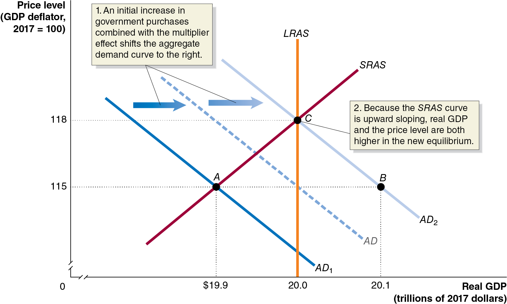{height=99%}

## The Multipliers Work in Both Directions

The Multipliers Work in Both Directions

An increase in government purchases and a cut in taxes have a positive multiplier effect. + A decrease in government purchases, and an increase in taxes have a negative multiplier effect. + Example: A reduction in government spending on defense initially affects defense contractors, but then it would spread to suppliers to and employees of those contractors and then to other firms and workers.

## 16.5 The Limits to Using Fiscal Policy to Stabilize the Economy

16.5 The Limits to Using Fiscal Policy to Stabilize the Economy

Discuss the difficulties that can arise in implementing fiscal policy.

For several reasons, fiscal policy may be even less effective than monetary policy at countercyclical stabilization: + Timing fiscal policy is harder, due to: + Legislative delay: Congress needs to agree on the actions. + Implementation delay: Large spending projects may take months or even years to begin, even once approved. + Government spending might crowd out private spending

Crowding out: A decline in private expenditures as a result of an increase in government purchases.

## Apply the Concept: Why Was the Recession of 2007–2009 So Severe? (1 of 2)

Apply the Concept: Why Was the Recession of 2007–2009 So Severe? (1 of 2)

The recession of 2007–2009 was the deepest recession in the United States since the Great Depression of the 1930s. + Why was this recession so deep?

## Apply the Concept: Why Was the Recession of 2007–2009 So Severe? (2 of 2)

Apply the Concept: Why Was the Recession of 2007–2009 So Severe? (2 of 2)

Economists Carmen Reinhart and Kenneth Rogoff studied recessions following financial crises for a variety of countries. + They found that such recessions were especially severe.

## Figure 16.12 The Effect of Crowding Out in the Short Run

Figure 16.12 The Effect of Crowding Out in the Short Run

A temporary increase in government purchases will cause decrease the supply of loanable funds, raising the equilibrium interest rate. + With the higher interest rate, consumption, investment, and net exports all fall. + The initial increase in spending is partially offset by the crowding out.

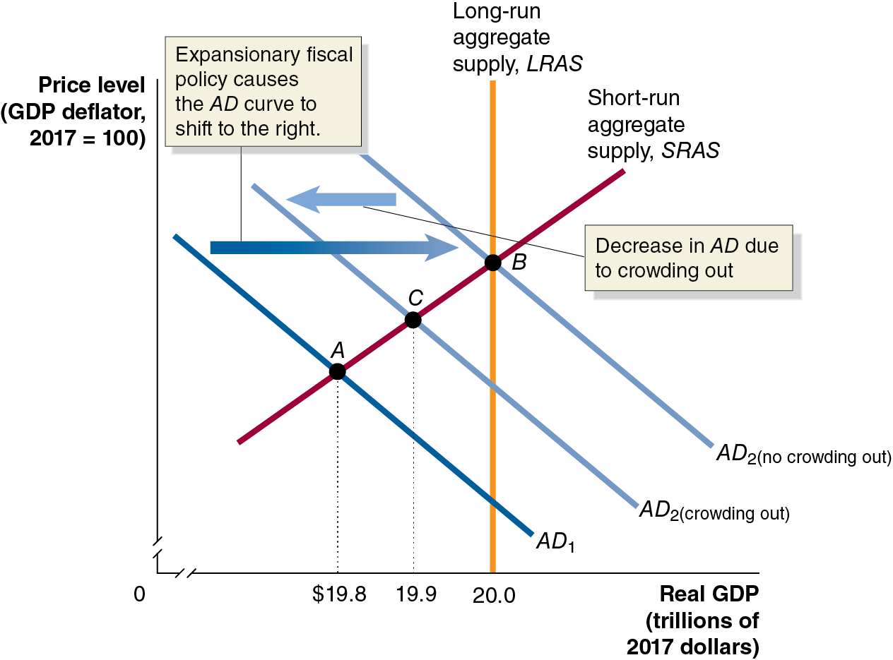{height=99%}

## Crowding Out in the Long Run

Crowding Out in the Long Run

In the long run, the increase in government purchases will have no effect on real G D P: the reduction in consumption, investment, and net exports will exactly offset the increase in government purchases. + Why? In the long run, the economy returns to potential + G D P, even without the government’s intervention. + The long-run effect is to increase the size of the government sector within the economy.

The long run may be many years away, however, so the intermediate increase in real G D P may be worth the cost.

## Fiscal Policy in Action: Did the Stimulus Package of 2009 Succeed?

Fiscal Policy in Action: Did the Stimulus Package of 2009 Succeed?

In early 2008, believing a recession was imminent, Congress authorized a tax cut: a one-time rebate of taxes already paid, totaling $95 billion. + This resulted in a boost to consumers’ current incomes. Changes to current incomes result in smaller increases in spending than changes to permanent incomes because people seek to “smooth” their consumption over time. + Economists estimate that consumers spent about 33–40 percent of the rebates they received, so the tax cut resulted in about $35 billion in increased spending.

## American Recovery and Reinvestment Act of 2009

American Recovery and Reinvestment Act of 2009

In 2009, Congress passed the American Recovery and Reinvestment Act, often called the “stimulus package.”  The $840 billion program was the largest fiscal policy action to that date in U.S. history. + About two-thirds of the stimulus package was spending increases. + The spending increases peaked in 2010 but were still occurring in 2013.

The remainder of the stimulus package took the form of individual tax cuts and tax credits. + Almost all of the tax-cut effects occurred quickly, in 2009–2011.

## How Effective Was the Stimulus Package?

How Effective Was the Stimulus Package?

To judge the effect of the stimulus package, we have to measure its effects holding constant all other factors affecting real G D P and employment. + Isolating the effects of the stimulus package is very difficult; economists still differ in their views about how effective the stimulus package was.

Further, such judgments are subject to political bias. + Many economists choose to rely on the estimates from the nonpartisan Congressional Budget Office (C B O), because in addition to its history of neutral politics, it has access to very good government data.

## Table 16.2 C B O Estimates of the Effects of the Stimulus Package

Table 16.2 C B O Estimates of the Effects of the Stimulus Package

The table shows C B O estimates of the effect of the stimulus package on economic variables, relative to what would have happened without the stimulus package. + The C B O’s conclusion: the stimulus package reduced the severity of the recession but did not come close to bringing the economy back to full employment.

## Table 16.3 Estimates of the Sizes of Government Purchases and Tax Multiplier (1 of 3)

Table 16.3 Estimates of the Sizes of Government Purchases and Tax Multiplier (1 of 3)

How large are the multipliers for government purchases and for taxes? This question is very difficult to answer, and different economists produce different estimates:

## Table 16.3 Estimates of the Sizes of Government Purchases and Tax Multiplier (2 of 3)

Table 16.3 Estimates of the Sizes of Government Purchases and Tax Multiplier (2 of 3)

## Table 16.3 Estimates of the Sizes of Government Purchases and Tax Multiplier (3 of 3)

Table 16.3 Estimates of the Sizes of Government Purchases and Tax Multiplier (3 of 3)

Estimating multipliers is difficult because many factors affect aggregate demand and short-run aggregate supply simultaneously. + Isolating the effect of one change is difficult, and different approaches to this task can result in wide variation in estimates.

## 16.6 Deficits, Surpluses, and Federal Government Debt

16.6 Deficits, Surpluses, and Federal Government Debt

Define federal budget deficit and federal government debt and explain how the federal budget can serve as an automatic stabilizer.

A budget deficit is the situation in which the government’s expenditures are greater than its tax revenue. + A budget surplus is the situation in which the government’s expenditures are less than its tax revenue. + Do you know whether the federal government is running a budget deficit or a budget surplus currently?

## Figure 16.13 The Federal Budget Deficit, 1901–2023 (1 of 2)

Figure 16.13 The Federal Budget Deficit, 1901–2023 (1 of 2)

{height=99%}

The U.S. federal government does not generally balance its budget. Sometimes its revenues are higher than its expenditure, but usually the reverse is true—especially so during wartime.

## Figure 16.13 The Federal Budget Deficit, 1901–2023 (2 of 2)

Figure 16.13 The Federal Budget Deficit, 1901–2023 (2 of 2)

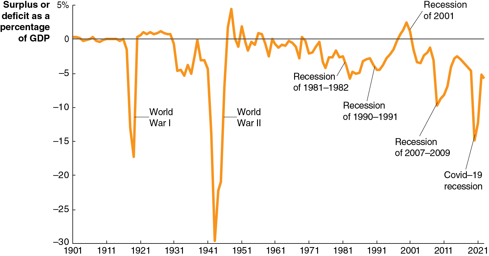{height=99%}

Budget deficits also occur during recessions: tax receipts fall, and automatic stabilizers like increases in transfer payments (unemployment insurance, food stamps, etc.) take effect. + Automatic stabilizers limit the severity of a recession; the Great Depression was more severe because most of these automatic stabilizers did not exist then.

## How the Federal Budget Can Serve as an Automatic Stabilizer

How the Federal Budget Can Serve as an Automatic Stabilizer

In 2009, the federal budget deficit was 9.3 percent of G D P and it increased again in 2020. + How much of this deficit was due to G D P being below potential, and how much was due to government spending and tax policies?

We can identify this by looking at the cyclically adjusted budget deficit or surplus: the deficit or surplus in the federal government’s budget if the economy were at potential G D P. + The C B O estimated that the budget deficit would be 7.6 percent of real G D P in 2009 if real G D P were at its potential. + So, this is the amount that spending needed to be cut, or taxes raised, in order to bring the federal budget into balance in the long run. The rest (1.7%) was due to automatic stabilizers.

## Should the Federal Budget Be Balanced?

Should the Federal Budget Be Balanced?

Although many economists believe the federal budget should be balanced when the economy is at potential G D P, few believe it should be balanced during a recession. + During a recession, tax revenues fall; to balance the budget, spending would have to fall also—making the recession worse.

In fact, some economists argue that the federal budget should normally be in deficit. + Just as households and firms borrow money to implement long-term investments, they argue that the federal government should do the same. + Making current taxpayers pay for those long-term benefits seems unfair.

## Figure 16.14 The Federal Government Debt, 1790–2022, with Projections for Future Years

Figure 16.14 The Federal Government Debt, 1790–2022, with Projections for Future Years

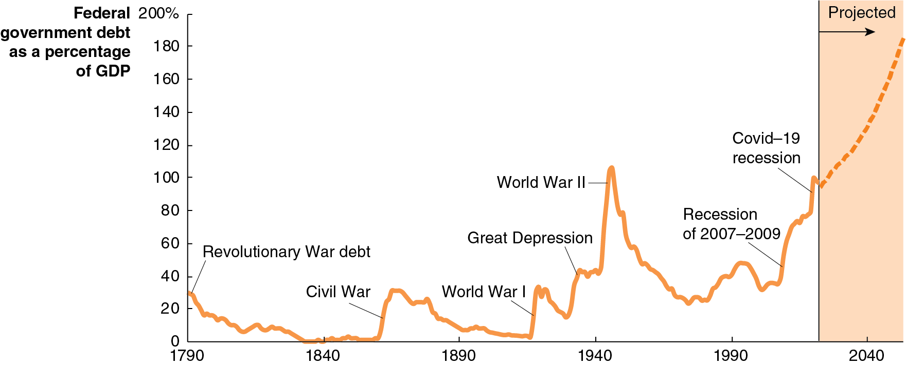{height=99%}

When the federal government runs a budget deficit, it finances its activities by selling Treasury securities. + The total value of those securities outstanding is known as the federal government debt or the national debt. + The national debt increased considerably during the two World Wars, the Great Depression, and the 2007–2009 and Covid-19 recessions.

## Apply the Concept: Who Owns the National Debt? (1 of 2)

Apply the Concept: Who Owns the National Debt? (1 of 2)

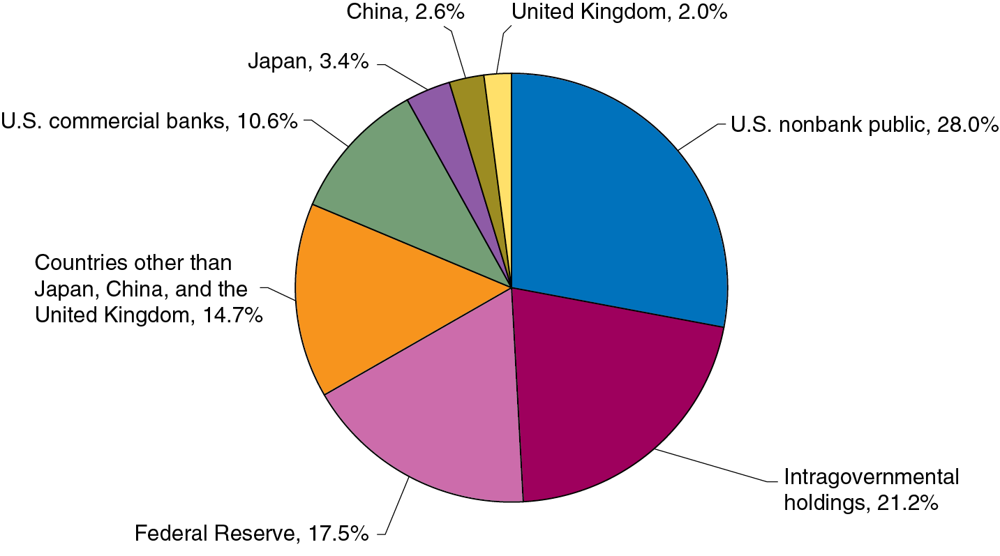{height=99%}

Almost 40 percent is held by the government itself: + Intragovernmental holdings denotes holdings of Treasury securities by U.S. government trust funds, notably the Social Security trust fund. + The Fed holds large amounts of Treasury debt, both from its normal operations and as part of its quantitative easing operations.

## Apply the Concept: Who Owns the National Debt? (2 of 2)

Apply the Concept: Who Owns the National Debt? (2 of 2)

{height=99%}

U.S. banks and other American investors also hold almost 40 percent of the national debt. Banks often hold U.S. Treasury debt as part of their reserves, as these are considered high-quality liquid assets, able to be quickly converted to cash. + The remaining 23 percent of the debt is held by foreign central banks, foreign commercial banks, and foreign investors.

## Is Government Debt a Problem?

Is Government Debt a Problem?

For now, the federal government is at no serious risk of defaulting on its obligations because: + The interest rate it can borrow money at is relatively low. + The size of the interest payments on the debt is low relative to the size of the federal budget—around 12 percent.

In the long run, a debt that increases in size relative to G D P can pose a problem—potentially crowding out investment, which is a key component of long-term growth. + This problem is reduced if the government debt was incurred to finance infrastructure, education, or research and development; these serve as a long-term investment for the economy.

## Apply the Concept: Should We Stop Worrying and Love the Debt?

Apply the Concept: Should We Stop Worrying and Love the Debt?

The federal government can make interest payments on its debt by printing money; this leads some people to suggest a modern monetary policy (M M T) under which debt is unimportant. + Monetary policy is ineffective, they claim, because private spending is not much affected by interest rates.

They argue that large deficits should not deter politicians from addressing “languishing labor-force participation rates, slow economic growth, persistent poverty,” etc. + These views are not shared by most mainstream economists, who warn this approach will bring high inflation.

{height=99%}

## 16.7 Long-Run Fiscal Policy and Economic Growth

16.7 Long-Run Fiscal Policy and Economic Growth

Discuss the effects of fiscal policy in the long run.

The fiscal policy we have concentrated on so far was intended to address short-run goals of stabilizing the economy. + But other fiscal policy actions are intended to have long-run impacts on potential G D P—that is, on aggregate supply, rather than aggregate demand. + Hence these actions are often referred to as supply-side economics.

Most of these policies are based on changing taxes in order to increase incentives to work, save, invest, and start a business.

## Explaining Long-Run Increases in Real G D P

Explaining Long-Run Increases in Real G D P

The long-run growth rate of real G D P depends primarily on: + The growth in the number of hours worked + The growth rate of labor productivity as measured by the growth in real G D P per hour worked.

We can write:

or in growth terms:

Growth rate of real G D P = Growth rate of hours worked + Growth rate of labor productivity

## Table 16.4 The Basis for the C B O’s Estimate of Real G D P Growth, 2023–2053

Table 16.4 The Basis for the C B O’s Estimate of Real G D P Growth, 2023–2053

The C B O predicts the number of hours worked will grow slower than the population, so the growth in hours worked will be small. + The majority of real G D P growth will result from increasing productivity.

## The Long-Run Effects of Tax Policy

The Long-Run Effects of Tax Policy

Most taxes are assessed as a percentage of some economic activity, like individual income, corporate income, or capital gains. + When an individual decides how much to work, he or she bases the decision on how much an hour of work will increase his or her ability to consume goods and services—the posttax wage. + When a firm decides how many people to employ, it considers how much it has to pay in total for each worker: the pretax wage.

The difference between these is an example of a tax wedge: the difference between the pretax and posttax return to an economic activity. + A large tax wedge distorts the incentives of individuals and firms to take part in economic activities, generally resulting in lower levels of economic activity—lower real G D P.

## Tax Rates Matter

Tax Rates Matter

Marginal tax rates matter because the larger they are, the larger will be the behavioral response to the tax: + Individual income tax + Affects labor supply decisions and returns to entrepreneurship

Corporate income tax + Affects the incentives of firms to engage in investment.

Tax on dividends and capital gains + Affects the supply of loanable funds from households to firms and hence the real interest rate. + Also affects the way firms disburse profits—2003 reduction in dividend tax led some firms like Microsoft to pay dividends for the first time.

## Tax Simplification

Tax Simplification

Simpler taxes would also lead to economic gains for society. + The current tax code is extremely complicated—over 3,000 pages long. + The I R S estimates that taxpayers spend more than 6.4 billion hours each year filling out their tax returns—45 hours per tax return. + A simplified tax code would increase economic efficiency by reducing the number of decisions households and firms make solely to reduce their tax payments.

## Figure 16.15 The Supply-Side Effects of a Tax Change

Figure 16.15 The Supply-Side Effects of a Tax Change

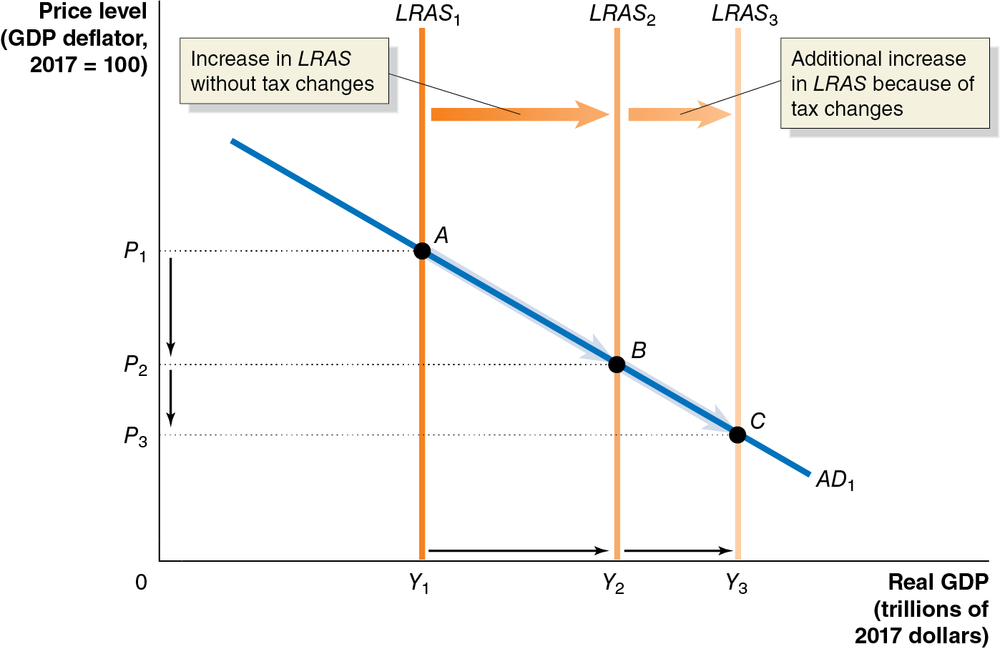{height=99%}

Tax reform has the potential to significantly increase real G D P in the long run beyond the increases that would otherwise occur. + The magnitude of the effect is uncertain, however: + Workers may not be able to increase hours worked beyond 40 per week. + Tax rates may not strongly affect saving and investment decisions. + Tax cuts may mostly affect aggregate demand, not aggregate supply.

## Online Appendix: A Closer Look at the Multiplier

Online Appendix: A Closer Look at the Multiplier

Apply the multiplier formula.

Our objective in this appendix is to develop an econometric model for how real G D P is determined. + Then we will use that model to identify: + The government purchases and tax multipliers + How those multipliers are altered by tax rates + How those multipliers change in an open economy, that is, when net exports change in response to income changes.

Throughout, we will assume that price levels do not change.

## Finding Real Equilibrium G D P (1 of 2)

Finding Real Equilibrium G D P (1 of 2)

For simplicity, we will initially assume that taxes do not depend on income (i.e., they are a fixed amount), there are no government transfers to households, and there are no imports or exports.

Consumption function:

Planned investment function

Government purchases function

Tax function

Equilibrium condition

These numbers are in billions of dollars, except the marginal propensity to consume (M P C) of 0.75.

  

is disposable income.

## Finding Real Equilibrium G D P (2 of 2)

Finding Real Equilibrium G D P (2 of 2)

Substituting into the equilibrium condition, we obtain:

So, in our model real G D P = $20,000.

## A More General Approach (1 of 2)

A More General Approach (1 of 2)

More generally, we could allow the parameters of the model to be represented by letters:

Consumption function:

Planned investment function

Government purchases function

Tax function

Equilibrium condition

The letters with bars over them are parameters—fixed (autonomous) values.

## A More General Approach (2 of 2)

A More General Approach (2 of 2)

Solving now for equilibrium, we get:

This is more useful for us in “change form”:

## A Formula for the Government Purchases Multiplier

A Formula for the Government Purchases Multiplier

If consumption, taxes, and investment remain constant, their changes are zero; so we get:

For M P C = 0.75, this gives a government purchases multiplier of 4:

A $10 billion increase in government purchases increases G D P by $40 billion.

## A Formula for the Tax Multiplier

A Formula for the Tax Multiplier

If consumption, investment, and government purchases remain constant, their changes are zero; so we get:

For M P C = 0.75, this gives a tax multiplier of

A $10 billion increase in tax decreases G D P by $30 billion.

## The “Balanced Budget” Multiplier

The “Balanced Budget” Multiplier

Suppose we increase government spending and taxes both by $10 billion; what would happen to real G D P?

So the overall

is the sum of these:

## Interpreting the Balanced Budget Multiplier

Interpreting the Balanced Budget Multiplier

billion tells us that if we raise government

purchases and taxes both by $10 billion, G D P goes up by $10 billion in the short run. + This is the same for any identical increase to government purchases and taxes. + The long-run effect is still zero; in the long run, G D P is determined by potential G D P instead. + The increased government purchases will instead crowd out private consumption and/or investment.

## Incorporating Tax Rates (1 of 2)

Incorporating Tax Rates (1 of 2)

In our model, taxes were autonomous. Now, we will make them depend on income. Assuming a tax rate of t,

consumers will now have disposable incomes of

So, the consumption function changes to:

Going through the same steps as before, we can obtain:

## Incorporating Tax Rates (2 of 2)

Incorporating Tax Rates (2 of 2)

If M P C = 0.75 and t = 0.2, we obtain:

If M P C = 0.75 and t = 0.1, we obtain:

So, lower tax rates lead to larger multipliers.

## The Multiplier in an Open Economy (1 of 2)

The Multiplier in an Open Economy (1 of 2)

Now suppose we have imports and exports. Assume exports are autonomous, but the level of imports depends on income:

M P I is the marginal propensity to import: the fraction of an increase in income spent on imports. + Our equilibrium condition becomes:

A little algebra gives:

## The Multiplier in an Open Economy (2 of 2)

The Multiplier in an Open Economy (2 of 2)

Let M P C = 0.75, t = 0.2, M P I = 0.1; then

This is smaller than before; a portion of spending goes on imports, which do not feed back into higher domestic income. + If M P I increases to 0.2, we have

So, a greater propensity to spend on imports results in a smaller government purchases multiplier.

## Copyright

Copyright

{height=99%}

This work is protected by United States copyright laws and is provided solely for the use of instructors in teaching their courses and assessing student learning. Dissemination or sale of any part of this work (including on the World Wide Web) will destroy the integrity of the work and is not permitted. The work and materials from it should never be made available to students except by instructors using the accompanying text in their classes. All recipients of this work are expected to abide by these restrictions and to honor the intended pedagogical purposes and the needs of other instructors who rely on these materials.

