## Macroeconomics

Macroeconomics

Ninth Edition

{height=99%}

Chapter 17

Inflation, Unemployment, and Federal Reserve Policy

{height=99%}

Copyright © 2025, 2021, 2018 Pearson Education, Inc. All Rights Reserved

## Chapter Outline

Chapter Outline

17.1 The Discovery of the Short-Run Trade-off between Unemployment and Inflation + 17.2 The Short-Run and Long-Run Phillips Curves + 17.3 Monetary Policy and Expectations of the Inflation Rate + 17.4 The Development of Federal Reserve Policy since the 1970s and the Operation of Foreign Central Banks

## Can the Fed Bring Down a High Inflation Rate without Causing a Recession?

Can the Fed Bring Down a High Inflation Rate without Causing a Recession?

Harvard economist Larry Summers: “over the past 75 years, every time inflation has exceeded 4 percent and unemployment has been below 5 percent, the U.S. economy has gone into recession within two years.” + In early 2023, inflation was above 6 percent and unemployment was under 4 percent. + Will the Fed’s efforts to bring down inflation drive us into a recession? Or is something different this time?

{height=99%}

## 17.1 The Discovery of the Short-Run Trade-Off between Unemployment and Inflation

17.1 The Discovery of the Short-Run Trade-Off between Unemployment and Inflation

Describe the Phillips curve and the nature of the short-run trade-off between unemployment and inflation.

The two great macroeconomic problems that the Fed deals with (in the short run) are unemployment and inflation. + But these two are related in an important way: higher levels of inflation are associated with lower levels of unemployment and vice versa.

## Figure 17.1 The Phillips Curve

Figure 17.1 The Phillips Curve

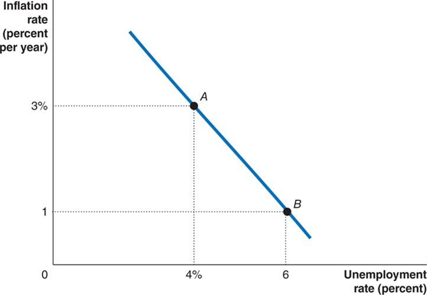{height=99%}

This relationship is known as the Phillips curve, after New Zealand economist A.W. Phillips, the first to identify this relationship. + Phillips curve: A graph showing the short-run relationship between the unemployment rate and the inflation rate.

## Figure 17.2 Using Aggregate Demand and Aggregate Supply to Explain the Phillips Curve

Figure 17.2 Using Aggregate Demand and Aggregate Supply to Explain the Phillips Curve

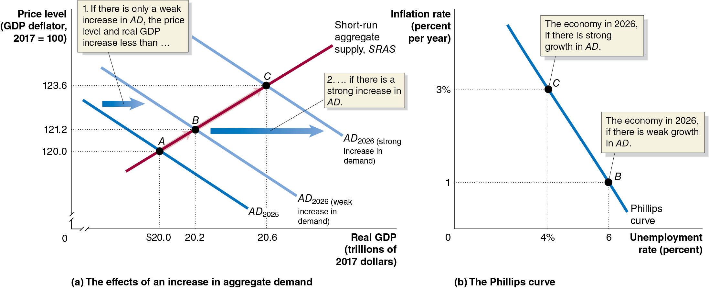{height=99%}

In the A D-A S model, a small aggregate demand increase leads to low inflation and high unemployment. + A stronger A D increase results in lower unemployment but more inflation—the short-run Phillips curve relationship.

## Is the Phillips Curve a Policy Menu?

Is the Phillips Curve a Policy Menu?

During the 1960s, some economists argued that the Phillips curve was a structural relationship: A relationship that depends on the basic behavior of consumers and firms and that remains unchanged over long periods. + In the 1960s, this relationship had appeared to be quite stable.

If this were true, policymakers could choose a point on the curve: trading permanently higher inflation for lower unemployment or vice versa. + But this turned out not to be true: allowing more inflation doesn’t lead to permanently lower unemployment.

## Figure 17.3 A Vertical Long-Run Aggregate Supply Curve Means a Vertical Long-Run Phillips Curve (1 of 2)

Figure 17.3 A Vertical Long-Run Aggregate Supply Curve Means a Vertical Long-Run Phillips Curve (1 of 2)

By the late 1960s, most economists agreed that the long-run aggregate supply curve was vertical. + Is a vertical long-run A S curve compatible with a downward-sloping long-run Phillips curve?

Economists Milton Friedman and Edmund Phelps argued that this implied the long-run Phillips curve was also vertical: in the long run, employment is determined by output, which in the long run does not depend on the price level.

{height=99%}

## Figure 17.3 A Vertical Long-Run Aggregate Supply Curve Means a Vertical Long-Run Phillips Curve (2 of 2)

Figure 17.3 A Vertical Long-Run Aggregate Supply Curve Means a Vertical Long-Run Phillips Curve (2 of 2)

Since employment was determined by potential G D P, so must be unemployment. + Unemployment, in the long run, goes to the natural rate of unemployment, when the output returns to potential G D P.

At this output level, there is no cyclical unemployment; but there does remain structural and frictional unemployment. These latter two are not predictably affected by inflation.

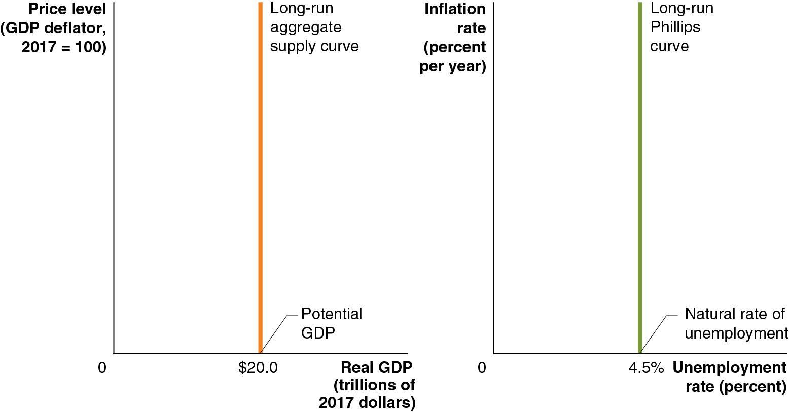{height=99%}

## The Role of Expectations of Future Inflation

The Role of Expectations of Future Inflation

However, this conclusion contradicted the experience of the 1950s and 1960s, during which time a stable trade-off seemed to exist between unemployment and inflation. + The short-run trade-off appears to exist because workers and firms sometimes expect the inflation rate to be either higher or lower than it turns out to be.

Suppose G M and the United Auto Workers (U A W) agree to a wage of $50 per hour for 2026. They expect the price level to increase from 120.0 in 2025 to 123.6 in 2026: 3 percent inflation. + Then $50 represents a real wage of $40.45:

## Table 17.1 The Effect of Unexpected Price Level Changes on the Real Wage

Table 17.1 The Effect of Unexpected Price Level Changes on the Real Wage

If the expectations about inflation are correct, the real wage will be $40.45 as expected; G M will hire its planned number of workers. + However, if inflation is lower (higher) than expected, the real wage becomes higher (lower) than expected, and G M will adjust its hiring decisions.

## Table 17.2 The Basis for the Short-Run Phillips Curve

Table 17.2 The Basis for the Short-Run Phillips Curve

Milton Friedman: “There is always a temporary trade-off between inflation and unemployment; there is no permanent trade-off. The temporary trade-off comes not from inflation per se, but from unanticipated inflation.”

## Apply the Concept: Why Might Workers Fail to Accurately Forecast Inflation?

Apply the Concept: Why Might Workers Fail to Accurately Forecast Inflation?

Most economists believe an increase in inflation will quickly lead to an increase in wages. + However, workers tend not to believe this, expecting that inflation will decrease their purchasing power for years or even permanently.

This has an important consequence: since workers do not expect their wages to increase with inflation, firms can increase wages by less than inflation (i.e., decrease real wages) without worrying about workers quitting or their morale falling.

{height=99%}

## 17.2 The Short-Run and Long-Run Phillips Curves

17.2 The Short-Run and Long-Run Phillips Curves

Explain the relationship between the short-run and long-run Phillips curves.

If there is both a short-run Phillips curve and a long-run Phillips curve, how are the two related? + We will examine this question in this section.

## Figure 17.4 The Short-Run Phillips Curve of the 1960s and the Long-Run Phillips Curve

Figure 17.4 The Short-Run Phillips Curve of the 1960s and the Long-Run Phillips Curve

Throughout the early 1960s, inflation was low—about 1.5 percent. + Firms and workers expected this rate to continue, but inflation was higher in the late 1960s, about 4.5 percent, due to expansionary monetary and fiscal policies. + Because this was unexpected, the economy moved along the short-run Phillips curve, resulting in low unemployment of 3.5 percent.

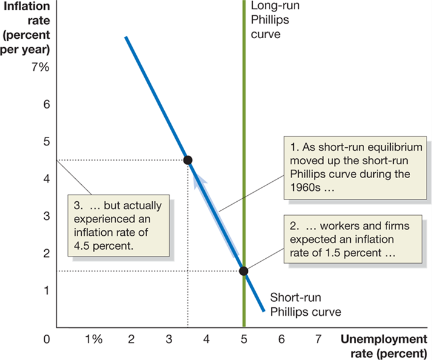{height=99%}

## Figure 17.5 Expectations and the Short-Run Phillips Curve (1 of 2)

Figure 17.5 Expectations and the Short-Run Phillips Curve (1 of 2)

Eventually, firms and workers adjusted their expectations to the inflation rate of 4.5 percent. + Workers demanded higher wages to compensate for the increased inflation, and the economy returned to potential G D P, with unemployment at its natural rate of 5 percent.

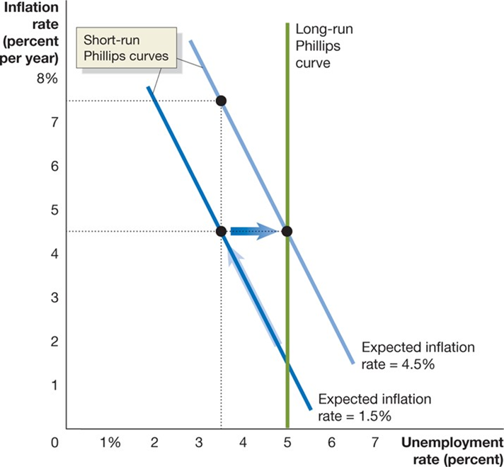{height=99%}

## Figure 17.5 Expectations and the Short-Run Phillips Curve (2 of 2)

Figure 17.5 Expectations and the Short-Run Phillips Curve (2 of 2)

The “new normal” inflation rate of 4.5 percent became embedded in the economy, in the form of the short-run Phillips curve shifting to the right. + 3.5 percent unemployment would require another unexpected increase in the rate of inflation.

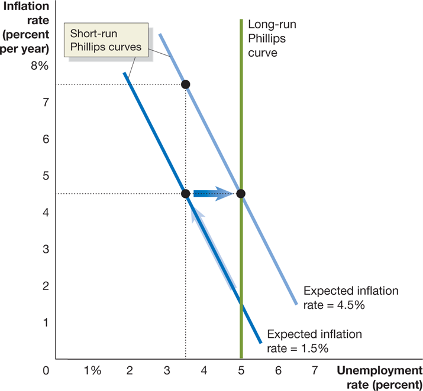{height=99%}

## Figure 17.6 A Short-Run Phillips Curve for Every Expected Inflation Rate

Figure 17.6 A Short-Run Phillips Curve for Every Expected Inflation Rate

Each expected inflation rate generates a different short-run Phillips curve. + In each case, when the inflation rate is actually at the expected level, the unemployment level is at its natural rate—that is, the long-run Phillips curve.

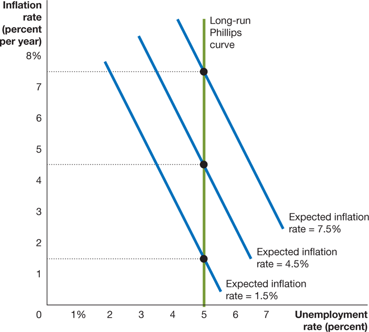{height=99%}

## Figure 17.7 The Inflation Rate and the Natural Rate of Unemployment in the Long Run (1 of 2)

Figure 17.7 The Inflation Rate and the Natural Rate of Unemployment in the Long Run (1 of 2)

By the 1970s, most economists agreed that the long-run Phillips curve was vertical; it was not possible to “buy” a permanently lower unemployment rate at the cost of permanently higher inflation. + In order to keep unemployment lower than the natural rate, the Fed would need to continually increase inflation.

{height=99%}

## Figure 17.7 The Inflation Rate and the Natural Rate of Unemployment in the Long Run (2 of 2)

Figure 17.7 The Inflation Rate and the Natural Rate of Unemployment in the Long Run (2 of 2)

Or it could decrease inflation, at the cost of a temporarily higher unemployment rate. + Since any rate of unemployment other than the natural rate results in the rate of inflation increasing or decreasing, the natural rate of unemployment is sometimes called the nonaccelerating inflation rate of unemployment, or N A I R U.

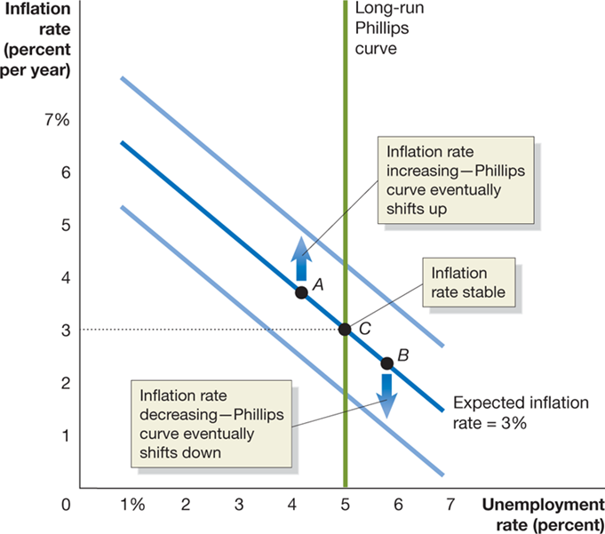{height=99%}

## Apply the Concept: Does the Natural Rate of Unemployment Ever Change?

Apply the Concept: Does the Natural Rate of Unemployment Ever Change?

The natural rate of unemployment might change if the amount of frictional or structural unemployment changed. Possible reasons for this include: + Demographic changes: Younger and less skilled workers have higher unemployment rates. + Changes in labor market institutions: A change in the availability of unemployment insurance, the prevalence of unions, or legal barriers to firing workers. + Past high rates of unemployment: During long periods of unemployment, workers’ skills may deteriorate, or they may become dependent on the government for support.

## 17.3 Monetary Policy and Expectations of the Inflation Rate

17.3 Monetary Policy and Expectations of the Inflation Rate

Discuss how expectations of the inflation rate affect monetary policy.

How long the economy remains off the long-run Phillips curve depends on how fast workers and firms adjust their expectations about future inflation. This in turn depends on inflation itself: + Low inflation: Slow adjustment, since workers and firms seem to ignore inflation + Moderate but stable inflation: Quick adjustment, stable but noticeable inflation is easily incorporated into expectations + High and unstable inflation: Quick adjustment again, but for a different reason: forming rational expectations about inflation becomes very important, so workers and firms pay a lot of attention to forecasting inflation.

Rational expectations: Expectations formed by using all available information about an economic variable.

## Figure 17.8 Rational Expectations and the Phillips Curve

Figure 17.8 Rational Expectations and the Phillips Curve

If workers and firms have adaptive expectations, expecting inflation to be the same as it was last period, then expansionary monetary policy can increase employment. + But if they have rational expectations, workers and firms will anticipate the Fed’s policies, and adjust their expectations about inflation accordingly. + Then the policy would have no effect on employment: the short-run Phillips curve would be vertical also.

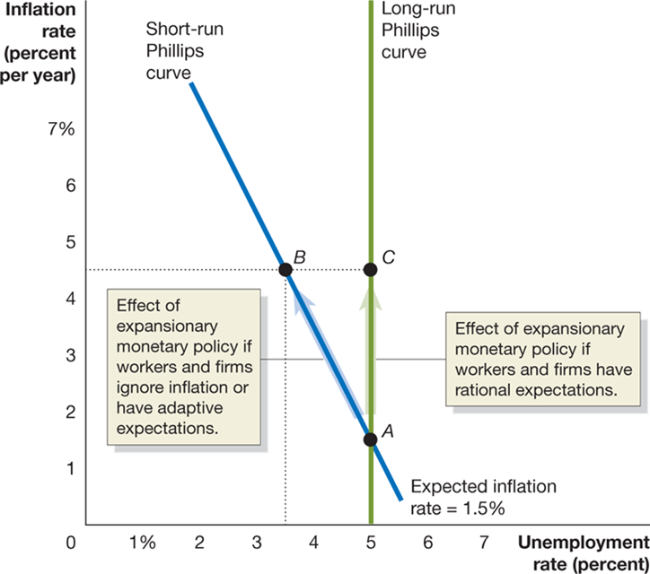{height=99%}

## Is the Short-Run Phillips Curve Really Vertical?

Is the Short-Run Phillips Curve Really Vertical?

This idea of rational expectations and a vertical short-run Phillips curve was proposed by Nobel Laureates Robert Lucas and Thomas Sargent. + Their critics argued that the 1950s and 1960s showed an obvious short-run trade-off between unemployment and inflation.

Lucas and Sargent: This happened because the Fed was secretive, not announcing changes in policy. If the Fed announces its policies, people will correctly anticipate inflation. + Critics: Workers and firms still cannot correctly anticipate inflation; their expectations are not rational. + Besides, wages and prices don’t adjust fast enough anyway, so even if people anticipated the inflation, they couldn’t do enough about it to make the short-run Phillips curve vertical.

## Real Business Cycle Models

Real Business Cycle Models

Lucas and Sargent concluded the Fed could affect output and employment but only through unexpected changes to the money supply. + During the 1980s, a different mechanism was suggested for explaining changes in real G D P: technology shocks—increases or decreases in productive ability—might push real G D P above or below its (previous) potential level.

Since this was based on real (not monetary) factors, models based on this became known as real business cycle models. + Real business cycle model: A macroeconomic model that focus on real rather than monetary explanations of the fluctuations in real G D P. + These models assume rational expectations and quickly adjusting prices, as did Lucas and Sargent; collectively, these two approaches are known as the new classical macroeconomics.

## 17.4 The Development of Federal Reserve Policy since the 1970s and the Operation of Foreign Central Banks

17.4 The Development of Federal Reserve Policy since the 1970s and the Operation of Foreign Central Banks

Discuss how Federal Reserve policy has changed over the years and contrast the structure of the Federal Reserve with the  structures of foreign central banks.

Through the late 1960s and early 1970s, Federal Reserve policy had led to high inflation rates. + Actions by the Organization of Petroleum Exporting Countries (O P E C) in the mid-1970s made the situation worse.

## Figure 17.9 A Supply Shock Shifts the S R A S Curve and the Short-Run Phillips Curve (1 of 2)

Figure 17.9 A Supply Shock Shifts the S R A S Curve and the Short-Run Phillips Curve (1 of 2)

{height=99%}

The graphs show the U.S. economy in 1973: moderate but anticipated inflation, hence unemployment is at its natural rate. + In 1974, O P E C caused oil prices to rise dramatically. This was a supply shock, decreasing short-run aggregate supply. + Unemployment rose, but so did people’s expectations of inflation—a higher short-run Phillips curve.

## Figure 17.9 A Supply Shock Shifts the S R A S Curve and the Short-Run Phillips Curve (2 of 2)

Figure 17.9 A Supply Shock Shifts the S R A S Curve and the Short-Run Phillips Curve (2 of 2)

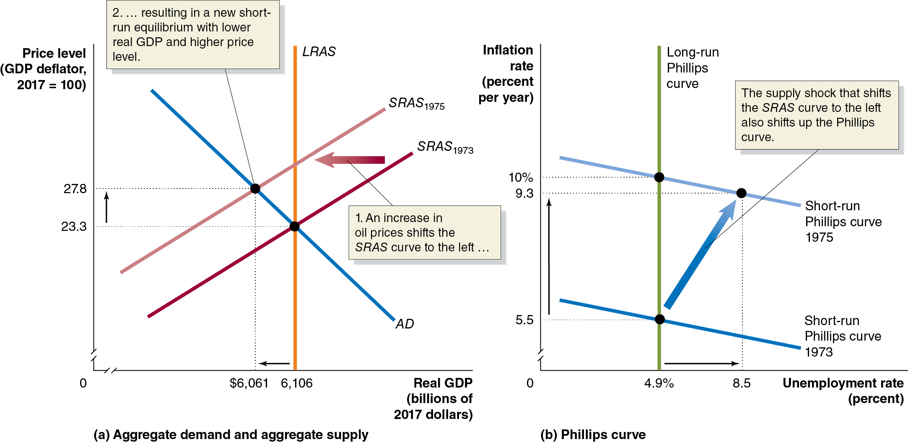{height=99%}

What could the Fed do? It wanted to fight both inflation and unemployment, but the short-run Phillips curve makes clear that improving one worsens the other. + The Fed chose expansionary monetary policy: reducing unemployment, at the cost of even more inflation.

## Figure 17.10 The Fed Tames Inflation, 1979–1989 (1 of 2)

Figure 17.10 The Fed Tames Inflation, 1979–1989 (1 of 2)

The newly high inflation was incorporated into people’s expectations and became self-reinforcing. + The Fed’s new chairman, Paul Volcker, wanted inflation lower, believing high inflation was hurting the economy. + So, Volcker announced and enacted a contractionary monetary policy. If people believed the announcement, they would adjust down to a lower Phillips curve. + But for several years, the Phillips curve appeared not to move.

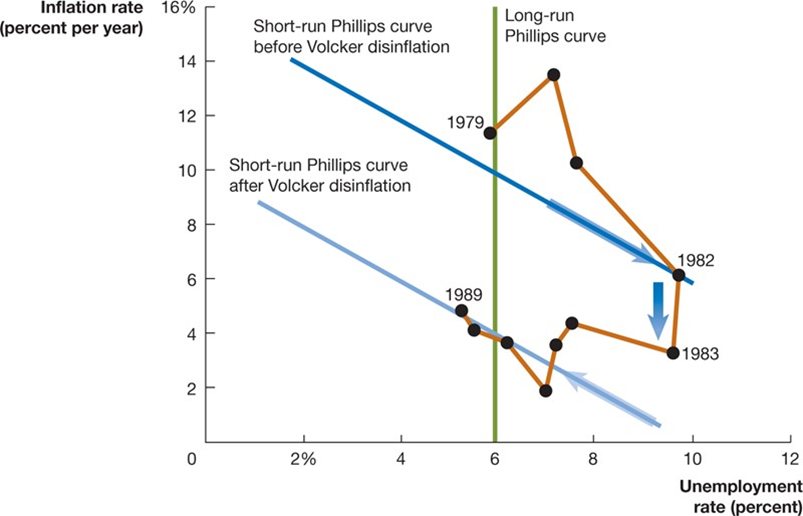{height=99%}

## Figure 17.10 The Fed Tames Inflation, 1979–1989 (2 of 2)

Figure 17.10 The Fed Tames Inflation, 1979–1989 (2 of 2)

Does this prove people were not forming their expectations about inflation rationally? Not necessarily. The Fed had a credibility problem: it had previously announced contractionary policies but allowed inflation to occur anyway. Eventually, several years of tight money convinced people that inflation would be lower. + Prices fell, and so did expectations about inflation: a new, lower short-run Phillips curve.

{height=99%}

## Table 17.3 The Record of Fed Chairs and Inflation

Table 17.3 The Record of Fed Chairs and Inflation

*The value for Jerome Powell is just for this period of his term. + Fed policies in the 1970s resulted in high inflation. + This forced the “Volcker disinflation” of the early 1980s; subsequent Fed chairs have been equally determined to keep inflation low. + Disinflation: A significant reduction in the inflation rate.

## Fed Chair Alan Greenspan

Fed Chair Alan Greenspan

Alan Greenspan was Fed chair from 1987 to 2006. When he left the Fed, Greenspan’s term appeared very successful: + Low inflation + Only two recessions—both short and mild (1990–1991, 2001) + Increased Fed credibility (following through on announced actions) + Increased Fed transparency (since 1994, federal funds rate target has been made public)

Greenspan also oversaw the de-emphasizing of the money supply as a Fed monetary policy target and the increased focus on interest rates—the federal funds rate, in particular.

## How Greenspan and Subsequent 

How Greenspan and Subsequent Fed Chairs Increased Fed Credibility

Whenever the Fed announces a policy change, it follows through with the change. + Since 1994, announcing all changes in the target federal funds rate. Previously, changes were not made public. + The F O M C meeting minutes are available after a short delay. The Fed Chair also holds press conferences following each F O M C meeting. + Ben Bernanke started doing this after some F O M C meetings in 2011 + Jerome Powell now does this after each meeting.

## Table 17.4 F O M C Estimates of the Natural Rate of Unemployment, 2015–2022

Table 17.4 F O M C Estimates of the Natural Rate of Unemployment, 2015–2022

Federal Open Market Committee members have adjusted down their beliefs about the natural rate of unemployment over the last decade. + Difficulty estimating both unemployment and its natural rate have led some economists (inside and outside the Fed) to look for an alternative measure of the health of the labor market.

## Figure 17.11 Employment–Population Ratio for Workers Aged 25 to 54 since 2022 (1 of 2)

Figure 17.11 Employment–Population Ratio for Workers Aged 25 to 54 since 2022 (1 of 2)

{height=99%}

Some economists believe the employment–population ratio for prime-aged workers is a better measure of the state of the labor market than is the unemployment rate. + The Fed began raising the federal funds rate in 2015, believing unemployment was close to its natural rate.

## Figure 17.11 Employment–Population Ratio for Workers Aged 25 to 54 since 2022 (2 of 2)

Figure 17.11 Employment–Population Ratio for Workers Aged 25 to 54 since 2022 (2 of 2)

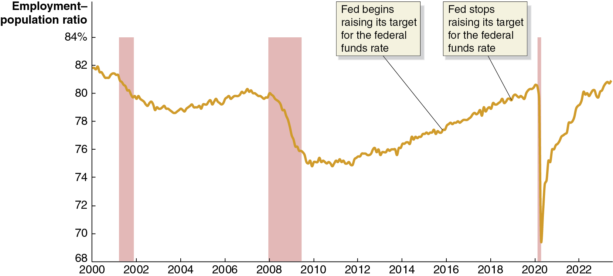{height=99%}

But the employment–population ratio was still 4.5 percentage points below its level in early 2000. + There may have been more slack in the labor market—and less reason to be concerned that the inflation rate would rise significantly—than the members of the F O M C believed at the time.

## New Approach to Monetary Policy

New Approach to Monetary Policy

The lesson the Fed took from the Great Inflation of the late 1960s to the early 1980s: anticipate inflation by looking at unemployment, and preempt the inflation using contractionary (or less expansionary) monetary policy. + In 2020 the Fed concluded this approach was no longer appropriate: since high inflation seemed unlikely to materialize, slowing the economy intentionally was unnecessary. + Instead, the Fed would wait until inflation had already risen above its target inflation rate before raising the federal funds rate.

## The New Approach Is Put to the Test

The New Approach Is Put to the Test

The Fed continued expansionary monetary policy through 2021, and Congress and the Biden administration passed the $1.9 trillion American Rescue Plan in March 2021. + Fed Chair Powell: “We might see some upward pressure on prices [as a result of expansionary monetary and fiscal policy]. Our best view is that the effect on inflation will be neither particularly large nor persistent.” + This was incorrect, and high inflation followed. The Fed began raising the federal funds rate target in March 2022, reaching a range of 5.25 to 5.50 percent in July 2023.

## A Rare “Soft Landing”?

A Rare “Soft Landing”?

Inflation peaked in mid-2022. + Would the high federal funds rate slow the growth of aggregate demand so much that the economy would fall into a recession? + From Larry Summers in the chapter opener: “over the past 75 years, every time inflation has exceeded 4 percent and unemployment has been below 5 percent, the U.S. economy has gone into recession within two years.” + But in late 2023, real G D P was increasing, inflation was falling, and the unemployment rate was still below 4 percent. + A soft landing from high inflation without a recession was looking more and more possible.

## Apply the Concept: Has the Phillips Curve Disappeared? (1 of 4)

Apply the Concept: Has the Phillips Curve Disappeared? (1 of 4)

Does the Phillips curve remain a useful tool for understanding short-run macroeconomics? + Fed Chair Powell in 2021: “There was a time when there was a tight connection between unemployment and inflation. That time is long gone. . . . [W]hen we seek to achieve low unemployment, high levels of employment, which is our mandate, you know, we think we have the freedom to do that based on the data without worrying too much about inflation.” + Inflation rose during 2021 while unemployment declined—consistent with the Phillips curve. + But from 2022 to 2023, inflation declined, and unemployment stayed low—not consistent with the Phillips curve.

## Apply the Concept: Has the Phillips Curve Disappeared? (2 of 4)

Apply the Concept: Has the Phillips Curve Disappeared? (2 of 4)

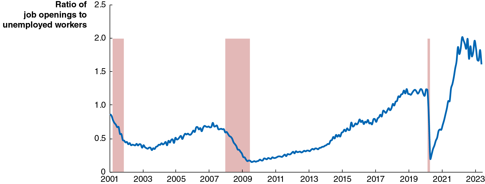{height=99%}

Unemployment rates may no longer be a good gauge of the state of the labor market. + Alternative measures like the ratio of job openings to unemployed workers may be better; this ratio did peak when the inflation rate was highest.

## Apply the Concept: Has the Phillips Curve Disappeared? (3 of 4)

Apply the Concept: Has the Phillips Curve Disappeared? (3 of 4)

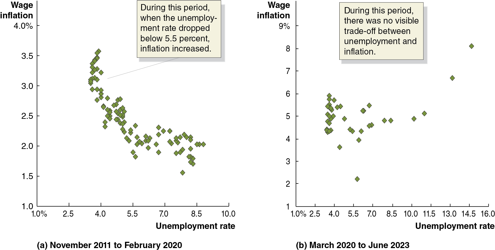{height=99%}

Alternatively, looking at price inflation may be the wrong inflation rate to consider; the trade-off between inflation and unemployment can be more visible when using wage inflation. + Indeed, throughout the 2010s (panel (a)) this trade-off seemed clear; though not during the pandemic period (panel (b)).

## Apply the Concept: Has the Phillips Curve Disappeared? (4 of 4)

Apply the Concept: Has the Phillips Curve Disappeared? (4 of 4)

One way to think about the pandemic period: + People interpreted high inflation rates as temporary, caused by the aggregate supply shock (Covid and supply chain problems) and expansionary monetary and fiscal policies. + The short-run Phillips curve temporarily shifted up. + But long-run inflation expectations remained low, so as the changes above expired, the short-run Phillips curve shifted back down.

We can conclude that it’s uncertain whether the Phillips curve still represents an important macroeconomic relationship. As a practical matter, though, Fed policymakers no longer use it in formulating policy.

## Too-Big-to-Fail and the Dodd-Frank Act

Too-Big-to-Fail and the Dodd-Frank Act

During the financial crisis of 2007–2009, the Fed adopted a too-big-to-fail policy, taking actions to save Bear Stearns and A I G from bankruptcy. + Too-big-to-fail policy: A policy under which the federal government does not allow large financial firms to fail, for fear of damaging the financial system. + The Wall Street Reform and Consumer Protection Act (2010) (aka the Dodd-Frank Act) was intended to reverse this course; it prohibited the Fed from making loans “for the purpose of assisting a single and specific company avoid bankruptcy.” + This has uncertain consequences for the future stability of the financial system.

## Should the Fed Be Independent of Congress and the President?

Should the Fed Be Independent of Congress and the President?

Arguments against Fed independence: + In a democracy, elected officials should make public policy; while monetary policy is complicated and requires a long view, the same is true of other tasks assigned to Congress and the president, like national security and foreign policy. + Reducing Fed independence would ease coordination of monetary policy with fiscal policy.

## Should the Fed Be Independent of Congress and the President? Arguments “For”

Should the Fed Be Independent of Congress and the President? Arguments “For”

Arguments in favor of Fed independence: + Political pressure to improve short-run outcomes would result in too “easy” money, resulting in high inflation. + A government controlling its central bank could use that control to further its internal political interests, like manipulating unemployment around election times.

Evidence for the above arguments would consist of higher inflation rates when a central bank was less independent.

## Figure 17.12 The More Independent the Central Bank, the Lower the Inflation Rate

Figure 17.12 The More Independent the Central Bank, the Lower the Inflation Rate

In 1993, economists Alberto Alesina and Larry Summers demonstrated an important link between the inflation rate in high-income countries and the degree of independence their central banks had from the rest of the government. + They concluded that, to continue to fight inflation, the Fed would need to maintain its independence.

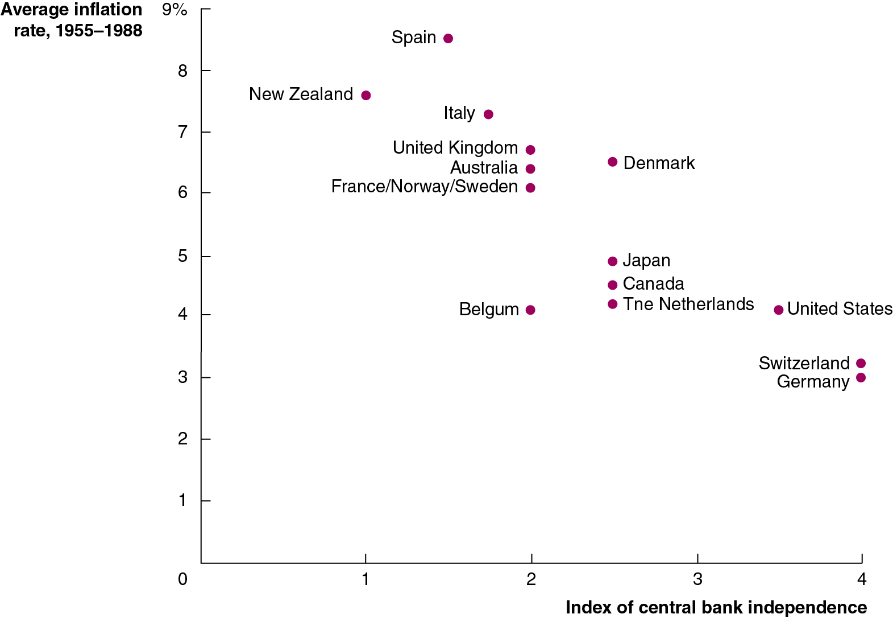{height=99%}

## Other Proposals to Alter the Fed

Other Proposals to Alter the Fed

Several proposals designed to alter the Fed’s operations or structure have recently been proposed, including: + Requiring the Fed to adopt a formal policy rule (like the Taylor rule). + Making price stability the Fed’s sole policy goal (i.e., removing its responsibility for employment under its dual mandate). + Auditing the Fed’s monetary policy actions, adding more congressional oversight.

## Central Banking in Other Countries:

Central Banking in Other Countries:The Bank of England

The Bank of England only obtained the power to set interest rates independently of the U K government in 1997; the government can still overrule the Bank of England in “extreme circumstances,” though it has not done so yet. + Just as the Fed focuses on the federal funds rate, the Bank of England focuses on its equivalent, the bank rate.

In 2023, U K unemployment was low, but inflation was high and real G D P was barely growing. Wages were rising, but not enough to offset inflation for many workers. + A “soft landing” was looking increasingly unlikely.

## Central Banking in Other Countries:

Central Banking in Other Countries:The Bank of Japan

Since 1998 the Bank of Japan has had relatively high autonomy to pursue price stability. + From 2016–2023, the Bank of Japan practiced yield curve control. The yield curve refers to the relationship among bonds that differ only in their maturities. Typically, short-term bonds have lower interest rates than longer-term bonds. The Bank of Japan tried to control not only short-term interest rates, but long-term ones as well, controlling the entire yield curve. + This policy ended in 2023; but by that time, the Bank of Japan owned more than half of all Japanese government bonds, distorting the government bond market.

## Central Banking in Other Countries:

Central Banking in Other Countries:The Bank of Canada

In theory, the Bank of Canada is not independent of the Canadian government: its inflation target is set jointly between the two, and the finance minister can direct the bank’s actions. + In practice, no such direction has ever been issued, so the Bank of Canada maintains high independence. + Like the Fed and the Bank of England, the Bank of Canada targets the interest rate for overnight loans.

## Central Banking in Other Countries:

Central Banking in Other Countries:The European Central Bank

The European Central Bank (E C B) conducts monetary policy for the 20 countries in the euro zone that use the euro as their common currency. + E C B board members come from across the euro zone, and have long terms of office, increasing the political independence of the E C B. + The mission of the E C B is complicated, with the member countries often having conflicting needs. + Like the Fed, the E C B targets the interest rate on overnight loans, the deposit facility rate. In 2023 was raising rates to combat inflation, but avoiding recession for all member nations seemed unlikely.

## Figure 17.13 Inflation across Countries in the Covid-19 Era

Figure 17.13 Inflation across Countries in the Covid-19 Era

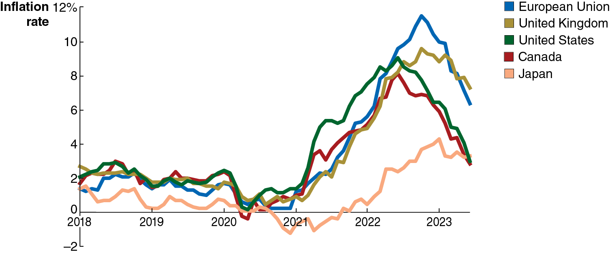{height=99%}

The path of inflation during the Covid-19 period was roughly similar in high-income countries with the exception of Japan: inflation rose during 2021, reached a peak in mid-2022, and then began to decline. + Japan was alone in having a peak inflation rate of less than 5 percent.

## Copyright

Copyright

{height=99%}

This work is protected by United States copyright laws and is provided solely for the use of instructors in teaching their courses and assessing student learning. Dissemination or sale of any part of this work (including on the World Wide Web) will destroy the integrity of the work and is not permitted. The work and materials from it should never be made available to students except by instructors using the accompanying text in their classes. All recipients of this work are expected to abide by these restrictions and to honor the intended pedagogical purposes and the needs of other instructors who rely on these materials.

