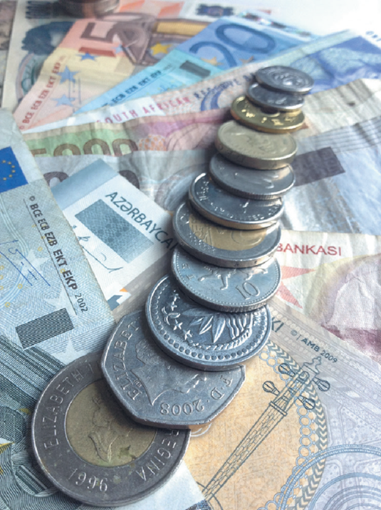
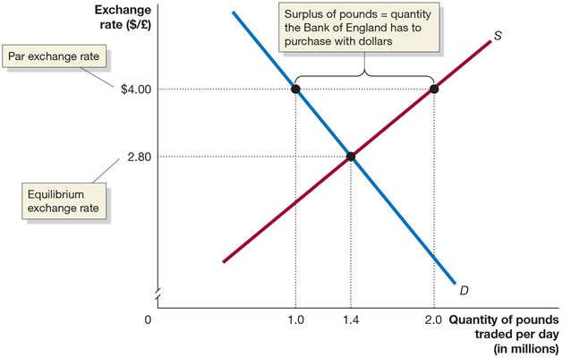

## Macroeconomics

Macroeconomics

Ninth Edition

{height=99%}

Chapter 18

Macroeconomics in an Open Economy

{height=99%}

Copyright © 2025, 2021, 2018 Pearson Education, Inc. All Rights Reserved

## Chapter Outline

Chapter Outline

18.1 The Balance of Payments: Linking the United States to the International Economy + 18.2 The Foreign Exchange Market and Exchange Rates + 18.3 Exchange Rate Systems + 18.4 The International Sector and National Saving and Investment + 18.5 The Effect of a Government Budget Deficit on Investment + 18.6 Monetary Policy and Fiscal Policy in an Open Economy + Online Appendix The Gold Standard and the Bretton Woods System

## Covid-19 Disrupts the Global Economy

Covid-19 Disrupts the Global Economy

{height=99%}

The uncertainty surrounding Covid-19 resulted in some firms making forecasting errors; the globalization of the world economy meant those errors had significant effects across the world. + For example, vehicle computer chip manufacturers forecast that vehicle production would slow in 2020, and produced fewer chips. But Chinese manufacturers increased production, resulting in a global shortage of vehicle computer chips, limiting production of vehicles in the United States and driving up automobile prices in 2021.

## 18.1 The Balance of Payments: Linking the United States to the International Economy

18.1 The Balance of Payments: Linking the United States to the International Economy

Explain how the balance of payments is calculated.

Until now, we have mostly ignored the linkages among countries at the macroeconomic level. + But countries are linked: + By trade in goods and services + By flows of financial investment

In this chapter, we will consider how these linkages work, and what the implications are for fiscal and monetary policy.

## Open and Closed Economies

Open and Closed Economies

Today, it is routine for consumers, firms, and investors to interact with their counterparts in foreign countries. + A country that has interactions in trade or finance with other countries is known as an open economy, as opposed to a closed economy, which has no interactions in trade or finance with other countries. + No economy today is completely closed, though a few countries, such as North Korea, have limited foreign economic interactions.

## Table 18.1 The U.S. Balance of Payments, 2020 (Billions of Dollars) (1 of 2)

Table 18.1 The U.S. Balance of Payments, 2020 (Billions of Dollars) (1 of 2)

A good way to understand economic interactions with other countries is by examining the balance of payments (B o P): the record of a country’s trade with other countries in goods, services, and assets. + It is composed of the current account: the part of the B o P that records the country’s net exports, net income on investments, and net transfers…

{height=99%}

## Table 18.1 The U.S. Balance of Payments, 2020 (Billions of Dollars) (2 of 2)

Table 18.1 The U.S. Balance of Payments, 2020 (Billions of Dollars) (2 of 2)

… the financial account, the part of the B o P that records purchases of assets a country has made abroad and foreign purchases of assets in the country… + … and the capital account, the part of the B o P that records relatively minor transactions such as migrants’ transfers and sales and purchases of nonproduced, nonfinancial assets.

## Figure 18.1 Trade Flows for the United States, 2022

Figure 18.1 Trade Flows for the United States, 2022

The current account records a country’s net exports, net income on investments, and net transfers. + An important part of this is the trade balance, the difference between the value of the goods a country exports and the value of the goods a country imports. + Positive = trade surplus + Negative = trade deficit

In 2022, the United States had an overall trade deficit of $1,183 billion.

{height=99%}

## The Rest of the Current Account

The Rest of the Current Account

The current account is made up of the + Trade balance, + Balance of services, the difference between the values of the exports and imports of services, + The sum of balance of trade and balance of services is net exports. + Net income on investments, and + Net transfers

For simplicity, we will frequently ignore the latter two—their sum is close to zero for the United States—and think of net exports as being equal to the current account balance.

## The Financial Account

The Financial Account

While the current account records short-term flows of funds into and out of the country, the financial account, the part of the B o P that records purchases of assets a country has made abroad and foreign purchases of assets in the country, records long-term flows: + Capital outflows: Purchases of assets overseas by Americans + Capital inflows: Purchases of American assets by foreigners

These assets might be financial assets, like stocks and bonds—foreign portfolio investment—or physical assets, like factories—foreign direct investment.

## Net Foreign Investment

Net Foreign Investment

The balance on the financial account can be thought of as a measure of net capital flows, or alternatively as its negative, net foreign investment, which is the difference between capital outflows from a country and capital inflows, also equal to net foreign direct investment plus net foreign portfolio investment.

## The Capital Account

The Capital Account

Prior to 19 99, the financial account and the capital account were known collectively as “the capital account.” + Since then, the capital account refers only to relatively minor transactions, like migrants’ transfers or sales and purchases of nonproduced, nonfinancial assets (like intellectual property or natural resource rights). + The balance on the capital account is relatively small—

only

billion in 2022—so we will ignore it.

## Why Is the Balance of Payments Always Zero?

Why Is the Balance of Payments Always Zero?

The balance of payments is equal to the sum of the: + Current account balance, + Financial account balance, and + Capital account balance (this is small enough to ignore).

This sum must be zero. Why? + The United States spent $971 billion (the current account balance) more on foreign goods and services than it received. + Where did this money go? It must have purchased U.S. financial or physical assets or increased foreign holdings of U.S. currency; in either case, these show up as positive entries in the financial account balance.

## 18.2 The Foreign Exchange Market and Exchange Rates

18.2 The Foreign Exchange Market and Exchange Rates

Explain how exchange rates are determined and how changes in exchange rates affect the prices of imports and exports.

When a firm or consumer wants to buy something—a good, a service, a financial asset—from a foreigner, that foreigner will often want to be paid in their own currency. + The value of one country’s currency in terms of another country’s currency is known as the nominal exchange rate. + Example: If one U.S. dollar can purchase 100 Japanese yen, then the

exchange rate is

or alternatively,

We can also calculate the real exchange rate, which corrects the nominal exchange rate for differences in prices between countries. + Foreign exchange markets are very active; over $5 trillion in currency is traded in foreign exchange markets each day.

## Figure 18.2 Equilibrium in the Foreign Exchange Market (1 of 3)

Figure 18.2 Equilibrium in the Foreign Exchange Market (1 of 3)

Market exchange rates are determined by supply and demand, just like any price. The demand for $U S comes from: + Foreign firms and households wanting to buy U.S. goods and services + Foreign firms and households wanting to invest in U.S. physical or financial assets + Currency traders believing the value of the $U S will rise

{height=99%}

## Figure 18.2 Equilibrium in the Foreign Exchange Market (2 of 3)

Figure 18.2 Equilibrium in the Foreign Exchange Market (2 of 3)

Unlike in markets for goods and services, the supply of $U S is caused by just the same elements as cause the demand for $U S, only in reverse: firms, households, and speculators wanting to obtain (say) Japanese yen, and pay for them with U.S. dollars. + The equilibrium exchange rate is the exchange rate at which the quantity of dollars supplied is just equal to the quantity of dollars demanded.

{height=99%}

## Figure 18.2 Equilibrium in the Foreign Exchange Market (3 of 3)

Figure 18.2 Equilibrium in the Foreign Exchange Market (3 of 3)

If the exchange rate is “too high,” more people will want to sell $U S for yen than want to buy them—a surplus. + The exchange rate will depreciate: The value of the $U S will fall, relative to the value of the yen.

An exchange rate that is too low will cause the $U S to appreciate: Increase in market value relative to the yen (or generally any other currency).

{height=99%}

## Are All Exchange Rates Determined by the Market?

Are All Exchange Rates Determined by the Market?

We assume in this chapter that exchange rates are determined by the market. + But this is not always true. + Example: For more than 10 years, the value of the Chinese yuan was fixed by the Chinese government at 8.28 yuan = $1.

Fixed exchange rates have important consequences; we will consider them in the next section.

## Shifts in the Demand for and Supply of Foreign Exchange

Shifts in the Demand for and Supply of Foreign Exchange

Anything (apart from the exchange rate itself) affecting the demand for foreign exchange will shift the demand curve—to the right for an increase in demand, to the left for a decrease. + This might result from: + Changes in the demand for U.S.-produced goods and services relative to foreign produced goods and services + Changes in the desire to invest in the U.S. relative to foreign countries + Changes in the expectations of currency traders about the likely future value of $U S relative to foreign currencies

The supply of $U S for yen is the same as the demand for yen with $U S, so the same factors that change demand also change supply.

## Figure 18.3 Shifts in the Demand and Supply Curve Resulting in a Higher Exchange Rate (1 of 2)

Figure 18.3 Shifts in the Demand and Supply Curve Resulting in a Higher Exchange Rate (1 of 2)

Suppose the exchange rate of yen for $U S starts out at

U.S. incomes rise, increasing our demand for Japanese imports. To pay for the imports, we need to buy yen, hence we supply $U S to the foreign exchange market.

{height=99%}

## Figure 18.3 Shifts in the Demand and Supply Curve Resulting in a Higher Exchange Rate (2 of 2)

Figure 18.3 Shifts in the Demand and Supply Curve Resulting in a Higher Exchange Rate (2 of 2)

At the same time, interest rates in the United States rise, making U.S. bonds more attractive to hold than Japanese bonds. So, the demand for $U S rises. + If the increase in demand is larger than the increase in supply of $U S, the exchange rate will appreciate—to

in this case.

{height=99%}

## Currency Speculation

Currency Speculation

A large amount of trade in foreign exchange is by speculators, currency traders who buy and sell foreign exchange in an attempt to profit from changes in exchange rates. + Speculators purchase and hold a currency when they believe it will appreciate, or they may engage in more complicated financial transactions. + Example: An agreement to buy currency in the future at a price agreed today.

## Exchange Rates, Imports, and Exports

Exchange Rates, Imports, and Exports

When the $US appreciates, the dollar price of foreign imports falls. Similarly, the foreign currency price of U.S. exports rises.

Example: Suppose the exchange rate between $U S and euros is

An iPhone with a U.S. price of $200 will cost

to a French person. But if the $U S appreciates so that the exchange

rate is now

that same i Phone will now cost the

French person

Then we expect French people to buy fewer i Phones. But at the same time, French wine has become cheaper for Americans to buy, so we will buy more of it. + An appreciation of the $U S causes U.S. exports to fall and imports to rise, so net exports will fall. + Hence, aggregate demand will fall and also real G D P.

## Apply the Concept: Is a Strong Currency Good for a Country?

Apply the Concept: Is a Strong Currency Good for a Country?

A currency “strengthens” when its value rises relative to other countries’ currencies. Should a country want a strong currency? + The answer is unclear. A strong currency makes exports more expensive and imports cheaper. The reverse is true overseas. + The answer isn’t even clear for a country’s firms: they buy some inputs from overseas and sell some outputs overseas—so a stronger currency can help or hurt them.

{height=99%}

## Real Exchange Rates

Real Exchange Rates

The real exchange rate is the price of domestic goods in terms of foreign goods:

Suppose initially

and the U.S. and British price

levels are both 100. Then the real exchange rate between $U S and British pounds is:

## A Change in the Real Exchange Rate

A Change in the Real Exchange Rate

Now suppose the $U S appreciates, so the new exchange rate is

and simultaneously the price level in the United States

rises + to 105 (5% inflation) while price levels stay constant in the U K, then:

Interpretation: Prices of U.S. goods are now 16 percent higher than they were, relative to the prices of British goods. + Real exchange rates are reported as index numbers, with one year chosen as the base year.

## What Determines Exchange Rates in the Long Run?

What Determines Exchange Rates in the Long Run?

In the short run, the two most important influences on exchange rates are: + Relative interest rates + Expectations about future values of currencies

But over the long run, it seems reasonable that exchange rates should move to equalize the purchasing powers of different currencies. This is known as the theory of purchasing power parity.

## Purchasing Power Parity

Purchasing Power Parity

Suppose that candy bars sell for

in the United Kingdom and for $1 in

the United States.

If the exchange rate were

then an entrepreneur could:

Buy a million candy bars in the United States for $1,000,000

Transport them to the U K, and sell them for

Exchange that currency for $2,000,000: a profit of $1,000,000, minus the cost of shipping.

If many people did this, there would be an increase in the supply of British pounds offered to purchase U.S. dollars, so we would expect the exchange rate to appreciate.

If it appreciated to

the currency would have equal purchasing power in

each location, and there would be no more pressure on the exchange rate to change.

## What Stops Purchasing Power Parity From Occurring?

What Stops Purchasing Power Parity From Occurring?

When you travel, you will notice that some goods and services are cheaper overseas than here, and some are more expensive. + Why doesn’t purchasing power parity stop this from happening? + Not all products can be traded internationally (especially services). + Products and consumer preferences are different across countries; prices are determined by supply but also by demand. + Countries impose barriers to trade, like tariffs (taxes on imports) and quotas (numerical limits on imports).

Example: The U.S. sugar quota ensures that purchasing power parity cannot reduce the price of sugar in the United States to the “world price.”

## Apply the Concept: The Big Mac Theory of Exchange Rates

Apply the Concept: The Big Mac Theory of Exchange Rates

The Economist collects the prices of Big Macs in different countries. + In January 2023, the average price of a Big Mac was $5.15 in the United States. + Comparing this to the average prices of Big Macs in other countries offers a (lighthearted) test of purchasing power parity:

Source: “The Big Mac Index,” Economist, January 2021.

## 18.3 Exchange Rate Systems

18.3 Exchange Rate Systems

Discuss the three key features of the current exchange rate system.

In the previous section, we assumed exchange rates were determined by the market. + A floating currency is the outcome of a country allowing its currency’s exchange rate to be determined by demand and supply.

Allowing the relative values of currencies to be determined by demand and supply is just one type of exchange rate system, or agreement among countries about how exchange rates should be determined.

## Other Exchange Rate Systems

Other Exchange Rate Systems

The current exchange rate system is best described as a managed float exchange system, under which the value of most currencies is determined by demand and supply, with occasional government intervention. + A fixed exchange rate system is one under which countries agree to keep the exchange rates among their currencies fixed for long periods. + From the nineteenth century until the 19 30s, countries’ currencies were redeemable for fixed amounts of gold—a system known as the gold standard. + The amount of gold for which each currency was redeemable determined the exchange rates.

## The Bretton Woods System

The Bretton Woods System

After the Great Depression of the 1930s, most countries abandoned the gold standard. In 1944, a conference in Bretton Woods, N H established the Bretton Woods system: + The United States pledged to trade gold with other foreign central banks at $U S 35 per ounce. + Other member countries agreed to a fixed exchange rate between their currency and the U.S. dollar.

Fixed exchange rate regimes can run into difficulties because exchange rates are not free to adjust quickly to changes in demand and supply for currencies. + By the early 19 70s, these difficulties ended the Bretton Woods system.

## The Current Exchange Rate System

The Current Exchange Rate System

The current exchange rate system has three important aspects: + The United States allows the dollar to float against other major currencies. + Twenty countries in Europe have adopted a common single European currency, the euro. + Some developing countries have attempted to keep their currencies’ exchange rates fixed against the $U S or some other currency, a process known as pegging.

Each of these aspects has important consequences, and we will examine them in turn.

## Figure 18.4 The U.S. Dollar’s Trade-Weighted Exchange Rate

Figure 18.4 The U.S. Dollar’s Trade-Weighted Exchange Rate

{height=99%}

The Bretton Woods system of fixed exchange rates ended in 19 73. Since then, the value of the $U S (in terms of how many units of foreign currency one U.S. dollar can buy) has floated. + The graph shows how the value of the U.S. dollar has changed relative to the currencies of our trading partners.

## The Euro

The Euro

In part to encourage international trade, 12 European countries decided to adopt a common currency—the euro—in 19 99. + The exchange rates of their currencies—the French franc, the Spanish peseta, the German mark, etc.—were permanently fixed against one another.

In 2002, the euro currency went into circulation, and the domestic currencies were withdrawn from circulation. + By 2023, 20 out of the 27 European Union nations had adopted the euro as their currency.

## Pegging against the Dollar

Pegging against the Dollar

Some developing countries have attempted to keep their exchange rates fixed against the $U S or other currencies, an action known as pegging. + Advantages: + Easier planning for firms + A more credible commitment to fighting inflation

Disadvantages: + Needing to support an under- or overvalued currency + Potential for destabilizing speculation if speculators believe the currency will eventually appreciate or depreciate + Difficulty in pursuing an independent monetary policy

## The Decline in Pegging

The Decline in Pegging

In the early 19 90s, several East Asian countries experienced speculative attacks on their currencies—including Thailand, South Korea, Indonesia, and Malaysia—leading them to abandon pegged exchange rates. + Today, many countries have followed this trend, allowing a managed float of their currencies instead.

Some countries maintain pegged exchange rates: + Several Caribbean countries, along with Saudi Arabia and other oil-exporting states, peg against the $U S + Several former French colonies in Africa pegged against the French franc and now do against the euro

Most of these countries are small and primarily trade with the country to whose currency they peg.

## Apply the Concept: The U.S. Dollar in the World Economy (1 of 2)

Apply the Concept: The U.S. Dollar in the World Economy (1 of 2)

There are 180 national currencies in the world, and countries can keep official foreign exchange reserves in any of them, to conduct international transactions. + In practice, only a few are used; and a large majority of transactions and reserves use the U.S. dollar, though this majority has been gradually declining: it was 71 percent in 1999. + The figure shows official foreign exchange reserves across the world as of March 2023.

{height=99%}

## Apply the Concept: The U.S. Dollar in the World Economy (2 of 2)

Apply the Concept: The U.S. Dollar in the World Economy (2 of 2)

There are both advantages and disadvantages for the United States from having the dollar be the most important foreign reserve currency: + Advantages: + Foreign holdings of U.S. dollars are effectively interest-free loans. + American firm and households can use U.S. currency around the world without having to convert to local currencies first.

Disadvantages: + The demand for U.S. dollars as reserves keeps the value of the U.S. dollar high, so U.S. exports are expensive for the rest of the world.

## 18.4 The International Sector and National Saving and Investment

18.4 The International Sector and National Saving and Investment

Define and apply the saving and investment equation.

When a country’s spending exceeds its income, it finances the difference by selling assets or by borrowing. So:

That is,

When U.S. net exports are negative, U.S. net foreign investment is negative by the same amount. + China exports more than it imports, so each year, their net foreign investments must be positive and of the same amount.

## Domestic Saving/Investment and Net Foreign Investment

Domestic Saving/Investment and Net Foreign Investment

Saving in an economy can be expressed as:

with:

and:

## The Saving and Investment Equation

The Saving and Investment Equation

so:

but:

so:

And since net exports equal net foreign investment,

This is the saving and investment equation: An equation that shows that national saving is equal to domestic investment plus net foreign investment.

## Using the Saving and Investment Equation

Using the Saving and Investment Equation

Example: If you save $1,000 and use it to buy a bond issued by Amazon, Amazon might use the $1,000 to help build a cloud computing facility in the United States (I), or for an internet site in China (N F I). + A useful way to rewrite this identity is as:

This highlights the fact that if net foreign investment (i.e., net exports) is negative, then national saving must be less than domestic investment.

## 18.5 The Effect of a Government Budget Deficit on Investment

18.5 The Effect of a Government Budget Deficit on Investment

Explain the effect of a government budget deficit on investment in an open economy.

When the government runs a budget deficit,

is negative, and

national savings tend to decline. + By the saving and investment equation, we know domestic investment and/or net foreign investment must decline. + Why? When the government runs a budget deficit, it finances its dissaving by selling bonds. To attract buyers, the government must typically raise interest rates. + Higher interest rates discourage firms from making investments. + They encourage funds to flow to the United States to buy those bonds, causing the $U S to appreciate, but this causes net exports to fall. And net exports equal net foreign investment.

## The Twin Deficits

The Twin Deficits

When government budget deficits lead to declines in net exports, the situation is known as twin deficits. + This was a big concern in the early 19 80s: large federal budget deficits resulted in high interest rates; high $U S exchange rates and large current account deficits followed. + Since 19 90, the budget deficit and current account deficit do not seem to be strongly related; evidence from other countries is mixed.

## Figure 18.5 U.S. Current Account Balance

Figure 18.5 U.S. Current Account Balance

{height=99%}

The graph shows the current account balance in the United States from 19 60–2020. + By the end of 2022, foreign investors owned over $16.2 trillion more of U.S. assets—stocks, bonds, factories, etc.—than U.S. investors owned of foreign assets. + This leads some to call the United States “the world’s largest debtor.”

## Apply the Concept: Will Apple Start Manufacturing i Phones in the United States? (1 of 3)

Apply the Concept: Will Apple Start Manufacturing i Phones in the United States? (1 of 3)

{height=99%}

American politicians use government policies to encourage production of goods in the United States and reduce the U.S. current account deficit. + In 2018, President Trump instituted tariffs on China and other trading partners to discourage imports of those countries’ goods. + In 2022, Congress passed the C H I P S and Science Act, providing $52.7 billion in subsidies and $24 in tax incentives to encourage the production of semiconductors and related goods in the United States.

## Apply the Concept: Will Apple Start Manufacturing i Phones in the United States? (2 of 3)

Apply the Concept: Will Apple Start Manufacturing i Phones in the United States? (2 of 3)

{height=99%}

Production of high-technology items like iPhones and semiconductors requires more than government subsidies, though: it needs reliable supply chains and sources of workers. + In 2023, Taiwan Semiconductor Manufacturing Company postponed the start of production at two factories it is building in Arizona, citing “an insufficient amount of skilled workers.”

## Apply the Concept: Will Apple Start Manufacturing i Phones in the United States? (3 of 3)

Apply the Concept: Will Apple Start Manufacturing i Phones in the United States? (3 of 3)

{height=99%}

It is very unlikely that Apple will move its assembly of iPhones to the United States. Current assembly models require large numbers both of unskilled workers, and of skilled engineers. + Late Apple C E O Steve Jobs said in 2010 that producing iPhones in the United States would require 30,000 trained engineers, and “you can’t find that many in America to hire.”

## 18.6 Monetary Policy and Fiscal Policy in an Open Economy

18.6 Monetary Policy and Fiscal Policy in an Open Economy

Compare the effectiveness of monetary policy and fiscal policy in an open economy and in a closed economy.

Economists refer to the ways in which monetary policy and fiscal policy affect the domestic economy as policy channels. + An open economy has more policy channels than does a closed economy. + Over time, the U.S. economy has become, and is becoming, more open; what will this do to the relative effectiveness of monetary and fiscal policy?

## Monetary Policy in an Open Economy

Monetary Policy in an Open Economy

Is monetary policy more effective in an open economy or in a closed economy? + Expansionary monetary policy effectively means lowering interest rates. + In a closed economy, this encourages investment and consumption spending on durables. + In an open economy, the demand for $U S falls, decreasing the exchange rate, but this causes net exports to rise.

Therefore, through this additional policy channel, the expansionary monetary policy will increase aggregate demand by more in an open economy than in a closed economy. + Of course, the same is true of contractionary monetary policy. Monetary policy is more effective in an open economy.

## Fiscal Policy in an Open Economy

Fiscal Policy in an Open Economy

Is fiscal policy also more effective in an open economy? + To find out, we can explore the effect of expansionary fiscal policy on the additional policy channel, net exports: + Tax cuts or increased government spending increase aggregate demand. + But this might result in higher interest rates, crowding out net exports due to the appreciating $U S.

Also, the multiplier effect is lower, since some spending takes place on imported goods, which do not feed back into real G D P. + Overall, fiscal policy is less effective in an open economy than in a closed economy.

## Online Appendix: The Gold Standard and the Bretton Woods System

Online Appendix: The Gold Standard and the Bretton Woods System

Explain the gold standard and the Bretton Woods System + Great Britain adopted the gold standard in 1816 but few nations followed until later that century. However, by 1913 almost all of Europe and most countries in the Western Hemisphere had adopted the gold standard. + Under a gold standard coins and currency can be redeemed for gold at any time. + Exchange rates were determined automatically by the amount of gold each currency could be redeemed for. + However, the gold standard collapsed in the 1930s due to the Great Depression and excessive money printing.

## The Bretton Woods System (1 of 2)

The Bretton Woods System (1 of 2)

After World War

ended the United States and Europe

concluded an international economic system was needed to prevent another global depression. + In 1947, these nations began participating in the General Agreement on Tariffs and Trade (G A T T) to reduce trade barriers and increase global trade. + Previously, in 1944, at a conference at Bretton Woods, New Hampshire established a fixed dollar price for gold of $35 an ounce. All other nations agreed to a fixed exchange rate with the U.S. dollar. + This became known as the Bretton Woods system.

## The Bretton Woods System (2 of 2)

The Bretton Woods System (2 of 2)

Under Bretton Woods central banks were committed to selling dollars in exchange for their own currencies. + For this reason these nations needed to hold U.S. dollar reserves. + Central banks running low on U.S. dollars could borrow them from the newly created International Monetary Fund (I M F). + Currency exchanges were dictated by the market and central banks either bought or sold U.S. dollars to keep the exchange rate fixed at the predetermined par exchange rate.

## Figure 18A.1: A Fixed Exchange Rate above Equilibrium Results in a Surplus of Pounds

Figure 18A.1: A Fixed Exchange Rate above Equilibrium Results in a Surplus of Pounds

{height=99%}

At the par exchange rate of $4 per pound, the quantity of pounds demanded by people who want to buy British goods is smaller than the quantity of pounds supplied by people who would like to exchange them for dollars. As a result, the

Bank of England must use dollars to buy the surplus of

million per day. Only

at an exchange rate of $2.80 per pound would the surplus be eliminated. If the par exchange rate was below the equilibrium exchange rate, there would be a shortage of domestic currency in the foreign exchange market.

## The Collapse of the Bretton Woods System

The Collapse of the Bretton Woods System

By the late 1960s the Bretton Woods System had two major problems: + There were too many dollars held by other nations for the United States to be able to redeem them for gold. + Some countries with undervalued currencies, such as Germany, were unwilling to revalue their currencies.

The figure on the next slide shows the West German government’s situation in 1971.

## Figure 18A.2: West Germany’s Undervalued Exchange Rate

Figure 18A.2: West Germany’s Undervalued Exchange Rate

{height=99%}

By selling deutsche marks and buying dollars to defend the par exchange rate, the Bundesbank was increasing the West German money supply, risking an increase in the inflation rate. Because Germany had suffered a devastating hyperinflation during the 1920s, the fear of inflation was greater in Germany than in any other industrial country.

## Relaxed Capital Controls Encouraged Currency Speculation

Relaxed Capital Controls Encouraged Currency Speculation

When international trade and currency speculation were less common, a country’s currency could survive being overvalued. + But during the 1960s, most European countries (including Germany) relaxed their capital controls, limits on the flow of foreign exchange and financial investment across countries. + This made it easier for investors to speculate on changes in exchange rates.

## Figure 18A.3: Destabilizing Speculation against the Deutsche Mark, 1971

Figure 18A.3: Destabilizing Speculation against the Deutsche Mark, 1971 

{height=99%}

Investors were convinced Germany would revalue its currency and they bought more deutsche marks which made it even more difficult for the Bundesbank to enter the market and push the exchange rate back to the par exchange rate. + Facing a bill of $250 million per day to maintain the par exchange rate, the West German government decided to allow the mark to float.

## Copyright

Copyright

{height=99%}

This work is protected by United States copyright laws and is provided solely for the use of instructors in teaching their courses and assessing student learning. Dissemination or sale of any part of this work (including on the World Wide Web) will destroy the integrity of the work and is not permitted. The work and materials from it should never be made available to students except by instructors using the accompanying text in their classes. All recipients of this work are expected to abide by these restrictions and to honor the intended pedagogical purposes and the needs of other instructors who rely on these materials.

